# Dataprep: Qwik Start

## GSP105


[Google Cloud Dataprep](https://cloud.google.com/dataprep/) is an intelligent data service for visually exploring, cleaning, and preparing data for analysis. Cloud Dataprep is serverless and works at any scale. There is no infrastructure to deploy or manage. Easy data preparation with clicks and no code!

In this lab you will use Dataprep to manipulate a dataset. You will import datasets, correct mismatched data, transform data, and join data. If this is new to you, you'll know what it all is by the end of this lab.

---
## Setup and Requirements

### Qwiklabs setup

#### Before you click the Start Lab button

Read these instructions. Labs are timed and you cannot pause them. The timer, which starts when you click Start Lab, shows how long Cloud resources will be made available to you.

This Qwiklabs hands-on lab lets you do the lab activities yourself in a real cloud environment, not in a simulation or demo environment. It does so by giving you new, temporary credentials that you use to sign in and access the Google Cloud Platform for the duration of the lab.

#### What you need

To complete this lab, you need:

* Access to a standard internet browser (Chrome browser recommended).
* Time to complete the lab.
* **Note:** If you already have your own personal GCP account or project, do not use it for this lab.

#### How to start your lab and sign in to the Console

1. Click the `Start Lab` button. If you need to pay for the lab, a pop-up opens for you to select your payment method. On the left you will see a panel populated with the temporary credentials that you must use for this lab.
    
2. Copy the username, and then click `Open Google Console`. The lab spins up resources, and then opens another tab that shows the `Choose an account` page.
    * **Tip:** Open the tabs in separate windows, side-by-side.
3. On the Choose an account page, click `Use Another Account`.
    
4. The Sign in page opens. Paste the username that you copied from the Connection Details panel. Then copy and paste the password.
    * **Important:** You must use the credentials from the Connection Details panel. Do not use your Qwiklabs credentials. If you have your own GCP account, do not use it for this lab (avoids incurring charges).
5. Click through the subsequent pages:
    * Accept the terms and conditions.
    * Do not add recovery options or two-factor authentication (because this is a temporary account).
    * Do not sign up for free trials.
6. After a few moments, the GCP console opens in this tab.
    * **Note:** You can view the menu with a list of GCP Products and Services by clicking the Navigation menu at the top-left, next to “Google Cloud Platform”.
        

---
## Create a Cloud Storage bucket in your project

1. In the Cloud Platform Console, select `Navigation menu > Storage > Browser`.
    
2. Click `Create bucket`.
3. In the `Create a bucket` dialog, `Name` the bucket a unique name, see [bucket name requirements](https://cloud.google.com/storage/docs/bucket-naming#requirements). Leave all other settings at the default value.
4. Click **Create**.
    * You created your bucket. Remember the bucket name for later steps.

---
## Initialize Cloud Dataprep

1. Select `Navigation menu > Dataprep`.
2. Check the checkbox to accept Google Dataprep Terms of Service, then click `ACCEPT`.
3. Check the checkbox to authorize sharing your account information with Trifacta, then click `Agree and Continue`.
4. Click `Allow` to allow Trifacta to access project data.
5. Click your GCP username to sign in to Cloud Dataprep by Trifacta. Your GCP username is `Username` in the Connection Details panel.
6. Click Allow to grant Cloud Dataprep access to your GCP lab account.
7. Check the checkbox and click Accept to agree to Trifacta Terms of Service.
8. Click Continue on the First time set up screen to create the default storage location.


* In the Welcome page, click `Hide tour`.

---
## Create a flow

Cloud Dataprep uses a `flow` workspace to access and manipulate datasets.

1. Click `Create Flow` in the upper right corner:
    
2. Name and describe the flow. Since this lab uses 2016 data from the [United States Federal Elections Commission 2016](https://classic.fec.gov/finance/disclosure/ftpdet.shtml#a2015_2016), name the flow "FEC-2016", and the describe the flow as "United States Federal Elections Commission 2016".
    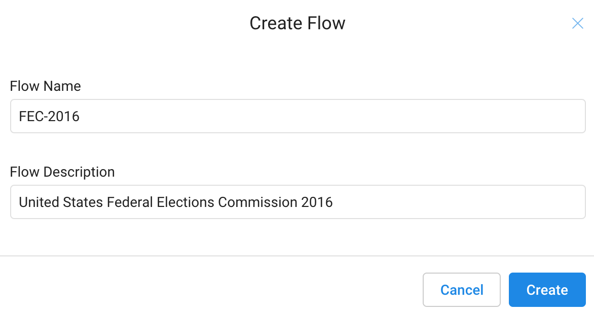
3. Click `Create`.
    * The FEC-2016 flow page opens. You can scroll through the "What's a flow?" slides to get an overview of what you'll be doing next, or click `Don't show me any helpers` to skip it.

---
## Import datasets

In this section you import and add data to the FEC-206 flow.

1. Click `Import & Add Datasets`.
    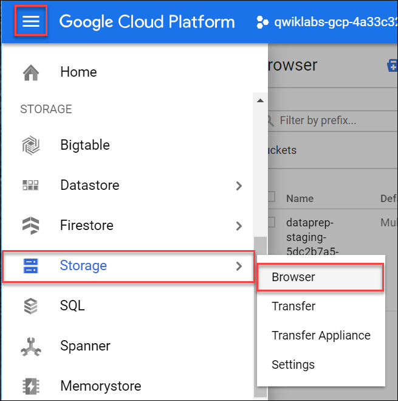
2. In the left menu pane, select `GCS` to import datasets from Google Cloud Storage, then click on the pencil to edit the file path.
    
3. Insert `gs://dataprep-samples/us-fec` in the `Choose a file or folder` text box, then click `Go`.
    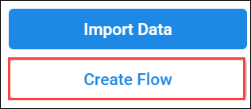
    * You may have to widen the browser window to see the `Go` and `Cancel` buttons.
4. Click the `+` icon next to cn-2016.txt to create a dataset shown in the right pane. Click on the title in the dataset and rename it "Candidate Master 2016".
5. In the same way add the itcont-2016.txt dataset, and rename it "Campaign Contributions 2016".
    
6. After both datasets are listed in the right pane, click `Import & Add to Flow`.
    * You see both datasets listed as a flow.
    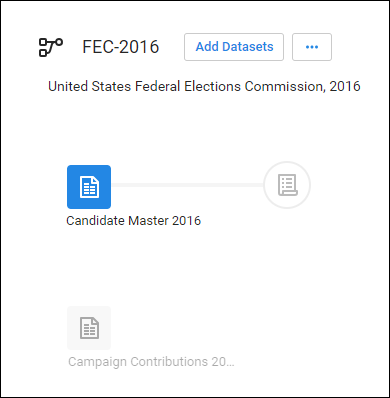

---
## Prep the candidate file

1. By default, the Candidate Master 2016 dataset is selected. In the right pane, click `Add New Recipe`.
    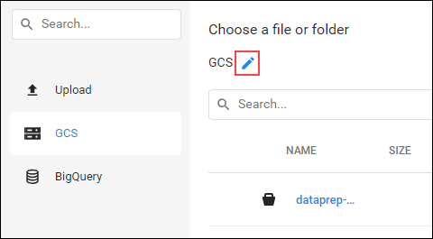
2. Click `Edit Recipe`.
    
    * The Candidate Master 2016-2 Transformer page opens in the grid view.
        
    * The Transformer page is where you build your transformation recipe and see the results applied to the sample. When you are satisfied with what you see, execute the job against your dataset.
    * Each of the column heads have a Name and value that specified the data type. Data types are shown when you click the flag icon:
        

Explore data in the grid view and apply transformation steps to your recipe.

1. Column5 provides data from 1990-2064. Widen column5 (like you would on a spreadsheet) to separate each year. Click to select the tallest bin, which represents year 2016.
    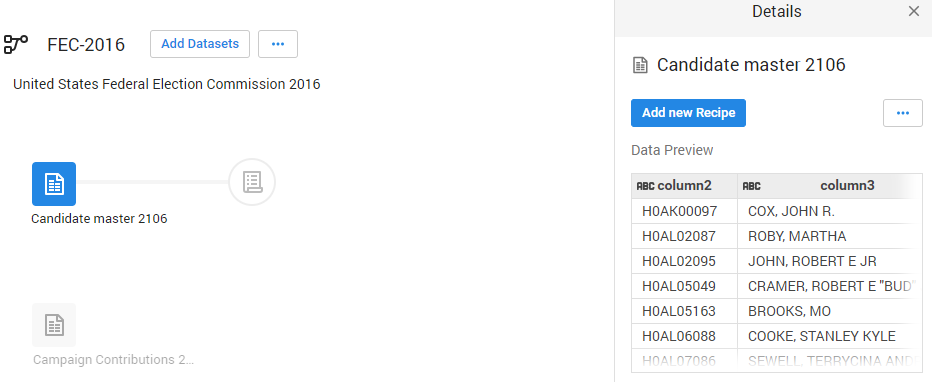
    * This creates a step where these values are selected.
2. In the `Suggestions` panel on the right, in the `Keep rows` section, click `Add` to add this step your recipe.
    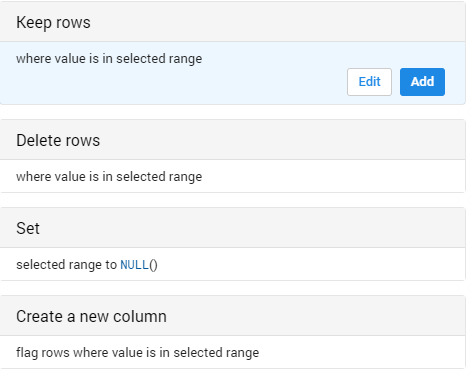
    * The Recipe panel on the right now has the following step: `Keep rows where(date(2016, 1, 1) <= column5) && (column5 < date(2018, 1, 1))`
3. In Column6 (State), hover over and click on the mismatched (red) portion of the header to select the mismatched rows.
    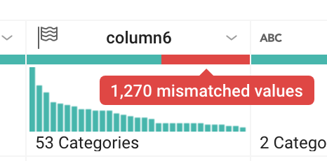
    * Scroll down to find the mismatched values and notice how most of these records have the value "P" in column7, and "US" in column6. The mismatch occurs because column6 is marked as a "State" column (indicated by the flag icon), but there are non-state (such as "US") values.
4. To correct the mismatch, click `Cancel` in the right pane to cancel the transformation, then click on the flag icon in `Column6` and change it to a `String` column.
    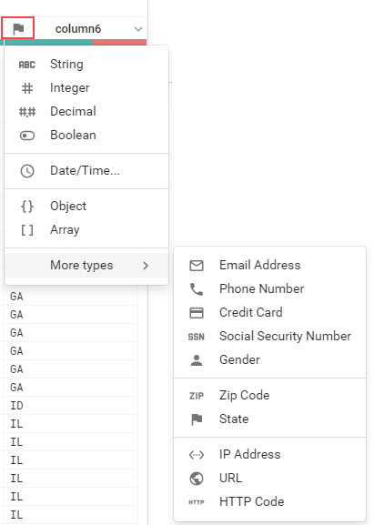
    * There is no longer a mismatch and the column marker is now green.
5. Filter on just the presidential candidates, which are those records that have the value "P" in column7. In the histogram for column7, hover over the two bins to see which is "H" and which is "P". Click the "P" bin.
    
6. In the right column, click `Add` to accept the step to the recipe.
    

---
## Join the Contributions file

On the Join page, you can add your current dataset to another dataset or recipe based on information that is common to both datasets.

Before you join the Contributions file to the Candidates file, clean up the Contributions file.

1. Click on `FEC-2016` (the dataset selector) at the top of the grid view page.
    
2. Click to select the grayed out `Campaign Contributions`.
3. In the right pane, click `Add New Recipe`, then click `Edit Recipe`.
4. Click the `recipe` icon at the top right of the page, then click `Add New Step`.
    

Remove extra delimiters in the dataset.

1. Insert the following Wrangle language command in the Search box:
    ```
   replacepatterns col: * with: '' on: `{start}"|"{end}` global: true
    ```
    * The Transformation Builder parses the Wrangle command and populates the Find and Replace transformation fields.
        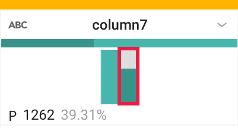
2. Click `Add` to add the transform to the recipe.
3. Add another new step to the recipe. Click `New Step`, then type "Join" in the Search box.
    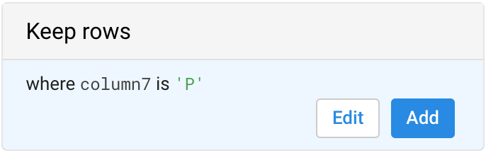
4. Click `Join datasets` to open the Joins page.
5. Click on `Candidate Master 2016-2` to join with Campaign Contributions-2, then `Accept` in the bottom right.
    
6. Hover in the Join keys section, then click on the `pencil` (Edit icon).
    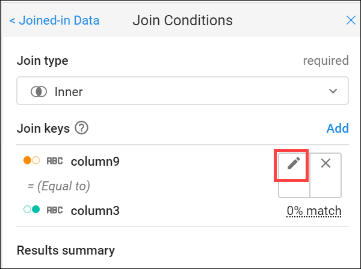
    * Dataprep infers common keys. There are many common values that Dataprep suggests as Join Keys.
7. In the Add Key panel, in the Suggested join keys section, click `column2 = column11`.
    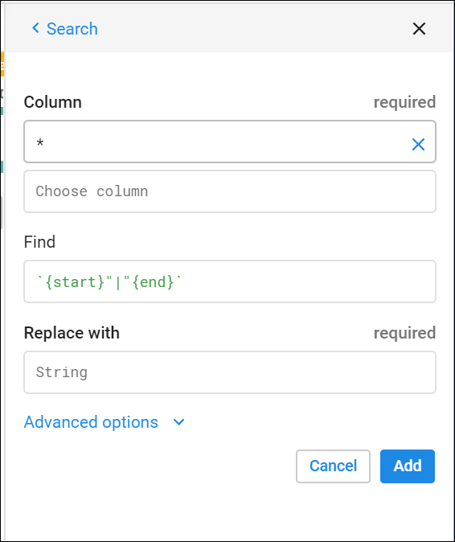
8. Click `Save and Continue`.
    * Columns 2 and 11 open for your review.
9. Click `Next`, then check the checkbox to the left of the "Columns" label to add all columns of both datasets to the joined dataset.
    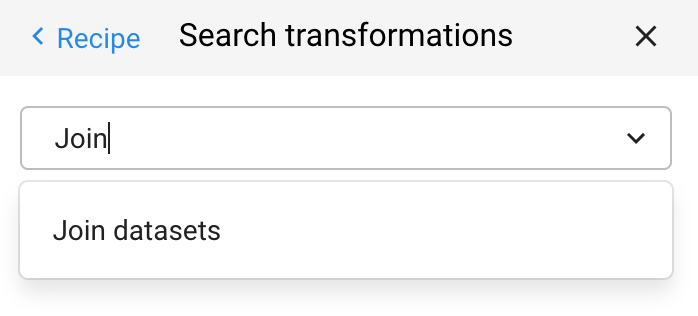
10. Click `Add to Recipe` to return to the grid view.

---
## Summary of data

Generate a useful summary by aggregating, averaging, and counting the contributions in Column 16 and grouping the candidates by IDs, names, and party affiliation in Columns 2, 24, 8 respectively.

1. Click on `New Step` and enter the following formula in the Transformation search box to preview the aggregated data.
    ```
    pivot value:sum(column16),average(column16),countif(column16 > 0) group: column2,column24,column8
    ```
    * An initial sample of the joined and aggregated data is displayed, representing a summary table of US presidential candidates and their 2016 campaign contribution metrics.
2. Click `Add` to open a summary table of major US presidential candidates and their 2016 campaign contribution metrics.
    

---
## Rename columns

1. You can make the data easier to interpret by renaming the columns. Add each of the renaming and rounding steps individually to the recipe by clicking `New Step`, then enter:
    ```
    rename type: manual mapping: [column24,'Candidate_Name'], [column2,'Candidate_ID'],[column8,'Party_Affiliation'], [sum_column16,'Total_Contribution_Sum'], [average_column16,'Average_Contribution_Sum'], [countif,'Number_of_Contributions']
    ```
2. Then click `Add`. Add in this last `New Step` to round the Average Contribution amount:
    ```
    set col: Average_Contribution_Sum value: round(Average_Contribution_Sum)
    ```
3. Then click `Add`. Your results will look something like this:
    

---
## Congratulations!

You used Dataprep to add a dataset and created recipes to wrangle the data into meaningful results.

### Next Steps / Learn More

This lab is part of a series of labs called Qwik Starts. These labs are designed to give you a little taste of the many features available with Google Cloud. Search for "Qwik Starts" in the [lab catalog](https://google.qwiklabs.com/catalog) to find the next lab you'd like to take!

---
## Student resources

* [Dataprep: Qwik Start - Qwiklabs Preview](https://youtu.be/K3K9X9VaThE)
