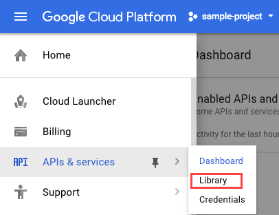

# Video Intelligence: Qwik Start

## GSP154


Google Cloud Video Intelligence makes videos searchable and discoverable by extracting metadata with an easy to use REST API. You can now search every moment of every video file in your catalog. It quickly annotates videos stored in [Google Cloud Storage](https://cloud.google.com/storage/), and helps you identify key entities (nouns) within your video; and when they occur within the video. Separate signal from noise by retrieving relevant information within the entire video, shot-by-shot, -or per frame.

---
## Setup and Requirements

### Before you click the Start Lab button

Read these instructions. Labs are timed and you cannot pause them. The timer, which starts when you click Start Lab, shows how long Cloud resources will be made available to you.

This Qwiklabs hands-on lab lets you do the lab activities yourself in a real cloud environment, not in a simulation or demo environment. It does so by giving you new, temporary credentials that you use to sign in and access the Google Cloud Platform for the duration of the lab.

### What you need

To complete this lab, you need:

* Access to a standard internet browser (Chrome browser recommended).
* Time to complete the lab.
* **Note:** If you already have your own personal GCP account or project, do not use it for this lab.

### How to start your lab and sign in to the Console

1. Click the `Start Lab` button. If you need to pay for the lab, a pop-up opens for you to select your payment method. On the left you will see a panel populated with the temporary credentials that you must use for this lab.
    
2. Copy the username, and then click `Open Google Console`. The lab spins up resources, and then opens another tab that shows the `Choose an account` page.
    * **Tip:** Open the tabs in separate windows, side-by-side.
3. On the Choose an account page, click `Use Another Account`.
    
4. The Sign in page opens. Paste the username that you copied from the Connection Details panel. Then copy and paste the password.
    * **Important:** You must use the credentials from the Connection Details panel. Do not use your Qwiklabs credentials. If you have your own GCP account, do not use it for this lab (avoids incurring charges).
5. Click through the subsequent pages:
    * Accept the terms and conditions.
    * Do not add recovery options or two-factor authentication (because this is a temporary account).
    * Do not sign up for free trials.
6. After a few moments, the GCP console opens in this tab.
    * * **Note:** You can view the menu with a list of GCP Products and Services by clicking the Navigation menu at the top-left, next to “Google Cloud Platform”.
    

### Activate Google Cloud Shell

Google Cloud Shell is a virtual machine that is loaded with development tools. It offers a persistent 5GB home directory and runs on the Google Cloud. Google Cloud Shell provides command-line access to your GCP resources.

1. In GCP console, on the top right toolbar, click the `Open Cloud Shell` button.
    
2. In the dialog box that opens, click `START CLOUD SHELL`:
    
    * You can click `START CLOUD SHELL` immediately when the dialog box opens.
3. It takes a few moments to provision and connect to the environment. When you are connected, you are already authenticated, and the project is set to your `PROJECT_ID`. For example:
    
    * `gcloud` is the command-line tool for Google Cloud Platform. It comes pre-installed on Cloud Shell and supports tab-completion.
        * You can list the active account name with this command:
            ```bash
            $ gcloud auth list
            # Output:
            Credentialed accounts:
            - <myaccount>@<mydomain>.com (active)
            # Example output:
            Credentialed accounts:
            - google1623327_student@qwiklabs.net
            ```
        * You can list the project ID with this command:
            ```bash
            $ gcloud config list project
            # Output:
            [core]
            project = <project_ID>
            # Example output:
            [core]
            project = qwiklabs-gcp-44776a13dea667a6
            ```
    * **Note:** Full documentation of gcloud is available on [Google Cloud gcloud Overview](https://cloud.google.com/sdk/gcloud).

---
## Enable the Video Intelligence API

1. For this lab the Cloud Video Intelligence API should be enabled so you can use it right away. In the left-hand navigation menu, select `APIs & Services > Library`:
    
2. Then search for `video`.
3. Click on the `Cloud Video Intelligence API` in the results that are returned, then click `Enable` if it is not enabled.

---
## Set up authorization

This lab creates and uses a service account that is tied to your Qwiklabs GCP project for authorization.

1. In Cloud Shell run the following command to create a new service account named `quickstart`:
    ```bash
    $ gcloud iam service-accounts create quickstart
    ```
2. Create a service account key file, replacing `<your-project-123>` with your Qwiklabs GCP Project ID:
    ```bash
    $ gcloud iam service-accounts keys create key.json --iam-account quickstart@<your-project-123>.iam.gserviceaccount.com
    ```
3. Now authenticate your service account, passing the location of your service account key file:
    ```bash
    $ gcloud auth activate-service-account --key-file key.json
    ```
4. Obtain an authorization token using your service account:
    ```bash
    $ gcloud auth print-access-token
    ```
5. You'll see the token in the output. You'll be using it in a future step.

---
## Make an annotate video request

1. Use the editor of your choice (`nano`, `vi`, etc. or the `gcloud` editor) to create a JSON request file with the following text, and save it as `request.json`:
    ```json
    {
        "inputUri":"gs://cloud-ml-sandbox/video/chicago.mp4",
        "features": [
            "LABEL_DETECTION"
        ]
    }
    ```
2. Use `curl` to make a `videos:annotate` request, replacing `ACCESS_TOKEN` with the access token you printed, and passing the filename of the entity request:
    ```bash
    $ curl -s -H 'Content-Type: application/json' \
    -H 'Authorization: Bearer ACCESS_TOKEN' \
    'https://videointelligence.googleapis.com/v1/videos:annotate' \
    -d @request.json
    ```
3. The Video Intelligence API creates an operation to process your request. You should now see a response that includes your operation name, which should look similar to this one:
    ```json
    {
        "name": "us-west1.18358601230245040268"
    }
    ```
    * You will use this name in a future step.
4. Use this script to request information on the operation by calling the `v1.operations` endpoint. Replace the `ACCESS_TOKEN` as before, and replace the `OPERATION_NAME` with the operation name value you just received:
    ```bash
    curl -s -H 'Content-Type: application/json' \
    -H 'Authorization: Bearer ACCESS_TOKEN' \
    'https://videointelligence.googleapis.com/v1/operations/OPERATION_NAME'
    ```
5. You'll now see information related to your operation. If the operation has completed, a done field is included and set to true:
    ```json
    {
        "name": "OPERATION_NAME",
        "metadata": {
            "@type": "type.googleapis.com/google.cloud.videointelligence.v1.Annota
        tionProgressMetadata",
            "progressMetadata": [
                {
                    "inputUri": "gs://cloud-ml-sandbox/video/chicago.mp4",
                    "startTime": "2016-09-22T21:41:56.766091Z",
                    "lastUpdateTime": "2016-09-22T21:42:03.889743Z"
                }
            ]
        },
        "done": true,
        ...
    }
    ```
6. After giving the request some time (about a minute, typically), re-run the command and the same request returns annotated results:
    ```json
    {
        "name": "OPERATION_NAME",
        "metadata": {
            "@type": "type.googleapis.com/google.cloud.videointelligence.v1.AnnotateVideoProgress",
            "annotationProgress": [
            {
                "inputUri": "/cloud-ml-sandbox/video/chicago.mp4",
                "progressPercent": 100,
                "startTime": "2017-02-17T22:39:00.333942Z",
                "updateTime": "2017-02-17T22:39:11.414399Z"
            }
            ]
        },
        "done": true,
        "response": {
            "@type": "type.googleapis.com/google.cloud.videointelligence.v1.AnnotateVideoResponse",
            "annotationResults": [
            {
                "inputUri": "/cloud-ml-sandbox/video/chicago.mp4",
                "segmentLabelAnnotations": [
                {
                    "entity": {
                        "entityId": "/m/01yrx",
                        "languageCode": "en-US"
                    },
                    "segments": [
                        {
                            "segment": {
                            "startTimeOffset": "0s",
                            "endTimeOffset": "14.833664s"
                            },
                            "confidence": 0.98509187
                        }
                    ]
                },
            ...
    ```

---
## Congratulations!

### Finish Your Quest

Continue your Quest with [Baseline: Data, ML, AI](https://google.qwiklabs.com/quests/34). A Quest is a series of related labs that form a learning path. Completing this Quest earns you the badge above, to recognize your achievement. You can make your badge (or badges) public and link to them in your online resume or social media account. [Enroll in this Quest](https://google.qwiklabs.com/learning_paths/34/enroll) and get immediate completion credit if you've taken this lab. [See other available Qwiklabs Quests](http://google.qwiklabs.com/catalog).

### Next Steps / Learn More

This lab is part of a series of labs called Qwik Starts. These labs are designed to give you a little taste of the many features available with Google Cloud. Search for "Qwik Starts" in the [lab catalog](https://google.qwiklabs.com/catalog) to find the next lab you'd like to take!

---
## Student Resources

* [Google Cloud Video Intelligence: Search every moment of every video in your catalog](https://youtu.be/Z2eOfK2rzbs)