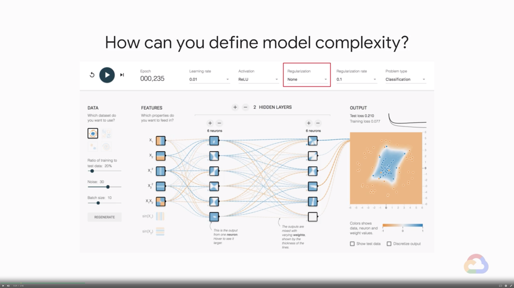
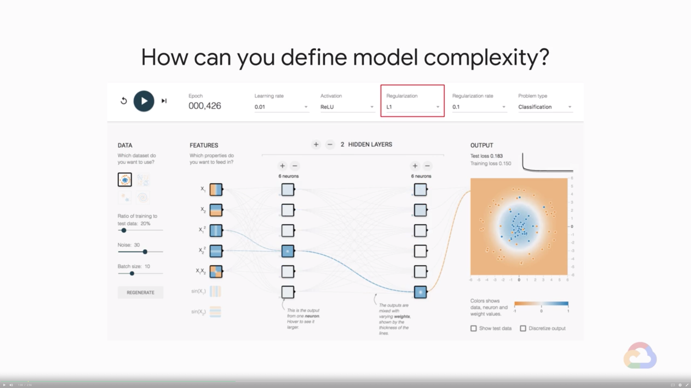
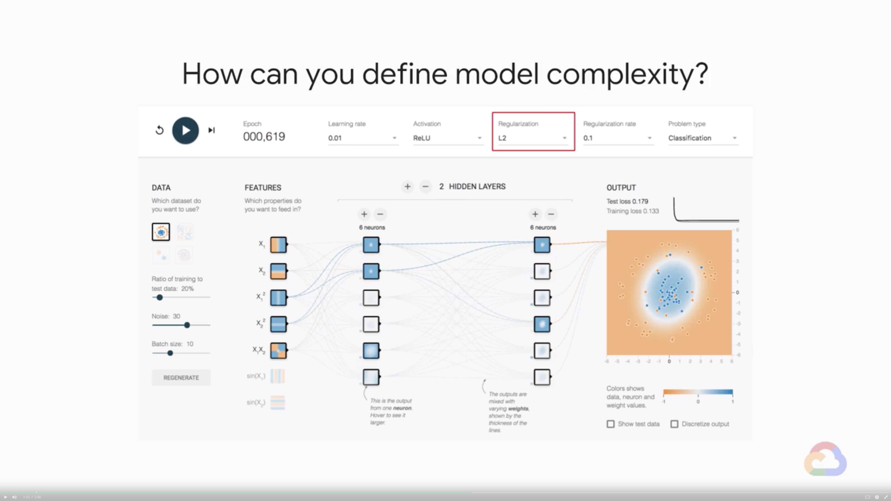
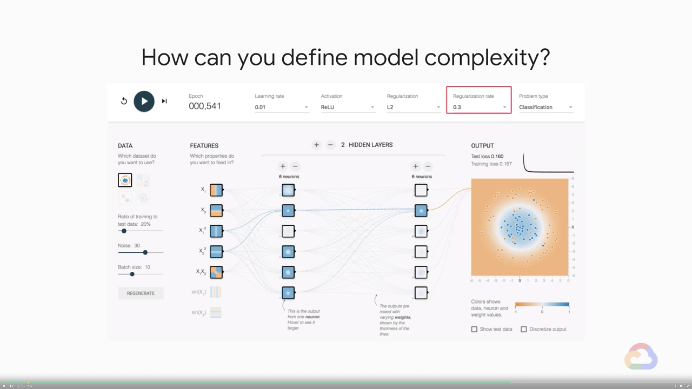
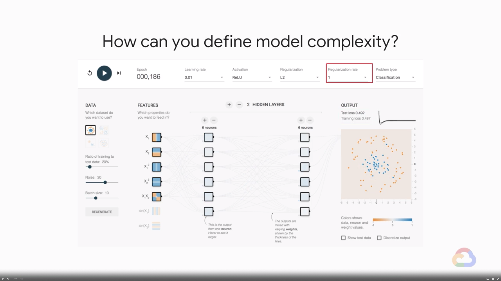

# Lab 1: Regularization

## Overview

In this lab, you will use TensorFlow playground to experiment with L1 and L2 regularisation and different values of Lambda also known as the regularisation rates.

---
## TensorFlow Playground

1. Open the lab by clicking on this link: http://goo.gl/4oA1WW
2. Return to this video after experimenting for a walkthrough
    * How can you define model complexity?
        * None regularization
            
        * L1 regularization (rate = 0.1)
            
        * L2 regularization (rate = 0.1)
            
        * L2 regularization (rate = 0.3)
            
        * L2 regularization (rate = 1)
            