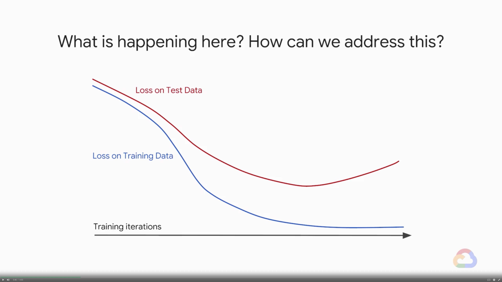
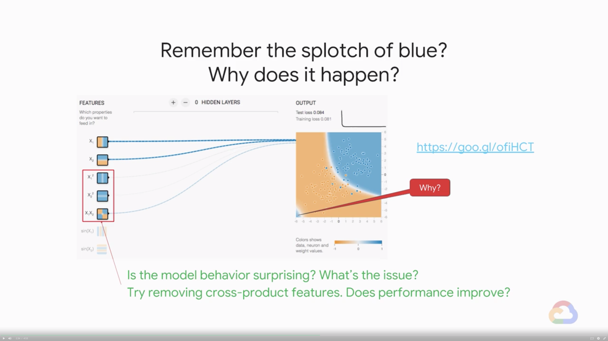
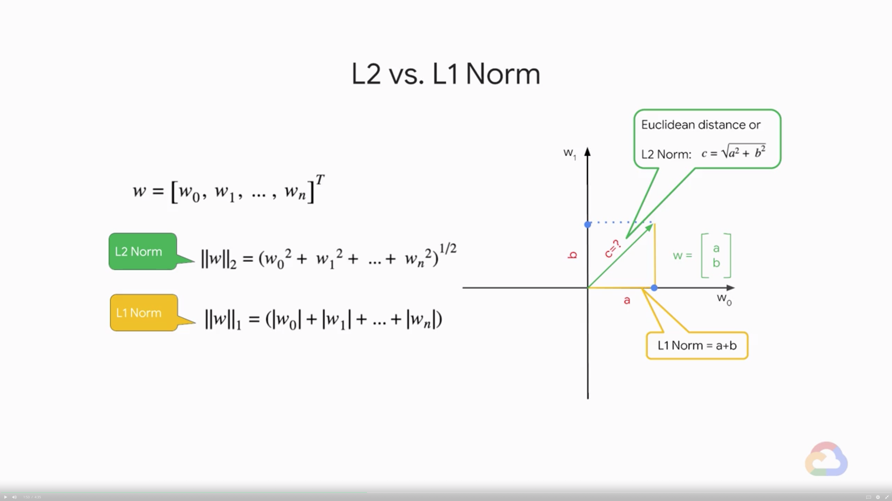
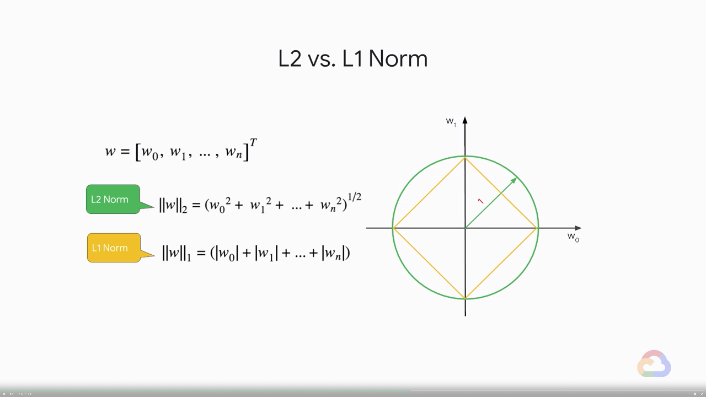
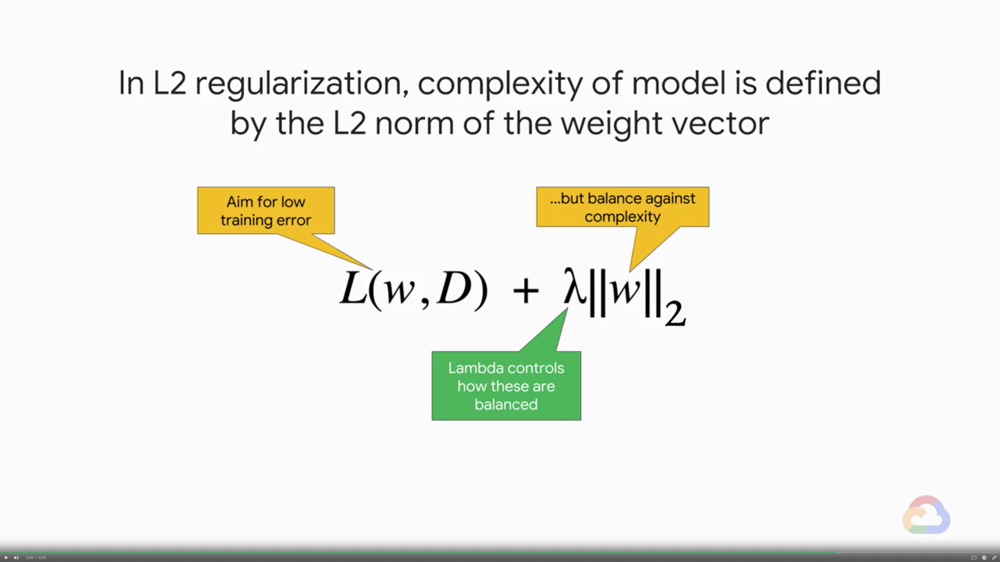
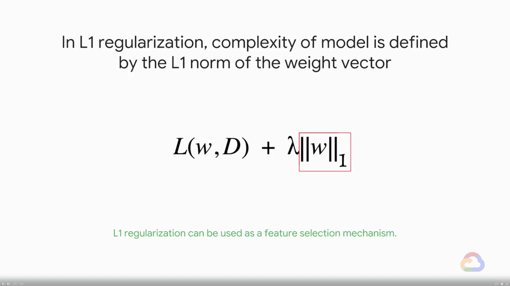

# The Art of ML

In this course, you will learn about The Art of Machine Learning. We will review aspects of machine learning that require intuition, judgment and experimentation to find the right balance and what’s good enough (spoiler alert: it's never perfect!).

## Introduction

> [](https://youtu.be/pZ3luWNk5_8)

* Learn how to...
    * Generalize your model
    * Tune batch size and learning rate for better model performance
    * Optimize your model
    * Apply the concepts in TensorFlow code

---
## Regularization

> [](https://youtu.be/L862qb3x2Bo)

* What is happening here? How can we address this?
    
    * What is happening here?
        * The loss value is nicely trending down on the training data but shoots upwards at some point on the test data
        * Some amount of overfitting is going on here
    * How can we address this?
        * Reduce the number of training iteration and stop early
* Remember the splotch of blue? Why does it happen?
    
* **The simpler the better**
    * Occam's razor
        * When presented with competing hypothetical answers to a problem, one should select the one that **makes the fewest assumptions**. The idea is attributed to William of Ockham (c. 1287 - 1347)
    * Factor is model complexity when calculating error
        * Minimize: loss(Data | Model) + complexity(Model)
            * loss: aim for low training error
            * complexity: ...but balance against complexity
        * Optimal model complexity is **data-dependent**, so requires hyperparameter tuning
        * Find the right balance bewteen simplicity and accurate fitting of the training data
* Regularization is a major field of ML research
    * Regularization refers to any techniques that helps generalize a model
        * A generalized model performs well not just on training data but also on never seen test data
    * We will look into these methods
        * L1 regularization
        * L2 regularization

### L1 & L2 Regularization

> [](https://youtu.be/u727UjdN6-0)

* How can we measure model complexity?
    * Both L1 and L2 regularization methods represent model complexity as the magnitude of the weight vector, and try to keep that in check
    * The magnitude of vector is represented by the norm function
    * L2 vs. L1 Norm
        
        
* In L2 regularization, complexity of model is defined by the L2 norm of the weight vector
    
* In L1 regularization, complexity of model is defined by the L1 norm of the weight vector
    
    * L1 regularization can be used as a **feature selection** mechanism
    * Feature selection simplifies the ML problem by causing a subset of the weight become zero
        * Zero weight then highlight the subsitive features that cannot be safely discarded

---
## Lab 1: Regularization

> [](https://youtu.be/jzYbV2K72XY)
> [](https://youtu.be/)

* Please follow the details in [here](./Lab-1.md)

---
## Module Quiz

1. Regularization is useful because it can
    * A. Make models more linear
    * B. Limit overfitting
    * C. Make models smaller
    * D. Make models more non-linear
    > Answer: B. C.

---
## Learning Rate and Batch Size

> [](https://youtu.be/jw6wI6dPz1c)

* Learning rate controls the size of the step in the weight space
    * If too small, training will take a long time
    * If too large, training will bounce around
    * Default learning rate in Estimator's LinearRegressor is smaller of $0.2$ or $\frac{1}{\sqrt{\textrm{nFeatures}}}$
        * This assumes that your feature and label values are small numbers
* Batch size controls the number of samples that the gradient is calculated on
    * If too small, training will bounce around
    * If too large, training will take a very long time
    * $40$-$100$ tends to be a good range for batch size
    * Can go up to as high as $500$
* Regularization provides a way to define model complexity based on te values of the weights
    * Ensure each batch is representative of the entire dataset
    * The gradient are computed within the batch. If the batch is not representative, the loss will jump around too much from batch to batch

### Optimization

> [](https://youtu.be/hQo_ZpU7aWA)

* Optimization is a major field of ML research
    * GradientDescent
        * The traditional approach, typically implemented stochastically i.e., with batches
    * Momentum
        * Reduce learning rate when gradient values are small
    * AdaGrad
        * Give frequently occuring features low learning rates
    * AdaDelta
        * Improves AdaGrad by avoiding reducing learning rate to zero
    * Adam
        * AdaGrad with a bunch of fixes
    * Ftrl
        * "Follow the regularized leader", works well on wide models
* Adam and Ftrl are good defaults for DNN and Linear models

### Practicing with TensorFlow Code

> [](https://youtu.be/BQsA-JlRu6w)

* How to change optimizer, learning rate, batch size?
    ```python
    train_fn = tf.estimator.inputs.pandas_input_fn(..., batch_size=10)
    myopt = tf.train.FtrlOptimizer(learning_rate=0.01, l2_regularization_strength=0.1)
    model = tf.estimator.LinearRegressor(..., optimizer=myopt)
    model.train(input_fn=train_fn, steps=10000)
    ```
    1. Control batch size via the input function
    2. Control learning rate via the optimizer passed into model
    3. Set up regularization in the optimizer
    4. Adjust number of steps based on `batch_size`, `learning_rate`
    5. Set number of steps, not number of epochs because distributed training doesn't play nicely with epochs
        * nStep = nEpochs * (nExample / batchSize)

---
## Lab 2: Hand-tuning ML Models

> [](https://youtu.be/2cFtB59Jw2k)
> [](https://youtu.be/UMNbVu0hMQU)

* Please follow the details in [here](./Lab-2.md)

---
## Module Quiz

1. What is the key reason that we want to penalize models for over-complexity?
    * A. Overly-complex models may not be generalizable to real-world scenarios on unseen data
    * B. Overly-complex models are slower to train
    * C. Overly-complex models are harder to implement or maintain in production environments.
    > Answer: A.
2. If your learning rate is too small, your loss function will:
    * A. Converge very slowly
    * B. Converge very fast
    > Answer: A.
3. If your learning rate is too high, your loss function
    * A. Will converge rapidly, but not reach the lowest error value possible
    * B. Will converge rapidly to the lowest error value possible
    * C. Will converge slowly to the lowest error value possible
    * D. Will converge rapidly, but then start to increase again
    > Answer: A.
4. If your batch size is too high, your loss function will
    * A. Oscillate wildly
    * B. Converge slowly
    > Answer: B.
5. If your batch size is too low, your loss function will:
    * A. Oscillate wildly
    * B. Converge slowly
    > Answer: A.