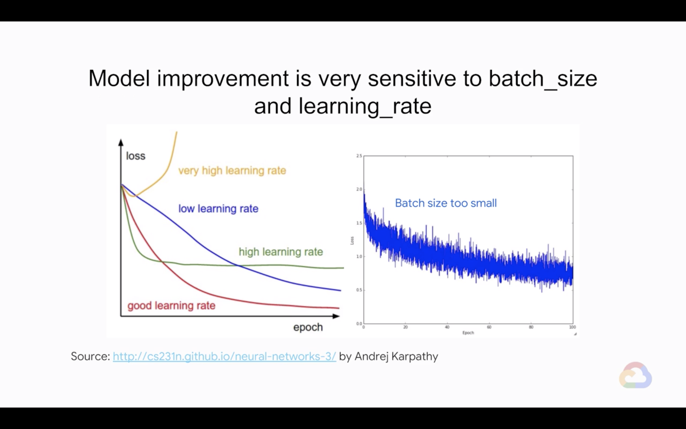

# Hyperparameter Tuning

In this module, you will learn how to differentiate between parameters and hyperparameters. Then we’ll discuss traditional grid search approach and learn how to think beyond it with smarter algorithms. Finally you’ll learn how Cloud ML engine makes it so convenient to automate hyperparameter tuning.

## Introduction

> [](https://youtu.be/fEGi9C_guFE)

* Learn how to...
    * Differentiate between parameters and hyperparameters
    * Think beyond simple grid search algorithms
    * Take advantage of Cloud ML Engine for hyperparameter tuning

---
## Parameters vs. Hyperparameters

> [](https://youtu.be/uzmFjlYPJT0)

* ML models are mathematical functions with parameters and hyperparameters
    * Parameters: Changed during model training
    * Hyperparameters: Set before training, doesn't chanegd afterwards
* Model improvement is very sensitive to **batch size** and **learning rate**
    

---
## Think Beyond Grid Search

> [](https://youtu.be/xh2rgXv_WtE)

* There are a variety of model parameters too
    * Size of model
    * Number of hash buckets
    * Embedding size
    * Etc.
* Wouldn't it be nice to have the NN training loop do meta-training across all these parameters?
    * "Fearn not! Google Vizier is at your service!" - "Google Vizier: A Service for Black-Box Optimization"
* How to use Cloud ML Engine for hyperparameter tuning?
    1. Make the hyperparameter as command-line arguments
        ```python
        parser.add_arguments(
            '--nbuckets',
            help='Number of buckets into which to discretize lats and lons',
            default=10,
            type=int
        )
        parser.add_argument(
            '--hidden_units',
            help='List of hidden layer sizes to use for DNN feature columns',
            nargs='+',
            default=[128, 32, 4]
        )
        ```
    2. Make sure outputs don't clobber each other
        ```python
        output_dir = os.path.join(
            output_dir,
            json.loads(
                os.environ.get('TF_CONFIG', '{}')
            ).get('task', {}).get('trial', '')
        )
        ```
    3. Supply hyperparameters to training job
        ```yaml
        %writefile hyperparame.yaml
        trainingInput:
            scaleTier: STANDARD_1
            hyperparameters:
                goal: MINIMIZE
                hyperparameterMetricTag: rmse
                maxTrials: 30
                maxParallelTrials: 1
                params:
                - parameterName: train_batch_size
                  type: INTEGER
                  minValue: 64
                  maxValue: 512
                  scaleType: UNIT_LOG_SCALE
                - parameterName: nbuckets
                  type: INTEGER
                  minValue: 10
                  maxValue: 20
                  scaleType: UNIT_LINEAR_SCALE
                - parameterName: hidden_units
                  type: CATEGORICAL
                  categoricalValues: ["128 64 32", "256 128 16", "512 128 64"]
        ```
        ```bash
        $ gcloud ml-engin jobs submit training $JOBNAME \
            --region=$REGION \
            --module-name=trainer.task \
            ...
            --config=hyperparam.yaml \
            -- \
            --output_dir=$OUTDIR \
            --num_epochs=100
        ```

---
## Lab 3: Improve Model Accuracy by Hyperparameter Tuning with Cloud AI Platform

> [](https://youtu.be/_ahcO3o3BsE)
> [](https://youtu.be/Q3AHZU5aoWk)

* Please follow the details in [here](./Lab-3.md)

---
## Module Quiz

1. If searching among a large number of hyperparameters, you should do a systematic grid search rather than start from random values, so that you are not relying on chance. True or False?
    * True
    * False
    > Answer: False
2. It is a good idea to use the training loss itself as the hyperparameter tuning metric. True or False?
    * True
    * False
    > Answer: False
3. Hyperparameter tuning in Cloud ML Engine involves adding the appropriate TensorFlow function call to your model code. True or False?
    * True
    * False
    > Answer: False
4. You are creating a model to predict the outcome (final score difference) of a basketball game between Team A and Team B. Your initial model is a neural network with [64, 32] nodes, learning_rate = 0.05, batch_size = 32. The input features include whether the game was played "at home" for Team A, the fraction of the last 7 games that Team A won, the average number of points scored by Team A in its last 7 games, the average score of Team A's opponents in its last 7 games, etc. Which of these are hyperparameters to the model?
    * A. The batch size
    * B. The learning rate
    * C. The number of previous games that the input features are averaged over
    * D. The number of nodes in each layer of the DNN
    * E. The number of layers in the DNN
    > Answer: A. B. C. D. E.
