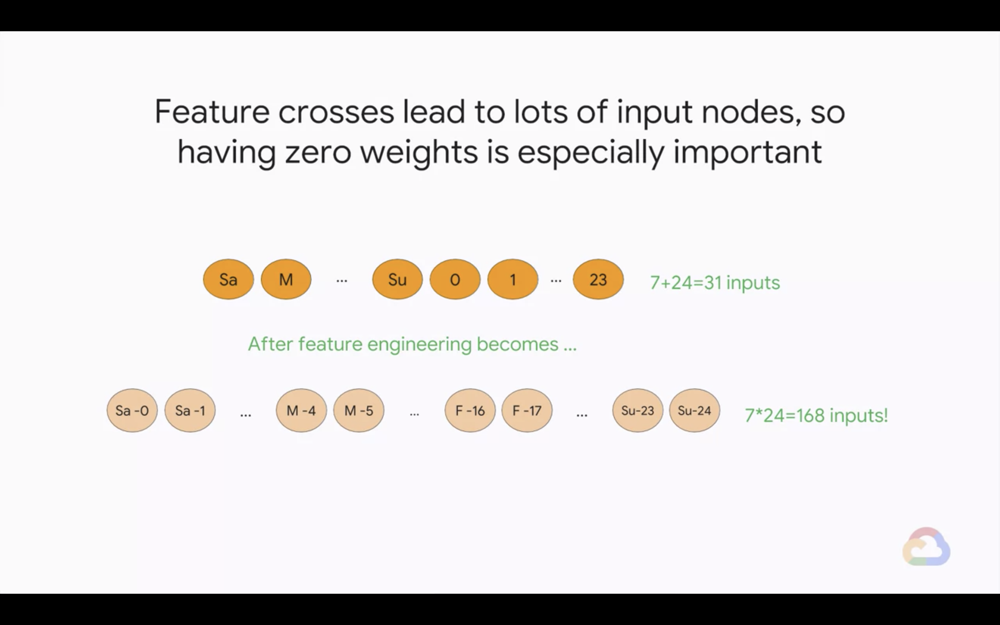
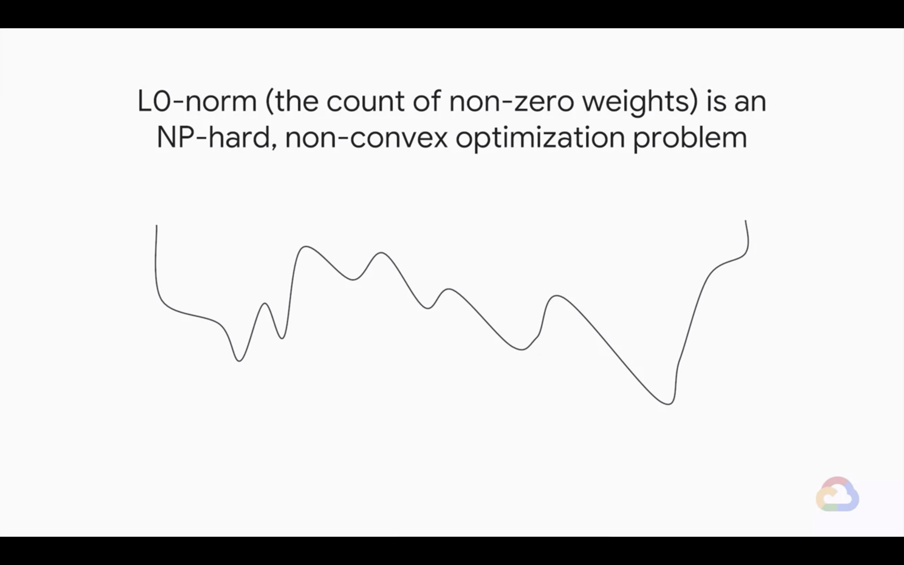
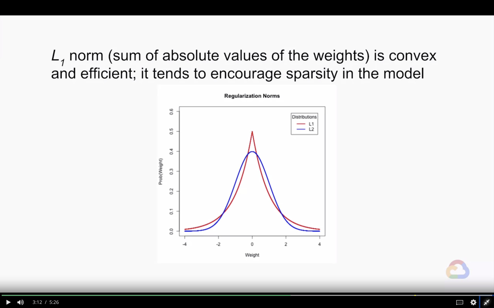
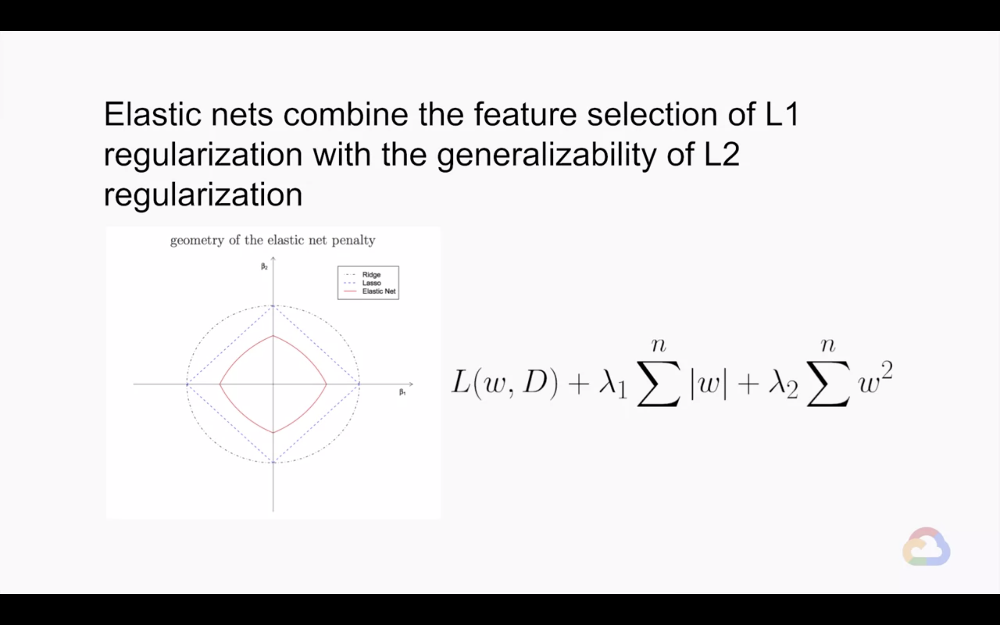

# A Pinch of Science

In this module, we will start to introduce the science along with the art of machine learning. We’re first going to talk about how to perform regularization for sparsity so that we can have simpler, more concise models. Then we’re going to talk about logistic regression and learning how to determine performance.

## Introduction

> 

---
## Regularization for Sparsity

> 

* Zeroing out coefficients can help with performance, especially with large models and sparse inputs
    | Actions | Impact |
    |---|---|
    | Fewer coefficients to store/load | Reduce memory, model size |
    | Fewer multiplications needed | Increase prediction speed |
    $$
    L(w, D) + \lambda \sum^{n}{|w|}
    $$
    * L2 regularization only makes weights **small**, not zero
* Feature crosses lead to lots of input nodes, so having zero weights is especially important
    
* **L0 norm** (the count of non-zero weights) is an NP-hard, non-convex optimization problem
    
* **L1 norm** (sum of absolute values of the weights) is convex and efficient; it tends to encourage sparsity in the model
    
* There are many possible choices of norms
    $$
    \| x \|_p = \left( \sum_{i = 1}^n{|x_i|^p} \right)^{1/p}
    $$
    * L0 norm
        $$
        \| x \|_0 = \sum_{i = 1}^n{|x_i|}^0
        $$
    * L1 norm - smaller model but less predictive
        $$
        \| x \|_1 = \sum_{i = 1}^n{|x_1|}
        $$
    * L2 norm - 
        $$
        \| x \|_2 = \left( \sum_{i = 1}^n{|x_i|} \right)^{1/2}
        $$
    * L$\infty$ norm
        $$
        \| x \|_{\infty} = \max {\{ |x_1|, ..., |x_n| \}}
        $$
* Elastic nets combine the feature selection of L1 regularization with the generalizability of L2 regularization
    

### Quiz - L1 Regularization

* What does L1 regularization tend to do a model's low predictive features' parameter weights?
    * A. Have small magnitudes
    * B. Have all positive values
    * C. Have zero values
    * D. Have large magnitudes
    > Answer: C.
* L1 regularization has been shown to induce sparsity to the model and do to its probably distribution, having a high peak at zero
* L2 regularization will be used for having small magnitudes

---
## Lab 4: L1 Regularization

> 
> 

* Please follow the details in [here](./Lab-4.md)

---
## Module Quiz

1. Which type of regularization is more likely to lead to zero weights?
    * A. L1
    * B. L2
    > Answer: A.
2. Which type of regularization penalizes large weight values more?
    * A. L1
    * B. L2
    > Answer: B.

---
## Logistic Regression

> 

* Case Study
    * Suppose you use linear regression to predict coin flips
        * You might use features like angle of bend, coin mass, etc. What could go wrong?

---
## Module Quiz

