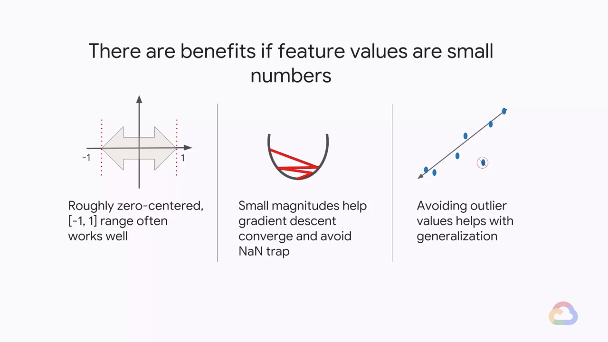
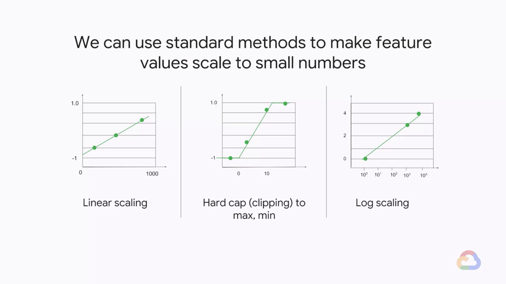
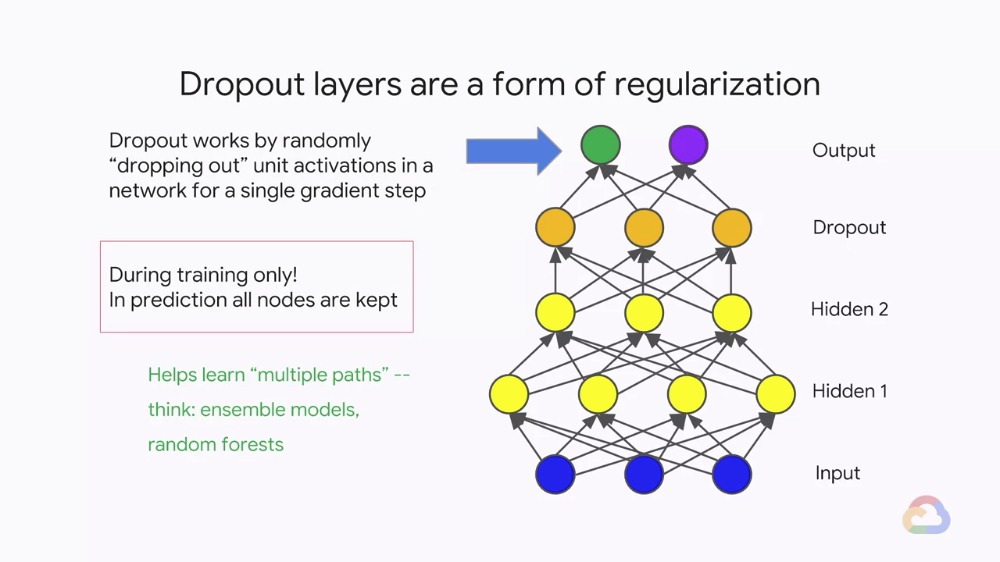
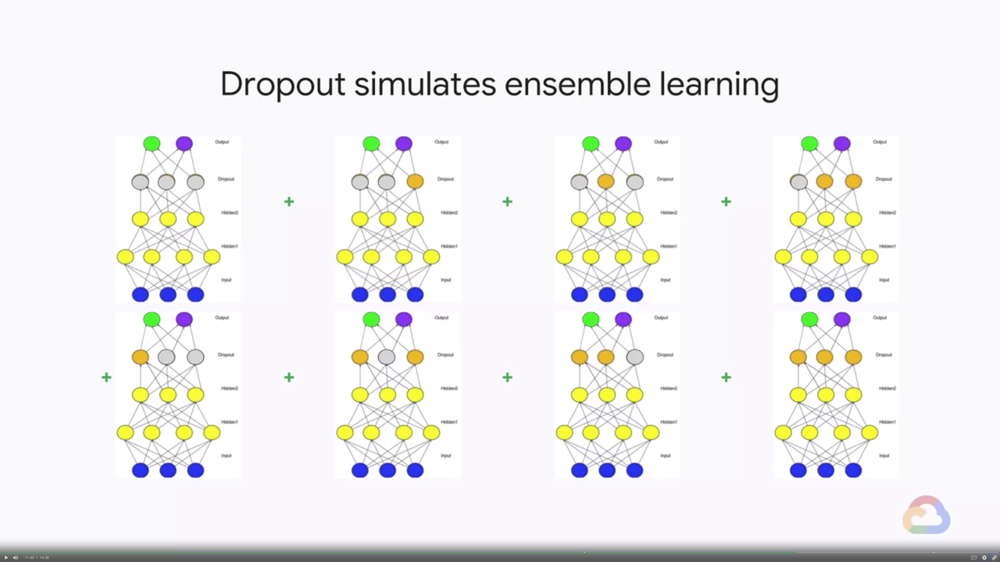
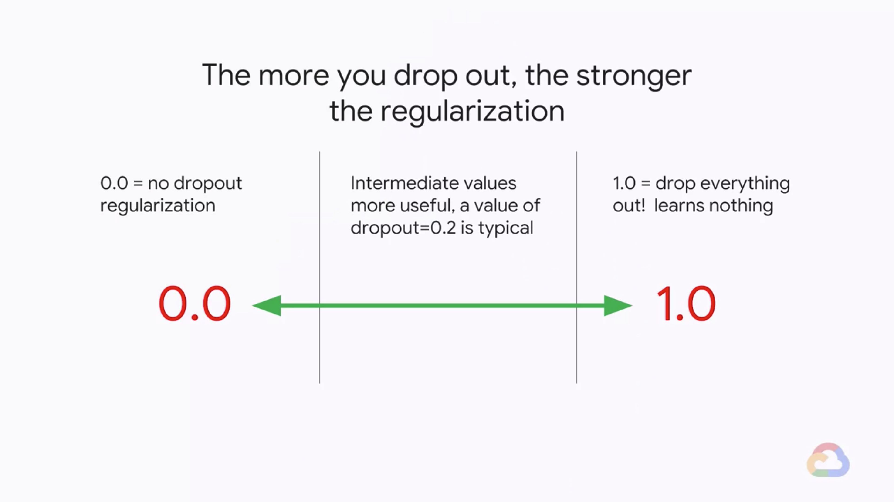

# The Science of Neural Networks

In this module, we will now be diving deep into the science, specifically with neural networks.

## Introduction

> [](https://youtu.be/UAFOiZY4imk)

### Neural Networks

> [](https://youtu.be/Wic1ySs5ip4)

* Feature crosses help linear models work in nonlinear problems
    * But there trends to be a limit
    * Combine features as an alternaive to feature crossing
        * Structure the model so that features are combined
        * Then the combinations may be combined
        * How to choose the combinations?
        * Get the model to learn them 
* A linear model can be represented as nodes and edges
    
* Add complexity: Non-linear?
    
    $$
    h_1 = w_1 \times x_1 + w_4 \times x_2 + w_7 \times x_3 \\
    h_2 = w_2 \times x_1 + w_5 \times x_2 + w_8 \times x_3 \\
    h_3 = w_3 \times x_1 + w_6 \times x_2 + w_9 \times x_3 \\
    \textrm{Output} = w_{10} \times h_1 + w_{11} \times h_2 + w_{12} \times h_3 \\
    = (w_10 \times w_1 + w_{11} \times w_2 + w_{12} \times w_3) \times x_1 \\
    + (w_10 \times w_4 + w_{11} \times w_5 + w_{12} \times w_6) \times x_2 \\
    + (w_10 \times w_7 + w_{11} \times w_8 + w_{12} \times w_9) \times x_3 \\
    = W_1 \times x_1 + W_2 \times x_2 + W_3 \times x_3
    $$
    * Matrix form
        $$
        H_1 = \begin{bmatrix}
            w_1 & w_1 & w_3 \\
            w_4 & w_5 & w_6 \\
            w_7 & w_8 & w_9 
            \end{bmatrix}
            \begin{bmatrix}
            x_1 \\
            x_2 \\
            x_3
            \end{bmatrix} \\
        H_2 = \begin{bmatrix}
            w_{10} & w_{11} & w_{12} \\
            w_{13} & w_{14} & w_{15} \\
            w_{16} & w_{17} & w_{18} 
            \end{bmatrix}
            \begin{bmatrix}
            w_1 & w_1 & w_3 \\
            w_4 & w_5 & w_6 \\
            w_7 & w_8 & w_9 
            \end{bmatrix}
            \begin{bmatrix}
            x_1 \\
            x_2 \\
            x_3
            \end{bmatrix} \\
            = \begin{bmatrix}
            W_1 & W_1 & W_3 \\
            W_4 & W_5 & W_6 \\
            W_7 & W_8 & W_9 
            \end{bmatrix}
            \begin{bmatrix}
            x_1 \\
            x_2 \\
            x_3
            \end{bmatrix}
        \hat{y} = \begin{bmatrix}
            w_{19} & w_{20} & w_{21}
            \end{bmatrix}
            \begin{bmatrix}
            w_{10} & w_{11} & w_{12} \\
            w_{13} & w_{14} & w_{15} \\
            w_{16} & w_{17} & w_{18} 
            \end{bmatrix}
            \begin{bmatrix}
            w_1 & w_1 & w_3 \\
            w_4 & w_5 & w_6 \\
            w_7 & w_8 & w_9 
            \end{bmatrix}
            \begin{bmatrix}
            x_1 \\
            x_2 \\
            x_3
            \end{bmatrix} \\
            = \begin{bmatrix}
            W_1' & W_2' & W_3'
            \end{bmatrix}
            \begin{bmatrix}
            x_1 \\
            x_2 \\
            x_3
            \end{bmatrix} \\
        $$
* Adding a Non-linearity
    
    $$
    \hat{y} = \begin{bmatrix}
        w_{19} & w_{20} & w_{21}
        \end{bmatrix}
        \begin{bmatrix}
        w_{10} & w_{11} & w_{12} \\
        w_{13} & w_{14} & w_{15} \\
        w_{16} & w_{17} & w_{18} 
        \end{bmatrix}
        f\left(
        \begin{bmatrix}
        w_1 & w_1 & w_3 \\
        w_4 & w_5 & w_6 \\
        w_7 & w_8 & w_9 
        \end{bmatrix}
        \begin{bmatrix}
        x_1 \\
        x_2 \\
        x_3
        \end{bmatrix} 
        \right) \\
        = \begin{bmatrix}
        w_{19} & w_{20} & w_{21}
        \end{bmatrix}
        \begin{bmatrix}
        w_{10} & w_{11} & w_{12} \\
        w_{13} & w_{14} & w_{15} \\
        w_{16} & w_{17} & w_{18} 
        \end{bmatrix}
        \begin{bmatrix}
        \max{(0, w_1 x_1 + w_2 x_2 + w_3 x_3) \\
        \max{(0, w_4 x_1 + w_5 x_2 + w_6 x_3) \\
        \max{(0, w_7 x_1 + w_8 x_2 + w_9 x_3) \\
        \end{bmatrix}
    $$
* Our favorite non-linearity is the Rectified Linear Unit (ReLU)
    
    * There are many different ReLU varients
        * ReLU
            
        * Softplus
            
        * Leaky ReLU
            
        * PReLU
            
        * ReLU6
            
        * ELU
            
* Neural Networks can be arbitrarily complex
    
    * Each neuron added, adds a new dimension to my vector space
        

### Quiz: Non-linearity

* Why is it important adding non-linear activation functions to neural networks?
    * A. Adds regularization
    * B. Increases the number of dimensions
    * C. Invokes early stopping
    * D. Stops the layers from collapsing back into just a linear model
    > Answer: D.

### Quiz: Neural Network Complexity

* Neural networks can be arbitrarily complex. To increase hidden dimensions, I can add _______. To increase function composition, I can add _______. If I have multiple labels per example, I can add _______.
    * A. Layers, neurons, outputs
    * B. Neurons, layers, outputs
    * C. Layers, outputs, neurons
    * D. Neurons, outputs, layers
    > Answer: B.

---
## Lab 5: Neural Networks Playground

> [](https://youtu.be/OFvbfaqnWgQ)

* Please follow the details in [here](./Lab-5.md)

---
## Training Neural Networks

> [](https://youtu.be/ob8ahtFLNOw)

* `DNNRegressor` usage is simlar to `LinearRegressor`
    ```python
    myopt = tf.train.AdamOptimizer(learning_rate=0.01)
    model = tf.estimator.DNNRegressor(
        model_dir=outdir, 
        hidden_units=[100, 50, 20], 
        feature_columns=INPUT_COLS, 
        optimizer=myopt, 
        dropout=0.1)
    NSTEPS = (100 * len(traindf)) / BATCH_SIZE
    model.train(input_fn=train_input_fn, steps=NSTEPS)
    ```
    * Use momentum-based optimizers e.g., Adagrad (the default) or Adam.
    * Specify number of hidden nodes
    * Optionally, can also regularize using dropout
* The common failure modes for gradient descent
    * **Gradients can vanish**
        * Insight: Each additional layer can successively reduce signal vs. noise
        * Solution: Using ReLU instead of sigmoid/tanh can help
    * **Gradients can explode**
        * Insight: Learning rates are important here
        * Solution: Batch normalization (useful knob) can help
    * **ReLU layers can die**
        * Insight: Monitor fraction of zero weights in TensorBoard
        * Solution: Lower your learning rates
* There are benefits if feature values are small numbers
    
* We can use standard methods to make feature values scale to small numbers
    
* Dropout layers are a form of regularization
    * Fropout works by randomly "dropping out" unit activations in a network for a singel gradient step
    * During **training** only! In prediction all nodes are kept
    
* Dropout simulates ensemble learning
    
* Typical values of dropout are between 20 to 50 percent
    * The more you drop out, the stronger the regularization
    

### Quiz: Gradient Descent Debugging

* Which of these is good advice if my model is experiencing exploding gradients?
    * A. Lower the learning rate
    * B. Add weight regularization
    * C. Add gradient clipping
    * D. Add batch normalization
    * E. See a doctor
    * F. Both C and D
    * G. A,C,D
    * H. A,B,C,D
    > Answer: H.

### Quiz: Dropout

* Dropout acts as another form of ______. It forces data to flow down ______ paths so that there is a more even spread. It also simulates ______ learning. Don’t forget to scale the dropout activations by the inverse of the ______. We remove dropout during ______.
    * A. Hyperparameter tuning, similar, deep, drop probability, training
    * B. Hyperparameter tuning, multiple, deep, drop probability, inference
    * C. Regularization, multiple, ensemble, keep probability, training
    * D. Regularization, multiple, ensemble, drop probability, inference
    * E. Regularization, multiple, ensemble, keep probability, inference
    * F. Hyperparameter tuning, multiple, deep, keep probability, inference
    * G. Regularization, similar, ensemble, keep probability, inference
    > Answer: E.

---
## Lab 6: Using Neural Networks to Build an ML Model

> [](https://youtu.be/1PDWtmkXkDU)

* Please follow the details in [here](./Lab-6.md)

---
## Module Quiz

1. Which of these is a common way that neural network training can fail?
    * A. Entire layers can die with all their weights becoming zero
    * B. Classification networks can yield outputs greater than 1.0
    * C. Gradients can vanish, making it harder to train networks the deeper they are
    * D. Gradients can explode if the learning rate is too high
    > Answer: A. C. D.
2. If you see a dead layer (fraction of zero weights close to 1), what is a reasonable thing to try?
    * A. Increase the learning rate
    * B. Lower the learning rate
    > Answer: B.
3. I am training a classification neural network with 5 hidden layers, sigmoid activation function, and [128, 64, 32, 16, 8] with learning_rate=0.05 and batch_size=32. I notice from TensorBoard that gradients in the third layer are near-zero. Is this a problem?
    * Yes
    * No
    > Answer: Yes.
4. I am training a classification neural network with 5 hidden layers, sigmoid activation function, and [128, 64, 32, 16, 8] with learning_rate=0.05 and batch_size=32. I notice from TensorBoard that gradients in the third layer are near-zero. What would you try to fix this?
    * A. Add more layers to the DNN
    * B. Try using ReLU activation function
    * C. Increase the learning rate
    > Answer: B. 

---
## Multi-class Neural Networks

> [](https://youtu.be/)


---
## Module Quiz

1. 
