# The Science of Neural Networks

In this module, we will now be diving deep into the science, specifically with neural networks.

## Introduction

> 

### Neural Networks

> 

* Feature crosses help linear models work in nonlinear problems
    * But there trends to be a limit
    * Combine features as an alternaive to feature crossing
        * Structure the model so that features are combined
        * Then the combinations may be combined
        * How to choose the combinations?
        * Get the model to learn them 
* A linear model can be represented as nodes and edges
    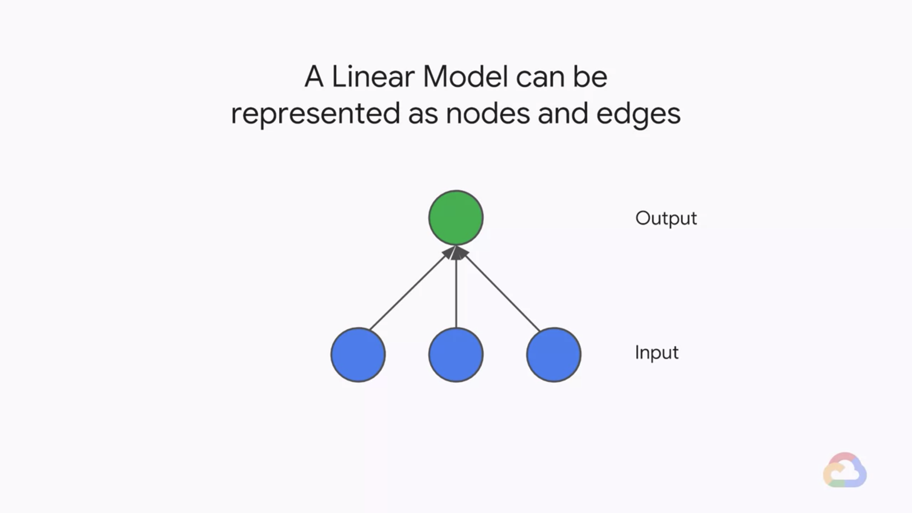
* Add complexity: Non-linear?
    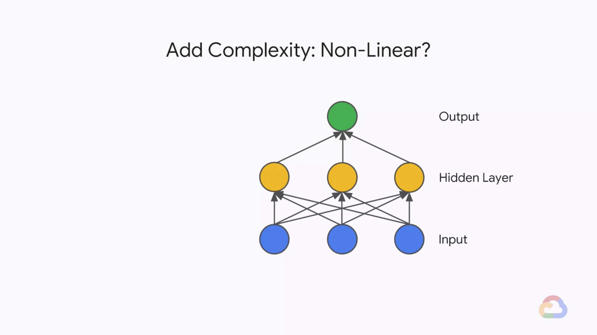
    $$
    h_1 = w_1 \times x_1 + w_4 \times x_2 + w_7 \times x_3 \\
    h_2 = w_2 \times x_1 + w_5 \times x_2 + w_8 \times x_3 \\
    h_3 = w_3 \times x_1 + w_6 \times x_2 + w_9 \times x_3 \\
    \textrm{Output} = w_{10} \times h_1 + w_{11} \times h_2 + w_{12} \times h_3 \\
    = (w_10 \times w_1 + w_{11} \times w_2 + w_{12} \times w_3) \times x_1 \\
    + (w_10 \times w_4 + w_{11} \times w_5 + w_{12} \times w_6) \times x_2 \\
    + (w_10 \times w_7 + w_{11} \times w_8 + w_{12} \times w_9) \times x_3 \\
    = W_1 \times x_1 + W_2 \times x_2 + W_3 \times x_3
    $$
    * Matrix form
        $$
        H_1 = \begin{bmatrix}
            w_1 & w_1 & w_3 \\
            w_4 & w_5 & w_6 \\
            w_7 & w_8 & w_9 
            \end{bmatrix}
            \begin{bmatrix}
            x_1 \\
            x_2 \\
            x_3
            \end{bmatrix} \\
        H_2 = \begin{bmatrix}
            w_{10} & w_{11} & w_{12} \\
            w_{13} & w_{14} & w_{15} \\
            w_{16} & w_{17} & w_{18} 
            \end{bmatrix}
            \begin{bmatrix}
            w_1 & w_1 & w_3 \\
            w_4 & w_5 & w_6 \\
            w_7 & w_8 & w_9 
            \end{bmatrix}
            \begin{bmatrix}
            x_1 \\
            x_2 \\
            x_3
            \end{bmatrix} \\
            = \begin{bmatrix}
            W_1 & W_1 & W_3 \\
            W_4 & W_5 & W_6 \\
            W_7 & W_8 & W_9 
            \end{bmatrix}
            \begin{bmatrix}
            x_1 \\
            x_2 \\
            x_3
            \end{bmatrix}
        \hat{y} = \begin{bmatrix}
            w_{19} & w_{20} & w_{21}
            \end{bmatrix}
            \begin{bmatrix}
            w_{10} & w_{11} & w_{12} \\
            w_{13} & w_{14} & w_{15} \\
            w_{16} & w_{17} & w_{18} 
            \end{bmatrix}
            \begin{bmatrix}
            w_1 & w_1 & w_3 \\
            w_4 & w_5 & w_6 \\
            w_7 & w_8 & w_9 
            \end{bmatrix}
            \begin{bmatrix}
            x_1 \\
            x_2 \\
            x_3
            \end{bmatrix} \\
            = \begin{bmatrix}
            W_1' & W_2' & W_3'
            \end{bmatrix}
            \begin{bmatrix}
            x_1 \\
            x_2 \\
            x_3
            \end{bmatrix} \\
        $$
* Adding a Non-linearity
    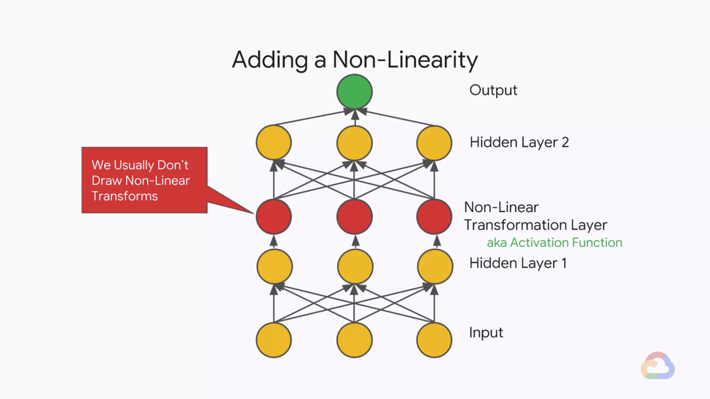
    $$
    \hat{y} = \begin{bmatrix}
        w_{19} & w_{20} & w_{21}
        \end{bmatrix}
        \begin{bmatrix}
        w_{10} & w_{11} & w_{12} \\
        w_{13} & w_{14} & w_{15} \\
        w_{16} & w_{17} & w_{18} 
        \end{bmatrix}
        f\left(
        \begin{bmatrix}
        w_1 & w_1 & w_3 \\
        w_4 & w_5 & w_6 \\
        w_7 & w_8 & w_9 
        \end{bmatrix}
        \begin{bmatrix}
        x_1 \\
        x_2 \\
        x_3
        \end{bmatrix} 
        \right) \\
        = \begin{bmatrix}
        w_{19} & w_{20} & w_{21}
        \end{bmatrix}
        \begin{bmatrix}
        w_{10} & w_{11} & w_{12} \\
        w_{13} & w_{14} & w_{15} \\
        w_{16} & w_{17} & w_{18} 
        \end{bmatrix}
        \begin{bmatrix}
        \max{(0, w_1 x_1 + w_2 x_2 + w_3 x_3) \\
        \max{(0, w_4 x_1 + w_5 x_2 + w_6 x_3) \\
        \max{(0, w_7 x_1 + w_8 x_2 + w_9 x_3) \\
        \end{bmatrix}
    $$
* Our favorite non-linearity is the Rectified Linear Unit (ReLU)
    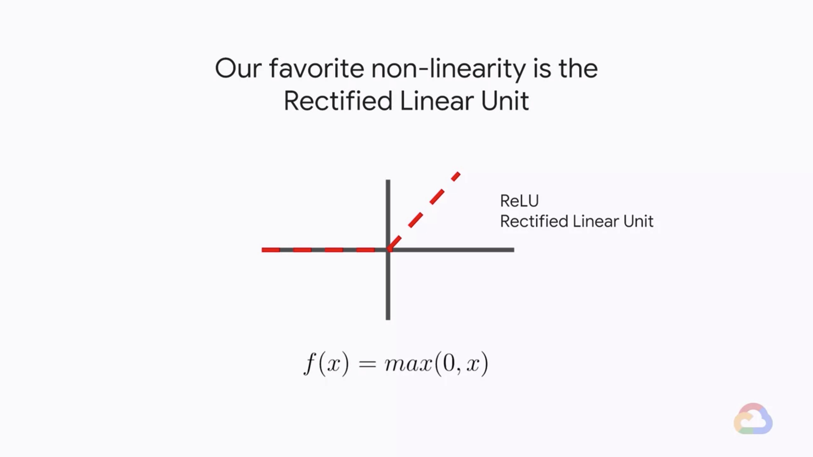
    * There are many different ReLU varients
        * ReLU
            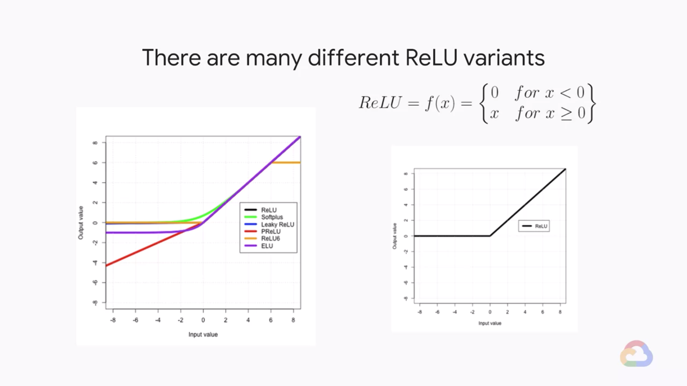
        * Softplus
            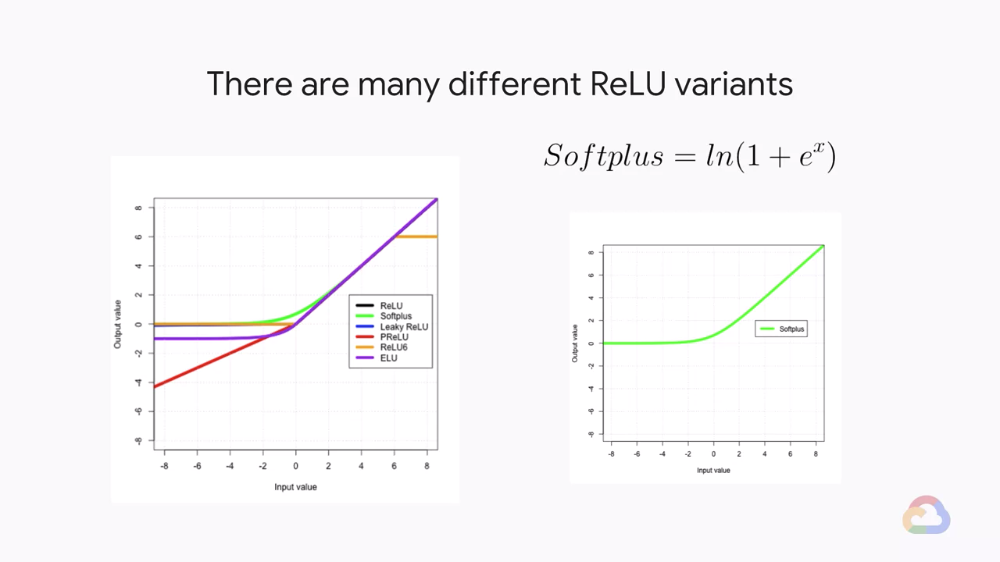
        * Leaky ReLU
            
        * PReLU
            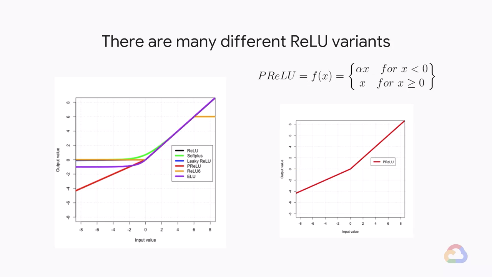
        * ReLU6
            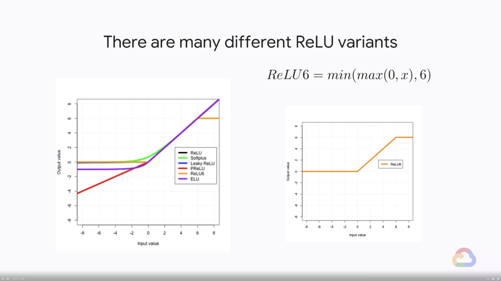
        * ELU
            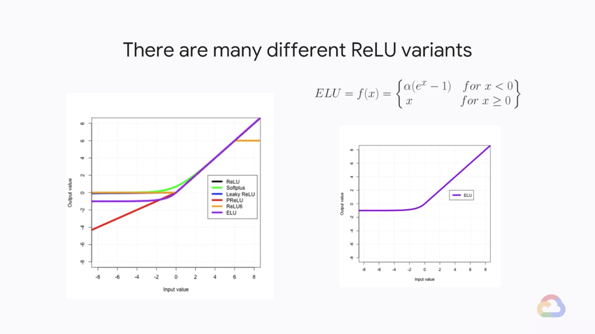
* Neural Networks can be arbitrarily complex
    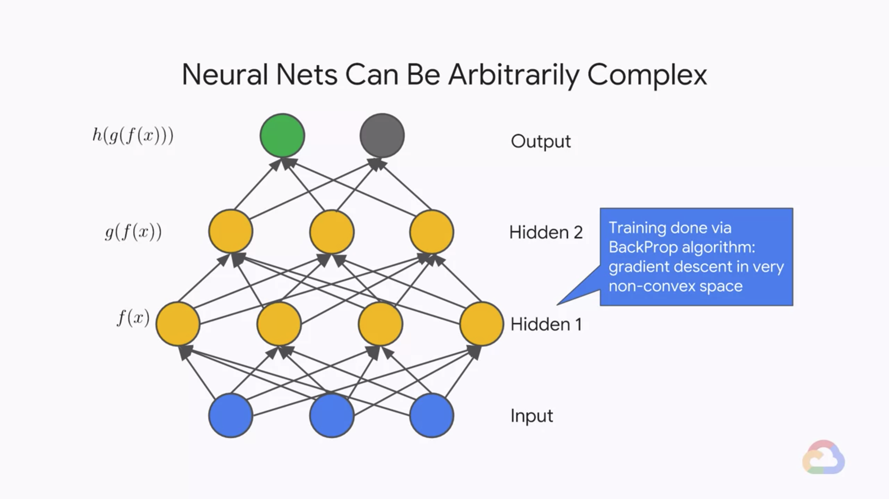
    * Each neuron added, adds a new dimension to my vector space
        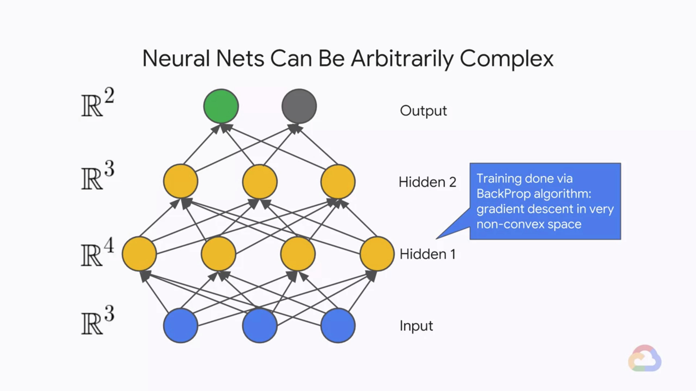

#### Quiz: Non-linearity

* Why is it important adding non-linear activation functions to neural networks?
    * A. Adds regularization
    * B. Increases the number of dimensions
    * C. Invokes early stopping
    * D. Stops the layers from collapsing back into just a linear model
    > Answer: D.

#### Quiz: Neural Network Complexity

* Neural networks can be arbitrarily complex. To increase hidden dimensions, I can add _______. To increase function composition, I can add _______. If I have multiple labels per example, I can add _______.
    * A. Layers, neurons, outputs
    * B. Neurons, layers, outputs
    * C. Layers, outputs, neurons
    * D. Neurons, outputs, layers
    > Answer: B.

---
## Lab 5: Neural Networks Playground

> 

* 

---
## Training Neural Networks

> 

---
## Lab 6: Using Neural Networks to Build a ML Model

> 

---
## Module Quiz

---
## Multi-class Neural Networks

> 

---
## Module Quiz

