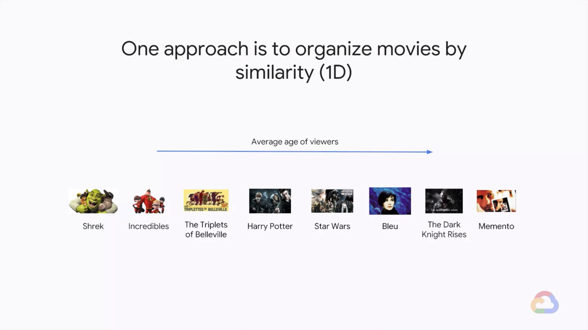
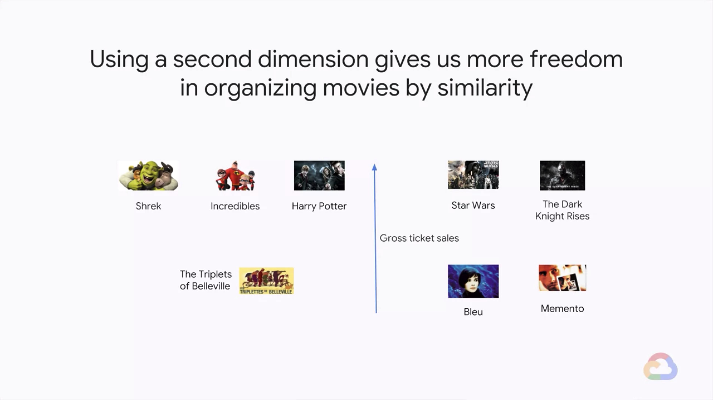
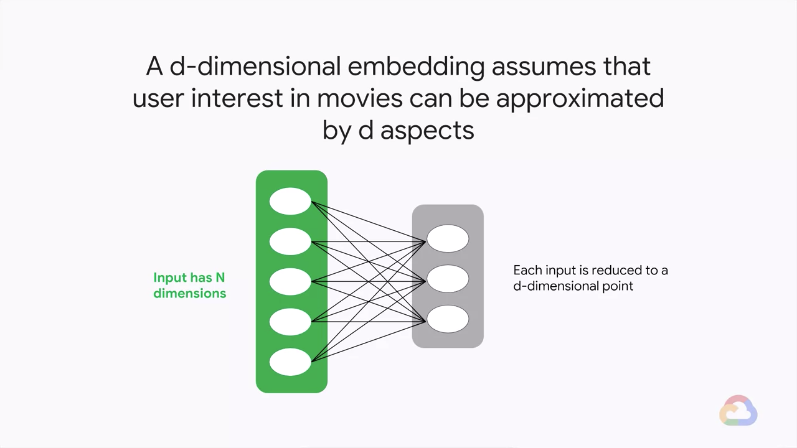
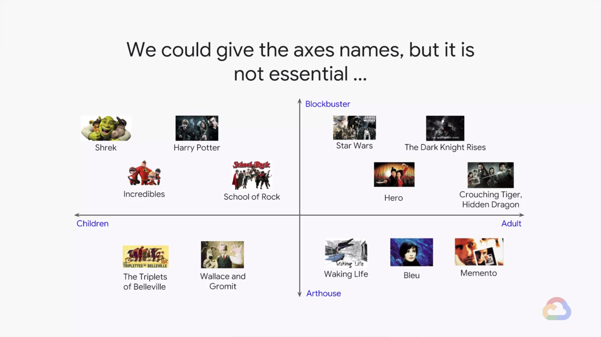
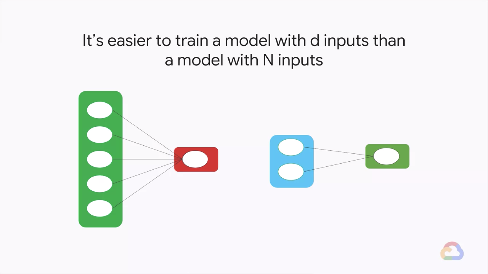
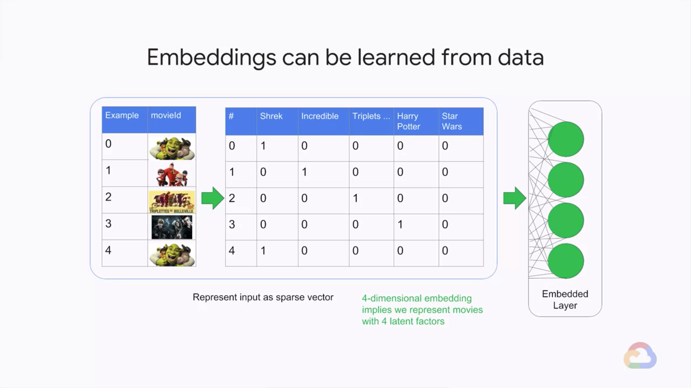
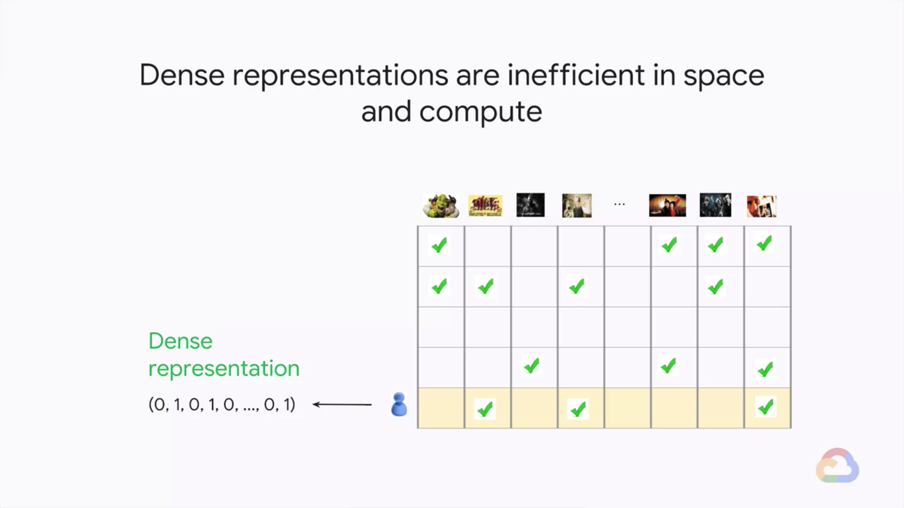
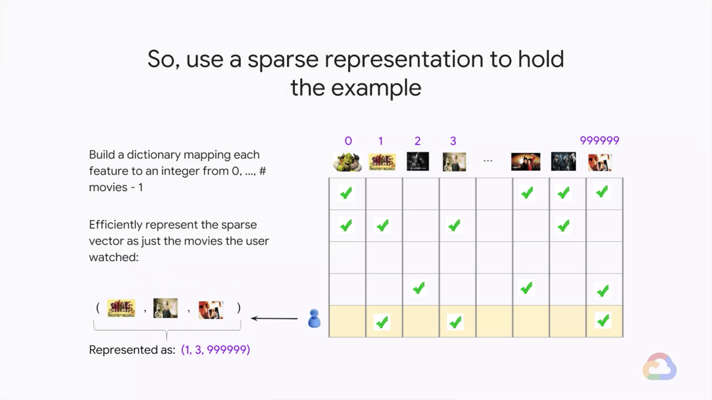
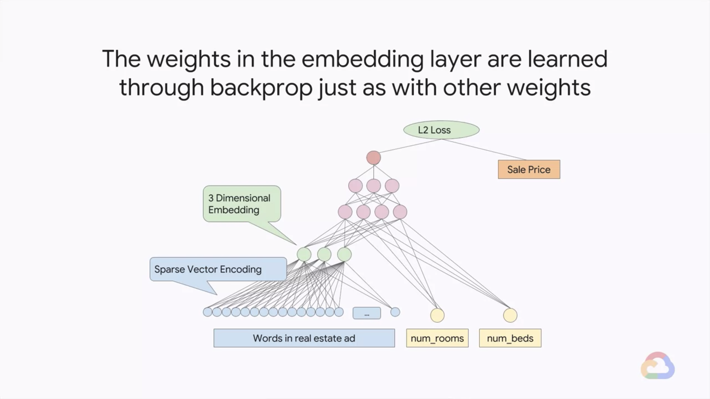
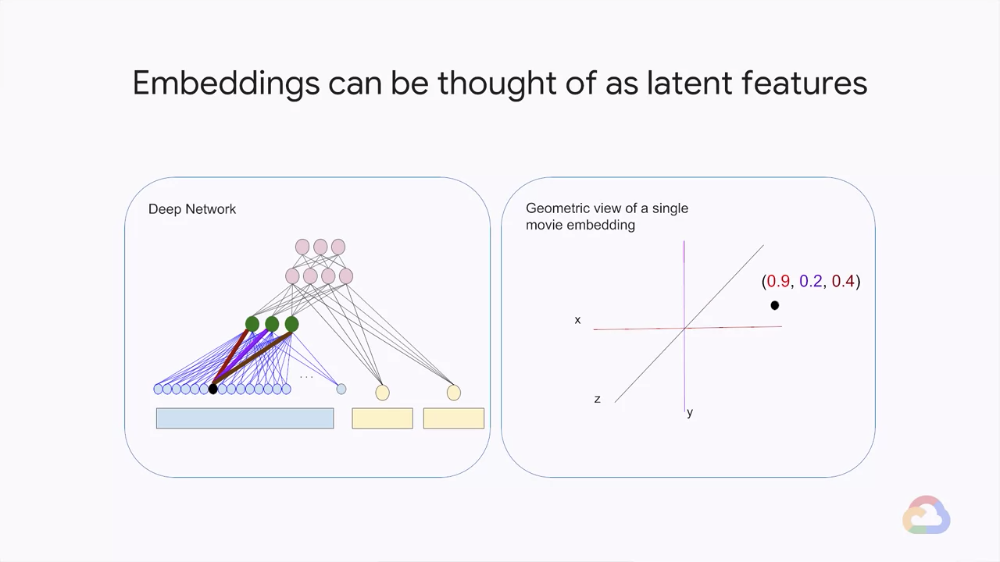

# Embeddings

In this module, you will learn how to use embeddings to manage sparse data, to make machine learning models that use sparse data consume less memory and train faster. Embeddings are also a way to do dimensionality reduction, and in that way, make models simpler and more generalizable.

## Introduction

> [](https://youtu.be/xxOVT5RjihM)

* Learn how to...
    * Use embeddings to 
        * Manage sparse data
        * Reduce dimensionality
        * Increase model generalization
        * Cluster observations
    * Create reusable embeddings
    * Explore embeddings in TensorBoard

### Review of Embeddings

> [](https://youtu.be/v6EDGjOjW0s)

* Creating an embedding column from a feature cross
* The weights in the embedding column are learned from data
* The model learns how to embed the feature cross in lower-dimensional space
* Embedding a feature cross in TensorFlow
    ```python
    import tf.feature_column as fc

    day_hr = fc.crossed_column(
        [dayofweek, hourofday],
        24 * 7
    )

    day_hr_em = fc.embedding_column(
        day_hr,
        2
    )
    ```
* Transfer learning of embeddings from similar ML models
    ```python
    import tf.feature_column as fc

    day_hr = fc.crossed_column(
        [dayofweek, hourofday],
        24 * 7
    )

    day_hr_em = fc.embedding_column(
        day_hr,
        2,
        ckpt_to_load_from='london/*ckpt-1000*',
        tensor_name_in_ckpt='dayhr_embed',
        trainable=Falses
    )
    ```
    * First layer: the feature cross
    * Second layer: a mystery box labeled latent factor
    * Third layer: the embedding
    * Fourth layer: 
        * one side: image of traffic
        * second side: image of people watching TV

---
## Recommendations

> [](https://youtu.be/rBXVSCLWQWw)

* Cases: How do you recommend movies to customers?
    
    * One approach is to organize movies by similarity (1D)
        
    * Using a second dimension gives us more freedom in organizing moview
        
* A d-dimensional embedding assumes that user interest in movies can be approximated by d aspects
    

---
## Data-driven Embeddings

> [](https://youtu.be/oYWnyg7WhoY)

* Cases: How do you recommend movies to customers?
    * We could give the axes names, but it is not essential...
        
    * The coordinates are called the 2D embedding for the movie
        
* It's easier to train a model with d inputs tha a model with N inputs
    
* Embeddings can be learned from data
    

---
## Sparse Tensors

> [](https://youtu.be/Eb_27I-dP0g)

* Storing the input vector as a one-hot encoded array is a bad idea
* Desnse representations are inefficient in space and compute
    
    * Use a sparse representation to hold the example
        
* Representing feature columns as sparse vectors
    * If you know the keys beforehand:
        ```python
        tf.feature_column.categorical_column_with_vocabulary_list(
            'employeeId',
            vocabulary_list=['8345', '72345', '87654', '98723', '23451']
        )
        ```
    * If your data is already indexed; i.e, has integers in $[0 - N)$:
        ```python
        tf.feature_column.categorical_column_with_identity(
            'employeeId',
            num_buckets=5
        )
        ```
    * If you don't have a vocabulary of all possible values:
        ```python
        tf.feature_column.categorical_column_with_hash_bucket(
            'employeeId',
            hash_bucket_size=500
        )
        ```
* Code to create an embedded feature column in TensorFlow
    

---
## Train and Embedding

> [](https://youtu.be/s-JOHzeuAzE)

* Embeddings are feature columns that function like layers
    
* The weights in the embedding layer are learned through backprop just as with other weights
    
* Embeddings can be thought of as latent features
    

---
## Similarity Property

> [](https://youtu.be/N5E46YaCLK4)


---
## Module Quiz


