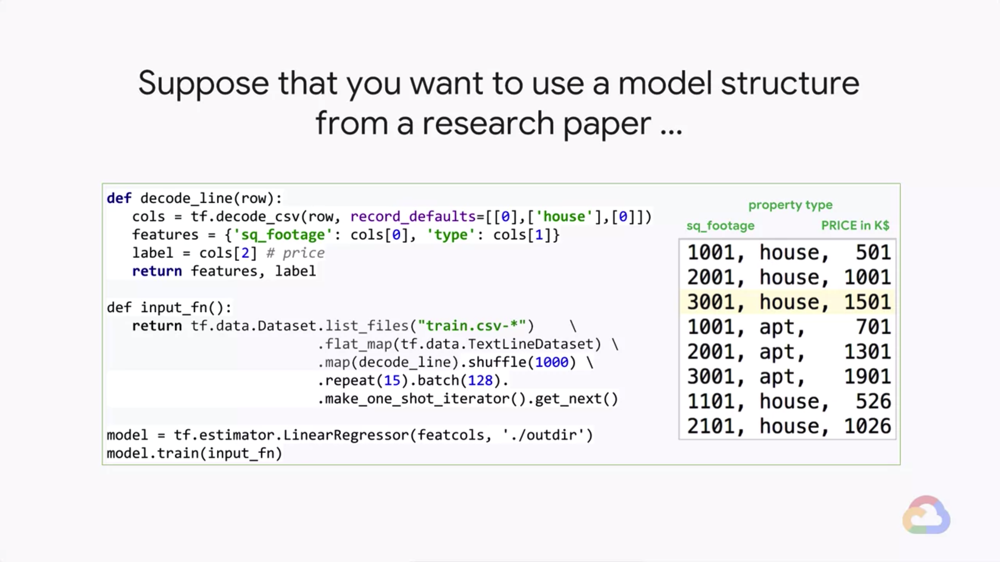
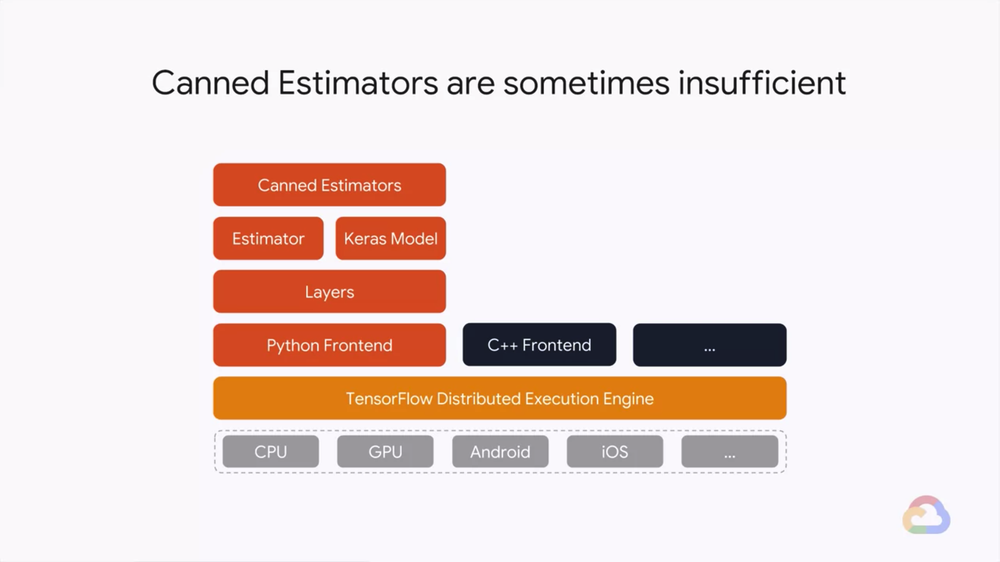

# Custom Estimator

In this module, we will go beyond using canned estimators by writing a custom estimator. By writing a custom estimator, you will be able to gain greater control over the model function itself.

# Introduction

> [](https://youtu.be/XvxPgcV4uxM)

* Learn how to...
    * Go beyond canned estimators
    * Write a custom estimator
    * Gain control over model functions
    * Incoporate Keras models into Estimator
* Estimator provides a lot of benefits
    * Quick model
    * Checkpointing
    * Out-of-memory datasets
    * Train / eval / monitor
    * Distributed training
    * Hyper-parameter tuning on ML-Engine
    * Production: serving predictions from a trained model
* Suppose that you want to use a model structure from a research paper...
    
* Canned Estimators are sometimes insufficient
    

---
## Model Function

> [](https://youtu.be/qhnrph-ztno)

* Suppose that you want to use a model structure from a research paper...
    * Implement the model using low-level TensorFlow ops
        ```python
        def model_from_research_paper(timeseries):
            x = tf.split(timeseries, N_INPUTS, 1)
            lstm_cell = rnn.BasicLSTMCell(LSTM_SIZE, forget_bias=1.0)
            outputs, _ = rnn.static_rnn(lstm_cell, x, dtype=tf.float32)
            outputs = outputs[-1]
            weight = tf.Variable(tf.random_normal[LSTM_SIZE, N_OUTPUTS])
            bias = tf.Variable(tf.random_normal([N_OUTPUTS]))
            predictions = tf.matmul(outputs, weight) + bias
            return predictions
        ```
* Create `train_and_evaluate` function with the base-class Estimator
    ```python
    def train_and_evaluation(output_dir, ...):
        estimator = tf.estimators.Estimator(model_fn = myfunc, model_dir=output_dir)
        train_spec = get_train()
        exporter = ...
        eval_spec = get_valid()
        tf.estimator.train_and_evaluate(estimator, train_spec, eval_spec)
    ```
    * `myfunc` (above) is a `EstimatorSpec`
* The 6 things in a `EstimatorSpec`
    ```python
    def myfunc(features, targets, mode):
        # Code up the model
        predictions = model_from_research_paper(features[INCOL])

        # Set up loss function, training/eval ops
        ...

        # Create dictionary of output tensors
        export_outputs = {
            "regression_export_outputs": tf.estimator.export.RegressionOutput(value=predictions)
        }

        # Return EstimatorSpec
        return tf.estimator.EstimatorSpec(
            mode=mode,
            predictions=predictions_dict,
            loss=loss,
            train_op=train_op,
            eval_metric_ops=eval_metric_ops,
            export_outputs=export_outputs
        )
    ```
    1. Mode in pass-through
    2. Any tensors you want to return
    3. Loss metric
    4. Training op
    5. Eval ops
    6. Export outputs
* The ops are set up in the appropriate mode
    ```python
    if mode == tf.estimator.ModeKeys.TRAIN or mode == tf.estimator.ModeKeys.EVAL:
        loss = tf.losses.mean_squared_error(targets, predictions)
        train_op = tf.contrib.layers.optimize_loss(
            loss=loss,
            global_step=tf.contrib.framework.get_global_step(),
            learning_rate=0.01,
            optimizer="SGD"
        )
        eval_metric_ops = {
            "rmse": tf.metrics.root_mean_squared_error(targets, predictions)
        }
    else:
        # Don't have a label
        loss = None
        train_op = None
        eval_metric_ops = None
    ```

---
## Lab 7: Implementing a Custom Estimator

> [](https://youtu.be/WvGEe3mtag4)

* Please follow the details in [here](./Lab-7.md)

---
## Keras Models

> [](https://youtu.be/_CxOgLiJVlI)

* Keras is a high-level deep neural networks library that suppots multiple backends
    * Besides TensorFlow, Keras also supports running on top of other neural network implementations like CNTK and theano.
* Keras is easy to use for fast prototyping
    ```python
    model = Sequential()
    model.add(Embedding(max_features, output_dim=256))
    model.add(LSTM(128))
    model.add(Dropout(0.5))
    model.add(Dense(1, activation='sigmoid'))

    model.compile(
        loss='binary_crossentropy',
        optimizer='rmsprop',
        metrics=['accuracy']
    )

    # From a compiled Keras model, you can get an Estimator
    estimator = keras.estimator.model_to_estimator(keras_model=model)

    # No need following lines
    model.fit(x_train, y_train, batch_size=16, epochs=10)
    score = model.evaluate(x_test, y_test, batch_size=16)
    ```
* From a compiled Keras model, you can get an Estimator
    ```python
    def train_and_evaluate(output_dir):
        estimator = make_keras_estimator(output_dir)
        train_spec = tf.estimator.TrainSpec(train_fn, max_steps=1000)
        exporter = LatestExporter('exporter', serving_input_fn)
        eval_spec = tf.estimator.EvalSpec(eval_fn, steps=None, exporters=exporter)
        tf.estimator.train_and_evaluate(estimator, train_spec, eval_spec)
    ```
* The connection between the input features and Keras is through a naming convention
    ```python
    model = keras.models.Sequential()
    model.add(keras.layers.Dense(..., name='XYZ'))

    def train_input_fn():
        ...
        features = {
            'XYZ_input': some_tensor
        }
        return features, labels
    ```

### Demo: Keras Models + Estimator

> [](https://youtu.be/X9deXay_ye4)

---
## Module Quiz

1. What is the benefit of using a pre-canned Estimator?
    * A. It can give us a quick ML model
    * B. It will cover every scenario you want to model
    * C. The syntax requires custom model coding
    > Answer: A.
2. What is the recommended way to create distributed Keras models?
    * A. Write a Keras model and add device placement TensorFlow code to distribute the model among parameter servers and workers
    * B. Write a custom estimator whose model function uses the TensorFlow equivalent of each of the Keras calls.
    * C. Write a Keras model as normal, and use the `model_to_estimator` function to convert it into an Estimator for `train_and_evaluate`
    > Answer: C.
3. In the model function for a custom estimator, you can customize:
    * A. The label that is used
    * B. The set of evaluation metrics
    * C. The optimizer that is used
    * D. The loss metric that is optimized
    * E. The predictions that are returned
    * F. The input function that is used
    > Answer: B. C. D. E.
