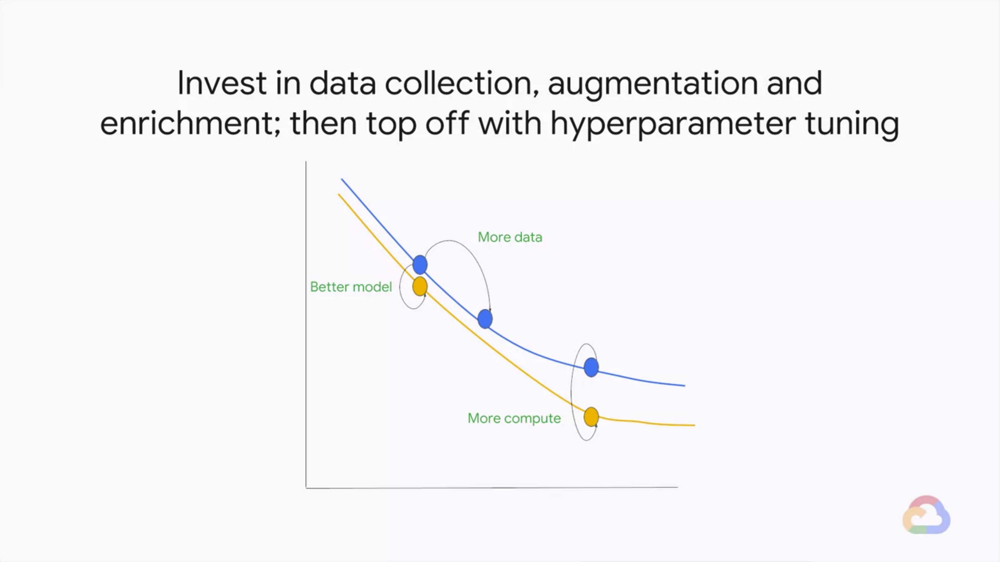

# Summary

Review the key concepts we covered in the Art and Science of ML course.

> 
> 

* [The Unreasonable Effectiveness of Data](https://static.googleusercontent.com/media/research.google.com/en//pubs/archive/35179.pdf)
* [Deep Learning Scaling is Predictable, Empirically](https://arxiv.org/abs/1712.00409)
* Invest in data collection, argumentation and enrichment; then top off with hyperparameter tuning
    
