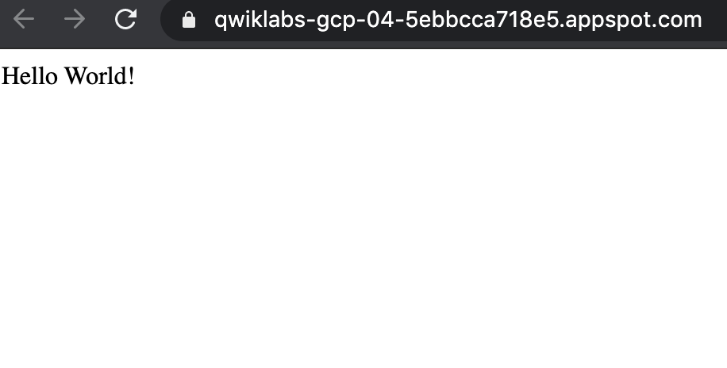

# Lab 5: Getting Started with App Engine

In this lab, you create and deploy a simple App Engine application using a virtual environment in the Google Cloud Shell.

## Objectives

In this lab, you learn how to perform the following tasks:

* Install the Cloud SDK for App Engine
* Preview an App Engine application running locally in Cloud Shell.
* Deploy an App Engine application, so that others can reach it.
* Disable an App Engine application, when you no longer want it to be visible.

---
## Set up your lab environment

### Before you click the Start Lab button

Read these instructions. Labs are timed and you cannot pause them. The timer, which starts when you click Start Lab, shows how long Cloud resources will be made available to you.

This Qwiklabs hands-on lab lets you do the lab activities yourself in a real cloud environment, not in a simulation or demo environment. It does so by giving you new, temporary credentials that you use to sign in and access the Google Cloud Platform for the duration of the lab.

### What you need

To complete this lab, you need:

* Access to a standard internet browser (Chrome browser recommended).
* Time to complete the lab.

> Note: If you already have your own personal GCP account or project, do not use it for this lab.

---
## Activate Google Cloud Shell

Google Cloud Shell is a virtual machine that is loaded with development tools. It offers a persistent 5GB home directory and runs on the Google Cloud. Google Cloud Shell provides command-line access to your GCP resources.

1. In GCP console, on the top right toolbar, click the Open Cloud Shell button.
    
2. Click `Continue`.
    
    * It takes a few moments to provision and connect to the environment. When you are connected, you are already authenticated, and the project is set to your `PROJECT_ID`. For example:
        
    * You can list the active account name with this command:
        ```bash
        $ gcloud auth list
        # Example output
        Credentialed accounts:
        - google1623327_student@qwiklabs.net
        ```
    * You can list the project ID with this command:
        ```bash
        $ gcloud config list project
        # Example output
        [core]
        project = qwiklabs-gcp-44776a13dea667a6
        ```
    * Full documentation of `gcloud` is available on [Google Cloud gcloud Overview](https://cloud.google.com/sdk/gcloud).

---
## Task 1: Install the Cloud SDK for App Engine

1. Run the following command to install the gcloud component that includes the App Engine extension for Python 3.7:
    ```bash
    $ gcloud components install app-engine-python
    ```
2. Initialize your App Engine app with your project and choose its region:
    ```bash
    $ gcloud app create --project=$DEVSHELL_PROJECT_ID
    ```
    * When prompted, select the [region](https://cloud.google.com/appengine/docs/locations) where you want your App Engine application located.
3. Clone the source code repository for a sample application in the `hello_world` directory:
    ```bash
    $ git clone https://github.com/GoogleCloudPlatform/python-docs-samples
    ```
4. Navigate to the source directory:
    ```bash
    $ cd python-docs-samples/appengine/standard_python37/hello_world
    ```

---
## Task 2: Run Hello World application locally

In this task, you run the Hello World application in a local, virtual environment in Cloud Shell.

Ensure that you are at the Cloud Shell command prompt.

1. Execute the following command to download and update the packages list.
    ```bash
    $ sudo apt-get update
    ```
2. Set up a virtual environment in which you will run your application.
    * Python virtual environments are used to isolate package installations from the system.
        ```bash
        $ sudo apt-get install virtualenv
        $ virtualenv -p python3 venv
        ```
        * If prompted `[Y/n]`, press `Y` and then `Enter`.
3. Activate the virtual environment.
    ```bash
    $ source venv/bin/activate
    ```
4. Navigate to your project directory and install dependencies.
    ```bash
    $ pip install  -r requirements.txt
    ```
5. Run the application:
    ```bash
    $ python main.py
    ```
6. In Cloud Shell, click `Web preview` > `Preview on port 8080` to preview the application.
    * To access the `Web preview` icon, you may need to collapse the **Navigation menu**.
    * Result:
        
7. To end the test, return to Cloud Shell and press `Ctrl + C` to abort the deployed service.
8. Using the Cloud Console, verify that the app is not deployed. In the Cloud Console, on the **Navigation menu**, click `App Engine` > `Dashboard`.
    * Notice that no resources are deployed.

---
## Task 3: Deploy and run Hello World on App Engine

To deploy your application to the App Engine Standard environment:

1. Navigate to the source directory:
    ```bash
    $ cd ~/python-docs-samples/appengine/standard_python37/hello_world
    ```
2. Deploy your Hello World application.
    ```bash
    $ gcloud app deploy
    ```
    * This `app deploy` command uses the `app.yaml` file to identify project configuration.
3. Launch your browser to view the app at `http://YOUR_PROJECT_ID.appspot.com`
    ```bash
    $ gcloud app browse
    ```
    * Copy and paste the URL into a new browser window.
    * Result:
        
6. Congratulations! You created your first application using App Engine.

---
## Task 4: Disable the application

App Engine offers no option to **Undeploy** an application. After an application is deployed, it remains deployed, although you could instead replace the application with a simple page that says something like "not in service."

However, you can disable the application, which causes it to no longer be accessible to users.

1. In the Cloud Console, on the **Navigation menu**, click `App Engine` > `Settings`.
2. Click `Disable application`.
3. Read the dialog message. Enter the `App ID` and click `DISABLE`.
    * If you refresh the browser window you used to view to the application site, you'll get a 404 error.
        

---
## End your Lab

When you have completed your lab, click `End Lab`. Qwiklabs removes the resources you’ve used and cleans the account for you.

You will be given an opportunity to rate the lab experience. Select the applicable number of stars, type a comment, and then click `Submit`.

The number of stars indicates the following:

* 1 star = Very dissatisfied
* 2 stars = Dissatisfied
* 3 stars = Neutral
* 4 stars = Satisfied
* 5 stars = Very satisfied

You can close the dialog box if you don't want to provide feedback.

For feedback, suggestions, or corrections, please use the Support tab.

> Copyright 2019 Google LLC All rights reserved. Google and the Google logo are trademarks of Google LLC. All other company and product names may be trademarks of the respective companies with which they are associated.
