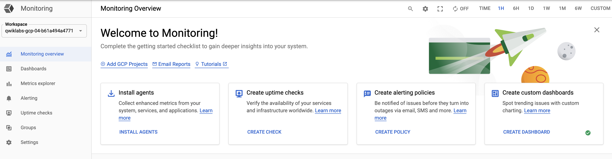
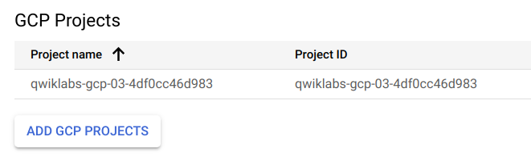

# Lab 6: Getting Started with Deployment Manager and Stackdriver

In this lab, you create a deployment using Deployment Manager and use it to maintain a consistent state of your deployment. You will also view resource usage in a VM instance using Cloud Monitoring.

---
## Objectives

In this lab, you will learn how to perform the following tasks:

* Create a Deployment Manager deployment.
* Update a Deployment Manager deployment.
* View the load on a VM instance using Cloud Monitoring.

---
## Task 1: Sign in to the Google Cloud Platform (GCP) Console

### Before you click the Start Lab button

Read these instructions. Labs are timed and you cannot pause them. The timer, which starts when you click Start Lab, shows how long Cloud resources will be made available to you.

This Qwiklabs hands-on lab lets you do the lab activities yourself in a real cloud environment, not in a simulation or demo environment. It does so by giving you new, temporary credentials that you use to sign in and access the Google Cloud Platform for the duration of the lab.

### What you need

To complete this lab, you need:

* Access to a standard internet browser (Chrome browser recommended).
* Time to complete the lab.

> Note: If you already have your own personal GCP account or project, do not use it for this lab.

---
## Task 2: Confirm that needed APIs are enabled

1. Make a note of the name of your GCP project. This value is shown in the top bar of the Google Cloud Platform Console. It will be of the form `qwiklabs-gcp-` followed by hexadecimal numbers.
2. In the GCP Console, on the **Navigation menu**, click `APIs & services`.
3. Scroll down in the list of enabled APIs, and confirm that these APIs are enabled:
    * Cloud Deployment Manager v2 API
    * Cloud Runtime Configuration API
    * Cloud Monitoring API
4. If one or more APIs is missing, click the Enable APIs and Services button at top. Search for the above APIs by name and enable each for your current project. (You noted the name of your GCP project above.)

---
## Task 3: Create a Deployment Manager deployment

1. In GCP console, on the top right toolbar, click the `Open Cloud Shell button`. Click `Continue`.
2. For your convenience, place the zone that Qwiklabs assigned you to into an environment variable called `MY_ZONE`. At the Cloud Shell prompt, type this partial command:
    ```bash
    $ export MY_ZONE=
    ```
    * Followed by the zone that Qwiklabs assigned you to. Your complete command will look like this:
        ```bash
        export MY_ZONE=us-central1-a
        ```
3. At the Cloud Shell prompt, download an editable Deployment Manager template:
    ```bash
    $ gsutil cp gs://cloud-training/gcpfcoreinfra/mydeploy.yaml mydeploy.yaml
    ```
4. Insert your Google Cloud Platform project ID into the file in place of the string `PROJECT_ID` using this command:
    ```bash
    $ sed -i -e 's/PROJECT_ID/'$DEVSHELL_PROJECT_ID/ mydeploy.yaml
    ```
5. Insert your assigned Google Cloud Platform zone into the file in place of the string `ZONE` using this command:
    ```bash
    $ sed -i -e 's/ZONE/'$MY_ZONE/ mydeploy.yaml
    ```
6. View the `mydeploy.yaml` file, with your modifications, with this command:
    ```bash
    $ cat mydeploy.yaml
    ```
    * The file will look something like this:
        ```yaml
        resources:
        - name: my-vm
          type: compute.v1.instance
          properties:
             zone: us-central1-a
             machineType: zones/us-central1-a/machineTypes/n1-standard-1
             metadata:
               items:
               - key: startup-script
                 value: "apt-get update"
             disks:
             - deviceName: boot
               type: PERSISTENT
               boot: true
               autoDelete: true
               initializeParams:
                 sourceImage: https://www.googleapis.com/compute/v1/projects/debian-cloud/global/images/debian-9-stretch-v20180806
             networkInterfaces:
             - network: https://www.googleapis.com/compute/v1/projects/qwiklabs-gcp-dcdf854d278b50cd/global/networks/default
               accessConfigs:
               - name: External NAT
                 type: ONE_TO_ONE_NAT
        ```
        * Do not use the above text literally in your own `mydeploy.yaml` file. Be sure that the zone that is named on the **zone**: and **machineType**: lines in your file matches the zone to which Qwiklabs assigned you. Be sure that the GCP project ID on the **network**: line in your file matches the project ID to which Qwiklabs assigned you, not the one in this example.
7. Build a deployment from the template:
    ```bash
    $ gcloud deployment-manager deployments create my-first-depl --config mydeploy.yaml
    ```
    * When the deployment operation is complete, the `gcloud` command displays a list of the resources named in the template and their current state.
8. Confirm that the deployment was successful. In the GCP Console, on the **Navigation menu**, click `Compute Engine` > `VM instances`. You will see that a VM **instance** called `my-vm` has been created, as specified by the template.
9. Click on the VM instance's name to open its VM instance details screen.
10. Scroll down to the **Custom metadata** section. Confirm that the startup script you specified in your Deployment Manager template has been installed.

---
## Task 4: Update a Deployment Manager deployment

1. Return to your Cloud Shell prompt. Launch the `nano` text editor to edit the `mydeploy.yaml` file:
    ```bash
    $ nano mydeploy.yaml
    ```
2. Find the line that sets the value of the startup script, `value: "apt-get update"`, and edit it so that it looks like this:
    ```yaml
    value: "apt-get update; apt-get install nginx-light -y"
    ```
    * Do not disturb the spaces at the beginning of the line. The YAML templating language relies on indented lines as part of its syntax. As you edit the file, be sure that the `v` in the word `value` in this new line is immediately below the `k` in the word `key` on the line above it.
3. Press `Ctrl + O` and then press `Enter` to save your edited file.
4. Press `Ctrl + X` to exit the `nano` text editor.
5. Return to your Cloud Shell prompt. Enter this command to cause Deployment Manager to update your deployment to install the new startup script:
    ```bash
    $ gcloud deployment-manager deployments update my-first-depl --config mydeploy.yaml
    ```
6. In the GCP console, on the **Navigation menu**, click `Compute Engine` > `VM instances`.
7. Click on the `my-vm` VM instance's name to open its `VM instance details` pane.
8. Scroll down to the `Custom metadata` section. Confirm that the startup script has been updated to the value you declared in your Deployment Manager template.

---
## Task 5: View the Load on a VM using Cloud Monitoring

1. In the GCP Console, on the **Navigation menu**, click `Compute Engine` > `VM instances`.
2. To open a command prompt on the `my-vm` instance, click `SSH` in its row in the `VM instances` list.
3. In the ssh session on `my-vm`, execute this command to create a CPU load:
    ```bash
    $ dd if=/dev/urandom | gzip -9 >> /dev/null &
    ```
    * This Linux pipeline forces the CPU to work on compressing a continuous stream of random data.
    * Leave the window containing your SSH session open while you proceed with the lab.

### Create a Monitoring workspace

You will now setup a Monitoring workspace that's tied to your Qwiklabs GCP Project. The following steps create a new account that has a free trial of Monitoring.

1. In the Google Cloud Platform Console, click on Navigation menu > Monitoring.
2. Wait for your workspace to be provisioned. When the Monitoring dashboard opens, your workspace is ready.
    
3. Click on **Settings** option from the left panel and confirm that the GCP project which Qwiklabs created for you is shown under the `GCP Projects` section.
    
4. Under the `Settings` tab menu, click `Agent`. Using your VM's open SSH window and the code shown on the Agents page, install both the Monitoring and Logging agents on your project's VM.
5. Once both of the agents have been installed on your project's VM, click `Metrics Explorer` under the main Cloud Monitoring menu on the far left.
6. In the **Metric** pane of **Metrics Explorer**, select the resource type `GCE VM instance` and the metric `CPU usage`.
   * In the resulting graph, notice that CPU usage increased sharply a few minutes ago.
7. Terminate your workload generator. Return to your SSH session on `my-vm` and enter this command:
    ```bash
    $ kill %1
    ```

---
## End your Lab

When you have completed your lab, click `End Lab`. Qwiklabs removes the resources you’ve used and cleans the account for you.

You will be given an opportunity to rate the lab experience. Select the applicable number of stars, type a comment, and then click `Submit`.

The number of stars indicates the following:

* 1 star = Very dissatisfied
* 2 stars = Dissatisfied
* 3 stars = Neutral
* 4 stars = Satisfied
* 5 stars = Very satisfied

You can close the dialog box if you don't want to provide feedback.

For feedback, suggestions, or corrections, please use the Support tab.

> Copyright 2019 Google LLC All rights reserved. Google and the Google logo are trademarks of Google LLC. All other company and product names may be trademarks of the respective companies with which they are associated.
