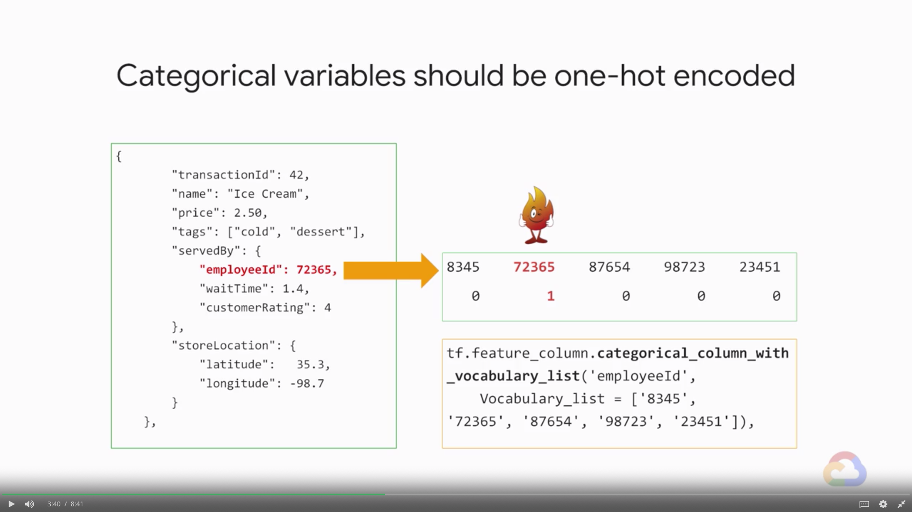
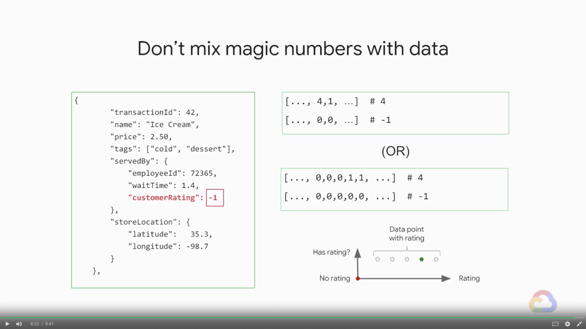

# Raw Data to Features

Feature engineering is often the longest and most difficult phase of building your ML project. In the feature engineering process, you start with your raw data and use your own domain knowledge to create features that will make your machine learning algorithms work. In this module we explore what makes a good feature and how to represent them in your ML model.

## Introduction

> [](https://youtu.be/Hf-ZQCgwk8w)

* Feature engineering
    * Scale to large datasets
    * Find good features
    * Preprocess with Cloud ML Engine
* Turn raw data to features
    * Raw data must be mapped into numerical feature vectors

---
## Good vs. Bad Features

> [](https://youtu.be/S3AQNhlNj3Y)

* Objectives
    * Turn raw dat to features
    * **Compare good vs. bad features**
    * Represent features
* What makes a good feature?
    1. **Be related to the objective**
        * Different problems in the same domain may need different features
    2. Be known at prediction-time
    3. Be neumeric with meaningful magnitude
    4. Hvae enough examples
    5. Bring human insight to problem

#### Quiz: Features are Related to the Objective

> [](https://youtu.be/8WY4E9F1tmc)

* Are these features related to the objective or not?
    * **Objective:** Predict total number of customers who will use a certain discount coupon
        * A. Font of the text with which the discount is advertised on partner websites
        * B. Price of the item the coupon applies to
        * C. Number of items in stock
        > Answer: A. B.
    * **Objective:** Predict point-of-sale credit card fraudulent activity
        * A. Whether cardholder has purchased these items at this store before
        * B. Credit card chip reader speed
        * C. Category of item being purchased
        * D. Expiry date of credit card
        > A. B. C. D.

### Features Known at Predicton-time

> [](https://youtu.be/kiBdRXLnDvA)

* What makes a good feature?
    1. Be related to the objective
        * Different problems in the same domain may need different features
    2. **Be known at prediction-time**
        * Some data could be known immediately, and some other data is not known in real time
        * Make sure that for every input that you're using for your model, for every feature, make sure that you have them the actual prediction time
    3. Be neumeric with meaningful magnitude
    4. Hvae enough examples
    5. Bring human insight to problem

#### Quiz: Features Known at Prediction-time

> [](https://youtu.be/efo_ko1-M9A)

* Is the value knowable at prediction time or not?
    * **Objective:** Predict total number of customers who will use a certain discount coupon
        * A. Total number of discountable items sold
        * B. Number of discountable items sold the previous month
        * C. Number of customers who viewed ads about item
        > Answer: B. C.
    * **Objective:** Predict whether a credit card transaction is fraudulent
        * A. Whether cardholder has purchased these items at this store before
        * B. Whether item is new at store (and can not have been purchased before)
        * C. Category of item being purchased
        * D. Online or in-person purchase
        > Answer: A. B. C. D.
* You cannot train with current data and predict with stale data

### Features Should be Numeric

> [](https://youtu.be/N-298tJYtY4)

* Be numeric with meaningful magnitude
* Neural networks are weighing and adding machines

#### Quiz: Features Should be Numeric

> [](https://youtu.be/HK2DBmTea6U)

* Which of these features are numeric (or could be in a useful form)?
    * **Objective:** Predict total number of customers who will use a certain discount coupon
        * A. Percent value of the discount (e.g. 10% off, 20% off, etc.)
        * B. Size of the coupon (e.g. 4 cm2, 24 cm2, 48 cm2, etc.)
        * C. Font an advertisement is in (Arial, Times New Roman, etc.)
        * D. Color of coupon (red, black, blue, etc.)
        * E. Item category (1 for dairy, 2 for deli, 3 for canned goods, etc.)
        > Answer: A.

### Features Should Have Enough Examples

> [](https://youtu.be/DQnrqtiLGps)

* Avoud having values of which you don't have enough examples

#### Quiz: Features Should Have Enough Examples

> [](https://youtu.be/-Kg_MVMurPA)
> [](https://youtu.be/7w9Y2KQ4MGU)

* Which of these will it be *difficult* to get enough examples?
    * **Objective:** Predict customer discount coupon usage
        * A. Percent discount of coupon (20%, 30%, etc.)
        * B. Date that promotional offer starts
        * C. Number of customers who opened advertising email
        * D. All of these we should be able enough examples for
        > Answer: D.
* Which of these will it be relatively easy to get enough examples for?
    * **Objective:** Predict point-of-sale credit card fraudulent activity
        * A. Whether cardholder has purchased these items at this store before
        * B. Distance between cardholder address and store
        * C. Category of item being purchased
        * D. Online or in-person purchase
        > Answer: A. B. C. D.

### Bringing Human Insight

> [](https://youtu.be/_BoUJwle2zQ)

---
## Quiz: Raw Data to Features

1. What are the characteristics of a good feature?
    * A. Be in free-text format
    * B. Have enough examples in the data
    * C. Be numeric with meaningful magnitude
    * D. Knowable at prediction time
    * E. Related to the objective
    > Answer: B. C. D. E.
2. I want to build a model to predict whether Team A will win its basketball game against Team B. I will train my model on features computed on historical basketball games. One of my features is how many games this season Team A has won. How should I compute this feature?
    * A. Compute num_games_won / num_games_played over the whole season
    * B. Compute num_games_won / num_games_played until the N-1 th game in order to train with the label for the N th game
    * C. Compute num_games_won / num_games_played until the N th game in order to train with the label for the N th game
    > Answer: B. 
3. I want to build a model to predict whether Team A will win its basketball game against Team B. Which of these attributes (computed on historical basketball games) are good features? Assume that these features are all computed appropriately without taking into account non-causal data.
    * A. How often Team A wins games
    * B. How often Team A wins games where its opponent is ranked in the top 10
    * C. How many of the last 7 games that Team A played that it has won
    * D. The fraction of games that Team A won when it played against Team B when both teams had this exact set of players
    > Answer: A. B. C.

---
## Discussion Prompt

Imagine you are the business owner of a same-day grocery food delivery service which prides itself on driving and delivering the freshest foods to their customers. Recently, some of your customers have started to complain that they are not getting their food orders on time. You are thinking of building a machine learning model to help optimize route times between your warehouse and individual customers but you don't know which features you should focus on first.

From the below list of available data fields, pick the *MOST* useful and the *LEAST* useful to your food delivery service model and explain your reasoning.

* Daily weather temperature and forecasts
* Route times for your common delivery areas
* Temperature sensors inside of your delivery trucks
* Category of items in each order
* Customer ratings of your delivery drivers

---
## Representing Features

> [](https://youtu.be/lxnkiMg5EFs)

* Objectives
    * Turn raw dat to features
    * Compare good vs. bad features
    * **Represent features**
* Raw data are converted to numeric features in different ways
* Numeric values can be used as-is
    * `numeric_column` is a type of feature column
* Only specific attributes should be discarded
* Categorical variables should be **one-hot** encoded
    
* Don't know the list of keys? 
    * Proprocess data to create a vocabulary of keys
    * The vocabulary and the mapping of the vocabulary needs to be identical at prediction time
* Options for encoding categorical data
    * If you **know the keys** beforehand:
        ```python
        tf.feature_column.categorical_column_with_vocabulary_list(
            'employeeId',
            vocabulary_list=['8345', '72345', '87654', '98723', '23451']
        )
        ```
    * If your data is **already indexed**; i.e., has integers in $[0-N)$:
        ```python
        tf.feature_column.categorical_column_with_identity(
            'employeeId',
            num_buckets=5
        )
        ```
    * If you don't have a vocabulary of all possible values:
        ```python
        tf.feature_column.categorical_column_with_hash_bucket(
            'employeeId',
            hash_bucket_size=500
        )
        ```
* **Don't mix magic numbers with data**
    * If you have **missing data**, you need to have another column
    

### ML vs. Statictics

> [](https://youtu.be/8Y9uflIbls8)

* ML = Lots of data, **keep outlier** and build models for them
* Statistics = "I've got all the data I'll ever get", **throw away outliers**
* Exact floats are not meaningful
    * Discretize floating point values into bins
        ```python
        lat = tf.feature_column.numeric_column('latitude')
        dlat = tf.feature_column.bucketized_column(
            lat, boundaries=np.arange(32, 42, 1).tolist()
        )
        ```
* Crazy outliers will hurt trainability
* Ideally, features should have a similar range

---
## Lab 1: Improve Model Accuracy with New Features

> [](https://youtu.be/ddfhhFItqHM)

* Please follow the details in [here](./Lab-1.md)

---
## Quiz: Representing Features

1. What is one-hot encoding?
    * A. One hot encoding is a process by which only the hottest numeric variable is retained for use by the neural network.
    * B. One hot encoding is a process by which numeric variables are converted into a form that could be provided to neural networks to do a better job in prediction.
    * C. One hot encoding is a process by which numeric variables are converted into a categorical form that could be provided to neural networks to do a better job in prediction.
    * D. One hot encoding is a process by which categorical variables are converted into a form that could be provided to neural networks to do a better job in prediction.
    > Answer: D.
2. Which of these offers the best way to encode categorical data that is already indexed, i.e. has integers in $[0-N]$?
    * A. `tf.feature_column.categorical_column_with_identity`
    * B. `tf.feature_column.categorical_column_with_vocabulary_list`
    * C. `tf.feature_column.categorical_column_with_hash_bucket`
    > Answer: A.
3. What do you use the `tf.feature_column.bucketized_column` function for?
    * A. To discretize floating point values into a smaller number of categorical bins
    * B. To compute the hash buckets needed to one-hot encode categorical values
    * C. To count the number of unique buckets the input values falls into
    > Answer: A.
