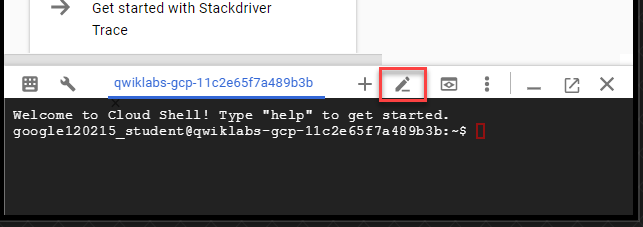
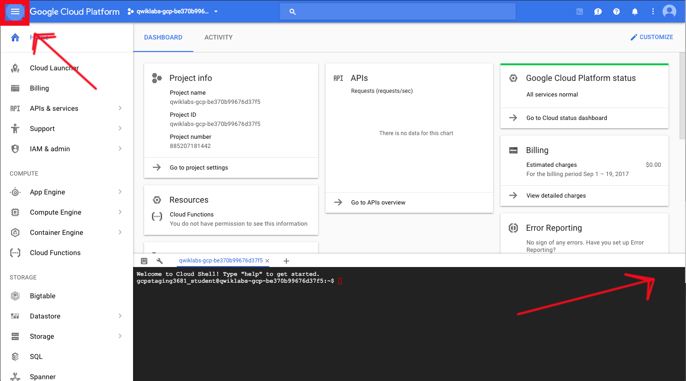

# Lab 3: MapReduce in Dataflow

> * Last Tested Date: DEC 07, 2018
> * Last Updated Date: DEC 07, 2018

## Overview

In this lab, you learn how to use pipeline options and carry out Map and Reduce operations in Dataflow.

### What You Need

You must have completed Lab 0 and have the following:

* Logged into GCP Console with your Qwiklabs generated account

### What You Learn

In this lab, you learn how to:

* Use pipeline options in Dataflow
* Carry out mapping transformations
* Carry out reduce aggregations

---
## Setup

For each lab, you get a new GCP project and set of resources for a fixed time at no cost.
1. Make sure you signed into Qwiklabs using an incognito window.
2. Note the lab's access time (for example, `02:00:00` and make sure you can finish in that time block.
    * There is no pause feature. You can restart if needed, but you have to start at the beginning.
3. When ready, click `START LAB`
4. Note your lab credentials. You will use them to sign in to Cloud Platform Console. 
    
5. Click `Open Google Console`.
6. Click `Use another account` and copy/paste credentials for **this** lab into the prompts.
    * If you use other credentials, you'll get errors or **incur charges**.
7. Accept the terms and skip the recovery resource page.
    * Do not click `End Lab` unless you are finished with the lab or want to restart it. This clears your work and removes the project.

### Activate Google Cloud Shell

Google Cloud Shell provides command-line access to your GCP resources.

8. From the GCP Console click the Cloud Shell icon on the top right toolbar:
    
9. Then click `START CLOUD SHELL`:
    
    * You can click `START CLOUD SHELL` immediately when the dialog comes up instead of waiting in the dialog until the Cloud Shell provisions.
    * It takes a few moments to provision and connects to the environment:
        
    * The Cloud Shell is a virtual machine loaded with all the development tools you’ll need. It offers a persistent 5GB home directory, and runs on the Google Cloud, greatly enhancing network performance and authentication.
10. Once connected to the cloud shell, you'll see that you are already authenticated and the project is set to your `PROJECT_ID`:
    ```bash
    $ gcloud auth list
    ```
    * Output:
        ```bash
        Credentialed accounts:
        - <myaccount>@<mydomain>.com (active)
        ```
    * **Note:** gcloud is the powerful and unified command-line tool for Google Cloud Platform. Full documentation is available on [Google Cloud gcloud Overview](https://cloud.google.com/sdk/gcloud). It comes pre-installed on Cloud Shell and supports tab-completion.
        ```bash
        $ gcloud config list project
        ```
        * Output:
            ```bash
            [core]
            project = <PROJECT_ID>
            ```

### Launch Google Cloud Shell Code Editor

Use the Google Cloud Shell Code Editor to easily create and edit directories and files in the Cloud Shell instance.

1. Once you activate the **Google Cloud Shell**, click the `Launch code editor` button (looks like a pencil) to open the Cloud Shell Code Editor.
    
    * **Note:** The `Launch code editor` button may be off screen to the right. You may need to click the `Navigation menu` button to close the menu to see the buttons.
        
    * You now have three interfaces available:
        * The Cloud Shell Code Editor
        * The Cloud Shell Command Line
        * Console (By clicking on the tab). You can switch back and forth between the Console and Cloud Shell by clicking on the tab.
        

---
## Identify Map and Reduce Operations

1. In **CloudShell** clone the source repo which has starter scripts for this lab:
    ```bash
    $ git clone https://github.com/GoogleCloudPlatform/training-data-analyst
    ```
    * Then navigate to the code for this lab.
        ```bash
        $ cd training-data-analyst/courses/data_analysis/lab2/python
        ```
2. Click `File > Refresh`.
    * View the source code for `is_popular.py` for the pipeline using the Cloud Shell in-browser editor or with the command line using nano:
        ```bash
        $ nano is_popular.py
        ```
        
3. Answer the following questions:
    * What custom arguments are defined?
        * `'--output_prefix'`
        * `'--input'`
    * What is the default output prefix?
        * `'/tmp/output'`
    * How is the variable `output_prefix` in `main()` set? _____________________________
    * How are the pipeline arguments such as` --runner` set? ______________________
4. Answer the following questions:
    * What are the key steps in the pipeline? 
        * `'GetJava'`
        * `'GetImport'`
        * `'PackageUse'`
        * `'TotalUse'`
        * `'Top_5'`
        * `'weite'`
    * Which of these steps happen in parallel? ____________________________________
    * Which of these steps are aggregations? _____________________________________

---
## Execute the Pipeline

1. Install the necessary dependencies for Python dataflow:
    ```bash
    $ sudo ./install_packages.sh
    ```
    * Verify that you have the right version of `pip` (should be > 8.0):
        ```bash
        $ pip -V
        ```
    * If not, open a new **CloudShell** tab and it should pick up the updated `pip`.
2. Run the pipeline locally:
    ```bash
    $ ./is_popular.py
    ```
    * **Note:** If you see an error that says "`No handlers could be found for logger "oauth2client.contrib.multistore_file`", you may ignore it. The error is simply saying that logging from the `oauth2` library will go to `stderr`.
3. Examine the output file:
    ```bash
    $ cat /tmp/output-*
    ```

---
## Use Command Line Parameters

1. Change the output prefix from the default value:
    ```bash
    $ ./is_popular.py --output_prefix=/tmp/myoutput
    ```
    * What will be the name of the new file that is written out?
2. Note that we now have a new file in the `/tmp` directory:
    ```bash
    $ ls -lrt /tmp/myoutput*
    ```

---
## What You Learned

In this lab, you:

* Used pipeline options in Dataflow
* Identified Map and Reduce operations in the Dataflow pipeline

---
---
## End Your Lab

1. When you have completed your lab, click `End Lab`. Qwiklabs removes the resources you’ve used and cleans the account for you.
2. You will be given an opportunity to rate the lab experience. Select the applicable number of stars, type a comment, and then click `Submit`.
    * The number of stars indicates the following:
        * 1 star = Very dissatisfied
        * 2 stars = Dissatisfied
        * 3 stars = Neutral
        * 4 stars = Satisfied
        * 5 stars = Very satisfied
3. You can close the dialog box if you don't want to provide feedback.
4. For feedback, suggestions, or corrections, please use the `Support` tab.

---
> ©2019 Google LLC All rights reserved. Google and the Google logo are trademarks of Google LLC. All other company and product names may be trademarks of the respective companies with which they are associated.
