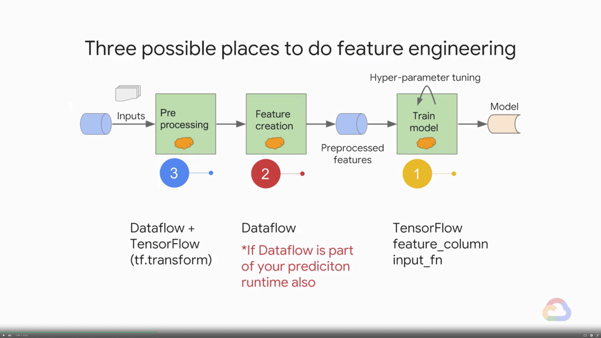
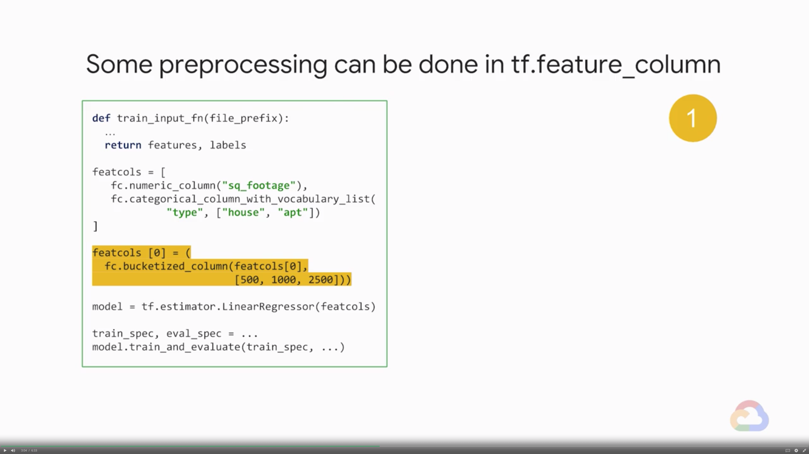
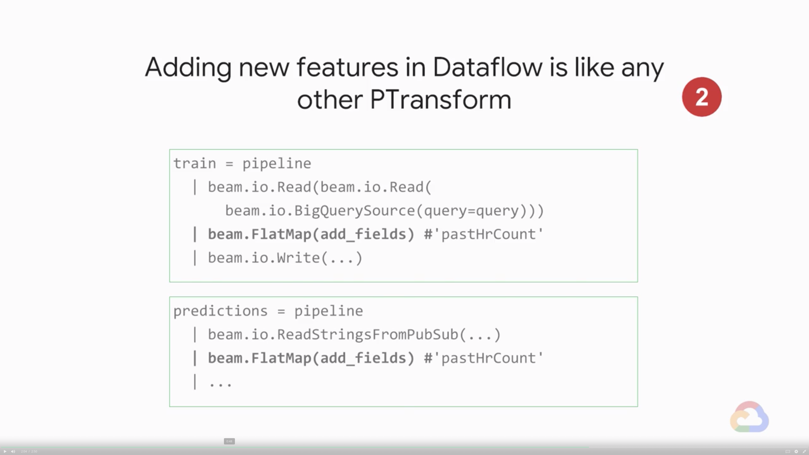

# Introducing 

In traditional machine learning, feature crosses don’t play much of a role, but in modern day ML methods, feature crosses are an invaluable part of your toolkit.In this module, you will learn how to recognize the kinds of problems where feature crosses are a powerful way to help machines learn.

## Introduction

> [](https://youtu.be/zSR-_a8P63M)

* Learn how to ...
    * Recognize where feature crosses are a powerful way to help machines learn
    * Implement feature crosses in TensorFlow
    * Incopoerate feature creation as part of your ML pipeline
    * Improve the taxifare model using feature crosses

---
## What is a Feature Cross?

> [](https://youtu.be/kxZfu2Anu6s)

* The feature cross provides a way to combine features in a linear model
    * Using non-linear inputs in a linear learner

---
## Discretization

> [](https://youtu.be/jXkkcF-xQ5I)

---
## Memorization vs. Generalization

> [](https://youtu.be/R8evI4-EyJc)

* A feature cross memorize the input space
* Goal of ML is generalization
* Memorization works when you have lots of data
* Feature crosses are powerful

---
## Taxi Colors

> [](https://youtu.be/YRZkcp2ZIjI)

* Which of these cars is a taxi?
    * Assume that your input data looks like this
        * e.g., Red, Rome; White, Rome; Yellow, NYC; White, NYC; ...
    * The linear model has problems; the feature cross has no problem
* Feature crosses bring a lot of power to linear model
    * Feature crosses + massive data is an efficient way of learning highly complex spaces
    * Feature crosses allow a linear model to memorize large datasets
    * Optimizing linear models is a convex problem
    * Before TensorFlow, Google used massive scale learners

---
## Lab 5: Feature Crosses to Create a Good Classifier

> [](https://youtu.be/w5AV3NXa3FQ)
> [](https://youtu.be/8LujL7KG5uk)

* Please follow the details in [here](./Lab-5.md)

---
## Sparsity

> [](https://youtu.be/_u7UXnpOEt0)

* Feature crosses combine discrete / categorical features
    * E.g., Cross `hour_of_day` with `day_of_week` to predict traffic
        * How many inputs would we have if we simply one-hot-encoded the hour of day and the day of week and provided it to a model?
            > Answer: 24 input nodes for hours in the day + 7 inputs for days of the week = 31
        * How many inputs do we now have for our model?
            > Answer: 24 x 7 inputs = 168 total inputs
* Feature crosses lead to sparsity
    * E.g., Cross `hour_of_day` with `day_of_week` to predict traffic
        * How many nodes in $x_3$ will be lit up for a single input from $x_1$ and $x_2$?
            > Answer: 1

### Quiz

* Which of these is a good feature cross?
    * Different cities in California have markedly different housing prices. Suppose you must create a model to predict housing prices. Which of the following sets of features or feature crosses could learn city-specific relationships between house characteristic and housing price?
        * A. Two feature crosses: [binned latitude X binned roomsPerPerson] and [binned longitude X binned roomsPerPerson]
        * B. One feature cross: [latitude X longitude X roomsPerPerson]
        * C. One feature cross: [binned latitude X binned longitude X binned roomsPerPerson]
        * D. Three separate binned features: [binned latitude], [binned longitude], [binned roomsPerPerson]
        > Answer: C.
        > Yes. Crossing binned latitude with binned longitude enables the model to learn city-specific effects of roomsPerPerson. Binning prevents a change in latitude producing the same result as a change in longitude. Depending on the granularity of the bins, this feature cross could learn city-specific or neighborhood-specific or even block-specific effects.

---
## Lab 6: Too Much of a Good Thing

> [](https://youtu.be/rCZhZlsNydc)
> [](https://youtu.be/Nj1EtL7SzC0)

* Please follow the details in [here](./Lab-6.md)

---
## Implementing Feature Crosses

> [](https://youtu.be/82LJIOneOac)

* Create feature crosses using TensorFlow
    ```python
    day_hr = tf.feature_column.crossed_column(
        [dayofweek, hourofday],
        24 * 7)
    ```
    * You can cross two or more categorical or bucketized columns
    * `24 * 7` is the number of hash buckets: `feature_cross % hash_bucket_size`
* Choosing the number of hash buckets is an art, not a science
* The number of hash buckets controls sparsity and collisions
    * Small `hash_buckets`, lots of collision
    * High `hash_buckets`, very sparse
* Some expericen: choose a number between $\frac{1}{2}\sqrt{n}$ and $2n$

---
## Embedding Feature

> [](https://youtu.be/KYxH8Nd9xAc)

* Creating an embedding column from a feature cross 
    * The weights in the embedding column are learned from data
        * ML is a way to learn the long tail to make fine grained predictions and derive insights beyond just a gross averages
    * The model learns how to embed the feature cross in lower-dimensional space
* Transfer learning of embeddings from similar ML models
* To create an embedding, use the embedding column method in TFF feature column
* Embedding features that you have learned from on one problem can often apply to their similar ML models
* Embedding features are an extremely powerful concept, and transfer learning of embeddings makes them even more so

---
## Module Quiz

1. You are building a model to predict the number of points ("margin") by which Team A will beat Team B in a basketball game. Your input features are (1) whether or not it it is a home game for Team A (2) average number of points Team A scored in its past 7 games and (3) average number of points Team B scored in its past 7 games. Which of these is a linear model suitable for machine learning?
    * A. `margin = b + w1 * is_home_game + w2 * avg_points_A + w3 * avg_points_B`
    * B. `margin = w1 * is_home + w2 * (avg_points_A - avg_points_B)^3`
    * C. `margin = (avg_points_A - avg_points_B)`
    * D. `margin = w1 * is_home + w1^2 * avg_points_A + w1^3 * avg_points_B`
    > Answer: A. B.
2. Feature crosses are more common in modern machine learning because:
    * A. Feature crosses work only with neural networks
    * B. People didn't know about feature crosses 10 years ago
    * C. Feature crosses require GPUs in order to compute efficiently
    * D. Feature crosses memorize, and that is okay only if you have extremely large datasets.
    > Answer: D.
3. The function tf.feature_column.crossed_column requires:
    * A. A list of categorical or bucketized features
    * B. A list of numeric features
    * C. A list of bucketized features
    * D. A list of categorical features
    > Answer: A.
4. You might create an embedding of a feature cross in order to:
    * A. Create a lower-dimensional representation of the input space
    * B. Identify similar sets of inputs for clustering
    * C. Reuse weights learned in one problem in another problem
    > Answer: A. B. C.

---
## Where to Do Feature Engineering

> [](https://youtu.be/huQVHz4FCX8)

* Where does the feature engineering code fit in?
    ```python
    def train_input_fn(file_prefix):
        ...
        return features, labels
    
    featcols = [
        fc.numeric_column('sq_footage'),
        fc.categorical_column_with_vocabulary_list(
            'type', ['house', 'apt']
        )
    ]

    model = tf.estimator.LinearRegressor(featcols)
    train_spec, eval_spec = ...
    model.train_and_evaluate(train_spec, ...)
    ```
* Three possible places to do feature engineering
    
* Some preprocessing can be done in `tf.feature_column`
    
* Powerful preprocessing can be done in TensorFlow by creating a new feature column
    

---
## Feature Creation in TensorFlow

> [](https://youtu.be/s7uYfTLKOHg)

* Recall that the input function returns features and labels
    * What us the data type of features? Python dictionary
* Create new features from existing features in TensorFlow
    
* Call the `add_engineered` method from all input functions
    

---
## Feature Creation in Dataflow

> [](https://youtu.be/v_Q51vsunkU)

* Recall that the reference architecture for GCP involves Dataflow in both the training and prediction pipeline
    
* Dataflow is ideal for time-windowed aggregations
    
* Adding new features in Dataflow is like any other PTrandform
    
* `tf.transform`
    

---
## Lab 7: Improve ML Model with Feature Engineering

> [](https://youtu.be/S5a_-SVFcgM)
> [](https://youtu.be/4YAcN3-xxt8)
> [](https://youtu.be/tWIRElgMLyU)

* Please follow the details in [here](./Lab-7.md)

---
