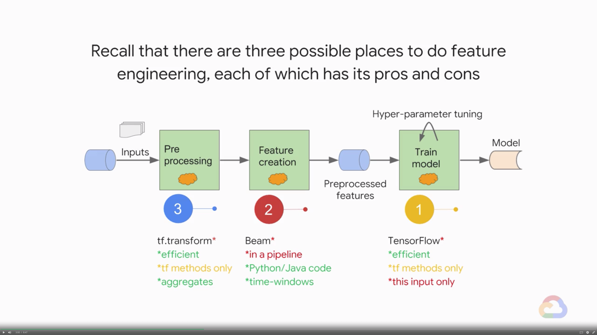
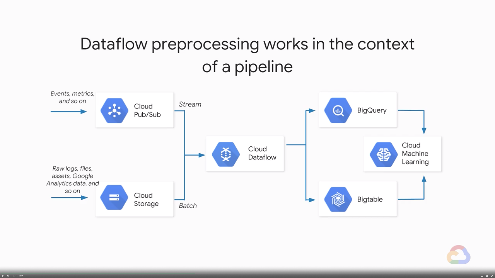
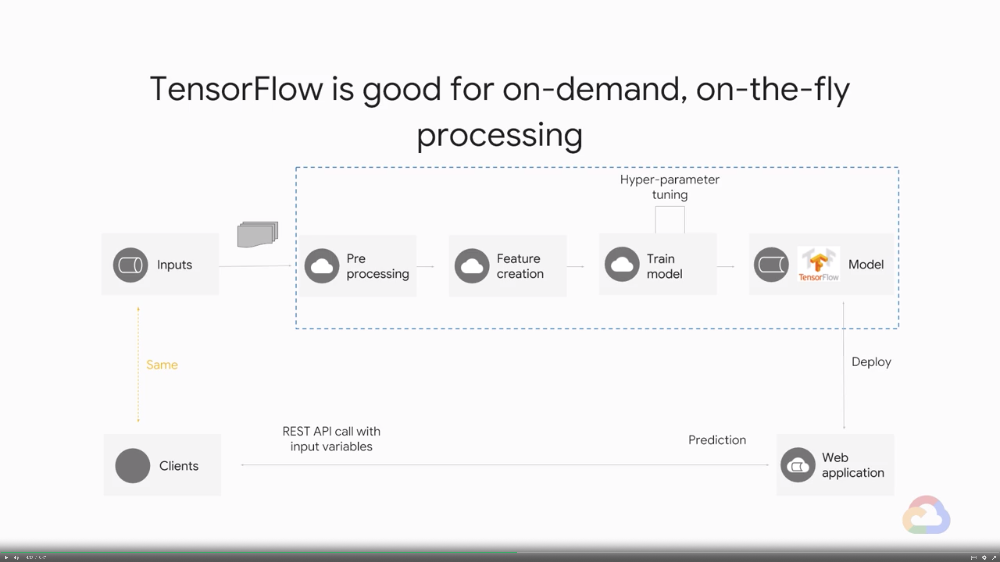

# TF Transform

TensorFlow Transform (`tf.Transform`) is a library for preprocessing data with TensorFlow. `tf.Transform` is useful for preprocessing that requires a full pass the data, such as: - normalizing an input value by mean and stdev - integerizing a vocabulary by looking at all input examples for values - bucketizing inputs based on the observed data distribution In this module we will explore use cases for `tf.Transform`.

## Introduction

> [](https://youtu.be/SfOfAzaQw1Q)

* Learn how to...
    * Implement feature preprocessing and feature creation using `tf.transform`
    * Carry out feature processing efficiently, at scale and on streaming data

---
## TensorFlow Transform

> [](https://youtu.be/sLHd23r21NM)

* Recall that there are three possible places to do feature engineering, each of which has its pros and cons
    
* Dataflow preprocessing works in the context of a pipeline
    
* TensorFlow is good for on-demand, on-the-fly processing
    
* `tf.transform` is a hybrid of Beam and TensorFlow
    * **Analyze phase - Beam**
        * Find min/max value of a numeric feature
        * Find all the unique values of a categorical feature
        * Executed in Beam while creating training dataset
    * **Transform phase - TensorFlow**
        * Scale inputs by the min and max
        * One-hot encode inputs based on set of unique values
        * Executed in TensorFlow during prediction
* `tf.transform` provides two PTransform
    * `AnalyzeAndTransformDataset`
        * Executed in Beam to create the training dataset
    * `TransformDataset`
        * Executed in Beam to create the evaluation dataset
        * The underlying transformations are executed in TensorFlow at prediction time
* You cannot use a evaluation dataset to compute min and max of vocabulary 

---
## Analyze Phase

> [](https://youtu.be/cDkneA9jBZ8)

* First, set up the schema of the training dataset
    ```python
    # TensorFlow type for input column
    raw_data_schema = {
        colname: dataset_schema.ColumnSchema(tf.string, ...)
            for colname in 'dayofweek,key'.splot(',')
    }
    # float32
    raw_data_schema.update({
        colname: dataset_schema.ColumnSchema(tf.float32, ...)
            for colname in 'fare_amount,pickuplon, ..., dropofflat'.split(',')
    })
    # Use the schema to create metadata "template"
    raw_data_metadata = dataset_metadata.DatasetMetadata(dataset_schema.Schema(raw_data_schema))
    ```
* Next, run the analyze-and-transform PTransform on training dataset to get back preprocessed training data and the transform function
    ```python
    raw_data = (p
        # 1. Read in data as usual for Beam
        | beam.io.Read(beam.io.BigQuerySource(query=myquery, use_standard_sql=True))
        # 2. Filter out data that you don't want to train with
        | beam.Filter(is_valid))
    # 3. Pass raw data + metadata template to AnalyzeAndTransformDataset
    transformed_dataset, transform_fn = ((raw_data, raw_data_metadata)
        | beam_impl.AnalyzeAndTransformDataset(preprocess))
    # 4. Get back transformed dataset and a reuseable function
    ```
* Write out the preprocessed training data into TFRecords, the most efficient format for TensorFlow
    ```python
    transformed_data |
        tfrecordio.WriteToTFRecord(
            os.pah.join(OUPUT_DIR, 'train'),
            coder=ExampleProtoCoder(
                # Note that we use the transformed metadata schema here
                transformed_metadata.schema
            )
        )
    ```

---
## Transform Phase

> [](https://youtu.be/iaUH0kFrg0g)

* The preprocessing function is restricted to TensorFlow functions
    ```python
    transformed_dataset, transform_fn = (
        (raw_data, raw_data_metadata)
        | beam_impl.AnalyzeAndTransformDataset(preprocess)
    )
    ```
    * The things you do in `preprocess()` will get added to the TensorFlow graph, and be executed in TensorFlow during serving
* The preprocessing function is restricted to functions you can call from TensorFlow graph
    ```python
    def preprocess(inputs):
        # Create features from the input tensors and put into "results" dict
        result = {}
        # Pass through
        result['fare_amount'] = inputs['fare_amount']
        # Vocabulary
        result['dayofweek'] = tft.strin_to_int(inputs['dayofweek'])
        ...
        # Scaling
        result['dropofflat'] = (tft.scale_to_0_1(inputs['dropofflat']))
        # Other TF fns
        result['passengers'] = tf.cast(inputs['passengers'], tf.float32)

        return result
    ```
* Analyze and Transform happens on the training dataset
* Writing out the eval dataset is similar, except that we reuse the transform function computed from the training data
    ```python
    raw_test_data = (p
        | beam.io.Read(beam.io.BigQuertSource(...))
        | 'eval_filter' >> beam.Filter(is_valid)
    )
    transformed_test_dataset = (((raw_test_data, raw_data_metadata), transform_fn)
        | beam_impl.TransformDataset())
    
    transformed_test_data, _ = transformed_test_dataset
    _ = transformed_test_data | tfrecordio.WriteToTFRecord(
        os.path.join(OUTPUT_DIR, 'eval'),
        coder=example_proto_coder.ExampleProtoCoder(
            transformed_metadata.schema)
        )
    )
    ```

---
## Supporting Serving

> [](https://youtu.be/MSzyUB-GHc0)

* For training and evaluation, we created preprocessed features using Beam
* For serving, we need to write out the transformation metadata
* Change input function to read preprocessed features
    ```python
    def read_dataset(args, mode):
        if mode == tf.estimator.ModeKeys.TRAIN:
            input_paths = args['train_data_paths']
        else:
            input_paths = args['eval_data_paths']
        # Reading transformed features
        transformed_metadata = metadata_io.read_metadata(
            os.path.join(args['matadata_path'], 'transformed_metadata')
        )
        return input_fn_maker.build_training_input_fn(
            metadata=transformed_metadata,
            file_pattern=(
                input_paths[0] if len(input_paths) == 1 else input_paths),
                ...
            )
        )
    ```
* The serving input function accepted the raw data
    ```python
    def make_serving_input_fn(args):
        raw_metadata = metadata_io.read_metadata(
            os.path.join(args['metadata_path'], 'rawdata_metadata')
        )
        transform_savedmodel_dir = (
            os.path.join(args['metadata_path'], 'transform_fn')
        )
        return input_fn_maker.build_parsing_transforming_serving_input_receiver_fn(
            raw_metadata,
            transform_savemodel_dir,
            exclude_raw_keys=[LABEL_COLUMN]
        )
    ```
* The model graph includes the preprocessing code

---
## Lab 8: Exploring `tf.transform`

> [](https://youtu.be/bHsnYzLoeHY)
> [](https://youtu.be/BSM01NqW-js)

* Please follow the details in [here](./Lab-8.md)

---
## Module Quiz

1. What is a common use case for where you would use `tf.transform` instead of a Cloud Dataflow pipeline or regular TensorFlow for preprocessing?
    * A. You need to compute the vocabulary list for categorical columns from your training dataset
    * B. You want to invoke on-the-fly preprocessing for ML models based solely on the inputs to a model function as part of your graph
    * C. You want to scale your inputs based on min/max value in the dataset
    * D. You want to take a rolling-average of the number of cars at an intersection during the last hour
    > Answer: A. C.
2. The Analyze phase of `tf.transform` is carried out via:
    * A. A TensorFlow program that contains Beam transforms
    * B. A Python Beam pipeline that contains TensorFlow functions
    > Answer: B.
3. The Transform phase of `tf.transform` is carried out via:
    * A. A Beam pipeline while creating a training or evaluation dataset
    * B. Inside a Beam pipeline for training and in TensorFlow during evaluation
    * C. Inside a Beam pipeline for evaluation and in TensorFlow during training
    * D. Inside a TensorFlow serving input function during prediction
    > Answer: A. D.
