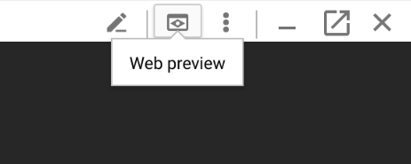
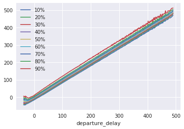

# Lab 4: Analyzing Data Using Datalab and BigQuery

## Overview

In this lab, you analyze a large (70 million rows, 8 GB) airline dataset using Google BigQuery and Cloud Datalab.

### What You Learn

In this lab, you:

* Launch Cloud Datalab
* Invoke a BigQuery query
* Create graphs in Datalab
* Commit and push your notebook to a project git repository

This lab illustrates how you can carry out data exploration of large datasets, but continue to use familiar tools like Pandas and Juypter. The "trick" is to do the first part of your aggregation in BigQuery, get back a Pandas dataset and then work with the smaller Pandas dataset locally. Cloud Datalab provides a managed Jupyter experience, so that you don't need to run notebook servers yourself.

---
## Setup

For each lab, you get a new GCP project and set of resources for a fixed time at no cost.

1. Make sure you signed into Qwiklabs using an incognito window.
2. Note the lab's access time (for example, `02:00:00` and make sure you can finish in that time block.
    * There is no pause feature. You can restart if needed, but you have to start at the beginning.
3. When ready, click `START LAB`
4. Note your lab credentials. You will use them to sign in to Cloud Platform Console. 
    
5. Click `Open Google Console`.
6. Click `Use another account` and copy/paste credentials for **this** lab into the prompts.
    * If you use other credentials, you'll get errors or **incur charges**.
7. Accept the terms and skip the recovery resource page.
    * Do not click `End Lab` unless you are finished with the lab or want to restart it. This clears your work and removes the project.

---
## Launch Cloud Datalab

To launch Cloud Datalab:

1. Open Cloud Shell. The Cloud Shell icon is at the top right of the Google Cloud Platform [web console](https://console.cloud.google.com/).
2. In Cloud Shell, type:
    ```bash
    $ gcloud compute zones list
    ```
    * **Note:** Please pick a zone in a geographically close region from the following: `us-east1`, `us-central1`, `asia-east1`, `europe-west1`. These are the regions that currently support Cloud ML Engine jobs. Please verify [here](https://cloud.google.com/ml-engine/docs/tensorflow/environment-overview#cloud_compute_regions) since this list may have changed after this lab was last updated. For example, if you are in the US, you may choose `us-east1-c` as your zone.
3. In Cloud Shell, type:
    ```bash
    $ datalab create mydatalabvm --zone <ZONE>
    ```
    * Replace `<ZONE>` with a zone name you picked from the previous step.
        * **Note:** follow the prompts during this process.
    * Datalab will take about 5 minutes to start.
4. Look back at Cloud Shell and follow any prompts. If asked for an ssh passphrase, hit return (for no passphrase).
5. If necessary, wait for Datalab to finishing launching. Datalab is ready when you see a message prompting you to do a **Web Preview**.
6. Click on **Web Preview** icon on the top-right corner of the Cloud Shell ribbon. Click **Change Port** and enter the port `8081` and click **Change and Preview**.
    
    
    
    * **Note:** If the cloud shell used for running the datalab command is closed or interrupted, the connection to your Cloud Datalab VM will terminate. If that happens, you may be able to reconnect using the command `datalab connect mydatalabvm` in your new Cloud Shell.
  
---
## Enables APIs

Ensure the **Cloud Source Repositories** API is enabled: https://console.cloud.google.com/apis/library/sourcerepo.googleapis.com/?q=Repositories

---
## Invoke BigQuery

To invoke a BigQuery query:

1. Navigate to the BigQuery console by selecting `Navigation menu` > `BigQuery` from the top-left-corner menu and click `Done`.
2. In `More` dropdown click `Query Settings`.
    * Under `Additional Settings` ensure that the `Legacy` is NOT selected (we will be using Standard SQL).
3. In the query textbox, type:
    ```sql
    #standardSQL
    SELECT
        departure_delay,
        COUNT(1) AS num_flights,
        APPROX_QUANTILES(arrival_delay, 5) AS arrival_delay_quantiles
    FROM
        `bigquery-samples.airline_ontime_data.flights`
    GROUP BY
        departure_delay
    HAVING
        num_flights > 100
    ORDER BY
        departure_delay ASC
    ```
    * Click `Run`.
    * What is the median arrival delay for flights left 35 minutes early?
        * Answer: the typical flight that left 35 minutes early arrived 28 minutes early.
4. Can you write a query to find the airport pair (departure and arrival airport) that had the maximum number of flights between them?
    * **Hint:** you can group by multiple fields.
    * One possible answer:
        ```sql
        #standardSQL
        SELECT
            departure_airport,
            arrival_airport,
            COUNT(1) AS num_flights
        FROM
            `bigquery-samples.airline_ontime_data.flights`
        GROUP BY
            departure_airport,
            arrival_airport
        ORDER BY
            num_flights DESC
        LIMIT
            10
        ```

---
## Draw Graphs in Cloud Datalab

1. In Cloud Datalab home page (browser), navigate into **notebooks**. You should now be in `datalab/notebooks/`.
2. Start a new notebook by clicking on the `+Notebook` icon. Rename the notebook to be `flights`.
3. In a cell in Datalab, type the following, then click `Run`.
    ```python
    query="""
    SELECT
        departure_delay,
        COUNT(1) AS num_flights,
        APPROX_QUANTILES(arrival_delay, 10) AS arrival_delay_deciles
    FROM
        `bigquery-samples.airline_ontime_data.flights`
    GROUP BY
        departure_delay
    HAVING
        num_flights > 100
    ORDER BY
        departure_delay ASC
    """

    import google.datalab.bigquery as bq
    df = bq.Query(query).execute().result().to_dataframe()
    df.head()
    ```
    * Note that we have gotten the results from BigQuery as a Pandas dataframe.
    * In what Python data structure are the deciles in?
4. In the next cell in Datalab, type the following, then click `Run`.
    ```python
    import pandas as pd
    percentiles = df['arrival_delay_deciles'].apply(pd.Series)
    percentiles = percentiles.rename(columns = lambda x : str(x*10) + "%")
    df = pd.concat([df['departure_delay'], percentiles], axis=1)
    df.head()
    ```
    * What has the above code done to the columns in the Pandas DataFrame?
5. In the next cell in Datalab, type the following, then click `Run`.
    ```python
    without_extremes = df.drop(['0%', '100%'], 1)
    without_extremes.plot(x='departure_delay', xlim=(-30,50), ylim=(-50,50))
    ```
        
    * Suppose we were creating a machine learning model to predict the arrival delay of a flight. Do you think departure delay is a good input feature? Is this true at all ranges of departure delays?
    * **Hint:** Try removing the xlim and ylim from the plotting command.
        

---
## Cleanup

1. You could leave Datalab instance running until your class ends. The default machine type is relatively inexpensive. However, if you want to be frugal, you can stop and restart the instance between labs or when you go home for the day. To do so, follow the next two steps.
2. Click on the person icon in the top-right corner of your Datalab window and click on the button to `STOP VM`.
3. You are not billed for stopped VMs. Whenever you want to restart Datalab, open Cloud Shell and type in:
    ```bash
    $ datalab connect mydatalabvm
    ```
    * This will restart the virtual machine and launch the Docker image that runs Datalab.

---
## Summary

In this lab, you learned how to carry out data exploration of large datasets using BigQuery, Pandas, and Juypter. The "trick" is to do the first part of your aggregation in BigQuery, get back a Pandas dataset and then work with the smaller Pandas dataset locally. Cloud Datalab provides a managed Jupyter experience, so that you don't need to run notebook servers yourself.

---
## End Your Lab

1. When you have completed your lab, click `End Lab`. Qwiklabs removes the resources you’ve used and cleans the account for you.
2. You will be given an opportunity to rate the lab experience. Select the applicable number of stars, type a comment, and then click `Submit`.
    * The number of stars indicates the following:
        * 1 star = Very dissatisfied
        * 2 stars = Dissatisfied
        * 3 stars = Neutral
        * 4 stars = Satisfied
        * 5 stars = Very satisfied
3. You can close the dialog box if you don't want to provide feedback.
4. For feedback, suggestions, or corrections, please use the `Support` tab.

---
> ©2019 Google LLC All rights reserved. Google and the Google logo are trademarks of Google LLC. All other company and product names may be trademarks of the respective companies with which they are associated.