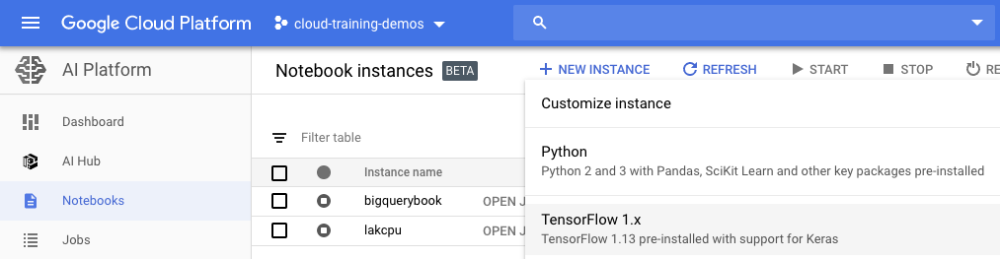

# Lab 5: Invoking Machine Learning APIs

> * Last Tested Date: DEC 03, 2018
> * Last Updated Date: DEC 04, 2018

## Overview

In this lab, you use Machine Learning APIs from within AI Platform Notebooks.

### What You Learn

In this lab, you learn how to invoke ML APIs from AI Platform Notebooks and use their results.

---
## Introduction

In this lab, you will first

* Clone the code repo within your AI Platform Notebooks environment

and then invoke ML APIs from AI Platform Notebooks to carry out some representative tasks:

* Vision API to detect text in an image
* Translate API to translate that text into English
* Natural Language API to find the sentiment of some famous quotes
* Speech API to transcribe an audio file

ML APIs are microservices. When we build AI models ourselves, it should be our goal to make them so easy to use and stand-alone.

---
## Enable APIs

Ensure the Cloud Source Repositories API is enabled: https://console.cloud.google.com/apis/library/sourcerepo.googleapis.com/?q=Repositories

---
## Setup

For each lab, you get a new GCP project and set of resources for a fixed time at no cost.

1. Make sure you signed into Qwiklabs using an incognito window.
2. Note the lab's access time (for example, `02:00:00` and make sure you can finish in that time block.
    * There is no pause feature. You can restart if needed, but you have to start at the beginning.
3. When ready, click `START LAB`
4. Note your lab credentials. You will use them to sign in to Cloud Platform Console. 
    
5. Click `Open Google Console`.
6. Click `Use another account` and copy/paste credentials for **this** lab into the prompts.
    * If you use other credentials, you'll get errors or **incur charges**.
7. Accept the terms and skip the recovery resource page.
    * Do not click `End Lab` unless you are finished with the lab or want to restart it. This clears your work and removes the project.

---
## Launch AI Platform Notebooks

To launch AI Platform Notebooks:

1. Click on the **Navigation Menu**. Navigate to `AI Platforms`, then to `Notebooks`.
    
2. On the Notebook instances page, click `+ NEW INSTANCE`. Select `TensorFlow 1.x`.
    
    * In the pop-up, confirm the name of the deep learning VM and click `Create`.
        
    * The new VM will take 2-3 minutes to start.
3. Click `Open JupyterLab`. A JupyterLab window will open in a new tab.
    

---
## Clone Course Repo within Your Datalab Instance

To clone the `training-data-analyst` notebook in your JupyterLab instance:

1. In JupyterLab, click the `Terminal` icon to open a new terminal.
    
2. At the command-line prompt, type in the following command and press `Enter`.
    ```bash
    $ git clone https://github.com/GoogleCloudPlatform/training-data-analyst 
    ```
3. Confirm that you have cloned the repository by double clicking on the `training-data-analyst` directory and ensuring that you can see its contents. The files for all the Jupyter notebook-based labs throughout this course are available in this directory.
    

---
## Enable APIs and Get API Key

To get an API key:

1. From the GCP console menu, select `APIs & Services` and select `Library`.
2. In the search box, type `vision` to find the `Google Cloud Vision API` and click on the hyperlink.
3. Click `Enable` if necessary.
4. Follow the same process to enable `Translate API`, `Speech API`, and `Natural Language` APIs.
5. From the GCP console menu, select `APIs & Services` and select `Credentials`.
6. If you do not already have an API key, click the `Create credentials` button and select `API key`. Once created, click close. You will need this API key in the notebook later.

---
## Invoke ML APIs from AI Platform Notebooks

1. In the notebook interface, navigate to `training-data-analyst > courses > machine_learning > deepdive > 01_googleml > mlapis.ipynb`
2. Read the commentary, then run the Python snippets (Use `Shift + Enter` to run each piece of code) in the cell, step by step. Make sure to insert your API Key in the first Python cell.

---
## End Your Lab

1. When you have completed your lab, click `End Lab`. Qwiklabs removes the resources you’ve used and cleans the account for you.
2. You will be given an opportunity to rate the lab experience. Select the applicable number of stars, type a comment, and then click `Submit`.
    * The number of stars indicates the following:
        * 1 star = Very dissatisfied
        * 2 stars = Dissatisfied
        * 3 stars = Neutral
        * 4 stars = Satisfied
        * 5 stars = Very satisfied
3. You can close the dialog box if you don't want to provide feedback.
4. For feedback, suggestions, or corrections, please use the `Support` tab.

---
> ©2019 Google LLC All rights reserved. Google and the Google logo are trademarks of Google LLC. All other company and product names may be trademarks of the respective companies with which they are associated.