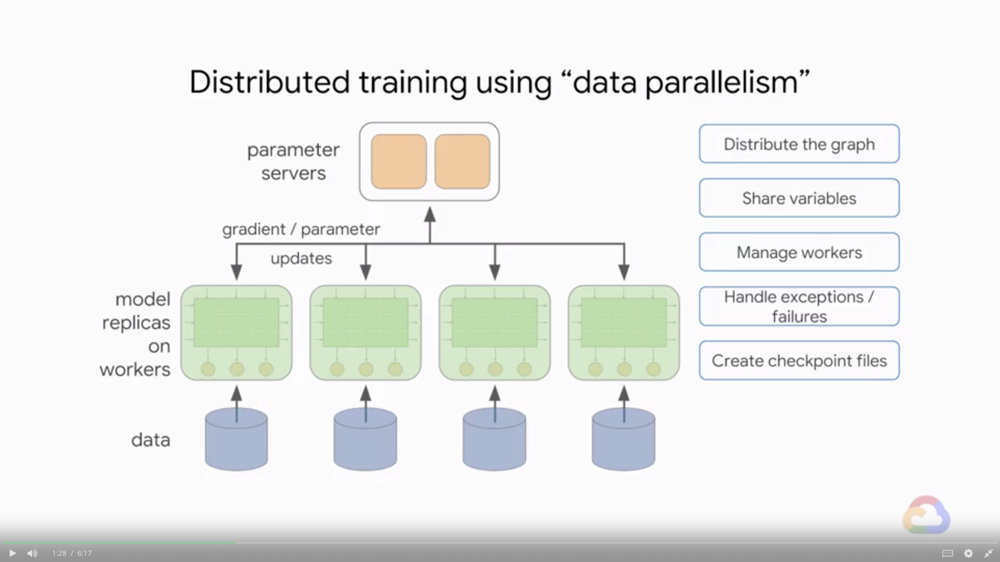
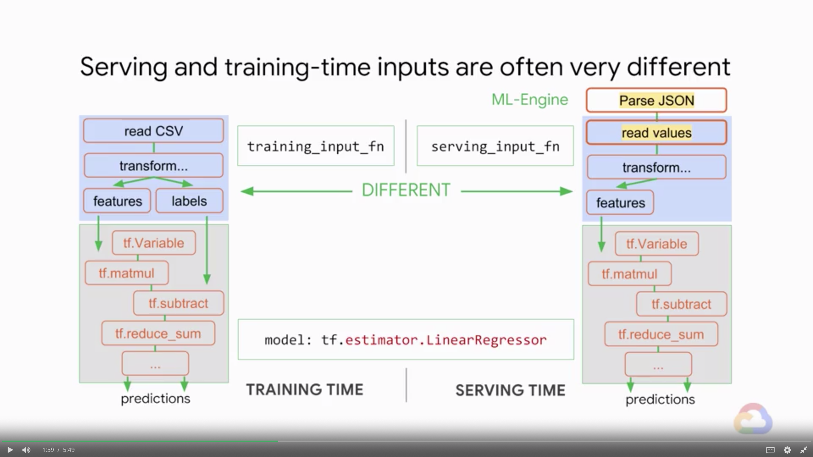
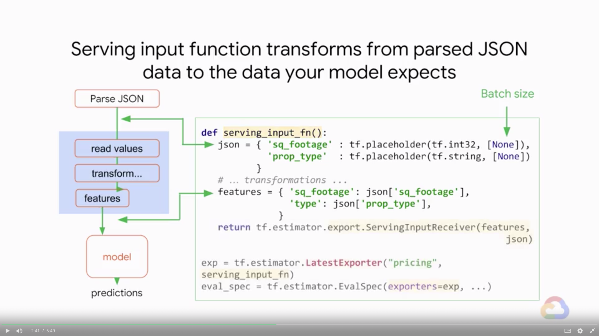
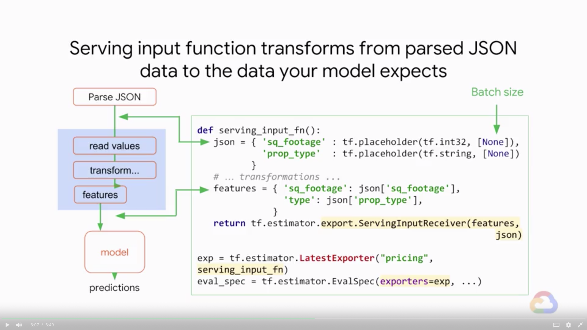
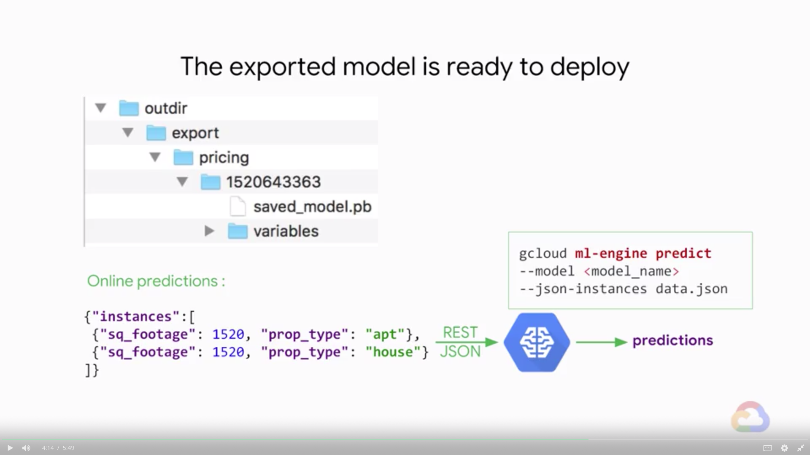

# Estimator API

In this module we will walk you through the Estimator API.

## Introduction

> [](https://youtu.be/cTvUTxNd1IE)

* Learn how to
    * Create production-ready machine learning models the easy way
    * Train on large datasets that do not fit in memory
    * Monitor your training metrics in Tensorboard

---
## Estimator API in TensorFlow

> [](https://youtu.be/BXIGUrCLAiY)

* Estimatoe wrap up a large amount of boilerplate code, on top of the model itself

#### Quiz

* Which of these abstraction levels treats TensorFlow as a numeric processing library?
    * A. Python API
    * B. `tf.layers`
    * C. `tf.estimator`
    * D. CPU
    > Answer: A.
* From small to big to prod with the Estimator API
    * Quick model
    * Checkpointing
    * Out-of-memory datasets
    * Train / eval / monitor
    * Distributed training
    * Hyper-parameter tuning on ML-Engine
    * Production: serving predictions from a trained model
* Pre-made estimators that can all be used in the same way
    * `tf.estimator.Estimator`
        * Pre-made regressors
            * `LinearRegressor`
            * `DNNRegressor`
            * `DNNLinearCombinedRegressor`
        * Pre-made classifiers
            * `LinearClassifier`
            * `DNNClassifier`
            * `DNNLinearCombinedClassifier`
        * Your custom estimator

### Pre-made Estimators

> [](https://youtu.be/SSA_mBC5sVs)

* Case Study: Predict property value from historical data
    * Features: square footage, house / apartment
    * Feature columns tell the model what inputs to expect
        ```python
        import tensorflow as tf

        featcols = [
            tf.feature_column.numeric_column('sq_footage'),
            # One-hot encoding
            tf.feature_column.categorical_column_with_vocabulary_list('type', ['house', 'apt'])
        ]
        model = tf.estimator.LinearRegressor(featcols)
        ```
    * Under the hood: feature columns take care of packing the inputs into the input vector of the model
    * Training: feed in training input data and train for 100 epochs
        ```python
        def train_input_fn():
            features = {
                'sq_footage': [1000, 2000, 3000, 1000, 2000, 3000],
                'type': ['house', 'house', 'house', 'apt', 'apt', 'apt']}
            labels = [500, 1000, 1500, 700, 1300, 1900]
            return features, labels
        
        model.train(train_input_fn, steps=100)
        ```
    * Predictions: once trained, the model can be used for prediction
        ```python
        def pred_input_fn():
            features = {
                'sq_footage': [1500, 1800],
                'type': ['house', 'apt']
            }
            return features
        
        # Generator
        predictions = model.predict(predict_input_fn)
        ```
    * Summary: Pick an estimator, train, predict
* To use a different pre-made estimator, just change the class name and supply appropriate parameters
    ```python
    model = tf.estimator.DNNRegressor(featcols, hidden_units=[3, 2])
    ```
* For example, here are some of the things you can change about the DNN Regressor
    ```python
    tf.estimator.DNNRegressor(feature_columns=...,
        hidden_units=[10, 5],
        activation_fn=tf.nn.relu,
        dropout=0.2,
        optimizer='Adam')
    ```

### Demo: Housing Price Model

> [](https://youtu.be/CDYlg9Rw0qY)

### Checkpointing

> [](https://youtu.be/zkVzuDRqf8Q)

* Model checkpoints
    1. Continue training
    2. Resume on failure
    3. Predict from trained model
* Estimators automatically checkpoint training
    ```python
    # Where to put the checkpoints
    model = tf.estimator.LinearRegressor(featcols, './model_trained')
    model.train(train_input_fn, steps=100)
    ```
    * Checkpoints come as standard, when you use the estimator API
    * When you instantiate the model and checkpoints will be saved tjere periodically
* We can now restore and predict with the model
    ```python
    # Where to put the checkpoints
    trained_model = tf.estimator.LinearRegressor(featcols, './model_trained')
    predictions = trained_model.predict(predict_input_fn)
    ```
    * Specify a folder when you instantiated, if a checkpoint is found there it is loaded, and the estimator is ready for predictions
* Training also resumes from the last checkpoint
    ```python
    model = tf.estimator.LinearRegressor(featcols, './model_trained')
    # Training continues
    model.train(train_input_fn, steps=100)
    ```
    * Without any checkpoints to start from, the estimator will train from scratch
    * Restarting from the latest checkpoint is the default behavior of estimators
    * To delete the checkpoints directory, to restart training

### Training on In-memory Datasets

> [](https://youtu.be/rEna2GwsmC4)

* In-memory datasets: usually NumPy arrays or Pandas dataframes - you can use them directly
    ```python
    # NumPy arrays
    def numpy_train_input_fn(sqrt, prop_type, price):
        return tf.estimator.inputs.numpy_input_fn(
            x={'sq_footage': sqrt, 'type': prop_type},
            y=price,
            batch_size=128,
            num_epochs=10,
            shuffle=True,
            queue_capacity=1000
        )
    
    # Pandas dataframe
    def panda_train_input_fn(df):
        return tf.estimator.inputs.pandas_input_fn(
            x=df,   # 'sq_footage', 'type' selected automatically because of feature columns definition
            y=df['price']
            batch_size=128,
            num_epochs=10,
            shuffle=True,
            queue_capacity=1000
        )
    ```
* Training happens until input is echausted or number of steps is reached
    ```python
    # Pandas dataframe
    def panda_train_fn(df):
        return tf.estimator.inputs.pandas_input_fn(
            x=df,
            y=df['price']
            batch_size=128,
            num_epochs=10,
            shuffle=True
        )
    # Trains until input exhausted (10 epochs) starting from checkpoint
    model.train(pandas_train_input_fn(df))
    # 1000 additional steps from checkpoint
    model.train(pandas_train_input_fn(df), steps=1000)
    # 1000 steps - might be nothing if checkpoint already there
    model.train(pandas_train_input_fn(df). max_steps=1000)
    ```
* To add a new feature, add it to the list of feature columns and make sure it is present in data frame
    ```python
    featcols = [
            tf.feature_column.numeric_column('sq_footage'),
            # One-hot encoding
            tf.feature_column.categorical_column_with_vocabulary_list('type', ['house', 'apt'])
        ]
    model = tf.estimator.LinearRegressor(featcols)
    # Pandas dataframe
    def panda_train_fn(df):
        return tf.estimator.inputs.pandas_input_fn(
            x=df,
            y=df['price']
            batch_size=128,
            num_epochs=10,
            shuffle=True
        )
    
    model.train(pandas_train_input_fn(df))
    ```

---
## Lab 2: Implementing a ML Model in TensorFlow using Estimator API

> [](https://youtu.be/pBtQvlmmYBc)
> [](https://youtu.be/7kO8FgL0z44)

* Please follow the details in [here](./Lab-2.md)

---
## Train on Large Datasets with Dataset API

> [](https://youtu.be/PZ9h_NIT0e4)

* Real world ML models
    | Problem | Solution |
    |---|---|
    | Out of memory data | ? |
    | Distribution | ? |
    | Need to evaluate during training | ? |
    | Deployments that scale | ? |
    * Out-of-memory datasets tend to be shared into multiple files
    * Datasets can be created from different file formats
        * They generate input functions for estimators
* Read one CSV file using `TextLineDataset`
    ```python
    def decode_line(row):
        cols = tf.decode_csv(row, record_defaults=[[0], ['house'], [0]])
        features = {
            'sq_footage': cols[0],
            'type': cols[1]
        }
        label = cols[2]     # price
        return features, label
    # They support arbitrary transformations with map()
    dataset = tf.data.Dataset.list_files('train.csv-*')
        .flat_map(tf.data.TextLineDataset)
        .map(decode_line)

    # Datasets handle shuffling, epochs, batching, ...
    dataset = dataset.shuffle(1000).repeat(15).batch(128)

    def input_fn():
        # Datasets help create input_fn's for estimators
        features, label = dataset.make_one_shot_iterator().get_next()
        return features, label
    
    model.train(input_fn)
    ```
* All the `tf.` commands that you write in Python **do not actually process any data**, they just build graphs
    * Under the hood: what does an input function do?
        * Nodes output one batch of data every time they are executed
        * Training: entire graphs runs in a loop
    * Common misconceptions about `input_fn`
        * Input functions called only once
        * Input functions return TensorFlow nodes (not data)
* The real benefit of `Dataset` is that you can do more than just ingest data

---
## Lab 3: Scaling up TensorFlow Ingest Using Batching

> [](https://youtu.be/XjeFw4I2HAE)
> [](https://youtu.be/9S4ohs9ZAn0)

* Please follow the details in [here](./Lab-3.md)

---
## Big Jobs, Distributed Training

> [](https://youtu.be/L_qNaSecZEs)

* Real world ML models
    | Problem | Solution |
    |---|---|
    | Out of memory data | Use the `Dataset` API |
    | Distribution | Use `train_and_evaluate` |
    | Need to evaluate during training | ? |
    | Deployments that scale | ? |
    * `estimator.train_and_evaluate` is the preferred method for training real-world models
        ```python
        estimator = tf.estimator.LinearRegressor(...)
        tf.estimator.train_and_evaluate(estimator, ...)
        ```
* **Data paralleism** = replicate your model on multiple workers
    * Distributed training using "data paralleism"
        
    * `estimator.train_and_evaluate` is the preferred method for training real-world models
        ```python
        # 1. Estimator: LinearRegressor
        estimator = tf.estimator.LinearRegressor(
            feature_columns=featcols,
            # 2. Run Config: run_config
            config=run_config
        )

        tf.estimator.train_and_evaluate(
            estimator,
            # 3. Train Spec: train_spec
            train_spec,
            # 4. Eval Spec: eval_spec
            eval_spec
        )
        ```
        * `run_config` tells the estimator where and how often to write Checkpoints and TensorBoard logs ("summaries")
            ```python
            run_config = tf.estimator.RunConfig(
                model_dir=output_dir,
                save_summary_steps=100,
                save_checkpoints_steps=2000
            )
            ```
        * The `TrainSpec` tells the estimator how to get training data
            ```python
            train_sepc = tf.estimator.TrainSpec(
                input_fn=train_input_fn,
                max_steps=50000
            )
            ```
        * The `EvalSpec` controls the evaluation and the checkpointing of the model since they happen at the same time
            ```python
            eval_spec = tf.estimator.EvalSpec(
                input_fn=eval_input_fn,
                steps=100,          # Evals on 100 batches
                throttle_secs=600,  # Eval no more than every 10 min
                exporters=...
            )
            ```
* Shuffling is even more important in distributed training
    ```python
    dataset = tf.data.Dataset.list_files('train.csv-*')
        .shuffle(100)
        .flat_map(tf.data.TextLineDataset)
        .map(decode_line)
    
    dataset = dataset.shuffle(1000)
        .repeat(15)
        .batch(128)
    ```

---
## Monitoring with TensorBoard

> [](https://youtu.be/kPNfT1poaDw)

* Real world ML models
    | Problem | Solution |
    |---|---|
    | Out of memory data | Use the `Dataset` API |
    | Distribution | Use `train_and_evaluate` |
    | Need to evaluate during training | Use `train_and_evaluate` + TensorBoard |
    | Deployments that scale | ? |
* TensorBoard is a tool that lets user visualize the training and the biometrics that the model writes to disk
* Point TensorBoard to your output directory and the dashboards appear in your browser at `localhost:6006`
    ```python
    tf.estimator.RunConfig(model_dir='output_dir')
    ```
    ```bash
    $ tensorboard --logdir output_dir
    ```
* Pre-made `Estimators` export relevant metrics, embeddings, histograms, etc. for TensorBoard, so there is nothing more to do
* If you are writing a custom `Estimator` model, you can add summaries for TensorBoard with a single line
    * Sprinkle appropriate summary ops throughout your code
        * `tf.summary.scalar`
        * `tf.summary.image`
        * `tf.summary.audio`
        * `tf.summary.text`
        * `tf.summary.histogram`
    * More info: https://www.tensorflow.org/get_started/summaries_and_tensorboard
    * Images and audio have their own (non-scalar) summary ops
        ```python
        # Image
        p = tf.placeholder('uint8', (None, ht, wd, num_channels))
        s = tf.summary.image('im1', p)
        # Audio
        p = tf.placeholder('float32', (None, duration_frames, num_channels))
        s = tf.summary.audio('au1', p, sample_rate=4000)
        ```

### Demo: TensorBoard

> [](https://youtu.be/UI2sl0NdHd8)

### Serving Input Function

> [](https://youtu.be/9Nr29SX7SGg)

* Real world ML models
    | Problem | Solution |
    |---|---|
    | Out of memory data | Use the `Dataset` API |
    | Distribution | Use `train_and_evaluate` |
    | Need to evaluate during training | Use `train_and_evaluate` + TensorBoard |
    | Deployments that scale | Using serving input function |
* Serving and training-time inputs often very different
    
* Serving input function transforms from parsed JSON data to the data your model expects
    
    
    
* Example serving input function that decodes JPEGs
    ```python
    def serving_input_fn():
        json = {
            'jpeg_bytes': tf.placeholder(tf.string, [None])
        }
        def decode(jpeg):
            pixels = tf.image.decode_jpeg(jpeg, channels=3)
            return pixels
        # Output shape: [batch, width, height, 3]
        pics = tf.map_fn(decode, json['jpeg_bytes'], dtype=tf.uint8)
        features = {
            'pics': pics
        }
        return tf.estimator.export.ServingInputReceiver(features, json)
    ```

### Recap: Estimator API

> [](https://youtu.be/b3uE8qfWkDY)

---
## Lab 4: Implementing a Distributed TensorFlow Model

> [](https://youtu.be/C5H_A7Di3f0)
> [](https://youtu.be/sC66_Y-3LAY)

* Please follow the details in [here](./Lab-4.md)

---
## Module Quiz

1. What are some of the key goals of the estimator API?
    * A. Create production-ready machine learning models using an API
    * B. Train on large datasets that do not fit in memory
    * C. Quickly monitor your training metrics in Tensorboard
    * D. All of the above
    > Answer: D.
2. What is one of the largest benefits of the estimator API?
    * A. It automatically tunes your ML model hyperparameters for you
    * B. It abstracts away boilerplate code which saves you time
    * C. It requires you to specify which hardware you will run on for the best performance
    > Answer: B.
3. What is the right way to call a linear regression model with tf.estimator?
    * A. `tf.estimator.LinearRegressor`
    * B. `tf.estimator.line_model`
    * C. `tf.estimator.regression`
    * D. `tf.estimator.LinearClassifier`
    > Answer: A.
4. Inputs to the estimator model are in the form of:
    * A. feature columns
    * B. BigQuery datasets
    * C. scalars
    * D. hyperparameters
    > Answer: A.
5. Numeric inputs can be passed to a linear regressor as-is, but categorical columns are often:
    * A. Not used, only numeric values can be passed
    * B. Uniformly distributed and aggregated first
    * C. Cleansed because of duplicate records
    * D. One-hot encoded
    > Answer: D.
6. What is the size of the training dataset (features + labels) in this example?
    
    * A. 6 rows, 3 columns
    * B. 7 rows, 4 columns
    * C. 6 rows, 2 columns
    * D. 6 rows, 4 columns
    > Answer: A.
7. In this example, what extra parameters does the `DNNRegressor` take that the `LinearRegressor` doesn't?
    
    * A. hidden_units
    * B. featcols
    * C. regression
    * D. neurons
    > Answer: A.
8. In what situation do you have to delete the model directory before starting training?
    * A. If your model is not performing well enough and you need to train for more epochs or with additional examples
    * B. If you want to automatically checkpoint from an earlier saved model
    * C. If you have changed the model structure from the previous time, for example, you used a DNNRegressor with `[64, 32]` last time and now you are using `[32, 16]`
    > Answer: C.
9.  What is the difference between `steps` and `max_steps`?
    
    * A. There is no difference
    * B. Steps means "train this many steps total". max_steps means "train these many additional steps"
    * C. Steps means "train these many additional steps". max_steps means "train up to these many steps total, starting from how many ever steps have been completed so far"
    > Answer: C.
