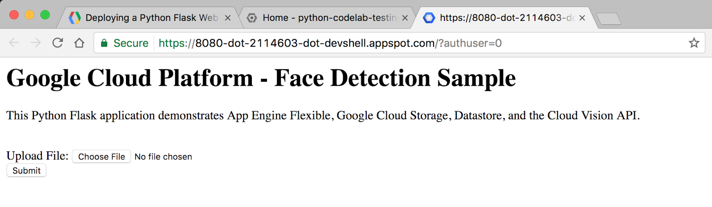
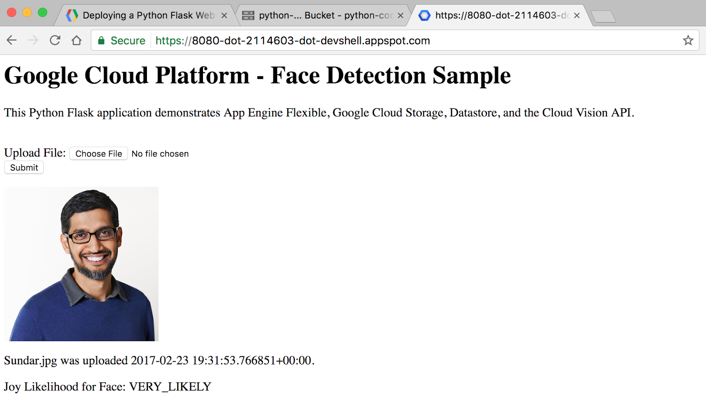
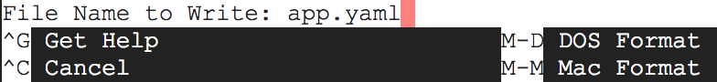
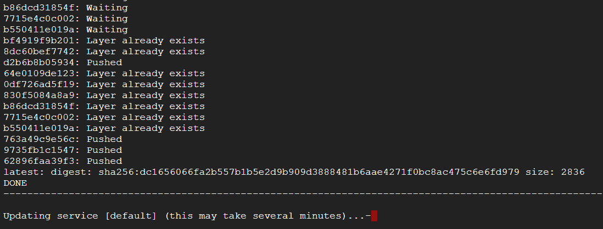

# Deploying a Python Flask Web Application to App Engine Flexible

## GSP023


### Summary

In this lab you will learn how to deploy a Python Flask web application to the App Engine Flexible environment. The example application allows a user to upload a photo of a person's face and learn how likely it is that the person is happy. The application uses Google Cloud APIs for Vision, Storage, and Datastore.

### About App Engine

Google App Engine applications are easy to create, easy to maintain, and easy to scale as your traffic and data storage needs change. With App Engine, there are no servers to maintain. You simply upload your application and it's ready to go.

App Engine applications automatically scale based on incoming traffic. Load balancing, microservices, authorization, SQL and NoSQL databases, traffic splitting, logging, search, versioning, roll out and roll backs, and security scanning are all supported natively and are highly customizable.

App Engine's [Flexible Environment](https://cloud.google.com/appengine/docs/flexible/) supports a host of programming languages, including Java, Python, PHP, NodeJS, Ruby, and Go. App Engine's [Standard Environment](https://cloud.google.com/appengine/docs/about-the-standard-environment) is an additional option for certain languages including Python. The two environments give users maximum flexibility in how their application behaves since each environment has certain strengths. Read [Choosing an App Engine Environment](https://cloud.google.com/appengine/docs/the-appengine-environments) for more information.

### What you'll learn

* How to deploy a simple web application to the App Engine Flexible Environment
* How to access the Google Cloud client libraries for Vision, Storage, and Datastore
* How to use the Cloud Shell

### Prerequisites

* Familiarity with Python
* Familiarity with standard Linux text editors such as `vim`, `emacs`, or `nano`
* Access to an image with a face

---
## Setup and Requirements

### Before you click the Start Lab button

Read these instructions. Labs are timed and you cannot pause them. The timer, which starts when you click Start Lab, shows how long Cloud resources will be made available to you.

This Qwiklabs hands-on lab lets you do the lab activities yourself in a real cloud environment, not in a simulation or demo environment. It does so by giving you new, temporary credentials that you use to sign in and access the Google Cloud Platform for the duration of the lab.

### What you need

To complete this lab, you need:

* Access to a standard internet browser (Chrome browser recommended).
* Time to complete the lab.
* **Note:** If you already have your own personal GCP account or project, do not use it for this lab.

### How to start your lab and sign in to the Console

1. Click the `Start Lab` button. If you need to pay for the lab, a pop-up opens for you to select your payment method. On the left you will see a panel populated with the temporary credentials that you must use for this lab.
    
2. Copy the username, and then click `Open Google Console`. The lab spins up resources, and then opens another tab that shows the **Choose an account** page.
    * **Tip:** Open the tabs in separate windows, side-by-side.
3. On the Choose an account page, click `Use Another Account`.
    
4. The Sign in page opens. Paste the username that you copied from the Connection Details panel. Then copy and paste the password.
    * **Important:** You must use the credentials from the Connection Details panel. Do not use your Qwiklabs credentials. If you have your own GCP account, do not use it for this lab (avoids incurring charges).
5. Click through the subsequent pages:
    * Accept the terms and conditions.
    * Do not add recovery options or two-factor authentication (because this is a temporary account).
    * Do not sign up for free trials.
6. After a few moments, the GCP console opens in this tab.
    * **Note:** You can view the menu with a list of GCP Products and Services by clicking the Navigation menu at the top-left, next to “Google Cloud Platform”.
    

---
## Activate Google Cloud Shell

Google Cloud Shell is a virtual machine that is loaded with development tools. It offers a persistent 5GB home directory and runs on the Google Cloud. Google Cloud Shell provides command-line access to your GCP resources.

1. In GCP console, on the top right toolbar, click the `Open Cloud Shell` button.
    
2. In the dialog box that opens, click `START CLOUD SHELL`:
    
    * **Note:** You can click `START CLOUD SHELL` immediately when the dialog box opens.
3. It takes a few moments to provision and connect to the environment. When you are connected, you are already authenticated, and the project is set to your `PROJECT_ID`. For example:
    
    * `gcloud` is the command-line tool for Google Cloud Platform. It comes pre-installed on Cloud Shell and supports tab-completion.
        * You can list the active account name with this command:
            ```bash
            $ gcloud auth list
            # Output:
            Credentialed accounts:
            - <myaccount>@<mydomain>.com (active)
            # Example output:
            Credentialed accounts:
            - google1623327_student@qwiklabs.net
            ```
        * You can list the project ID with this command:
            ```bash
            $ gcloud config list project
            # Output:
            [core]
            project = <project_ID>
            # Example output:
            [core]
            project = qwiklabs-gcp-44776a13dea667a6
            ```
    * **Note:** Full documentation of `gcloud` is available on [Google Cloud gcloud Overview](https://cloud.google.com/sdk/gcloud).

---
## Get the sample code

1. In Cloud Shell on the command-line, run the following command to clone the Github repository:
    ```bash
    $ git clone https://github.com/GoogleCloudPlatform/python-docs-samples.git
    ```
2. Change directory into `python-docs-samples/codelabs/flex_and_vision`:
    ```bash
    $ cd python-docs-samples/codelabs/flex_and_vision
    ```

---
## Authenticate API Requests

The Datastore, Storage, and Vision APIs are automatically enabled for you in this lab. In order to make requests to the APIs, you will need service account credentials. You can generate credentials from your project using gcloud in Cloud Shell. Your Project ID can be found on the Qwiklabs tab, where you started the lab.

1. Set an environment variable for `[YOUR_PROJECT_ID]`, replacing `[YOUR_PROJECT_ID]` with your own project ID:
    ```bash
    $ export PROJECT_ID=[YOUR_PROJECT_ID]
    ```
2. Create a Service Account to access the Google Cloud APIs when testing locally:
    ```bash
    $ gcloud iam service-accounts create qwiklab \
    --display-name "My Qwiklab Service Account"
    ```
3. Give your newly created Service Account appropriate permissions:
    ```bash
    $ gcloud projects add-iam-policy-binding ${PROJECT_ID} \
    --member serviceAccount:qwiklab@${PROJECT_ID}.iam.gserviceaccount.com \
    --role roles/owner
    ```
4. After creating your Service Account, create a Service Account key:
    ```bash
    $ gcloud iam service-accounts keys create ~/key.json \
    --iam-account qwiklab@${PROJECT_ID}.iam.gserviceaccount.com
    ```
    * This command generates a service account key stored in a JSON file named `key.json` in your home directory.
5. Using the absolute path of the generated key, set an environment variable for your service account key:
    ```bash
    $ export GOOGLE_APPLICATION_CREDENTIALS="/home/${USER}/key.json"
    ```

> **Note:** You can read more about [authenticating the Vision API](https://cloud.google.com/vision/docs/common/auth).

---
## Testing the Application Locally

### Starting your virtual environment and installing dependencies

1. Create an isolated Python 3 environment named env with [`virtualenv`](https://virtualenv.pypa.io/en/stable/):
    ```bash
    $ virtualenv -p python3 env
    ```
2. Enter your newly created `virtualenv` named `env`:
    ```bash
    $ source env/bin/activate
    ```
3. Use `pip` to install dependencies for your project from the `requirements.txt` file:
    ```bash
    $ pip install -r requirements.txt
    ```
    * The `requirements.txt` file is a list of package dependencies you need for your project. The above command downloaded all of these listed package dependencies to the virtualenv.

### Creating an App Engine App

1. Next, create an App Engine instance by using:
    ```bash
    $ gcloud app create
    ```
2. A prompt will display a list of regions. Select a Region that supports App Engine Flexible for Python then press `ENTER`. You can read more about [Regions and Zones](https://cloud.google.com/docs/geography-and-regions).

### Creating a Storage Bucket

1. First, set the environment variable `CLOUD_STORAGE_BUCKET` equal to the name of your `PROJECT_ID`. (It is generally recommended to name your bucket the same as your `PROJECT_ID` for convenience purposes).
    ```bash
    $ export CLOUD_STORAGE_BUCKET=${PROJECT_ID}
    ```
2. Now run the following command to create a bucket with the same name as your `PROJECT_ID`.
    ```bash
    $ gsutil mb gs://${PROJECT_ID}
    ```

### Running the Application

1. Execute the following command to start your application:
    ```bash
    $ python main.py
    ```
2. Once the application starts, click on the `Web Preview` icon in the Cloud Shell toolbar and choose `"Preview on port 8080."`
    
    * A tab in your browser opens and connects to the server you just started. You should see something like this:
        
3. Now things will get interesting! Click the `Choose File` button, find an image from your computer that has a human face, and then click `Submit`.
    * After uploading a photo, you should see something like this:
        

> **Note:** When you are done testing your application locally, press `CTRL + C` on the Cloud Shell command line to shut down the local web server.

---
## Exploring the Code

### Sample Code Layout

```
templates/
    homepage.html   /* HTML template that uses Jinja2 */
app.yaml            /* App Engine application configuration file */
main.py             /* Python Flask web application */
requirements.txt    /* List of dependencies for the project */
```

### `main.py`

This Python file is a Flask web application. The application allows users to submit photos (preferably of faces), which are stored in Cloud Storage and analyzed using the face detection feature of the Cloud Vision API. Key information about each photo is stored in Datastore, Google Cloud Platform's NoSQL database, where it is accessed each time a user visits the website.

This application uses the Google Cloud Platform client libraries for Storage, Datastore, and Vision. These client libraries make it easy to access Cloud APIs from your favorite programming languages.

Let's take a look at some key snippets of the code.

The imports section at the top is where we import the various packages we need for our code. This is how we import our Google Cloud client libraries for Datastore, Storage, and Vision:

```python
from google.cloud import datastore
from google.cloud import storage
from google.cloud import vision
```

Here is the code for what happens when a user visits the root URL of the website. A Datastore client object is created, which is used to access the Datastore client library. A query on Datastore is run for entities of kind Faces. Finally, the HTML template is rendered, passing in the image_entities we extract from Datastore as a variable.

```python
@app.route('/')
def homepage():
    # Create a Cloud Datastore client.
    datastore_client = datastore.Client()

    # Use the Cloud Datastore client to fetch information from Datastore about
    # each photo.
    query = datastore_client.query(kind='Faces')
    image_entities = list(query.fetch())

    # Return a Jinja2 HTML template and pass in image_entities as a parameter.
    return render_template('homepage.html', image_entities=image_entities)
```

Let's take a look at how [entities](https://cloud.google.com/datastore/docs/concepts/entities) are saved to Datastore. Datastore is Google Cloud's NoSQL database solution. Data is stored in objects called *entities*. Each entity is assigned a unique identifying key, which can be created using a *kind* and a key name string. A *kind* is an organizational bucket for what type of *entity* it is. For example, we might want to set up kinds for Photos, People, and Animals.

Each *entity* can have multiple developer-defined properties, which can have values of a number of types, including integers, floats, strings, dates, or binary data.

```python
    # Create a Cloud Datastore client.
    datastore_client = datastore.Client()

    # Fetch the current date / time.
    current_datetime = datetime.now()

    # The kind for the new entity.
    kind = 'Faces'

    # The name/ID for the new entity.
    name = blob.name

    # Create the Cloud Datastore key for the new entity.
    key = datastore_client.key(kind, name)

    # Construct the new entity using the key. Set dictionary values for entity
    # keys blob_name, storage_public_url, timestamp, and joy.
    entity = datastore.Entity(key)
    entity['blob_name'] = blob.name
    entity['image_public_url'] = blob.public_url
    entity['timestamp'] = current_datetime
    entity['joy'] = face_joy

    # Save the new entity to Datastore.
    datastore_client.put(entity)
```

The Storage and Vision client libraries can be accessed programmatically in a similar manner to Datastore. You can open the `main.py` file yourself using vim, emacs, or nano to explore all of the sample code.

### `homepage.html`

The Flask web framework leverages Jinja2 as a template engine. This allows us to pass in variables and expressions from `main.py` into `homepage.html` that get replaced with values once the page is rendered.

Learn more about Jinja2 at http://jinja.pocoo.org/docs/2.9/templates/.

This Jinja2 HTML template displays a form for users to submit photos to the database. It also displays each previously submitted image along with its file name, upload date/time, and the likelihood that the face detected by the Vision API is happy.

```html
<h1>Google Cloud Platform - Face Detection Sample</h1>

<p>This Python Flask application demonstrates App Engine Flexible, Google Cloud
Storage, Datastore, and the Cloud Vision API.</p>

<br>

<html>
  <body>
    <form action="upload_photo" method="POST" enctype="multipart/form-data">
      Upload File: <input type="file" name="file"><br>
      <input type="submit" name="submit" value="Submit">
    </form>
    
      
      <p>{{image_entity['blob_name']}} was uploaded {{image_entity['timestamp']}}.</p>
      <p>Joy Likelihood for Face: {{image_entity['joy']}}</p>
    
  </body>
</html>
```

---
## Deploying the App to App Engine Flexible

App Engine Flexible uses a file called app.yaml to describe an application's deployment configuration. If this file is not present, App Engine will try to guess the deployment configuration. However, it is a good idea to provide this file.

1. Next, you will modify app.yaml using an editor of your choice `vim`, `nano`, or `emacs`. We will use the nano editor:
    ```bash
    $ nano app.yaml
    ```
2. Once you have `app.yaml` open, replace `<your-cloud-storage-bucket>` with the name of your Cloud Storage bucket. (If you forgot the name of your Cloud Storage bucket, copy the GCP Project ID from the Qwiklabs tab). The `env_variables` section sets up environment variables that will be used in `main.py` once the application is deployed.
    ```yaml
    runtime: python
    env: flex
    entrypoint: gunicorn -b :$PORT main:app

    runtime_config:
        python_version: 3

    env_variables:
        CLOUD_STORAGE_BUCKET: <your-cloud-storage-bucket>
    ```
    * This is the basic configuration needed to deploy a Python 3 App Engine Flex application. You can learn more about configuring App Engine [here](https://cloud.google.com/appengine/docs/flexible/python/configuring-your-app-with-app-yaml).
4. You can now close save and close the file in `nano` by using (`CTRL + X`), which will prompt:
    
5. Type a letter `Y` and then press the `ENTER` key one more time to confirm the filename for the following prompt:
    
6. Deploy your app on App Engine by using `gcloud`:
    ```bash
    $ gcloud app deploy
    ```
    * Watch in Cloud Shell as the application gets built. This will up to 5 minutes. The App Engine Flexible environment is automatically provisioning a Google Compute Engine virtual machine for you behind the scenes, and then installing the application, then starting it.
        
7. After the application is deployed, open the app in your web browser with the following URL:
    ```
    https://<PROJECT_ID>.appspot.com
    ```
    * If you forgot your `PROJECT_ID`, run gcloud config list project from the Cloud Shell command line.

### Summary

You have set up a Python web application and deployed it to the App Engine Flexible environment.

---
## Congratulations!

You learned how to write and deploy a Python web application to the App Engine Flexible environment!

### Finish Your Quest

This self-paced lab is part of the Qwiklabs Quest [Deploying Applications](https://google.qwiklabs.com/quests/26). A Quest is a series of related labs that form a learning path. Completing this Quest earns you the badge above, to recognize your achievement. You can make your badge (or badges) public and link to them in your online resume or social media account. [Enroll in this Quest](http://google.qwiklabs.com/learning_paths/26/enroll) and get immediate completion credit if you've taken this lab. S[ee other available Qwiklabs Quests](http://google.qwiklabs.com/catalog).

#### Take Your Next Lab

Continue your Quest with [Build a Node.js Web App using Google Cloud Platform](https://google.qwiklabs.com/searches/lab?keywords=build%20a%20Node.js%20Web%20App), or check out these suggestions:

* [Build and Launch an ASP.NET Core App from Google Cloud Shell](https://google.qwiklabs.com/searches/lab?keywords=build%20and%20Launch%20an%20ASP.NET)
* [Running WordPress on App Engine Flexible Environment](https://google.qwiklabs.com/searches/lab?keywords=Running%20WordPress%20on%20App)

#### Learn More

* Python on Google Cloud Platform: https://cloud.google.com/python/
* App Engine Flexible Documentation for Python: https://cloud.google.com/appengine/docs/flexible/python/
* Documentation for Python Client Libraries: Datastore, Storage, and Vision
* Learn more about Client Libraries https://googlecloudplatform.github.io/google-cloud-python/.
* More Python code samples: https://cloud.google.com/python/samples
* Learn more about Flask at http://flask.pocoo.org/.