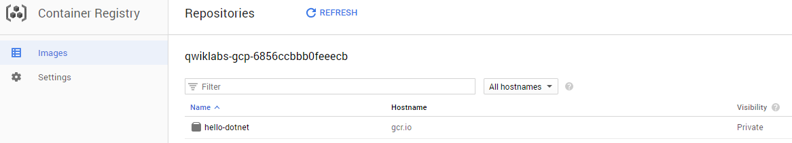
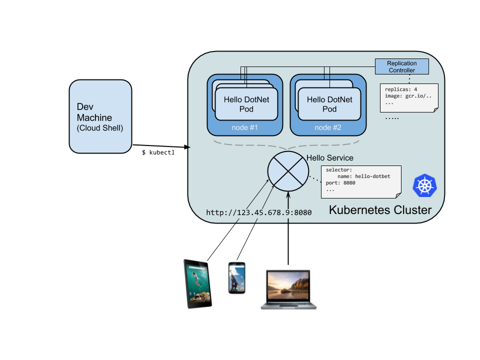
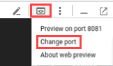
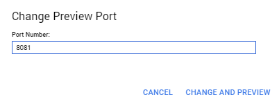

# Deploy ASP.NET Core App to Kubernetes Engine

## GSP030


[ASP.NET Core](https://docs.microsoft.com/en-us/aspnet/core/) is a new open-source and cross-platform framework for building modern cloud-based and internet-connected applications using the C# programming language.

[Kubernetes](http://kubernetes.io/) is an open source project which can run in many different environments, from laptops to high-availability multi-node clusters, from public clouds to on-premise deployments, from virtual machines to bare metal.

In this lab, you deploy a simple ASP.NET Core app to [Kubernetes](http://kubernetes.io/) running on [Container Engine](https://cloud.google.com/container-engine/). This lab builds on the [Build and launch an ASP.NET Core app from Google Cloud Shell](https://google.qwiklabs.com/catalog_lab/499) lab. Please consider completing that lab before running this one.

The goal of this lab is for you to turn your code (a simple Hello World ASP.NET Core app here) into a replicated application running on Kubernetes. You take code that you have developed on your machine, turn it into a Docker container image, and then run that image on Container Engine.

Here's a diagram of the various parts in play in this lab to help you understand how pieces fit together. Use this as a reference as you progress through the lab; it should all make sense by the time you get to the end (but feel free to ignore this for now).


For the purpose of this lab, using a managed environment such as Container Engine (a Google-hosted version of Kubernetes running on Compute Engine) allows you to focus more on experiencing Kubernetes rather than setting up the underlying infrastructure.

If you are interested in running Kubernetes on your local machine, such as a development laptop, you should probably look into [Minikube](http://kubernetes.io/docs/getting-started-guides/minikube/). This offers a simple setup of a single node kubernetes cluster for development and testing purposes. You can use Minikube to go through this lab if you wish.

### What you'll learn

* How to package a simple ASP.NET Core app as a Docker container.
* How to create your Kubernetes cluster on Container Engine.
* How to deploy your ASP.NET Core app to a pod.
* How to allow external traffic to your pod.
* How to scale up your service and roll out an upgrade.
* How to run Kubernetes Graphical dashboard.

---
## Setup and Requirements

### Before you click the Start Lab button

Read these instructions. Labs are timed and you cannot pause them. The timer, which starts when you click Start Lab, shows how long Cloud resources will be made available to you.

This Qwiklabs hands-on lab lets you do the lab activities yourself in a real cloud environment, not in a simulation or demo environment. It does so by giving you new, temporary credentials that you use to sign in and access the Google Cloud Platform for the duration of the lab.

### What you need

To complete this lab, you need:

* Access to a standard internet browser (Chrome browser recommended).
* Time to complete the lab.
* **Note:** If you already have your own personal GCP account or project, do not use it for this lab.

### How to start your lab and sign in to the Console

1. Click the `Start Lab` button. If you need to pay for the lab, a pop-up opens for you to select your payment method. On the left you will see a panel populated with the temporary credentials that you must use for this lab.
    
2. Copy the username, and then click `Open Google Console`. The lab spins up resources, and then opens another tab that shows the **Choose an account** page.
    * **Tip:** Open the tabs in separate windows, side-by-side.
3. On the Choose an account page, click `Use Another Account`.
    
4. The Sign in page opens. Paste the username that you copied from the Connection Details panel. Then copy and paste the password.
    * **Important:** You must use the credentials from the Connection Details panel. Do not use your Qwiklabs credentials. If you have your own GCP account, do not use it for this lab (avoids incurring charges).
5. Click through the subsequent pages:
    * Accept the terms and conditions.
    * Do not add recovery options or two-factor authentication (because this is a temporary account).
    * Do not sign up for free trials.
6. After a few moments, the GCP console opens in this tab.
    * **Note:** You can view the menu with a list of GCP Products and Services by clicking the Navigation menu at the top-left, next to “Google Cloud Platform”.
    

---
## Activate Google Cloud Shell

Google Cloud Shell is a virtual machine that is loaded with development tools. It offers a persistent 5GB home directory and runs on the Google Cloud. Google Cloud Shell provides command-line access to your GCP resources.

1. In GCP console, on the top right toolbar, click the `Open Cloud Shell` button.
    
2. In the dialog box that opens, click `START CLOUD SHELL`:
    
    * **Note:** You can click `START CLOUD SHELL` immediately when the dialog box opens.
3. It takes a few moments to provision and connect to the environment. When you are connected, you are already authenticated, and the project is set to your `PROJECT_ID`. For example:
    
    * `gcloud` is the command-line tool for Google Cloud Platform. It comes pre-installed on Cloud Shell and supports tab-completion.
        * You can list the active account name with this command:
            ```bash
            $ gcloud auth list
            # Output:
            Credentialed accounts:
            - <myaccount>@<mydomain>.com (active)
            # Example output:
            Credentialed accounts:
            - google1623327_student@qwiklabs.net
            ```
        * You can list the project ID with this command:
            ```bash
            $ gcloud config list project
            # Output:
            [core]
            project = <project_ID>
            # Example output:
            [core]
            project = qwiklabs-gcp-44776a13dea667a6
            ```
    * **Note:** Full documentation of `gcloud` is available on [Google Cloud gcloud Overview](https://cloud.google.com/sdk/gcloud).

---
## Create an ASP.NET Core app in Cloud Shell

Enter the following in the the Cloud Shell Command Line.

1. The `dotnet` command line tool is already installed in the cloud shell. Enter the following command to verify the version:
    ```bash
    $ dotnet --version
    # Example output:
    2.1.xxx
    ```
2. Enter the following command to disable Telemetry coming from your new app:
    ```bash
    $ export DOTNET_CLI_TELEMETRY_OPTOUT=1
    ```
3. Create a skeleton ASP.NET Core web app using the following `dotnet` command:
    ```bash
    $ dotnet new razor -o HelloWorldAspNetCore
    # Example output:
    Restore completed in 11.44 sec for HelloWorldAspNetCore.csproj.
    Restore succeeded.
    ```
    * This will create a project and restore its dependencies. You should see a message similar to below.

---
## Run the ASP.NET Core app

You're almost ready to run your app.

1. Navigate to your project folder:
    ```bash
    $ cd HelloWorldAspNetCore
    ```
2. Enter this command to run the app:
    ```bash
    $ dotnet run --urls=http://localhost:8080
    # Example output:
    Hosting environment: Production
    Content root path: /home/atameldev/HelloWorldAspNetCore
    Now listening on: http://[::]:8080
    Application started. Press Ctrl+C to shut down.
    ```
    * The application starts listening on port `8080`.
3. To verify that the app is running, click on the `Web Preview` button on the top right in Cloud Shell and select `Preview on port 8080`.
    * Press `CTRL + C` to return to the command line.
    

---
## Publish the ASP.NET Core app

1. Now, publish the app to get a self-contained DLL using the dotnet publish command:
    ```bash
    $ dotnet publish -c Release
    # Example output:
    ...
    HelloWorldAspNetCore -> /home/gcpstaging55636_student/HelloWorldAspNetCore/bin/Release/netcoreapp2.1/HelloWorldAspNetCore.dll
    ```
    * Running `publish` displays some messages with a successfully published DLL at the end of the process.
2. Navigate to the the `publish` folder, where you need to be for the next step:
    ```bash
    $ cd bin/Release/netcoreapp2.1/publish/
    ```

---
## Package the ASP.NET Core app as a Docker container

Next, prepare your app to run on Kubernetes. The first step is to define the container and its contents.

1. In the `publish` directory and create a `Dockerfile` to define the Docker image.
    ```bash
    $ touch Dockerfile
    ```
2. Add the following to `Dockerfile` using your favorite editor (`vim`, `nano`, `emacs` or Cloud Shell's code editor).
    ```Dockerfile
    FROM gcr.io/google-appengine/aspnetcore:2.1
    ADD ./ /app
    ENV ASPNETCORE_URLS=http://*:${PORT}
    WORKDIR /app
    ENTRYPOINT [ "dotnet", "HelloWorldAspNetCore.dll" ]
    ```
3. Save the `Dockerfile`.

`Dockerfile` builds on the official Google App Engine image for ASP.NET Core 2.1 apps, which is already configured to run .NET Core apps and adds the app files and the tools necessary to run the app from the directory.

One important configuration included in your `Dockerfile` is the port on which the app listens for incoming traffic (`8080`). This is accomplished by setting the `ASPNETCORE_URLS` environment variable, which ASP.NET Core apps use to determine which port to listen to.

4. Build an image by running this command, replacing `<project_id>` with your GCP Project ID:
    ```bash
    $ DEVSHELL_PROJECT_ID=<project_id>
    $ docker build -t gcr.io/$DEVSHELL_PROJECT_ID/hello-dotnet:v1 .
    ```
5. Once this completes, test the image locally with the following command which will run a Docker container as a daemon on port 8080 from your newly-created container image:
    ```bash
    $ docker run -d -p 8080:8080 gcr.io/$DEVSHELL_PROJECT_ID/hello-dotnet:v1
    ```
6. Again, take advantage of the web preview feature of Cloud Shell:
    
   * You should see the default ASP.NET Core web page in a new tab.
7. Once you verify that the app is running locally in a Docker container, you can stop the running container. First, get the container id:
    ```bash
    $ docker ps
    ```
8. Stop the container, replacing `<Container_ID>` with your ID number:
    ```bash
    $ docker stop <Container_ID>
    ```
    * In this example, your app was running as Docker process `ced2872b26fc`:
        ```bash
        # Example output:
        CONTAINER ID        IMAGE                              COMMAND
        ced2872b26fc        gcr.io/PROJECT_ID/hello-dotnet:v1    "dotnet HelloWorld
        $ docker stop ced2872b26fc
        ced2872b26fc
        ```
9. Set the project with this command:
    ```bash
    $ gcloud config set project $DEVSHELL_PROJECT_ID
    ```
10. Now that the image works as intended you can push it to the [Google Container Registry](https://cloud.google.com/tools/container-registry/), a private repository for your Docker images accessible from every Google Cloud project (but also from outside Google Cloud Platform):
    ```bash
    $ gcloud docker -- push gcr.io/$DEVSHELL_PROJECT_ID/hello-dotnet:v1
    ```
11. You can see the container image listed in the console by going to `Navigation menu > Container Registry > Images`. At this point you now have a project-wide Docker image available which Kubernetes can access and orchestrate as you'll see in a few minutes.
    

Note that while here a generic domain was used for the `registry gcr.io`, you can also be more specific about which zone and bucket to use. Details are documented here: [Pushing and Pulling Images](https://cloud.google.com/container-registry/docs/pushing-and-pulling).

If you're curious, you can navigate through the container images stored in Google Cloud Storage by following this link: https://console.cloud.google.com/storage/browser/ (the full resulting link should be of this form: https://console.cloud.google.com/project/PROJECT_ID/storage/browser/).

---
## Create your cluster

You are now ready to create your Container Engine cluster.

1. A cluster consists of a Kubernetes master API server managed by Google and a set of worker nodes. The worker nodes are Compute Engine virtual machines. Use the `gcloud` CLI in Cloud Shell to create a cluster with two [n1-standard-1](https://cloud.google.com/compute/docs/machine-types) nodes (this will take a few minutes to complete):
    ```bash
    $ gcloud container clusters create hello-dotnet-cluster \
    --num-nodes 2 \
    --machine-type n1-standard-1 \
    --zone europe-west1-b
    ```
2. In the end, you should see the cluster created.
    ```bash
    # Example output:
    Creating cluster hello-dotnet-cluster...done.
    Created [https://container.googleapis.com/v1/projects/dotnet-atamel/zones/europe-west1-b/clusters/hello-dotnet-cluster].
    kubeconfig entry generated for hello-dotnet-cluster.
    NAME                  LOCATION        MASTER_VERSION  MASTER_IP      MACHINE_TYPE   NODE_VERSION   NUM_NODES  STATUS
    hello-dotnet-cluster  europe-west1-b  1.11.7-gke.12   35.195.57.183  n1-standard-1  1.11.7-gke.12  2          RUNNING
    ```

> **Note:** Alternatively, you could create this cluster via the Console: `Kubernetes Engine > Kubernetes Clusters > Create cluster`.

You can create the cluster in another Zone but it is recommended to keep it on the same region as the storage bucket used by the container registry (see previous step).

3. Navigate to `Navigation menu > Kubernetes Engine` to see your fully-functioning Kubernetes cluster powered by Google Container Engine:
    

It's now time to deploy your own containerized application to the Kubernetes cluster! From now on you'll use the `kubectl` command line (already set up in your Cloud Shell environment). The rest of this lab requires both the kubernetes client and server version to be 1.2 or above. `kubectl version` will show you the current version of the command.

---
## Create your pod

A kubernetes **pod** is a group of containers, tied together for the purposes of administration and networking. It can contain a single container or multiple. Here you'll simply use one container built with your ASP.NET Core image stored in your private container registry. It will serve content on port `8080`.

1. Create a pod with the `kubectl run` command:
    ```bash
    $ kubectl run hello-dotnet \
    --image=gcr.io/$DEVSHELL_PROJECT_ID/hello-dotnet:v1 \
    --port=8080
    ```
    * As you can see, you've created a **deployment** object. Deployments are the recommended way to create and scale pods. Here, a new deployment manages a single pod replica running the `hello-dotnet:v1` image.
2. To view the deployment you just created, run:
    ```bash
    $ kubectl get deployments
    # Example output:
    NAME         DESIRED   CURRENT   UP-TO-DATE   AVAILABLE   AGE
    hello-dotnet   1         1         1            1           37s
    ```
3. To view the pod created by the deployment, run this command:
    ```bash
    $ kubectl get pods
    # Example output:
    NAME                         READY     STATUS    RESTARTS   AGE
    hello-dotnet-714049816-ztzrb   1/1       Running   0          57s
    ```
4. Now is a good time to run through some interesting `kubectl` commands (none of these will change the state of the cluster:
    ```bash
    $ kubectl get pods
    $ kubectl cluster-info
    $ kubectl config view
    $ kubectl get events
    $ kubectl logs <pod-name>
    ```
    * At this point you have your container running under the control of Kubernetes but you still have to make it accessible to the outside world.

---
## Allow external traffic

By default, the pod is only accessible by its internal IP within the cluster. In order to make the `hello-dotnet` container accessible from outside the kubernetes virtual network, you have to expose the pod as a kubernetes **service**.

1. From Cloud Shell you can expose the pod to the public internet with the `kubectl expose` command combined with the `--type="LoadBalancer"` flag. This flag is required for the creation of an externally accessible IP:
    ```bash
    $ kubectl expose deployment hello-dotnet --type="LoadBalancer" --port=8080
    ```
    * The flag used in this command specifies that you'll be using the load-balancer provided by the underlying infrastructure in this case the [Compute Engine load balancer](https://cloud.google.com/compute/docs/load-balancing/). Note that you expose the deployment, and not the pod directly. This will cause the resulting service to load balance traffic across all pods managed by the deployment (in this case only 1 pod, but you will add more replicas later).

The Kubernetes master creates the load balancer and related Compute Engine forwarding rules, target pools, and firewall rules to make the service fully accessible from outside of Google Cloud Platform.

2. To find the publicly-accessible IP address of the service, simply request `kubectl` to list all the cluster services:
    ```bash
    $ kubectl get services
    # Example output:
    NAME         CLUSTER-IP     EXTERNAL-IP      PORT(S)    AGE
    hello-dotnet 10.3.253.62   104.155.20.69    8080/TCP    1m
    kubernetes   10.3.240.1     <none>           443/TCP    5m
    ```
    * Note there are 2 IP addresses listed for your service, both serving port `8080`. One is the internal IP that is only visible inside your cloud virtual network; the other is the external load-balanced IP. In this example, the external IP address is `104.155.20.69`.
3. The `EXTERNAL-IP` may take a minute to become available. Run the previous command again until the external IP is visible, you'll need it for the next step.
    * You should now be able to reach the service by pointing your browser to this address: `http://<EXTERNAL_IP>:8080`

At this point you've gained at least several features from moving to containers and Kubernetes:

* You do not need to specify which host to run your workload on.
* You benefit from service monitoring and restart.

Let's see what else you can gain from your new Kubernetes infrastructure.

---
## Scale up your service

1. One of the powerful features offered by Kubernetes is how easy it is to scale your application. Suppose you suddenly need more capacity for your application. Simply tell the replication controller to manage a new number of replicas for your pod:
    ```bash
    $ kubectl scale deployment hello-dotnet --replicas=4
    $ kubectl get deployment
    # Example output:
    NAME         DESIRED   CURRENT   UP-TO-DATE   AVAILABLE   AGE
    hello-dotnet   4         4         4            3           16m
    ```
2. Find the pods that are now running:
    ```bash
    $ kubectl get pods
    # Example output:
    NAME                         READY     STATUS    RESTARTS   AGE
    hello-dotnet-714049816-g4azy   1/1       Running   0          1m
    hello-dotnet-714049816-rk0u6   1/1       Running   0          1m
    hello-dotnet-714049816-sh812   1/1       Running   0          1m
    hello-dotnet-714049816-ztzrb   1/1       Running   0          16m
    ```

Note the **declarative approach** here. Rather than starting or stopping new instances you declare how many instances should be running at all times. Kubernetes reconciliation loops make sure the reality matches what you requested and takes action if needed.

Here's a diagram summarizing the state of your Kubernetes cluster:



---
## Roll out an upgrade to your service

At some point the application that you've deployed to production will require bug fixes or additional features. Kubernetes is here to help you deploy a new version to production without impacting your users.

1. Navigate to `HelloWorldAspNetCore > Pages` and update one of the carousel messages in `Index.cshtml` file.
    * Find the following line.
        ```cshtml
        Learn how to build ASP.NET apps that can run anywhere
        ```
    * Change it to this:
        ```cshtml
        Learn how to build ASP.NET apps that can run on Google Cloud Platform!
        ```
    * Save the `Index.cshtml` file.
2. Inside `HelloWorldAspNetCore` directory, publish the app to get a self-contained DLL.
    ```bash
    $ dotnet publish -c Release
    ```
3. You can now build and publish a new container image to the registry with an incremented tag (v2 in this case):
    ```bash
    $ cd bin/Release/netcoreapp2.1/publish/
    $ docker build -t gcr.io/$DEVSHELL_PROJECT_ID/hello-dotnet:v2 .
    $ gcloud docker -- push gcr.io/$DEVSHELL_PROJECT_ID/hello-dotnet:v2
    ```
    * Building and pushing this updated image should be much quicker as you're take full advantage of caching.

You're now ready for Kubernetes to smoothly update your replication controller to the new version of the application. In order to change the image label for your running container, you need to edit the existing `hello-dotnet deployment` and change the image from `gcr.io/PROJECT_ID/hello-dotnet:v1` to `gcr.io/PROJECT_ID/hello-dotnet:v2`.

4. To do this, use the `kubectl edit` command. This will open up a text editor displaying the full deployment yaml configuration. It isn't necessary to understand the full yaml config right now, instead just understand that by updating the `spec.template.spec.containers.image` field in the config you are telling the deployment to update the pods to use the new image.
    ```bash
    $ kubectl edit deployment hello-dotnet
    ```
5. When the file opens, look for `Spec > Containers > Image` and edit the version number, noted below:
    ```bash
    # Please edit the object below. Lines beginning with a '#' will be ignored,
    # and an empty file will abort the edit. If an error occurs while saving this file will be
    # reopened with the relevant failures.
    #
    apiVersion: extensions/v1beta1
    kind: Deployment
    metadata:
    annotations:
        deployment.kubernetes.io/revision: "1"
    creationTimestamp: 2017-01-06T10:05:28Z
    generation: 3
    labels:
        run: hello-dotnet
    name: hello-dotnet
    namespace: default
    resourceVersion: "151017"
    selfLink: /apis/extensions/v1beta1/namespaces/default/deployments/hello-dotnet
    uid: 981fe302-f1e9-11e5-9a78-42010af00005
    spec:
    replicas: 4
    selector:
        matchLabels:
        run: hello-dotnet
    strategy:
        rollingUpdate:
        maxSurge: 1
        maxUnavailable: 1
        type: RollingUpdate
    template:
        metadata:
        creationTimestamp: null
        labels:
            run: hello-dotnet
        spec:
        containers:
        - image: gcr.io/PROJECT_ID/hello-dotnet:v1 # Update this line
            imagePullPolicy: IfNotPresent
            name: hello-dotnet
            ports:
            - containerPort: 8080
            protocol: TCP
            resources: {}
            terminationMessagePath: /dev/termination-log
        dnsPolicy: ClusterFirst
        restartPolicy: Always
        securityContext: {}
        terminationGracePeriodSeconds: 30
    ```
    * After making the change, save and close the file (you're currently in `vi`, so press `ESC` then type `:wq` then press the `ENTER` key).
        ```bash
        # Example output:
        deployment "hello-dotnet" edited
        ```

The deployment has been updated with the new image, causing new pods to be created with the new image and old pods to be deleted.

6. Check your deployments:
    ```bash
    $ kubectl get deployments
    # Example output:
    NAME         DESIRED   CURRENT   UP-TO-DATE   AVAILABLE   AGE
    hello-dotnet   4         5         4            3           1h
    ```
    * While this is happening, the users of the services should not see any interruption. After a little while they will start accessing the new version of your application.

You can find more details on rolling updates in the [Container Engine documentation](https://cloud.google.com/container-engine/docs/rolling-updates).

Hopefully with these deployment, scaling and update features you'll agree that once you've setup your environment (your GKE/Kubernetes cluster here), Kubernetes can help you focus on your application rather than managing the infrastructure.

---
## Run the Kubernetes Graphical dashboard (optional)

With recent versions of Kubernetes, a graphical web user interface (dashboard) has been introduced. This user interface allows you to get started quickly and enables some of the functionality found in the CLI as a more approachable and discoverable way of interacting with the system.

1. To configure access to the Kubernetes cluster dashboard, from the Cloud Shell window, run:
    ```bash
    $ gcloud container clusters get-credentials hello-dotnet-cluster \
    --zone europe-west1-b --project $DEVSHELL_PROJECT_ID
    ```
2. Add lab user as a cluster administrator in the cluster's RBAC so that you can interact with Kubernetes Dashboard service:
    ```bash
    $ kubectl create clusterrolebinding cluster-admin-binding --clusterrole=cluster-admin --user=$(gcloud config get-value core/account)
    # Example output:Your active configuration is: [cloudshell-xxxxx]
    clusterrolebinding.rbac.authorization.k8s.io/cluster-admin-binding created
    ```

### Deploying the Dashboard UI

1. The Dashboard UI is not deployed by default. To deploy it, run the following command:
    ```bash
    $ kubectl create -f https://raw.githubusercontent.com/kubernetes/dashboard/master/aio/deploy/recommended/kubernetes-dashboard.yaml
    # Example output:
    ommended/kubernetes-dashboard.yaml
    secret/kubernetes-dashboard-certs created
    secret/kubernetes-dashboard-csrf created
    serviceaccount/kubernetes-dashboard created
    role.rbac.authorization.k8s.io/kubernetes-dashboard-minimal created
    rolebinding.rbac.authorization.k8s.io/kubernetes-dashboard-minimal created
    deployment.apps/kubernetes-dashboard created
    service/kubernetes-dashboard created
    ```

To protect your cluster data, Dashboard deploys with a minimal RBAC configuration by default. To login into Kubernetes dashboard, you must authenticate using a token.

If you have not set up specific tokens for this purpose, you can use a token allocated to a service account, such as the namespace-controller.

2. To get the token value, run the following command:
    ```bash
    $ kubectl -n kube-system describe $(kubectl -n kube-system \
    get secret -n kube-system -o name | grep namespace) | grep token:
    # Example output:
    token:      eyJhbGciOiJSUzI1NiIsInR5cCI6IkpXVCJ9.eyJpc3MiOiJrdWJlcm5ldGVzL3NlcnZpY2VhY2NvdW50Iiwia3ViZXJuZXRlcy5pby9zZXJ2aWNlYWNjb3VudC9uYW1lc3BhY2UiOiJrdWJlLXN5c3RlbSIsImt1YmVybmV0ZXMuaW8vc2VydmljZWFjY291bnQvc2VjcmV0Lm5hbWUiOiJuYW1lc3BhY2UtY29udHJvbGxlci10b2tlbi1kOTZyNCIsImt1YmVybmV0ZXMuaW8vc2VydmljZWFjY291bnQvc2VydmljZS1hY2NvdW50Lm5hbWUiOiJuYW1lc3BhY2UtY29udHJvbGxlciIsImt1YmVybmV0ZXMuaW8vc2VydmljZWFjY291bnQvc2VydmljZS1hY2NvdW50LnVpZCI6ImU2ZmFkNGQ5LTJjNjYtMTFlOC05NDFiLTQyMDEwYTgwMDFlYiIsInN1YiI6InN5c3RlbTpzZXJ2aWNlYWNjb3VudDprdWJlLXN5c3RlbTpuYW1lc3BhY2UtY29udHJvbGxlciJ9.AY3Fp-T_4wxTzvo4kiWi4zxojVTSr1Wy7BL_-HmIRlWTRAUmy_1RAJS19zn4BbSkxlV13Y9Bv3NoVcG01jKd4QoM172OXo2TqSU5v2B62i3-_CDZtf3CVgQIp9jiuxACcR5zg3w-4ewGfH4C3ospoKCuayyRaADLq0ThWLGaTQv9e7UjSfWAPir3XPXQut3mMRYrSiHcFNiEGeztSfF3cyhuvL2I5Lfh20yYuqW5j-w72BLnlqQGPuhJXJgH1_35XUCU8WtnkEK-qYX40ajDWJYa1s9_R-MWzF6Zwji2Gh5txOvxG3lZuIq9GSAOBp85617wB3eCGio6Nu3L9TwWXA
    ```
3. Copy the token, it will be needed to get into the Kubernetes dashboard.
4. Start the proxy on port `8081`:
    ```bash
    $ kubectl proxy --port 8081
    ```
5. Click the `Web Preview` icon in Cloud Shell:
    
    * Type in `8081`, then click `Change and Preview`:
        
    * This should send you to the API endpoint. To get to the dashboard, remove `"?authuser=0"` and replace it with `"api/v1/namespaces/kube-system/services/https:kubernetes-dashboard:/proxy/"`.

