# Firebase SDK for Cloud Functions

## GSP054


In this lab you'll learn how to use the Firebase SDK for Google Cloud Functions to improve a Chat Web app, and how to use Cloud Functions to send notifications to users of the Friendly Chat app.


### What you should know

This lab is most effective if you are familiar with: [Firebase platform](https://firebase.google.com/products/) [Node.js](https://nodejs.org/)

### What you'll learn

* Create Google Cloud Functions using the Firebase SDK.
* Trigger Cloud Functions based on Auth, Cloud Storage, and Cloud Firestore events.
* Add Firebase Cloud Messaging support to your web app.

---
## Setup and Requirements

### Before you click the Start Lab button

Read these instructions. Labs are timed and you cannot pause them. The timer, which starts when you click Start Lab, shows how long Cloud resources will be made available to you.

This Qwiklabs hands-on lab lets you do the lab activities yourself in a real cloud environment, not in a simulation or demo environment. It does so by giving you new, temporary credentials that you use to sign in and access the Google Cloud Platform for the duration of the lab.

### What you need

To complete this lab, you need:

* Access to a standard internet browser (Chrome browser recommended).
* Time to complete the lab.
* **Note:** If you already have your own personal GCP account or project, do not use it for this lab.

### How to start your lab and sign in to the Console

1. Click the `Start Lab` button. If you need to pay for the lab, a pop-up opens for you to select your payment method. On the left you will see a panel populated with the temporary credentials that you must use for this lab.
    
2. Copy the username, and then click `Open Google Console`. The lab spins up resources, and then opens another tab that shows the **Choose an account** page.
    * **Tip:** Open the tabs in separate windows, side-by-side.
3. On the Choose an account page, click `Use Another Account`.
    
4. The Sign in page opens. Paste the username that you copied from the Connection Details panel. Then copy and paste the password.
    * **Important:** You must use the credentials from the Connection Details panel. Do not use your Qwiklabs credentials. If you have your own GCP account, do not use it for this lab (avoids incurring charges).
5. Click through the subsequent pages:
    * Accept the terms and conditions.
    * Do not add recovery options or two-factor authentication (because this is a temporary account).
    * Do not sign up for free trials.
6. After a few moments, the GCP console opens in this tab.
    * **Note:** You can view the menu with a list of GCP Products and Services by clicking the Navigation menu at the top-left, next to “Google Cloud Platform”.
    

---
## Activate Google Cloud Shell

Google Cloud Shell is a virtual machine that is loaded with development tools. It offers a persistent 5GB home directory and runs on the Google Cloud. Google Cloud Shell provides command-line access to your GCP resources.

1. In GCP console, on the top right toolbar, click the `Open Cloud Shell` button.
    
2. In the dialog box that opens, click `START CLOUD SHELL`:
    
    * **Note:** You can click `START CLOUD SHELL` immediately when the dialog box opens.
3. It takes a few moments to provision and connect to the environment. When you are connected, you are already authenticated, and the project is set to your `PROJECT_ID`. For example:
    
    * `gcloud` is the command-line tool for Google Cloud Platform. It comes pre-installed on Cloud Shell and supports tab-completion.
        * You can list the active account name with this command:
            ```bash
            $ gcloud auth list
            # Output:
            Credentialed accounts:
            - <myaccount>@<mydomain>.com (active)
            # Example output:
            Credentialed accounts:
            - google1623327_student@qwiklabs.net
            ```
        * You can list the project ID with this command:
            ```bash
            $ gcloud config list project
            # Output:
            [core]
            project = <project_ID>
            # Example output:
            [core]
            project = qwiklabs-gcp-44776a13dea667a6
            ```
    * **Note:** Full documentation of `gcloud` is available on [Google Cloud gcloud Overview](https://cloud.google.com/sdk/gcloud).

---
## Get the sample code

1. Clone the [friendlychat repository on GitHub](https://github.com/firebase/friendlychat) from the command line:
    ```bash
    $ git clone https://github.com/firebase/friendlychat
    ```
    * The `friendlychat` repository contains sample projects for multiple platforms. This lab will only use two repositories:
        * **Cloud-functions-start** -The starting code that you'll build upon in this lab. This is the same as the final code for the Firebase Web lab.
        * **Cloud-functions** -The complete code for the finished sample app.

> **Note:** If you just want to run the finished app, you still have to create a project in the Firebase console. See the **Create a Firebase project and Setup your app** section for instructions.

### Open the starter app

1. Navigate to the `friendlychat/cloud-functions-start` directory from the sample code directory:
    ```bash
    $ cd friendlychat/cloud-functions-start
    ```
    * This directory contains the starting code for the lab which consists of fully functional Chat Web App.

---
## Set up your app

### Enable Firebase on your project

1. Next, enable Firebase for your lab. Use this link to open the [Firebase console](https://console.firebase.google.com/), then click `Add project`:
    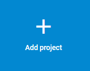
2. In the `Add a project` dialog, select your Qwiklab's project from the `Project name` dropdown, check the boxes to accept the default settings and terms. Click `ADD FIREBASE`.
    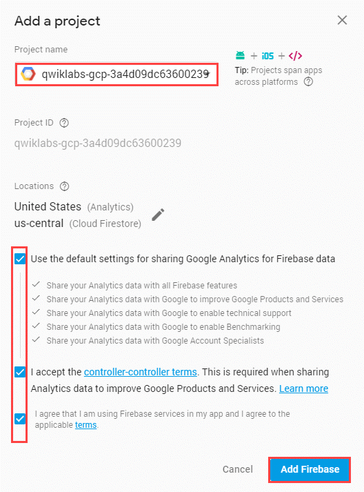
3. Billing is already enabled for your lab. Confirm the billing plan by clicking `CONFIRM PLAN`:
    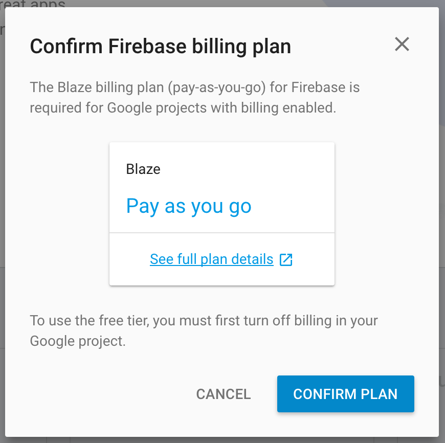

### Enable Google Auth

To allow users to sign in to the web app with their Google account, enable Google Auth.

1. In the Firebase Console, click on the `Authentication` section.
    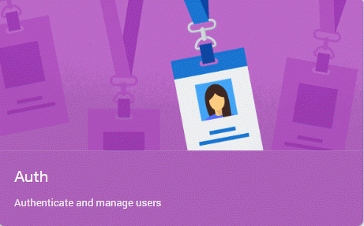
2. In the Users tab, click `Set up sign-in method`.
3. In the Sign-in method tab, **click the pencil icon next to Google** in the Sign-in providers section.
4. Click `Enable` and give the project a welcoming Project public-facing name, like `Friendly Chat`.
    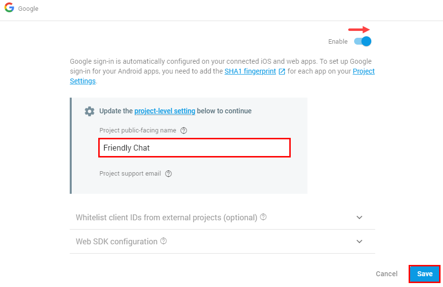
5. Click on the **project-level setting** link, a new tab will open. In the Support email dropdown, choose your Qwiklabs email for the Support email.
    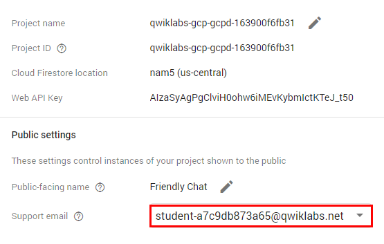
6. Go back to the first Firebase tab and click `SAVE`.
    * Now a user can sign into the app with their Google account.

### Add Firebase to your web app

1. In the Firebase console click on `Project Overview`, then add Firebase to your web app by clicking the **web** icon.
2. First, add an App nick name, this lab uses `"Friendly Chat"`, then click `Register app`:
    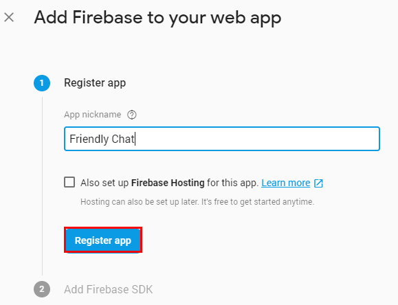
    * The code block for adding Firebase to your app will open. In your own environment you would copy this code block and edit your app to add it, but for this lab you don't have to.
3. Then click `Continue to console`.

### Enable Firebase Storage

1. In the Firebase console, click on `Storage`, then click on `Get Started`:
    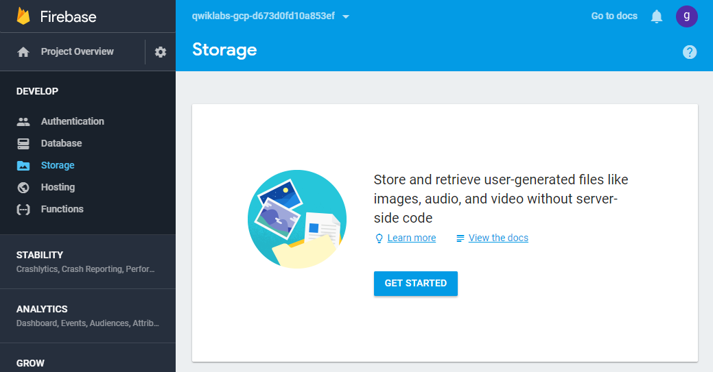
2. When prompted to confirm you viewed security rules, click `GOT IT`.
    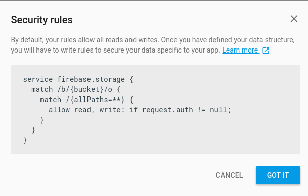

### Configure the Firebase CLI

1. Go back to the GCP Console. Cloud Shell comes with the `firebase` Command Line Interface (CLI) already installed. Check what version is installed with the following command:
    ```bash
    $ firebase --version
    ```
    * The `firebase --version` command will print a version which is at least `4.0.0` which has all the latest features required for Cloud Functions.
2. Authorize the Firebase CLI:
    ```bash
    $ firebase login --no-localhost
    # Example output:
    Allow Firebase to collect anonymous CLI usage information? (Y/n)
    ```
    * The `--no-localhost` option is used because you are on a remote shell.
3. You will be prompted to open a link. Copy the link provided.
    ```bash
    Visit this URL on any device to log in:

    https://accounts.google.com/o/oauth2/auth?client_id=...
    ```
4. Open a new tab and paste the URL into it. Make sure you log in with the lab username and password provided to you (you can find these under Connection Details on the Qwiklabs page).
5. Copy the verification code from the browser and enter it in the Cloud Shell prompt.
6. To set up the Firebase CLI to use your Firebase Project, run the following:
    ```bash
    $ firebase use --add
    ```
    * Select your Project ID and follow the instructions. When prompted, create an alias, such as `staging`.
    * Giving your project an alias is helpful if you are managing multiple apps/projects. You can switch between aliases in Cloud Shell with `firebase use <alias_name>`.

---
## Deploy and run the web app

Now that you have imported and configured your project, run the web app for the first time.

1. In the `cloud-functions-start` folder, run:
    ```bash
    $ firebase deploy --except functions
    ```
    * This will deploy only the web app to the Firebase Hosting.
    * This is the console output you should see:
        ```bash
        i deploying database, storage, hosting
        ✔  database: rules ready to deploy.
        i  storage: checking rules for compilation errors...
        ✔  storage: rules file compiled successfully
        i  hosting: preparing ./ directory for upload...
        ✔  hosting: ./ folder uploaded successfully
        ✔ storage: rules file compiled successfully
        ✔ hosting: 8 files uploaded successfully
        i starting release process (may take several minutes)...

        ✔ Deploy complete!

        Project Console: https://console.firebase.google.com/project/friendlychat-1234/overview
        Hosting URL: https://friendlychat-1234.firebaseapp.com
        ```

### Open the web app

1. You will see the Hosting URL address: `https://<project-id>.firebaseapp.com`.
2. Click on it to open it in a new browser tab. You will see the chat app's functioning UI.
3. Sign in to the app by using the `SIGN-IN WITH GOOGLE` button. Feel free to add some messages and post images.
    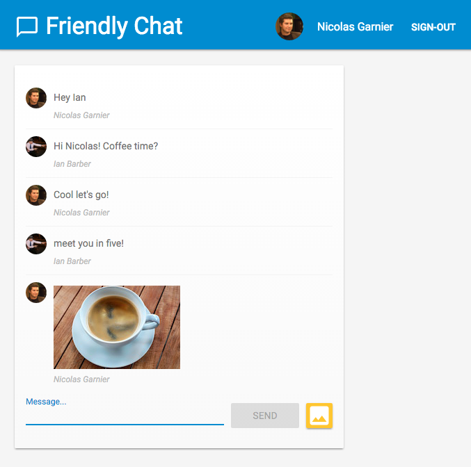
4. If you sign into the app for the first time on a new browser, make sure to **allow** notifications if prompted.
    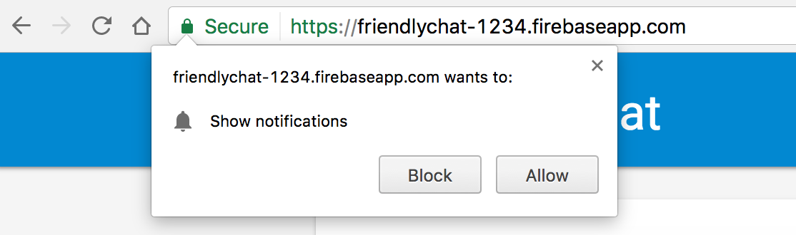
    * If you have accidentally clicked `Block`, change the setting by clicking on the `Secure` button to the left of the URL in the Chrome Omnibar (or click `Site settings`) and select `Notifications > Always Allow on this Site`:
        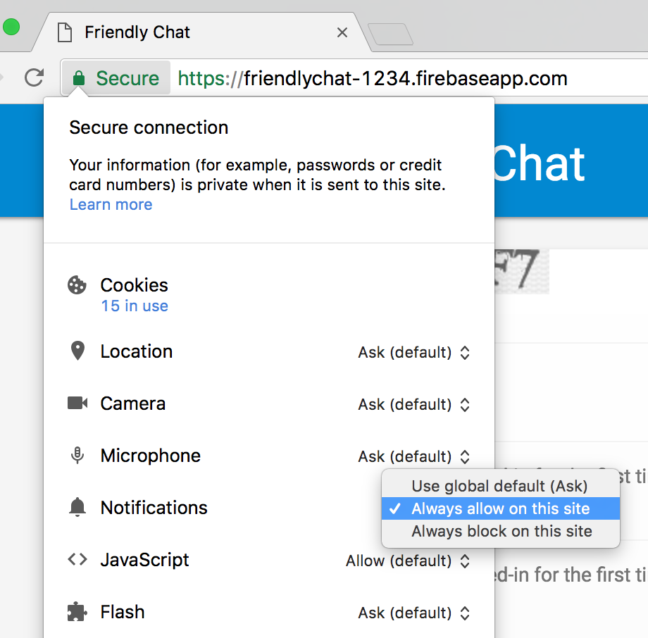

Next you'll add some functionality using the Firebase SDK for Cloud Functions.

---
## The Functions Directory

Cloud Functions allows you to have code that runs in the Cloud without having to set up a server. You'll learn how to build functions that react to Firebase Auth, Cloud Storage, and Firebase Realtime Database events.

When using the Firebase SDK for Cloud Functions, your Functions code will live under the `functions` directory by default. Your Functions code is also a [Node.js](https://nodejs.org/) app, and therefore needs a `package.json` that gives some information about your app and lists dependencies.

1. For this lab you already have the `functions/index.js` file, which is where your code will go. The file can be found in the `cloud-functions-start` directory. Feel free to inspect it before moving forward:
    ```bash
    $ cd functions
    $ ls
    # Example output:
    index.js  package.json
    ```
    * The `functions/package.json` file already lists two required dependencies: the [Firebase SDK for Cloud Functions](https://www.npmjs.com/package/firebase-functions) and the [Firebase Admin SDK](http://npmjs.com/package/firebase-admin).
2. From the `functions` directory, install the dependencies.
    ```bash
    $ npm install
    ```
3. Now have a look at the `index.js` file:
    ```bash
    $ cat index.js
    # Example output:
    /**
    * Copyright 2017 Google Inc. All Rights Reserved.
    * ...
    */

    // Import the Firebase SDK for Google Cloud Functions.
    const functions = require('firebase-functions');
    // Import and initialize the Firebase Admin SDK.
    const admin = require('firebase-admin');
    admin.initializeApp();

    // TODO(DEVELOPER): Write the addWelcomeMessage Function here.

    // TODO(DEVELOPER): Write the blurImages Function here.

    // TODO(DEVELOPER): Write the sendNotification Function here.
    ```
    * The Firebase Admin SDK can be configured automatically when deployed on a Cloud Functions environment or other Google Cloud Platform containers. This is what happens do above when using `admin.initializeApp()`;

Now add a Function that runs when a user signs in for the first time in your chat app and add a message to welcome the user.

---
## Import the Cloud Functions and Firebase Admin modules

In this section you'll be adding code to the `friendlychat-web > cloud-functions-start > functions > index.js` file.

Two modules will be required during this lab:

* Use the `firebase-functions` module to write the Cloud Functions trigger rules.
* Use the `firebase-admin` module to use the Firebase platform on a server with admin access (which lets you write to the Realtime Database or send FCM notifications).

1. Go to the Cloud Shell Code Editor. Navigate to `friendlychat-web > cloud-functions-start > functions` and open the `index.js` file.
2. In the `index.js` file, replace the `// TODO(DEVELOPER): Import the Cloud Functions for Firebase and the Firebase Admin modules here` line with the following:
    ```js
    // Import the Firebase SDK for Google Cloud Functions.
    const functions = require('firebase-functions');
    // Import and initialize the Firebase Admin SDK.
    const admin = require('firebase-admin');
    admin.initializeApp();
    ```
    * The Firebase Admin SDK can be configured automatically when deployed on a Google Cloud environment. This is done using `admin.initializeApp();` above.

Next you'll add a welcome chat message Function that runs when a user signs in to the chat app for the first time.

---
## Welcome New Users

### Chat messages structure

Messages posted to the FriendlyChat chat feed are stored in the Firebase Realtime Database. 

1. Now look at the data structure used for a message. To do this, post a new message to the chat that reads `"Hello World"`:
    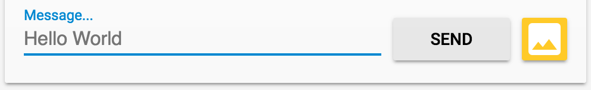
    * This should appear as:
        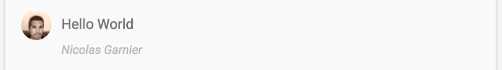
2. In your Firebase app console, Under the Develop section click `Database`:
    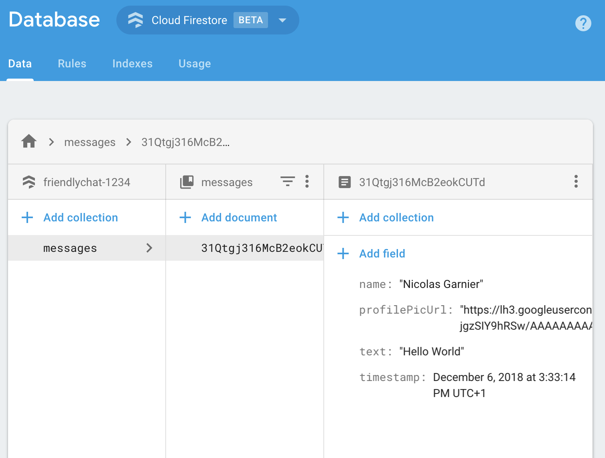
    * As you can see, chat messages are stored in the Cloud Firestore as a document with the `name`, `profilePicUrl`, `text`, and `timestamp` attributes added to the `messages` collection.

### Adding welcome messages

The first Cloud Function adds a message that welcomes new users into the chat. For this we can use the trigger `functions.auth().onCreate` which runs the function every time a user signs in for the first time in your Firebase app.

1. Using the code editor, replace the `//*TODO(DEVELOPER): Write the addWelcomeMessage Function here.*` function into your `index.js` file with the following:
    ```js
    // Adds a message that welcomes new users into the chat.
    exports.addWelcomeMessages = functions.auth.user().onCreate(async (user) => {
        console.log('A new user signed in for the first time.');
        const fullName = user.displayName || 'Anonymous';

        // Saves the new welcome message into the database
        // which then displays it in the FriendlyChat clients.
        await admin.firestore().collection('messages').add({
            name: 'Firebase Bot',
            profilePicUrl: '/images/firebase-logo.png', // Firebase logo
            text: `${fullName} signed in for the first time! Welcome!`,
            timestamp: admin.firestore.FieldValue.serverTimestamp(),
        });
        console.log('Welcome message written to database.');
    });
    ```
    * Adding this function to the special `exports` object is Node's way of making the function accessible outside of the current file and is required for Cloud Functions.
    * In the function above you are adding a new welcome message posted by "Firebase Bot" to the list of chat messages using the [add](https://firebase.google.com/docs/firestore/manage-data/add-data#add_a_document) method on the `messages` collection in the Cloud Firestore which is where the messages of the chat are stored.
    * Since this is an asynchronous operation, the [Promise](https://developer.mozilla.org/en-US/docs/Web/JavaScript/Reference/Global_Objects/Promise), indicating when the Cloud Firestore write has finished, needs to be returned so that Functions doesn't exit the execution too early.

### Deploy the Function

1. In the command line, navigate to the `cloud-functions-start` directory and deploy the function:
    ```bash
    $ cd ..
    $ firebase deploy --only functions
    # Example output:
    i  deploying functions
    i  functions: ensuring necessary APIs are enabled...
    ⚠  functions: missing necessary APIs. Enabling now...
    i  env: ensuring necessary APIs are enabled...
    ⚠  env: missing necessary APIs. Enabling now...
    i  functions: waiting for APIs to activate...
    i  env: waiting for APIs to activate...
    ✔  env: all necessary APIs are enabled
    ✔  functions: all necessary APIs are enabled
    i  functions: preparing functions directory for uploading...
    i  functions: packaged functions (X.XX KB) for uploading
    ✔  functions: functions folder uploaded successfully
    i  starting release process (may take several minutes)...
    i  functions: creating function addWelcomeMessages...
    ✔  functions[addWelcomeMessages]: Successful create operation. 
    ✔  functions: all functions deployed successfully!

    ✔  Deploy complete!

    Project Console: https://console.firebase.google.com/project/friendlypchat-1234/overview
    ```

> **Tip:** The first time you are deploying functions for a project will take longer than usual because you're enabling APIs on your Google Cloud Project. The length of time also depends on the number of functions being deployed, and will increase as you add more.

### Test the function

Once the function has deployed successfully you need a user that signs to the Friendly Chat for the first time to test the welcome message. Since you've already signed in once, you'll delete you account and then sign in as a first time user.

1. In the Firebase console, click `Authentication` section to delete your account from the list of users.
    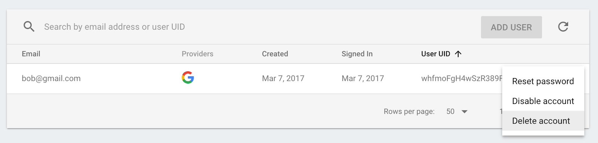
2. Refresh the Friendly Chat tab, then sign in, looking like a first time user, with the Sign In button.
    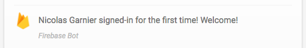
    * **Logs:** If the welcome message doesn't appear or if you face any other issues later on, double-check the command line output for errors during the deploy. If that looks successful, visit the [Cloud Functions logs](https://console.firebase.google.com/project/_/functions/logs?search=&severity=DEBUG) to see if any error messages appeared. You can also verify that the function was deployed successfully and see how many times it has been executed by switching to the `DASHBOARD` tab.

---
## Image moderation

Users can upload all types of images in the chat. Moderating offensive images is important, especially in public social platforms. The images that are being published to Friendly Chat are stored in [Google Cloud Storage](https://firebase.google.com/docs/storage/).

With Cloud Functions, you can detect new image uploads using the `functions.storage().onChange` trigger. This will run every time a new file is uploaded or modified in Cloud Storage.

To moderate chat images, the following process will be used:

1. Check if the image is flagged as Adult or Violent using the [Cloud Vision API](https://cloud.google.com/vision/).
2. If the image has been flagged, download it in the running Functions instance.
3. Blur the image using [ImageMagick](https://www.imagemagick.org/).
4. Upload the blurred image to Cloud Storage.

### Enable the Cloud Vision API

1. You'll be using the Google Cloud Vision API in this function. Confirm the API is enabled. In the Console, navigate to `Navigation menu > API & services > Library` and search for `Google Cloud Vision API`:
    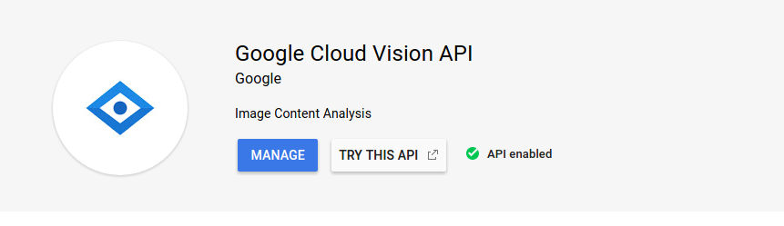
    * If the API is not enabled, click `Enable`.

### Install dependencies

To moderate the images you need a few Node.js packages:

* Google Cloud Vision Client Library for Node.js: [@google-cloud/vision](https://www.npmjs.com/package/@google-cloud/vision) to run the image through the Cloud Vision API to detect inappropriate images.
* A Node.js library [child-process-promise](https://www.npmjs.com/package/child-process-promise): to run ImageMagick since the ImageMagick command-line tool comes pre-installed on all Functions instances.

1. In the command line, go to the `functions` directory and install these packages into your Cloud Functions app:
    ```bash
    $ cd functions
    $ npm install --save @google-cloud/vision@0.12.0 child-process-promise@2.2.1
    ```
    * This will install the packages and add them as declared dependencies in your `package.js` file.

### Import and configure dependencies

Next you'll import the dependencies that were installed, and some Node.js core modules (`path`, `os` and `fs`).

1. In the code editor, add the following lines to the top of your `index.js` file (there is no line to replace):
    ```js
    const Vision = require('@google-cloud/vision');
    const vision = new Vision();
    const spawn = require('child-process-promise').spawn;

    const path = require('path');
    const os = require('os');
    const fs = require('fs');
    ```
    * Since the function will run inside a Google Cloud environment, there is no need to configure the Cloud Storage and Cloud Vision libraries. They will be configured automatically to use your project.

### Detecting inappropriate images

1. The `functions.storage.onChange` Cloud Functions trigger runs your code as soon as a file or folder is created or modified in a Cloud Storage bucket. Add the `blurOffensiveImages` Function into your `index.js` file (there is no line to replace):
    ```js
    // Checks if uploaded images are flagged as Adult or Violence and if so blurs them.
    exports.blurOffensiveImages = functions.runWith({memory: '2GB'}).storage.object().onFinalize(
        async (object) => {
        const image = {
            source: {imageUri: `gs://${object.bucket}/${object.name}`},
        };

        // Check the image content using the Cloud Vision API.
        const batchAnnotateImagesResponse = await vision.safeSearchDetection(image);
        const safeSearchResult = batchAnnotateImagesResponse[0].safeSearchAnnotation;
        const Likelihood = Vision.types.Likelihood;
        if (Likelihood[safeSearchResult.adult] >= Likelihood.LIKELY ||
            Likelihood[safeSearchResult.violence] >= Likelihood.LIKELY) {
            console.log('The image', object.name, 'has been detected as inappropriate.');
            return blurImage(object.name);
        }
        console.log('The image', object.name, 'has been detected as OK.');
    });
    ```
    * Note that some configurations were added of the Cloud Functions instance that will run the function with `.runWith({memory: '2GB'})`. This requests the instance gets 2GB of memory rather than the default as this function is memory intensive.

When the function is triggered, the image is run through the Cloud Vision API to detect if it is flagged as adult or violent. If the API detects the image as inappropriate, the `blurImage` function (next section) blurs the image.

### Blurring the image

1. Still using the code editor, in the `index.js` file, replace the `//*TODO(DEVELOPER): Write the blurOffensiveImages Function here**` line with the following:
    ```js
    // Blurs the given image located in the given bucket using ImageMagick.
    async function blurImage(filePath) {
        const tempLocalFile = path.join(os.tmpdir(), path.basename(filePath));
        const messageId = filePath.split(path.sep)[1];
        const bucket = admin.storage().bucket();

        // Download file from bucket.
        await bucket.file(filePath).download({destination: tempLocalFile});
        console.log('Image has been downloaded to', tempLocalFile);
        // Blur the image using ImageMagick.
        await spawn('convert', [tempLocalFile, '-channel', 'RGBA', '-blur', '0x24', tempLocalFile]);
        console.log('Image has been blurred');
        // Uploading the Blurred image back into the bucket.
        await bucket.upload(tempLocalFile, {destination: filePath});
        console.log('Blurred image has been uploaded to', filePath);
        // Deleting the local file to free up disk space.
        fs.unlinkSync(tempLocalFile);
        console.log('Deleted local file.');
        // Indicate that the message has been moderated.
        await admin.firestore().collection('messages').doc(messageId).update({moderated: true});
        console.log('Marked the image as moderated in the database.');
    }
    ```

In the above function:

* The image binary is downloaded from Cloud Storage.
* Then the image is blurred using ImageMagick's convert tool and the blurred version is re-uploaded to the Storage Bucket.
* Then the file is deleted on the Cloud Functions instance to free up some disk space. This is done so the same Cloud Functions instance can get re-used. If files are not cleaned up it could run out of disk.
* Finally, a boolean is added to the chat message indicating the image was moderated, which will trigger a refresh of the message on the client.

### Deploy the Function

1. In the command line, go to the `cloud-functions-start` directory and deploy the function:
    ```bash
    $ cd ..
    $ firebase deploy --only functions
    # Example output:
    i  deploying functions
    i  functions: ensuring necessary APIs are enabled...
    ✔  functions: all necessary APIs are enabled
    i  functions: preparing functions directory for uploading...
    i  functions: packaged functions (X.XX KB) for uploading
    ✔  functions: functions folder uploaded successfully
    i  starting release process (may take several minutes)...
    i  functions: updating function addWelcomeMessages...
    i  functions: creating function blurOffensiveImages...
    ✔  functions[addWelcomeMessages]: Successful update operation.
    ✔  functions[blurOffensiveImages]: Successful create operation.
    ✔  functions: all functions deployed successfully!

    ✔  Deploy complete!

    Project Console: https://console.firebase.google.com/project/friendlychat-1234/overview
    ```

### Test the function

Once the function has deployed successfully:

1. Open your Friendly Chat app in your browser using the Hosting URL: `https://<project-id>.firebaseapp.com`
2. Once signed-in, click the `Upload an image` button.
3. Choose your best offensive image to upload, or you can use this [flesh eating Zombie](https://pixabay.com/photo-949916) and after a few moments you should see your post refresh with a blurred version of the image:
    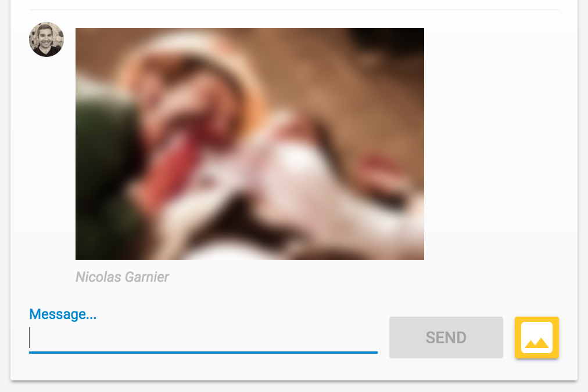

---
## New Message Notifications

In this section you will add a Cloud Function that sends notifications to participants of the chat when a new message is posted.

Using [Firebase Cloud Messaging](https://firebase.google.com/docs/cloud-messaging/) (FCM) you can send notifications to your users in a cross platform and reliable way. To send a notification to a user you need their FCM device token. The chat web app that you are using already collects device tokens from users when they open the app for the first time on a new browser or device. These tokens are stored in Cloud Firestore in the `fcmTokens` collection.

### Send notifications

To detect when new messages are posted you'll be using the `functions.database.ref().onCreate` Cloud Functions trigger which runs your code when a new object is created at a given path of the Cloud Firestore.

1. Add the `sendNotifications` to your `index.js` file replace the `//*TODO(DEVELOPER): Write the sendNotification Function here*` line with the following:
    ```js
    // Sends a notifications to all users when a new message is posted.
    exports.sendNotifications = functions.firestore.document('messages/{messageId}').onCreate(
        async (snapshot) => {
            // Notification details.
            const text = snapshot.data().text;
            const payload = {
            notification: {
                title: `${snapshot.data().name} posted ${text ? 'a message' : 'an image'}`,
                body: text ? (text.length <= 100 ? text : text.substring(0, 97) + '...') : '',
                icon: snapshot.data().profilePicUrl || '/images/profile_placeholder.png',
                click_action: `https://${process.env.GCLOUD_PROJECT}.firebaseapp.com`,
            }
        };

        // Get the list of device tokens.
        const allTokens = await admin.firestore().collection('fcmTokens').get();
        const tokens = [];
        allTokens.forEach((tokenDoc) => {
            tokens.push(tokenDoc.id);
        });

        if (tokens.length > 0) {
            // Send notifications to all tokens.
            const response = await admin.messaging().sendToDevice(tokens, payload);
            await cleanupTokens(response, tokens);
            console.log('Notifications have been sent and tokens cleaned up.');
        }
    });
    ```

In the Function above you are gathering all users’ device tokens from the Firebase Realtime Database and sending a notification to each of these using the `admin.messaging().sendToDevice` function.

### Cleanup the tokens

Lastly, remove tokens that are no longer valid. This happens when tokens from the user are no longer used by the browser or device. For example, if a user revokes the notification permission for his browser session, the tokens become invalid.

1. To remove invalid tokens, add the following `cleanupTokens` function in your `index.js` file:
    ```js
    // Cleans up the tokens that are no longer valid.
    function cleanupTokens(response, tokens) {
        // For each notification we check if there was an error.
        const tokensDelete = [];
        response.results.forEach((result, index) => {
            const error = result.error;
            if (error) {
                console.error('Failure sending notification to', tokens[index], error);
                // Cleanup the tokens who are not registered anymore.
                if (error.code === 'messaging/invalid-registration-token' ||
                    error.code === 'messaging/registration-token-not-registered') {
                    const deleteTask = admin.firestore().collection('messages').doc(tokens[index]).delete();
                    tokensDelete.push(deleteTask);
                }
            }
        });
        return Promise.all(tokensDelete);
    }
    ```

### Deploy the Function

1. In the command line, deploy the function from the `cloud-functions-start` directory:
    ```bash
    $ firebase deploy --only functions
    # Example output:
    i  deploying functions
    i  functions: ensuring necessary APIs are enabled...
    ✔  functions: all necessary APIs are enabled
    i  functions: preparing functions directory for uploading...
    i  functions: packaged functions (X.XX KB) for uploading
    ✔  functions: functions folder uploaded successfully
    i  starting release process (may take several minutes)...
    i  functions: updating function addWelcomeMessages...
    i  functions: updating function blurOffensiveImages...
    i  functions: creating function sendNotifications...
    ✔  functions[addWelcomeMessages]: Successful update operation.
    ✔  functions[blurOffensiveImages]: Successful updating operation.
    ✔  functions[sendNotifications]: Successful create operation.
    ✔  functions: all functions deployed successfully!

    ✔  Deploy complete!

    Project Console: https://console.firebase.google.com/project/friendlychat-1234/overview
    ```

### Test the function

Once the function has deployed successfully you'll need to have a user that signs-in for the first time. If you have signed-in already with your account you can open the Firebase Console Authentication section and delete your account from the list of users.

1. Open your Friendly Chat app in your browser using the Hosting URL: `https://<project-id>.firebaseapp.com`
    * **Reminder:** If you are using the Google Chrome Incognito browser, open the chat app in a new Chrome browser, do not use Incognito.
2. If you're signing in to the app for the first time, remember to Allow notifications:
    
3. Close the chat app tab or display a different tab. Notifications appear only if the app is in the background. To learn how to receive messages while your app is in the foreground, have a look at [the documentation](https://firebase.google.com/docs/cloud-messaging/js/receive#handle_messages_when_your_web_app_is_in_the_foreground).
4. Using a different browser (or an Incognito window), sign in to the app and post a message. You should see a notification displayed by the first browser:
    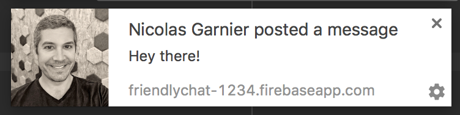

> **Note:** If you attempt to adapt this lab to reach a third-party service outside of Google, you need to switch to the a paid plan. See the [pricing page](https://firebase.google.com/pricing/) for more details.

---
## Congratulations!

You have used the Firebase SDK for Cloud Functions and added server-side components to a chat app.

### What was covered

* Authoring Cloud Functions using the Firebase SDK for Cloud Functions.
* Trigger Cloud Functions based on Auth, Cloud Storage, and Cloud Firestore events.
* Add Firebase Cloud Messaging support to your web app.
* Deployed Cloud Functions using the Firebase CLI.

### Finish your Quest

This self-paced lab is part of the Qwiklabs [Deploying Applications](https://google.qwiklabs.com/quests/26) Quest. A Quest is a series of related labs that form a learning path. Completing this Quest earns you the badge above, to recognize your achievement. You can make your badge (or badges) public and link to them in your online resume or social media account. [Enroll in this Quest](http://google.qwiklabs.com/learning_paths/26/enroll) and get immediate completion credit if you've taken this lab. [See other available Qwiklabs Quests](http://google.qwiklabs.com/catalog).

### Next labs

* Learn about Running [WordPress on App Engine Flexible Environment](https://google.qwiklabs.com/catalog_lab/985).
* See how Firebase is used in authentication in [App Dev-Adding User Authentication to your Application-Java](https://google.qwiklabs.com/catalog_lab/969).

### Next steps/learn more

* Learn more about Firebase at [here](https://firebase.google.com/).
* Learn about the other [Cloud Function trigger types](https://firebase.google.com/docs/functions/firestore-events).
* Use Firebase and Cloud Functions with your own app.