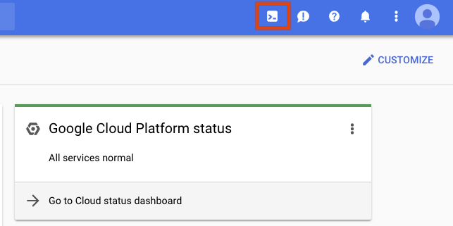

# Getting Started with Cloud Shell & gcloud

## GSP002


Google Cloud Shell provides you with gcloud command-line access to computing resources hosted on the Google Cloud Platform. Cloud Shell is a Debian-based virtual machine with a persistent 5GB home directory, which makes it easy for you to manage your GCP projects and resources. The Cloud SDK gcloud and other utilities you need come pre-installed in Cloud Shell, which allows you to get up and running quickly.

In this hands-on lab, you will learn how to connect to computing resources hosted on the Google Cloud Platform via Cloud Shell. You will learn how to use Cloud Shell and the gcloud command.

We encourage students to type the commands themselves, to help encourage learning of the core concepts. Many labs will include a code block that contains the required commands. You can easily copy and paste the commands from the code block into the appropriate places during the lab.

### What you'll do

* Practice using gcloud commands.
* Connect to storage services hosted on the Google Cloud Platform.

### Prerequisites

* Familiarity with standard Linux text editors such as `vim`, `emacs`, or `nano`.

---
## Setup

### Before you click the Start Lab button

Read these instructions. Labs are timed and you cannot pause them. The timer, which starts when you click Start Lab, shows how long Cloud resources will be made available to you.

This Qwiklabs hands-on lab lets you do the lab activities yourself in a real cloud environment, not in a simulation or demo environment. It does so by giving you new, temporary credentials that you use to sign in and access the Google Cloud Platform for the duration of the lab.

### What you need

To complete this lab, you need:

* Access to a standard internet browser (Chrome browser recommended).
* Time to complete the lab.

> **Note:** If you already have your own personal GCP account or project, do not use it for this lab.

### How to start your lab and sign in to the Console

1. Click the `Start Lab` button. If you need to pay for the lab, a pop-up opens for you to select your payment method. On the left you will see a panel populated with the temporary credentials that you must use for this lab.
    
2. Copy the username, and then click `Open Google Console`. The lab spins up resources, and then opens another tab that shows the `Choose an account` page.
    * **Tip:** Open the tabs in separate windows, side-by-side.
3. On the Choose an account page, click `Use Another Account`.
    
4. The Sign in page opens. Paste the username that you copied from the Connection Details panel. Then copy and paste the password.
    * **Important:** You must use the credentials from the Connection Details panel. Do not use your Qwiklabs credentials. If you have your own GCP account, do not use it for this lab (avoids incurring charges).
5. Click through the subsequent pages:
    * Accept the terms and conditions.
    * Do not add recovery options or two-factor authentication (because this is a temporary account).
    * Do not sign up for free trials.
6. After a few moments, the GCP console opens in this tab.
    * **Note:** You can view the menu with a list of GCP Products and Services by clicking the Navigation menu at the top-left, next to “Google Cloud Platform”.
        

### Activate Google Cloud Shell

Google Cloud Shell is a virtual machine that is loaded with development tools. It offers a persistent 5GB home directory and runs on the Google Cloud. Google Cloud Shell provides command-line access to your GCP resources.

1. In GCP console, on the top right toolbar, click the `Open Cloud Shell` button.
    
2. In the dialog box that opens, click `START CLOUD SHELL`:
    
    * You can click `START CLOUD SHELL` immediately when the dialog box opens.
3. It takes a few moments to provision and connect to the environment. When you are connected, you are already authenticated, and the project is set to your `PROJECT_ID`. For example:
    
4. `gcloud` is the command-line tool for Google Cloud Platform. It comes pre-installed on Cloud Shell and supports tab-completion.
    * You can list the active account name with this command:
        ```bash
        $ gcloud auth list
        # Output
        Credentialed accounts:
        - <myaccount>@<mydomain>.com (active)
        # Example output
        Credentialed accounts:
        - google1623327_student@qwiklabs.net
        ```
    * You can list the project ID with this command:
        ```bash
        $ gcloud config list project
        # Output
        [core]
        project = <project_ID>
        # Example output
        [core]
        project = qwiklabs-gcp-44776a13dea667a6
        ```
    * Full documentation of `gcloud` is available on [Google Cloud gcloud Overview](https://cloud.google.com/sdk/gcloud).

### Understanding Regions and Zones

Certain Compute Engine resources live in regions or zones. A region is a specific geographical location where you can run your resources. Each region has one or more zones. For example, the `us-central1` region denotes a region in the Central United States that has zones `us-central1-a`, `us-central1-b`, `us-central1-c`, and `us-central1-f`.


Resources that live in a zone are referred to as zonal resources. Virtual machine Instances and persistent disks live in a zone. To attach a persistent disk to a virtual machine instance, both resources must be in the same zone. Similarly, if you want to assign a static IP address to an instance, the instance must be in the same region as the static IP.
* Learn more about regions and zones and see a complete list in [Regions & Zones documentation](https://cloud.google.com/compute/docs/regions-zones/).

---
## Use the command line

1. Open a new `Cloud Shell` session by clicking on the icon in the top right corner of the GCP Console:
    
2. After Cloud Shell is activated you can use the command line to invoke the Cloud SDK `gcloud` command or other tools available on the virtual machine instance. You can also use your `$HOME` directory in persistent disk storage to store files across projects and between Cloud Shell sessions. Your `$HOME` directory is private to you and cannot be accessed by other users.
    * Let's take a look at some of the commands available.
        * `gcloud` offers simple usage guidelines that are available by adding the `-h` flag onto the end of any `gcloud` invocation. Run the following command in Cloud Shell:
            ```bash
            $ gcloud -h
            ```
        * More verbose help can be obtained by appending `--help` flag, or executing gcloud help command. Run the following in Cloud Shell:
            ```bash
            $ gcloud config --help
            ```
        * Press use the enter key or the spacebar to scroll through the help content. Press `q` to exit the content. Now run the following command:
            ```bash
            $ gcloud help config
            ```
        * You can see that the `gcloud config --help` and `gcloud help config` commands are equivalent. Both give long, detailed help.

---
## Use your home directory

Now let's try out your home directory. The contents of your Cloud Shell home directory persists across projects between all Cloud Shell sessions, even after the virtual machine terminates and is restarted.

1. Change your current working directory:
    ```bash
    $ cd $HOME
    ```
2. Open your `.bashrc` configuration file using `vi`.
    ```bash
    $ vi ./.bashrc
    ```
    * The editor opens and displays the contents of the file. Press the `ESC` key and then `:q` to exit the editor.

---
## Using gcloud commands

1. Let's view the list of configuration in our environment. From reading the long, detailed help results in the previous step, we know we can use the command `gcloud` list.
    ```bash
    $ gcloud config list
    ```
2. To check how other properties are set, see all properties by calling:
    ```bash
    $ gcloud config list --all
    ```

---
## Managing Cloud Storage data

You can use the `gsutil` tool in Cloud Shell to manage Cloud Storage resources. This includes creating and deleting buckets and objects, copying and moving storage data, and managing bucket and object ACLs. `gsutil` will also let you transfer data in and out of your Cloud Shell instance.

1. Try creating a Cloud Storage bucket. Bucket names must be unique, so replace `unique-name` with something else, or append the name to make it unique.
    ```bash
    $ gsutil mb gs://unique-name
    ```
    * Now we'll create some data to upload to your bucket.
2. First, create a test file:
    ```bash
    $ vi test.dat
    ```
3. Start the editor:
    ```bash
    i
    ```
4. Add some data to your file:
    ```bash
    Welcome to gcloud!
    ```
5. Save the `test.dat` file: `<ESC>`, then
    ```bash
    :wq
    ```
6. Now upload some data to the bucket you created (make sure to replace `unique-name` with your storage bucket):
    ```bash
    $ gsutil cp test.dat gs://unique-name
    ```
7. To see your bucket and file, open the navigation menu and select `Storage > Browser`. Then click on your bucket. You should see the `test.dat` file:
    

---
## Test your Understanding

Below are a multiple choice questions to reinforce your understanding of this lab's concepts. Answer them to the best of your abilities.

* 1,3,5: Three basic ways to interact with the GCP services and resources:
    1. Client libraries
    2. GLib
    3. Command-line interface
    4. GStreamer
    5. GCP Console
* 3: Which tool in cloud shell helps to manage Cloud Storage resources?
    1. compute
    2. bq
    3. gsutil
    4. gcloud

---
## Congratulations!

You learned how to launch Cloud Shell and ran some sample `gcloud` commands.

### Finish Your Quest

This self-paced lab is part of the Qwiklabs [GCP Essentials](https://google.qwiklabs.com/quests/23) Quest. A Quest is a series of related labs that form a learning path. Completing this Quest earns you the badge above, to recognize your achievement. You can make your badge (or badges) public and link to them in your online resume or social media account. [Enroll in this Quest](https://google.qwiklab.com/learning_paths/23/enroll) and get immediate completion credit if you've taken this lab. [See other available Qwiklabs Quests](https://google.qwiklabs.com/catalog).

### Take Your Next Lab

Continue your Quest with [Provision Services with GCP Marketplace](https://google.qwiklabs.com/catalog_lab/339), or check out these suggestions:

* [Creating a Persistent Disk](https://google.qwiklabs.com/catalog_lab/559)
* [Hello Node Kubernetes](https://google.qwiklabs.com/catalog_lab/468)

### Next steps / Learn More

* Cloud Shell [Documentation](https://cloud.google.com/shell/docs/) and [tutorial video](https://www.youtube.com/watch?v=hBMcAKzGt3w).
* `gcloud` [Documentation](https://cloud.google.com/sdk/gcloud/) and [tutorial video](https://www.youtube.com/watch?v=oTIK9OvQBxQ&list=PLIivdWyY5sqIij_cgINUHZDMnGjVx3rxi&index=15).

---
## Student Resources

* [Get Started with Cloud Shell, GCP Essentials](Get Started with Cloud Shell, GCP Essentials)