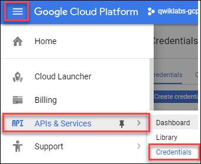

# Google Cloud Speech API: Qwik Start

## GSP119


The Google Cloud Speech API enables easy integration of Google speech recognition technologies into developer applications. The Speech API allows you to send audio and receive a text transcription from the service (see [What is the Google Cloud Speech API?](https://cloud.google.com/speech/docs/) for more information).

### What you'll do

* Create an API key
* Create a Speech API request
* Call the Speech API request

---
## Setup and Requirements

### Before you click the Start Lab button

Read these instructions. Labs are timed and you cannot pause them. The timer, which starts when you click Start Lab, shows how long Cloud resources will be made available to you.

This Qwiklabs hands-on lab lets you do the lab activities yourself in a real cloud environment, not in a simulation or demo environment. It does so by giving you new, temporary credentials that you use to sign in and access the Google Cloud Platform for the duration of the lab.

### What you need

To complete this lab, you need:

* Access to a standard internet browser (Chrome browser recommended).
* Time to complete the lab.
* **Note:** If you already have your own personal GCP account or project, do not use it for this lab.

### How to start your lab and sign in to the Console

1. Click the `Start Lab` button. If you need to pay for the lab, a pop-up opens for you to select your payment method. On the left you will see a panel populated with the temporary credentials that you must use for this lab.
    
2. Copy the username, and then click `Open Google Console`. The lab spins up resources, and then opens another tab that shows the `Choose an account` page.
    * **Tip:** Open the tabs in separate windows, side-by-side.
3. On the Choose an account page, click `Use Another Account`.
    
4. The Sign in page opens. Paste the username that you copied from the Connection Details panel. Then copy and paste the password.
    * **Important:** You must use the credentials from the Connection Details panel. Do not use your Qwiklabs credentials. If you have your own GCP account, do not use it for this lab (avoids incurring charges).
5. Click through the subsequent pages:
    * Accept the terms and conditions.
    * Do not add recovery options or two-factor authentication (because this is a temporary account).
    * Do not sign up for free trials.
6. After a few moments, the GCP console opens in this tab.
    * * **Note:** You can view the menu with a list of GCP Products and Services by clicking the Navigation menu at the top-left, next to “Google Cloud Platform”.
    

### Activate Google Cloud Shell

Google Cloud Shell is a virtual machine that is loaded with development tools. It offers a persistent 5GB home directory and runs on the Google Cloud. Google Cloud Shell provides command-line access to your GCP resources.

1. In GCP console, on the top right toolbar, click the `Open Cloud Shell` button.
    
2. In the dialog box that opens, click `START CLOUD SHELL`:
    
    * You can click `START CLOUD SHELL` immediately when the dialog box opens.
3. It takes a few moments to provision and connect to the environment. When you are connected, you are already authenticated, and the project is set to your `PROJECT_ID`. For example:
    
    * `gcloud` is the command-line tool for Google Cloud Platform. It comes pre-installed on Cloud Shell and supports tab-completion.
        * You can list the active account name with this command:
            ```bash
            $ gcloud auth list
            # Output:
            Credentialed accounts:
            - <myaccount>@<mydomain>.com (active)
            # Example output:
            Credentialed accounts:
            - google1623327_student@qwiklabs.net
            ```
        * You can list the project ID with this command:
            ```bash
            $ gcloud config list project
            # Output:
            [core]
            project = <project_ID>
            # Example output:
            [core]
            project = qwiklabs-gcp-44776a13dea667a6
            ```
    * **Note:** Full documentation of gcloud is available on [Google Cloud gcloud Overview](https://cloud.google.com/sdk/gcloud).

---
## Create an API Key

Since you'll be using `curl` to send a request to the Speech API, you'll need to generate an API key to pass in our request URL.

1. To create an API key, click `Navigation menu > APIs & services > Credentials`:
    
2. Then click `Create credentials`:
    
3. In the drop down menu, select `API key`:
    
4. Copy the key you just generated.
5. Now that you have an API key, save it to an environment variable to avoid having to insert the value of your API key in each request. You can do this in Cloud Shell command line. In the following command, be sure to replace `<YOUR_API_KEY>` with the key you just copied.
    ```bash
    $ export API_KEY=<YOUR_API_KEY>
    ```

---
## Create your Speech API request

* **Note:** You will use a pre-recorded file that's available on Google Cloud Storage: `gs://cloud-samples-tests/speech/brooklyn.flac`. You can listen to this file before sending it to the Speech API [here](https://storage.cloud.google.com/speech-demo/brooklyn.wav).

1. Create `request.json` in Cloud Shell command line. You'll use this to build your request to the speech API:
    ```bash
    $ touch request.json
    ```
2. Now open the `request.json` using your preferred command line editor (`nano`, `vim`, `emacs`) or `gcloud`. Add the following to your `request.json` file, using the uri value of the sample raw audio file:
    ```json
    {
        "config": {
            "encoding":"FLAC",
            "languageCode": "en-US"
        },
        "audio": {
            "uri":"gs://cloud-samples-tests/speech/brooklyn.flac"
        }
    }
    ```
    * The request body has a `config` and `audio` object.
    * In `config`, you tell the Speech API how to process the request:
        * The encoding parameter tells the API which type of audio encoding you're using while the file is being sent to the API. `FLAC` is the encoding type for `.raw` files (here is [documentation](https://cloud.google.com/speech/reference/rest/v1/RecognitionConfig) for encoding types for more details).
    * There are other parameters you can add to your `config` object, but `encoding` is the only required one.
    * In the `audio` object, you pass the API the uri of the audio file in Cloud Storage.
3. Now you're ready to call the Speech API!

---
## Call the Speech API

1. Pass your request body, along with the API key environment variable, to the Speech API with the following `curl` command (all in one single command line):
    ```bash
    $ curl -s -X POST -H "Content-Type: application/json" --data-binary @request.json \
    "https://speech.googleapis.com/v1/speech:recognize?key=${API_KEY}"
    ```
    * Your response should look something like this:
        ```json
        {
            "results": [
                {
                    "alternatives": [
                        {
                            "transcript": "how old is the Brooklyn Bridge",
                            "confidence": 0.98267895
                        }
                    ]
                }
            ]
        }
        ```
        * The transcript value will return the Speech API's text transcription of your audio file, and the `confidence` value indicates how sure the API is that it has accurately transcribed your audio.
         * You'll notice that you called the `syncrecognize` method in the request above. The Speech API supports both synchronous and asynchronous speech to text transcription. In this example you sent it a complete audio file, but you can also use the `syncrecognize` method to perform streaming speech to text transcription while the user is still speaking.
2. You created an Speech API request then called the Speech API.

---
## Congratulations!

### Finish Your Quest

Continue your Quest with [Baseline: Data, ML, AI](https://google.qwiklabs.com/quests/34). A Quest is a series of related labs that form a learning path. Completing this Quest earns you the badge above, to recognize your achievement. You can make your badge (or badges) public and link to them in your online resume or social media account. [Enroll in this Quest](https://google.qwiklabs.com/learning_paths/34/enroll) and get immediate completion credit if you've taken this lab. [See other available Qwiklabs Quests](http://google.qwiklabs.com/catalog).

### Take Your Next Lab

This lab is part of a series of labs called Qwik Starts. These labs are designed to give you a little taste of the many features available with Google Cloud. Search for "Qwik Starts" in the [lab catalog](https://google.qwiklabs.com/catalog) to find the next lab you'd like to take!

### Next Steps /Learn More

* Check out our [Quests](https://google.qwiklabs.com/catalog) for a series of labs to concentrate on one area. For example [Networking in the Google Cloud](https://google.qwiklabs.com/quests/31).
* Or, learn about something completely different with [Google Maps Web Services Proxy for Mobile Applications](https://google.qwiklabs.com/focuses/4459).

---
## Student Resources

* [Powerful Speech Recognition Using Google Machine Learning](https://youtu.be/k9xLdXNriEo)
* [Google Cloud Speech: Qwik Start - Qwiklabs Preview](https://youtu.be/7_f7XKbUjK4)
