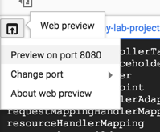
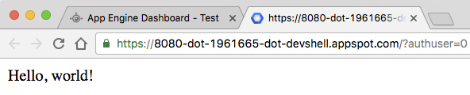
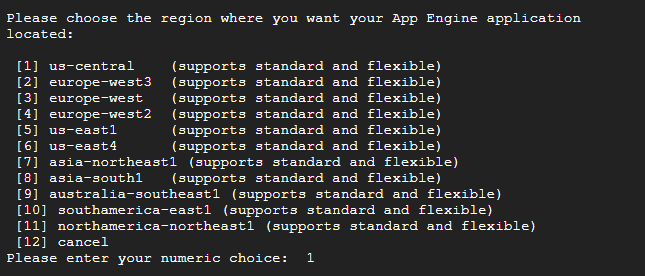
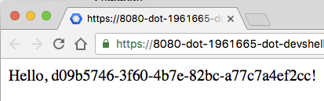

# Deploy Node.js Express Application in App Engine

## GSP028


Google App Engine applications are easy to create, easy to maintain, and easy to scale as your traffic and data storage needs change. With App Engine, there are no servers to maintain. You simply upload your application and it's ready to go.

App Engine applications automatically scale based on incoming traffic. load balancing, microservices, authorization, SQL and NoSQL databases, Memcache, traffic splitting, logging, search, versioning, roll out and roll backs, and security scanning are all supported natively and are highly customizable.

App Engine's environments, the [Standard Environment](https://cloud.google.com/appengine/docs/about-the-standard-environment) and the [Flexible environment](https://cloud.google.com/appengine/docs/flexible/), support a host of programming languages, including Java, Python, PHP, Node.js, Go, etc.. The two environments give users maximum flexibility in how their application behaves since each environment has certain strengths. Read [The App Engine Environments](https://cloud.google.com/appengine/docs/the-appengine-environments) for more information.

This tutorial uses the sample code from the [Google Cloud Node.js Getting Started guide](https://github.com/GoogleCloudPlatform/nodejs-docs-samples). You will learn how to to connect to computing resources hosted on Google Cloud Platform via the web. You will learn how to use Cloud Shell and the Cloud SDK gcloud command.

### What you'll learn

* How to create a Node.js Express application on Google App Engine.
* How to update the code without taking the server down.

---
## Setup and Requirements

### Before you click the Start Lab button

Read these instructions. Labs are timed and you cannot pause them. The timer, which starts when you click Start Lab, shows how long Cloud resources will be made available to you.

This Qwiklabs hands-on lab lets you do the lab activities yourself in a real cloud environment, not in a simulation or demo environment. It does so by giving you new, temporary credentials that you use to sign in and access the Google Cloud Platform for the duration of the lab.

### What you need

To complete this lab, you need:

* Access to a standard internet browser (Chrome browser recommended).
* Time to complete the lab.
* **Note:** If you already have your own personal GCP account or project, do not use it for this lab.

### How to start your lab and sign in to the Console

1. Click the `Start Lab` button. If you need to pay for the lab, a pop-up opens for you to select your payment method. On the left you will see a panel populated with the temporary credentials that you must use for this lab.
    
2. Copy the username, and then click `Open Google Console`. The lab spins up resources, and then opens another tab that shows the **Choose an account** page.
    * **Tip:** Open the tabs in separate windows, side-by-side.
3. On the **Choose an account** page, click `Use Another Account`.
    
4. The Sign in page opens. Paste the username that you copied from the Connection Details panel. Then copy and paste the password.
    * **Important:** You must use the credentials from the Connection Details panel. Do not use your Qwiklabs credentials. If you have your own GCP account, do not use it for this lab (avoids incurring charges).
5. Click through the subsequent pages:
    * Accept the terms and conditions.
    * Do not add recovery options or two-factor authentication (because this is a temporary account).
    * Do not sign up for free trials.
6. After a few moments, the GCP console opens in this tab.
    * **Note:** You can view the menu with a list of GCP Products and Services by clicking the Navigation menu at the top-left, next to “Google Cloud Platform”.
    

---
## Activate Google Cloud Shell

Google Cloud Shell is a virtual machine that is loaded with development tools. It offers a persistent 5GB home directory and runs on the Google Cloud. Google Cloud Shell provides command-line access to your GCP resources.

1. In GCP console, on the top right toolbar, click the `Open Cloud Shell` button.
    
2. In the dialog box that opens, click `START CLOUD SHELL`:
    
    * **Note:** You can click `START CLOUD SHELL` immediately when the dialog box opens.
3. It takes a few moments to provision and connect to the environment. When you are connected, you are already authenticated, and the project is set to your `PROJECT_ID`. For example:
    
    * `gcloud` is the command-line tool for Google Cloud Platform. It comes pre-installed on Cloud Shell and supports tab-completion.
        * You can list the active account name with this command:
            ```bash
            $ gcloud auth list
            # Output:
            Credentialed accounts:
            - <myaccount>@<mydomain>.com (active)
            # Example output:
            Credentialed accounts:
            - google1623327_student@qwiklabs.net
            ```
        * You can list the project ID with this command:
            ```bash
            $ gcloud config list project
            # Output:
            [core]
            project = <project_ID>
            # Example output:
            [core]
            project = qwiklabs-gcp-44776a13dea667a6
            ```
    * **Note:** Full documentation of `gcloud` is available on [Google Cloud gcloud Overview](https://cloud.google.com/sdk/gcloud).

---
## Enable the App Engine Admin API

1. Click on the `Navigation` menu icon in the top left of the screen:
    
2. Select `APIs & services` from the drop down and click on `Dashboard`:
    
3. Click on `Enable APIs and services`:
    
4. Then, search for `App Engine` in the search box.
5. Click on `App Engine Admin API`, then click `Enable` if the API isn't enabled already.

---
## Get the Getting Started Example source code

1. After Cloud Shell launches, you can use the command line to clone the example source code in the home directory:
    ```bash
    $ git clone https://github.com/GoogleCloudPlatform/nodejs-docs-samples.git && cd nodejs-docs-samples/appengine/hello-world/flexible
    ```
2. Now, install the dependencies with `npm`:
    ```bash
    $ npm install
    ```

---
## Run the Application Locally

1. You can start the Node.js application normally with `npm`:
    ```bash
    $ npm start
    ```
2. Once the application started, click on the `Web Preview` icon the Cloud Shell toolbar and choose `Preview on port 8080`.
    
3. A tab in your browser opens and connects to the server you just started.
    
    * In the cloud shell command line, press `CTRL + C` to quit.

---
## Deploying the Application into App Engine

App Engine uses a file called `app.yaml` to describe an application's deployment configuration. If this file is not present, App Engine will try to guess the deployment configuration. However, it is a good idea to provide this file.

1. Open `app.yaml` to see what it contains. You can use `vim`, `nano`,or `emacs` to view the file:
    ```yaml
    runtime: nodejs
    env: flex
    ```
    * This is the basic configuration needed to deploy a Node.js application. You can learn more about [configuring App Engine](https://cloud.google.com/appengine/docs/flexible/nodejs/configuring-your-app-with-app-yaml).
2. Close your code editor.
3. To deploy your application into App Engine environment, run:
    ```bash
    $ gcloud app deploy
    ```
4. Because this is the first time you are deploying App Engine, the tool will prompt you to select a location to deploy the app. For this lab choose `us-central`.
    
    * When prompted, enter `Y` to confirm deployment.
    * First time deployment may take several minutes. This is because App Engine Flexible environment automatically provisions a Google Compute Engine virtual machine for you behind the scenes, and then installs and starts the application.
5. After the application deploys, you can visit it by opening the URL `http://<project-id>.appspot.com` in your web browser. The `project-id` is the GCP Project ID in the `CONNECTION DETAILS` section of the lab.
    * Alternatively, you enter the following command for the URL link: `gcloud app browse`

### Summary

In this step, you set up a simple Node.js application and ran and deployed your application on App Engine.

---
## Updating the Application

Update the application to generate a [UUID](https://en.wikipedia.org/wiki/Universally_unique_identifier) every time someone visits the page.

1. Install the `uuid` package with `npm`:
    ```bash
    $ npm install uuid --save
    ```
2. Now modify `app.js` to use `uuid`. You can use `vim`, `nano`,or `emacs` to edit the file. Enter the following in the the Cloud Shell Command Line to update the `app.js` file:
    ```bash
    $ vi app.js
    ```
    * Press `I` to start the editor
    * Add the following in `app.js` file:
        ```js
        res.status(200).send(`Hello, ${uuid()}!`);
        ```
    * Save the `app.js` file by pressing `ESC` then entering `:wq`
    ```js
    // [START app]
    'use strict';

    const express = require('express');
    const app = express();
    const uuid = require('uuid');

    app.get('/', (req, res) => {
    res.status(200).send(`Hello, ${uuid()}!`);
    });

    // Start the server
    const PORT = process.env.PORT || 8080;
    app.listen(PORT, () => {
    console.log(`App listening on port ${PORT}`);
    console.log('Press Ctrl+C to quit.');
    });
    // [END app]
    ```
3. Now, you can test the application locally. Start the Node.js application with `npm`:
    ```bash
    $ npm start
    ```
4. Once the application started, click on the `Web Preview` icon the Cloud Shell toolbar and choose `Preview on port 8080`.
    
5. A tab in your browser opens and connects to the server you just started. You should see the new app that displays a UUID!
    
    * In the cloud shell command line, press `CTRL + C` to quit.
6. To deploy your updated application, run:
    ```bash
    $ gcloud app deploy
    ```
7. In a few minutes, the new version will be deployed and you can visit it by opening the URL `http://<project-id>.appspot.com` in your web browser.
    * Alternatively, you enter the following command for the URL link: `gcloud app browse`

### Summary

In this step, you updated your Node.js application without any downtime.

---
## Congratulations!

You learned how to write and deploy your first App Engine web application!

### Finish Your Quest

This self-paced lab is part of the Qwiklabs Quest [Deploying Applications](https://google.qwiklabs.com/quests/26). A Quest is a series of related labs that form a learning path. Completing this Quest earns you the badge above, to recognize your achievement. You can make your badge (or badges) public and link to them in your online resume or social media account. [Enroll in this Quest](http://google.qwiklabs.com/learning_paths/26/enroll) and get immediate completion credit if you've taken this lab. [See other available Qwiklabs Quests](http://google.qwiklabs.com/catalog).

### Take Your Next Lab

Continue your Quest with [Build and Launch an ASP.NET Core App from Google Cloud Shell](https://google.qwiklabs.com/catalog_lab/499), or check out these suggestions:

* [Running WordPress on App Engine Flexible Environment](https://google.qwiklabs.com/catalog_lab/985)
* [Deploy an ASP.NET Core App to App Engine](https://google.qwiklabs.com/catalog_lab/500)

### Learn More

* Node.js on Google Cloud Platform: https://cloud.google.com/nodejs/
* App Engine Documentation: https://cloud.google.com/appengine/
* For Node.js examples: https://cloud.google.com/nodejs/samples
