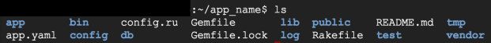
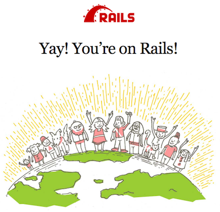
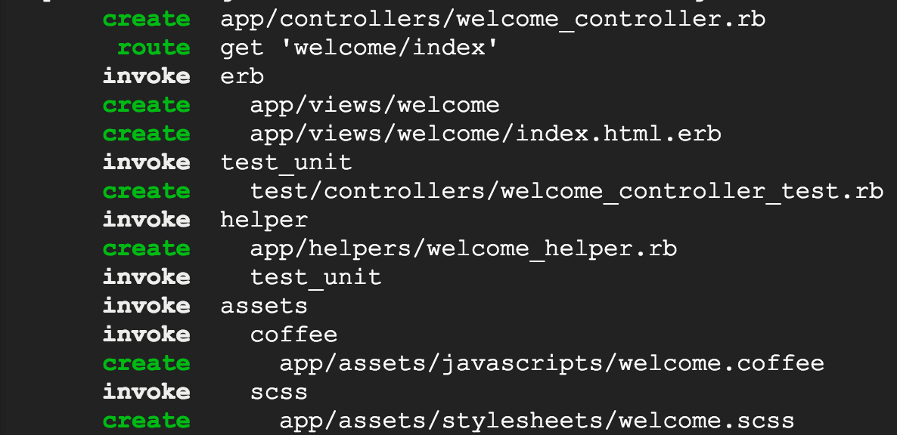
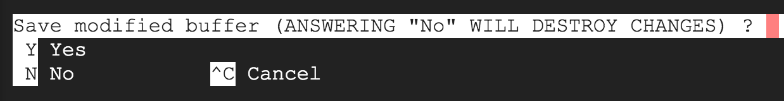
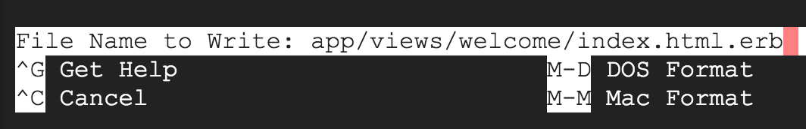
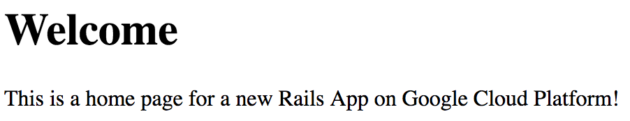

# Deploy a Ruby on Rails App to App Engine Flexible Environment

## GSP026


In this lab, you will learn how to deploy a new Ruby on Rails application, or Rails app for short, to Google App Engine Flexible environment. You will learn how to use Cloud Shell and the Cloud SDK to get started without downloading anything.

Google App Engine Flexible environment applications are easy to create, easy to maintain, and easy to scale as your traffic and data storage changes. With App Engine, there are no servers to maintain. You simply upload your application and it's ready to go.

App Engine applications automatically scale based on incoming traffic. Load balancing, microservices, authorization, SQL and NoSQL databases, traffic splitting, logging, search, versioning, roll out and roll backs, and security scanning are all supported natively and are highly customizable.

### What you'll learn

* How to create a new Rails application using the Cloud Shell
* How to test a Rails application using Web Preview in the Cloud Shell before deployment
* How to add a Welcome page to the Rails application
* How to prepare your deployment configuration
* How to deploy a new Rails application to Google App Engine

### Prerequisites

* Familiarity with standard Linux text editors such as `vim`, `emacs` or `nano`
* Familiarity with Ruby on Rails

---
## Setup and Requirements

### Before you click the Start Lab button

Read these instructions. Labs are timed and you cannot pause them. The timer, which starts when you click Start Lab, shows how long Cloud resources will be made available to you.

This Qwiklabs hands-on lab lets you do the lab activities yourself in a real cloud environment, not in a simulation or demo environment. It does so by giving you new, temporary credentials that you use to sign in and access the Google Cloud Platform for the duration of the lab.

### What you need

To complete this lab, you need:

* Access to a standard internet browser (Chrome browser recommended).
* Time to complete the lab.
* **Note:** If you already have your own personal GCP account or project, do not use it for this lab.

### How to start your lab and sign in to the Console

1. Click the `Start Lab` button. If you need to pay for the lab, a pop-up opens for you to select your payment method. On the left you will see a panel populated with the temporary credentials that you must use for this lab.
    
2. Copy the username, and then click `Open Google Console`. The lab spins up resources, and then opens another tab that shows the **Choose an account** page.
    * **Tip:** Open the tabs in separate windows, side-by-side.
3. On the Choose an account page, click `Use Another Account`.
    
4. The Sign in page opens. Paste the username that you copied from the Connection Details panel. Then copy and paste the password.
    * **Important:** You must use the credentials from the Connection Details panel. Do not use your Qwiklabs credentials. If you have your own GCP account, do not use it for this lab (avoids incurring charges).
5. Click through the subsequent pages:
    * Accept the terms and conditions.
    * Do not add recovery options or two-factor authentication (because this is a temporary account).
    * Do not sign up for free trials.
6. After a few moments, the GCP console opens in this tab.
    * **Note:** You can view the menu with a list of GCP Products and Services by clicking the Navigation menu at the top-left, next to “Google Cloud Platform”.
    

---
## Activate Google Cloud Shell

Google Cloud Shell is a virtual machine that is loaded with development tools. It offers a persistent 5GB home directory and runs on the Google Cloud. Google Cloud Shell provides command-line access to your GCP resources.

1. In GCP console, on the top right toolbar, click the `Open Cloud Shell` button.
    
2. In the dialog box that opens, click `START CLOUD SHELL`:
    
    * **Note:** You can click `START CLOUD SHELL` immediately when the dialog box opens.
3. It takes a few moments to provision and connect to the environment. When you are connected, you are already authenticated, and the project is set to your `PROJECT_ID`. For example:
    
    * `gcloud` is the command-line tool for Google Cloud Platform. It comes pre-installed on Cloud Shell and supports tab-completion.
        * You can list the active account name with this command:
            ```bash
            $ gcloud auth list
            # Output:
            Credentialed accounts:
            - <myaccount>@<mydomain>.com (active)
            # Example output:
            Credentialed accounts:
            - google1623327_student@qwiklabs.net
            ```
        * You can list the project ID with this command:
            ```bash
            $ gcloud config list project
            # Output:
            [core]
            project = <project_ID>
            # Example output:
            [core]
            project = qwiklabs-gcp-44776a13dea667a6
            ```
    * **Note:** Full documentation of `gcloud` is available on [Google Cloud gcloud Overview](https://cloud.google.com/sdk/gcloud).

---
## Enable the App Engine Admin API

1. Click on the `Navigation` menu icon in the top left of the screen:
    
2. Select `APIs & services` from the drop down and click on `Dashboard`:
    
3. Click on `Enable APIs and services`:
    
4. Then, search for `App Engine` in the search box.
5. Click on `App Engine Admin API`, then click `Enable` if the API isn't enabled already.

---
## Install the Rails gem

1. Open a new Google Cloud Shell session and run the following command to install the Rails `gem`:
    ```bash
    $ gem install rails
    ```
2. Now, you can verify the `gem` installation by using:
    ```bash
    $ rails --version
    ```
    * You should see something similar to the following:
        ```bash
        Rails 5.x.x
        ```
    * You installed the Rails gems and verified installation by checking the version.

---
## Generate a new Rails application

1. Now that you have Rails installed, generate the scaffolding of a new Rails app by running the following command:
    ```bash
    $ rails new app_name
    ```
2. Move into the directory created by Rails for the application:
    ```bash
    $ cd app_name
    ```
3. You can view the generated files for a new Rails applications by using:
    ```bash
    $ ls
    ```
    * You should see something similar to:
        
4. Update the version string in `.ruby-versio`n file.
    ```bash
    $ echo "2.5.3" > .ruby-version
    ```
5. You will now make a configuration update to your `Gemfile`. Run the following command to open the file with the Nano text editor:
    ```bash
    $ nano Gemfile
    ```
6. Now replace the line `gem 'sqlite3'` with `gem 'sqlite3', '~> 1.3.6'`. That portion of the file should now resemble the following:
    ```gemfile
    # Use sqlite3 as the database for Active Record
    gem 'sqlite3', '~> 1.3.6'
    ```
    * Save the file and exit the Nano text editor by holding `CTRL + X` > `Y` > `ENTER`.
7. Now run the following command to update your gems:
    ```bash
    $ bundle install
    # Example output
    Bundle complete! 18 Gemfile dependencies, 79 gems now installed.
    Use `bundle info [gemname]` to see where a bundled gem is installed.
    ```

---
## Test the Generated Rails Application

Now that you have a Rails app, test it using `Web Preview` in the Cloud Shell environment. By default Web `Preview uses port 8080`.

1. Start the Rails app server listening on port `8080`:
    ```bash
    $ bundle exec rails server --port 8080
    ```
2. Once the application starts, click on the `Web Preview` icon in the Cloud Shell toolbar and click `Preview on port 8080`.
    
3. A tab in your browser opens and connects to the server you just started. You should see the following image:
    
    * You can now stop the Rails server by using `CTRL + C` in Cloud Shell. You can read more about the [Web Preview](https://cloud.google.com/shell/docs/using-web-preview).

---
## Add a Welcome page

1. Now you will add a Hello World page to the generated Rails application. You will generate the scaffolding for a new page by using *rails generate*. The following command will create a new Rails controller `Welcome` with an action called `index`:
    ```bash
    $ bundle exec rails generate controller Welcome index
    ```
    * This command will generate the following new directories and files by default for the new controller and action:
        
2. Next, using your preferred editor (`vim`, `nano`, `emacs`, or `gcloud` code editor) modify the `index` page. We are using the `nano` editor:
    ```bash
    $ nano app/views/welcome/index.html.erb
    ```
3. Modify the placeholder HTML to display your own welcome message. For example you could do the following:
    ```html
    <h1>Welcome</h1>
    <p>This is a home page for a new Rails App on Google Cloud Platform!</p>
    ```
    * You can now save and close the file in nano by using `CTRL + X`, which will prompt:
        
    * Type a letter `Y` and then press `ENTER` to confirm the filename for the following prompt:
        
4. Finally, set this new page as the root page for Rails. Whenever a user visits the Rails app they will see your Welcome#index page:
    * Open `config/routes.rb`:
        ```bash
        $ nano config/routes.rb
        ```
    * Add the following line:
        ```ruby
        root 'welcome#index'
        ```
    * It should look similar to the following:
        ```ruby
        Rails.application.routes.draw do
            get 'welcome/index'
            # For details on the DSL available within this file, see http://guides.rubyonrails.org/routing.html
            root 'welcome#index'
        end
        ```
    * You can now save and close the file in nano by using `CTRL + X`, which will prompt:
        
    * Type a letter `Y` and then press `ENTER` to confirm the filename for the following prompt:
        
5. Start listening on port `8080` again:
    ```bash
    $ bundle exec rails server --port 8080
    ```
    * Refresh the tab you used to check the app, and you should now see your welcome message:
        
    * Stop the Rails server by using `CTRL + C` in Cloud Shell.

---
## Deployment Configuration

App Engine Flexible environment uses a file called `app.yaml` to describe an application's deployment configuration. If this file is not present, the `gcloud` tool will try to guess the deployment configuration. However, it is a good idea to provide this file because Rails requires a *secret key* in production.

1. A *secret key* is used to protect user session data. You can generate a secret key by using:
    ```bash
    $ bundle exec rails secret
    ```
2. **Copy the secret key that's generated** to your clipboard, you will use it in the next step.
3. To store the secret key, you will use the Runtime Configuration Service.
4. Create a new configuration named `flex-env-config` by using the following command:
    ```bash
    $ gcloud beta runtime-config configs create flex-env-config
    ```
5. Next, add a variable for the `SECRET_KEY_BASE` environment variable, replacing `[SECRET_KEY]` with the value you saved earlier:
    ```bash
    $ gcloud beta runtime-config configs variables set \
    --config-name=flex-env-config --is-text \
    SECRET_KEY_BASE "[SECRET_KEY]"
    ```
6. In your editor, create a new file called `app.yaml`. We are using `nano`:
    ```bash
    $ nano app.yaml
    ```
    * And add the following to the file:
        ```yaml
        # How to start your application
        entrypoint: bundle exec rackup --port $PORT
        # Use App Engine flexible environment
        env: flex
        # Use the supported Ruby runtime
        runtime: ruby

        # App Engine flexible environment will load the configuration
        # values from the Runtime Configuration Service defined by
        # flex-env-config and create a .env file used by your
        # application to determine environment values.
        runtime_config:
            dotenv_config: flex-env-config
        ```
    * You can now save and close the file.
7. Next, add the `dotenv-rails` gem to your `Gemfile` by using the following command:
    ```bash
    $ bundle add dotenv-rails
    ```
8. Bundler will add the gem to your `Gemfile` and run `bundle install` to install the gem.
9. Finally, App Engine requires permission to load configurations from Runtime Configuration Service at build time.
10. Retrieve the project number by listing available projects by using the following command:
    ```bash
    $ export PROJECT_ID=$(gcloud config get-value project)
    $ gcloud projects list --filter $PROJECT_ID
    ```
11. Copy your `PROJECT_NUMBER` for the project and save it. You will use to deploy your app.
12. Use the `PROJECT_NUMBER` in the following command (replace `[PROJECT_NUMBER]` with the output from the last command) to add the a new member to your project IAM policy for the role roles/editor to run database migrations:
    ```bash
    $ gcloud projects add-iam-policy-binding $PROJECT_ID \
    --member=serviceAccount:[PROJECT_NUMBER]@cloudbuild.gserviceaccount.com \
    --role=roles/editor
    ```

---
## Deploying the Application on App Engine

1. First, create an App Engine instance by running:
    ```bash
    $ gcloud app create --region us-central
    ```
    * You can read more about [Regions and Zones](https://cloud.google.com/docs/geography-and-regions).
2. You will now make a configuration update to your `Gemfile` before deploying. Run the following command to open the file with the Nano text editor:
    ```bash
    $ nano Gemfile
    ```
3. Replace the line `ruby '2.6.1'` with `ruby '2.5.3'`. Save the file and exit the Nano text editor by holding `CTRL + X` > `Y` > `ENTER`.
4. After you've made the change, you can deploy your app on App Engine by running the following command:
    ```bash
    $ gcloud app deploy
    ```

> **Note:** First time deployment may take several minutes. This is because App Engine Flexible environment will automatically provision a Google Compute Engine virtual machine for you behind the scenes, and then install the application, and start it. If your deployment timed out, please let the instructor know.

---
## Check out your Rails App

1. After the application is deployed, you can visit it by opening the following URL in your web browser. Copy the GCP Project ID from the tab where you started your lab:
    ```
    https://[PROJECT_ID].appspot.com
    ```
2. You should see your Welcome page:
    

---
## Test your knowledge

Test your knowledge about Google cloud Platform by taking our quiz. (Please select multiple correct options.)

* T: (T/F) With App Engine, there are no servers to maintain. You simply upload your application and it's ready to go.

---
## Congratulations!

You learned how to write and deploy your first App Engine Rails application!

### Finish Your Quest

This self-paced lab is part of the Qwiklabs Quest [Deploying Applications](https://google.qwiklabs.com/quests/26). A Quest is a series of related labs that form a learning path. Completing this Quest earns you the badge above, to recognize your achievement. You can make your badge (or badges) public and link to them in your online resume or social media account. [Enroll in this Quest](http://google.qwiklabs.com/learning_paths/26/enroll) and get immediate completion credit if you've taken this lab. [See other available Qwiklabs Quests](http://google.qwiklabs.com/catalog).

### Take Your Next Lab

Continue your Quest with [Deploy an ASP.NET Core App to App Engine](https://google.qwiklabs.com/catalog_lab/350), or check out these suggestions:

* [Build and Launch an ASP.NET Core App from Google Cloud Shell](https://google.qwiklabs.com/catalog_lab/499)
* [Using Apigee for API Management](https://google.qwiklabs.com/catalog_lab/852)

### Learn More

* Ruby on Google Cloud Platform: https://cloud.google.com/ruby/
* App Engine Documentation: https://cloud.google.com/appengine/docs/flexible/ruby/
* More Ruby samples: https://cloud.google.com/ruby/samples