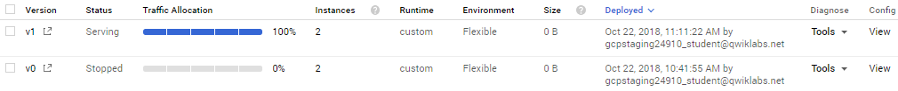

# Deploy an ASP.NET Core App to App Engine

## GSP027


In this lab, you will deploy a simple ASP.NET Core app to App Engine flexible environment. This lab builds on the [Build and launch an ASP.NET Core app from Google Cloud Shell](https://google.qwiklabs.com/searches/lab?keywords=Build%20and%20launch%20an%20ASP.NET%20Core%20app%20from%20Google%20Cloud%20Shell) lab.

[ASP.NET Core](https://docs.microsoft.com/en-us/aspnet/core/) is an open-source and cross-platform framework for building modern cloud-based and internet-connected applications using the C# programming language.

Google App Engine applications are easy to create, maintain, and scale as your traffic and data storage needs change. With App Engine, there are no servers to manage. You simply upload your application and it's ready to go.

App Engine applications automatically scale based on incoming traffic. App Engine natively supports load balancing, microservices, authorization, SQL and NoSQL databases, Memcache, traffic splitting, logging, search, versioning, roll out and roll backs, and security scanning, all of which are highly customizable.

App Engine's environments, the [standard environment](https://cloud.google.com/appengine/docs/about-the-standard-environment) and the [flexible environment](https://cloud.google.com/appengine/docs/flexible/), support a host of programming languages, including C#, Java, Python, PHP, Node.js, Go, and more. The two environments give users maximum flexibility in how their application behaves, since each environment has certain strengths. For more information, read [Choosing an App Engine Environment](https://cloud.google.com/appengine/docs/the-appengine-environments).

### What you'll do

* Package a simple ASP.NET Core app as a Docker container.
* Deploy a simple ASP.NET Core app to App Engine.

### Prerequisites

[Build and launch an ASP.NET Core app from Google Cloud Shell](https://google.qwiklabs.com/searches/lab?keywords=Build%20and%20launch%20an%20ASP.NET%20Core%20app%20from%20Google%20Cloud%20Shell)

---
## Setup and Requirements

### Before you click the Start Lab button

Read these instructions. Labs are timed and you cannot pause them. The timer, which starts when you click Start Lab, shows how long Cloud resources will be made available to you.

This Qwiklabs hands-on lab lets you do the lab activities yourself in a real cloud environment, not in a simulation or demo environment. It does so by giving you new, temporary credentials that you use to sign in and access the Google Cloud Platform for the duration of the lab.

### What you need

To complete this lab, you need:

* Access to a standard internet browser (Chrome browser recommended).
* Time to complete the lab.
* **Note:** If you already have your own personal GCP account or project, do not use it for this lab.

### How to start your lab and sign in to the Console

1. Click the `Start Lab` button. If you need to pay for the lab, a pop-up opens for you to select your payment method. On the left you will see a panel populated with the temporary credentials that you must use for this lab.
    
2. Copy the username, and then click `Open Google Console`. The lab spins up resources, and then opens another tab that shows the **Choose an account** page.
    * **Tip:** Open the tabs in separate windows, side-by-side.
3. On the Choose an account page, click `Use Another Account`.
    
4. The Sign in page opens. Paste the username that you copied from the Connection Details panel. Then copy and paste the password.
    * **Important:** You must use the credentials from the Connection Details panel. Do not use your Qwiklabs credentials. If you have your own GCP account, do not use it for this lab (avoids incurring charges).
5. Click through the subsequent pages:
    * Accept the terms and conditions.
    * Do not add recovery options or two-factor authentication (because this is a temporary account).
    * Do not sign up for free trials.
6. After a few moments, the GCP console opens in this tab.
    * **Note:** You can view the menu with a list of GCP Products and Services by clicking the Navigation menu at the top-left, next to “Google Cloud Platform”.
    

---
## Activate Google Cloud Shell

Google Cloud Shell is a virtual machine that is loaded with development tools. It offers a persistent 5GB home directory and runs on the Google Cloud. Google Cloud Shell provides command-line access to your GCP resources.

1. In GCP console, on the top right toolbar, click the `Open Cloud Shell` button.
    
2. In the dialog box that opens, click `START CLOUD SHELL`:
    
    * **Note:** You can click `START CLOUD SHELL` immediately when the dialog box opens.
3. It takes a few moments to provision and connect to the environment. When you are connected, you are already authenticated, and the project is set to your `PROJECT_ID`. For example:
    
    * `gcloud` is the command-line tool for Google Cloud Platform. It comes pre-installed on Cloud Shell and supports tab-completion.
        * You can list the active account name with this command:
            ```bash
            $ gcloud auth list
            # Output:
            Credentialed accounts:
            - <myaccount>@<mydomain>.com (active)
            # Example output:
            Credentialed accounts:
            - google1623327_student@qwiklabs.net
            ```
        * You can list the project ID with this command:
            ```bash
            $ gcloud config list project
            # Output:
            [core]
            project = <project_ID>
            # Example output:
            [core]
            project = qwiklabs-gcp-44776a13dea667a6
            ```
    * **Note:** Full documentation of `gcloud` is available on [Google Cloud gcloud Overview](https://cloud.google.com/sdk/gcloud).

---
## Create an ASP.NET Core app in Cloud Shell

Enter the following in the the Cloud Shell Command Line.

1. The `dotnet` command line tool is already installed in the cloud shell. Enter the following command to verify the version:
    ```bash
    $ dotnet --version
    # Example output:
    2.1.xxx
    ```
2. Enter the following command to disable Telemetry coming from your new app:
    ```bash
    $ export DOTNET_CLI_TELEMETRY_OPTOUT=1
    ```
3. Create a skeleton ASP.NET Core web app using the following `dotnet` command:
    ```bash
    $ dotnet new razor -o HelloWorldAspNetCore
    # Example output:
    Restore completed in 11.44 sec for HelloWorldAspNetCore.csproj.
    Restore succeeded.
    ```
    * This will create a project and restore its dependencies. You should see a message similar to below.

---
## Run the ASP.NET Core app

You're almost ready to run your app.

1. Navigate to your project folder:
    ```bash
    $ cd HelloWorldAspNetCore
    ```
2. Enter this command to run the app:
    ```bash
    $ dotnet run --urls=http://localhost:8080
    # Example output:
    Hosting environment: Production
    Content root path: /home/atameldev/HelloWorldAspNetCore
    Now listening on: http://[::]:8080
    Application started. Press Ctrl+C to shut down.
    ```
    * The application starts listening on port `8080`.
3. To verify that the app is running, click on the `Web Preview` button on the top right in Cloud Shell and select `Preview on port 8080`.
    * Press `CTRL + C` to return to the command line.
    

---
## Publish the ASP.NET Core app

1. Now, publish the app to get a self-contained DLL using the dotnet publish command:
    ```bash
    $ dotnet publish -c Release
    # Example output:
    ...
    HelloWorldAspNetCore -> /home/gcpstaging55636_student/HelloWorldAspNetCore/bin/Release/netcoreapp2.1/HelloWorldAspNetCore.dll
    ```
    * Running `publish` displays some messages with a successfully published DLL at the end of the process.
2. Navigate to the the `publish` folder, where you need to be for the next step:
    ```bash
    $ cd bin/Release/netcoreapp2.1/publish/
    ```

---
## Package the ASP.NET Core app as a Docker container

Next, prepare your app to run on App Engine Flexible. The first step is to define the container and its contents. Don't worry, you won't need to install Docker -- App Engine flexible can build Docker images remotely as part of the deployment process.

1. Create a `Dockerfile` to define the Docker image.
    ```bash
    $ touch Dockerfile
    ```
2. Edit the `Dockerfile` file and add the following:
    ```Dockerfile
    FROM gcr.io/google-appengine/aspnetcore:2.1
    ADD ./ /app
    ENV ASPNETCORE_URLS=http://*:${PORT}
    WORKDIR /app
    ENTRYPOINT [ "dotnet", "HelloWorldAspNetCore.dll" ]
    ```
    * `Dockerfile` builds on the official Google App Engine image for ASP.NET Core 2.1 apps, which is already configured to run .NET Core apps and adds the app files and the tools necessary to run the app from the directory.
    * One important configuration included in our Dockerfile is the port on which the app listens for incoming traffic (`8080`), per [App Engine flexible requirements](https://cloud.google.com/appengine/docs/flexible/custom-runtimes/build). This is accomplished by setting the `ASPNETCORE_URLS` environment variable, which ASP.NET Core apps use to determine which port to listen to.

---
## Create app.yaml for App Engine flexible

The `app.yaml` file describes how to deploy the app to App Engine, in this case, the App Engine flexible environment. Create `app.yaml` file in the publish folder with following contents:

```yaml
env: flex
runtime: custom
```

---
## Deploy to App Engine flexible

Once you've saved the Dockerfile and app.yaml files to the publish directory, you're ready to deploy your app to App Engine flexible using gcloud.

1. Just follow the prompts to create an App Engine application.
    ```bash
    $ gcloud app deploy --version v0
    ```
2. During deployment, you will be asked to choose a region for your application. Chose a region where you want your app to run in.
    ```bash
    Please choose a region for your application. After choosing a region,
    you cannot change it. Which region would you like to choose?
    [1] europe-west   (supports standard and flexible)
    [2] us-central    (supports standard and flexible)
    [3] us-east1      (supports standard and flexible)
    [4] asia-northeast1 (supports standard and flexible)
    [5] cancel
    ```
    * Type `Y` to continue.
    * **Note:** First-time deployment may take several minutes. This is because App Engine flexible environment automatically provisions a Google Compute Engine virtual machine for you behind the scenes, then installs the application and starts it.
    * When finished you should see confirmation that the app is deployed.
        ```bash
        ...
        Deployed service [default] to [https://<project-id>.appspot.com]
        ```
3. After you've deployed the application, run:
    ```bash
    $ gcloud app browse
    ```
4. Then click on the URL provided in the output to see your deployed app.

---
## Deploy a new version of your service

At some point, the application that you've deployed to production will require bug fixes or additional features. App Engine is here to help you deploy a new version to production without impacting your users.

1. First, modify the application.
    * Open the Code Editor in Cloud Shell and navigate to `Index.cshtml` under the Pages folder of `HelloWorldAspNetCore`:
    * Find this default message:
        ```cshtml
        Learn how to build ASP.NET apps that can run anywhere.
        ```
    * And change it to this:
        ```cshtml
        Learn how to build ASP.NET apps that can run on Google Cloud!
        ```
    * Save the changes
2. Go back to Cloud Shell. Inside the `HelloWorldAspNetCore` directory, run the following to publish the app to get a self-contained DLL:
    ```bash
    $ dotnet publish -c Release
    ```
3. Navigate to the publish directory.
    ```bash
    $ cd bin/Release/netcoreapp2.1/publish/
    ```
4. You can now deploy a new version of your app (`v1` in this case).
    ```bash
    $ gcloud app deploy --version v1
    ```
5. Once it's deployed, go to `App Engine > Versions` in the Google Cloud Console to see the new version of your app serving all of the traffic.
    
6. Go look for the updated message in your app by running this again and clicking the link returned:
    ```bash
    $ gcloud app browse
    ```

---
## Test your Understanding

Below are a multiple choice questions to reinforce your understanding of this lab's concepts. Answer them to the best of your abilities

* 3: You can specify a version for your application using ____ parameter in App Engine.
    1. compute
    2. app
    3. version
    4. gcloud

---
## Congratulations!

There! You've created an ASP.NET Core app, packaged it as a Docker container, and deployed it to Google App Engine Flexible. You have mastered:

* How to package a simple ASP.NET Core app as a Docker container.
* How to deploy a simple ASP.NET Core app to App Engine.

### Finish Your Quest

This self-paced lab is part of Qwiklabs [Deploying Applications](https://google.qwiklabs.com/quests/26) and [Windows on GCP](https://google.qwiklabs.com/quests/27) Quests. A Quest is a series of related labs that form a learning path. Completing the Quests earns you the badges above, to recognize your achievement. You can make your badge (or badges) public and link to them in your online resume or social media account. [Enroll in a Quest and get immediate completion credit if you've taken this lab. See other available Qwiklabs Quests.

### Take Your Next Lab

Continue your path to application development on GCP mastery with the [Cloud Architecture Quest](https://google.qwiklabs.com/quests/24) (an advanced level quest - you are now prepared for the challenge!), or continue your Windows on GCP Quest with [Deploy ASP.NET Core app to Kubernetes Engine](https://google.qwiklabs.com/catalog_lab/506), or check out these suggestions:

* [Deploy Windows Server with ASP.NET Framework to Compute Engine](https://google.qwiklabs.com/catalog_lab/507)
* [Build and Launch an ASP.NET Core App from Google Cloud Shell](https://google.qwiklabs.com/catalog_lab/499)

### Next Steps / Learn More

* [ASP.NET Core Documentation](https://docs.microsoft.com/en-us/aspnet/core/)
* ASP.NET on Google Compute Engine [tutorial video](https://www.youtube.com/watch?v=bQdil26zGJw)
