# Using Apigee for API Management

## GSP163


Every mobile app, smartphone, and connected experience is backed by an API that needs to be managed, secured, analyzed, and scaled. Rather than having app developers consume your services directly, they can access an API proxy created on Apigee Edge. Apigee Edge is a platform for developing and managing API proxies. Think of a proxy as an abstraction layer that "fronts" for your backend service APIs and provides value-added features like security, rate limiting, quotas, analytics, and more.

With the analytics tools you can see short- and long-term usage trends of your APIs. You can:

* Segment your audience by top developers and apps
* Understand usage by API method to know where to invest
* Create custom reports on business- or operational-level information

In this lab you'll build an Apigee API proxy which will consume a public HTTP backend service running on Google Cloud Platform. You will learn how to:

* Create and use an API with Apigee.
* Use Google Datastore data to return a JSON payload.
* Access data to test functionality.

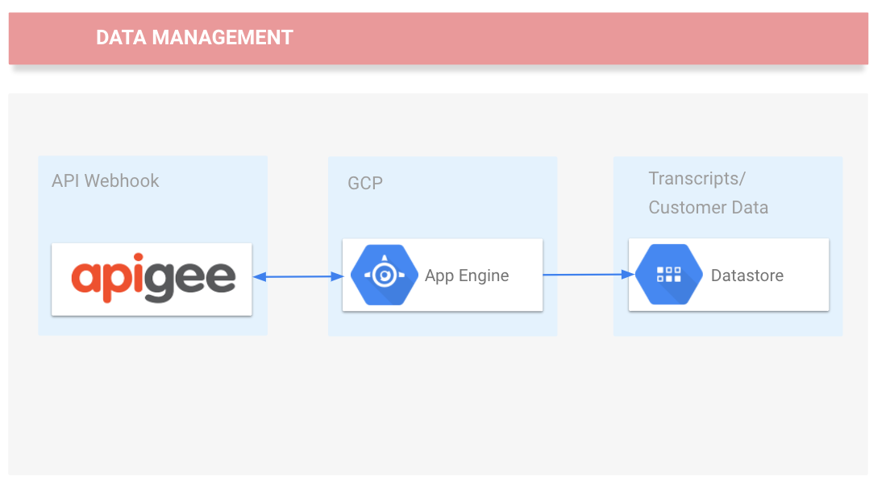

---
## Setup and Requirements

### Before you click the Start Lab button

Read these instructions. Labs are timed and you cannot pause them. The timer, which starts when you click Start Lab, shows how long Cloud resources will be made available to you.

This Qwiklabs hands-on lab lets you do the lab activities yourself in a real cloud environment, not in a simulation or demo environment. It does so by giving you new, temporary credentials that you use to sign in and access the Google Cloud Platform for the duration of the lab.

### What you need

To complete this lab, you need:

* Access to a standard internet browser (Chrome browser recommended).
* Time to complete the lab.
* **Note:** If you already have your own personal GCP account or project, do not use it for this lab.

### How to start your lab and sign in to the Console

1. Click the `Start Lab` button. If you need to pay for the lab, a pop-up opens for you to select your payment method. On the left you will see a panel populated with the temporary credentials that you must use for this lab.
    
2. Copy the username, and then click `Open Google Console`. The lab spins up resources, and then opens another tab that shows the **Choose an account** page.
    * **Tip:** Open the tabs in separate windows, side-by-side.
3. On the **Choose an account** page, click `Use Another Account`.
    
4. The Sign in page opens. Paste the username that you copied from the Connection Details panel. Then copy and paste the password.
    * **Important:** You must use the credentials from the Connection Details panel. Do not use your Qwiklabs credentials. If you have your own GCP account, do not use it for this lab (avoids incurring charges).
5. Click through the subsequent pages:
    * Accept the terms and conditions.
    * Do not add recovery options or two-factor authentication (because this is a temporary account).
    * Do not sign up for free trials.
6. After a few moments, the GCP console opens in this tab.
    * **Note:** You can view the menu with a list of GCP Products and Services by clicking the Navigation menu at the top-left, next to “Google Cloud Platform”.
    

---
## Activate Google Cloud Shell

Google Cloud Shell is a virtual machine that is loaded with development tools. It offers a persistent 5GB home directory and runs on the Google Cloud. Google Cloud Shell provides command-line access to your GCP resources.

1. In GCP console, on the top right toolbar, click the `Open Cloud Shell` button.
    
2. In the dialog box that opens, click `START CLOUD SHELL`:
    
    * **Note:** You can click `START CLOUD SHELL` immediately when the dialog box opens.
3. It takes a few moments to provision and connect to the environment. When you are connected, you are already authenticated, and the project is set to your `PROJECT_ID`. For example:
    
    * `gcloud` is the command-line tool for Google Cloud Platform. It comes pre-installed on Cloud Shell and supports tab-completion.
        * You can list the active account name with this command:
            ```bash
            $ gcloud auth list
            # Output:
            Credentialed accounts:
            - <myaccount>@<mydomain>.com (active)
            # Example output:
            Credentialed accounts:
            - google1623327_student@qwiklabs.net
            ```
        * You can list the project ID with this command:
            ```bash
            $ gcloud config list project
            # Output:
            [core]
            project = <project_ID>
            # Example output:
            [core]
            project = qwiklabs-gcp-44776a13dea667a6
            ```
    * **Note:** Full documentation of `gcloud` is available on [Google Cloud gcloud Overview](https://cloud.google.com/sdk/gcloud).

### Apigee account

1. An Apigee Edge account is required. You can sign up for a free evaluation account by following the directions at: `https://login.apigee.com/sign__up`
2. Fill out the form to get an evaluation account created. Use your personal email address and choose an appropriate password.

---
## Getting Your Application Configured and Deployed

### Download the Code

1. In Cloud Shell, enter the following command to clone the repository:
    ```bash
    $ gsutil cp -r gs://spls/gsp163/* .
    ```
2. List the files added:
    ```bash
    $ ls
    ```
3. Unzip the cloned file:
    ```bash
    unzip apigee-taw-20180328T192944Z-001.zip
    ```

### Get Datastore Ready

Cloud Datastore is a highly-scalable NoSQL database for your applications. It automatically handles sharding and replication, providing you with a highly available and durable database that scales automatically to handle your applications' load. Datastore provides a myriad of capabilities such as ACID transactions, SQL-like queries, and indexes.

In this lab, Datastore will be used to emulate a customer dataset.

1. Go to the `Datastore > Entities` in the Google Cloud Platform Console.
2. Click `Select Datastore Mode`.
3. Use the `Select a location` dropdown to choose where to store your data.
4. Click `Create Database`.
5. Now click `Create Entity`.
6. On the `Create an entity` page, use `"default"` for Namespace.
7. Type `"Task"` for Kind.
8. Under `Properties` click the `Add property` button to add these 3 properties:
    | Name | Type | Value | Indexed |
    |---|---|---|---|
    | description | String | Learn Google Cloud Datastore | un-✓ |
    | created | Date and time | (today's date) | ✓ |
    | done | Boolean | False | ✓ |
9. Your creation page should now look like this:
    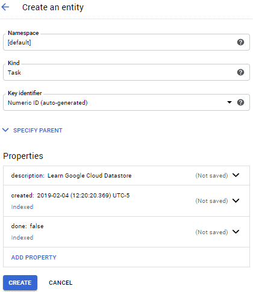
10. Click Create.

You just created and stored data in Cloud Datastore!

### Import Data

1. First, use your favorite editor (`nano`, `vi`, etc.) or the Google Cloud Shell Code Editor to inspect some of the files the lab uses. Access the Code Editor from the Cloud Shell toolbar by clicking the pencil icon.
    
    * Then, you'll deploy the python files so you can run a query in Datastore.
2. In the code editor, browse to `apigee-taw > apigee-utils` and open `import_datastore_categories.py`.
3. Review a couple of files to familiarize yourself with creating entities with Datastore.
    ```python
    ```
    * The `import_datastore.py` file will read the `cataogories_data.csv` file and load the data to Google Cloud Datastore `"categories"` kind. There is no need to create the kind since the script will do it for you.
4. Now open `import_datastore_publsihers.py`.
    ```python
    ```
    * The `import_datastore_publishers.py` file will read the `publishers_data.csv` file and load the data to Google Cloud Datastore `"publishers"` kind. There is no need to create the kind as the script will create it for you. Review the script to familiarize yourself with creating entities with Datastore.

This sample data will allow you to test the integration of Apigee and the Google Cloud Platform.

5. Run the following in Cloud Shell to change directories:
    ```bash
    $ cd apigee-taw/apigee-utils
    ```
6. Run these scripts to deploy the files:
    ```bash
    $ python import_datastore_categories.py
    $ python import_datastore_publishers.py
    ```
7. Go back to the Datastore tab and refresh your browser.
8. In the Console click on the Kind dropdown to select categories.
    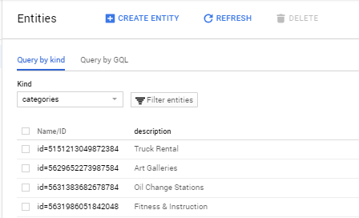
9. Now you can see all the entities you uploaded via the Python script. You can also select **publishers** to see that uploaded data as well.

---
## GQL data load test

Now query the data you uploaded using GQL. GQL maps roughly to SQL - you can think of a GQL kind as a SQL table, a GQL entity as a SQL row, and a GQL property as a SQL column. However, a SQL row-column lookup is limited to a single value, whereas in GQL a property can be a multiple value property.

In this query you'll validate the data import process by running a GQL statement.

1. In the Console, select the Query by GQL tab.
    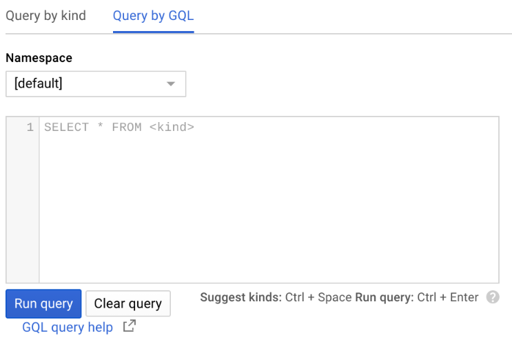
2. Copy the following code and paste it into row 1:
    ```sql
    SELECT description from categories ORDER BY description ASC
    ```
3. Then click `Run Query`.
4. The output validates the data import process.
    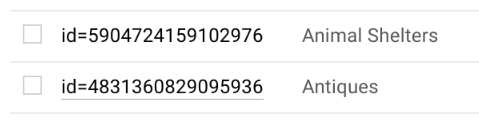

---
## Setup Google Cloud App Engine

Google App Engine is a fully managed platform that completely abstracts away infrastructure so you focus only on code. Go from zero to planet-scale and see why some of today's most successful companies power their applications on App Engine. App Engine allows you to build modern web and mobile applications on an open cloud platform - bring your own language runtimes, frameworks, and third party libraries.

You'll now deploy your API to App Engine. You'll be creating an API Proxy a little later in Apigee Edge, which will take care of the security and authorizations needed to protect your service and as well as give you data to analyze.

1. First, open the `module-1 > main.py` file in your editor just to see what it looks like.
    ```python
    #!/usr/bin/env python

    import urllib
    import json

    from flask import Flask
    from flask import request
    from flask import make_response

    app = Flask(__name__)

    from google.appengine.ext import db

    class publishers(db.Model):
    phone1 = db.StringProperty()
    address = db.StringProperty()
    business_name = db.StringProperty()
    phone1 = db.StringProperty()

    @app.route('/webhook', methods=['POST'])
    def webhook():
        req = request.get_json(silent=True, force=True)

        print("Request:")
        print(json.dumps(req, indent=4))

        res = makeWebhookResult(req)

        res = json.dumps(res, indent=4)
        print(res)
        r = make_response(res)
        r.headers['Content-Type'] = 'application/json'
        return r

    def makeWebhookResult(req):

        phone = req.get("phone")

        qds = publishers.all()
        qds.filter("phone1 =", phone)
        for p in qds.run():
        varPhone = (p.phone)
        varBusiness_Name = (p.business_name)
        varAddress = (p.address)

        return {
            "speech": 'speech',
            "displayText": 'speech',
            "businessName": varBusiness_Name,
            "businessAddress": varAddress,
            "businessPhone": varPhone,
            "message": 'You ran your first application with Apigee!'
            "source": "qwiklab-module1-appengine"
        }

    if __name__ == '__main__':
        port = int(os.getenv('PORT', 5000))

        print "Starting app on port %d" % port

        app.run(debug=True, port=port, host='0.0.0.0')
    ```
    * The `main.py` file will allow Apigee to make requests to Google Cloud Datastore to retrieve data as the details of a certain publishers.

Now, deploy the API to App Engine.

2. In Cloud Shell, leave the directory you're in:
    ```bash
    $ cd
    ```
3. Go to the `apigee-taw/moduel-1` folder:
    ```bash
    $ cd apigee-taw/module-1
    ```
4. Run the following to deploy your app to App Engine:
    ```bash
    $ gcloud app deploy
    ```
    * Type `Y` when asked if you want to continue.
5. At this point you now have an App Engine service running.
    * When the process is complete, navigate to `Navigation menu > App Engine > Versions` to see your deployed application.

---
## Testing Google Cloud App Engine

Test the deployment by sending a test request to App Engine. A few tools are available to stage the workflow. For example, Postman is available for Mac OS X, Windows, Linux and Chrome users, and it gives you a graphical interface to use. For this lab, use a simple curl command in Cloud Shell.

1. In Cloud Shell, run the following command, replacing `[PROJECT_ID]` with your lab's Project ID:
    ```bash
    $ curl -H "Content-Type: application/json" -X POST -d '{"phone": "9085055555"}' https://[PROJECT_ID].appspot.com/webhook
    ```
2. The response should be similar to the below response.
    ```json
    {
        "source": "qwiklab-module-1-apigee-gcp-taw-appengine",
        "businessPhone": "9085055555",
        "speech": "speech",
        "businessCategory": "Boat Dealers",
        "businessName": "Acme Corp",
        "businessAddress": "55 Some Address Ave.",
        "displayText": "speech",
        "message": "It Works!!!!"
    }
    ```

You have now deployed Google Datastore and created an App Engine application to request a JSON payload. There is no security associated with it at this time. You will now create some restrictions once the Apigee setup has been completed.

---
## Setting up Apigee

You expose APIs on Apigee Edge by implementing API proxies. API proxies decouple the app-facing API from your backend services, shielding those apps from backend code changes. As you make backend changes to your services, apps continue to call the same API without any interruption.

Often API proxies are defined as a collection of XML files along with other supporting files. By defining your API proxies as a set of files external to Apigee Edge, you can maintain them in a source controlled system and import them into Edge for testing and deployment.

For this lab you'll be building ProxyEndpoints in Apigee to send requests to the backend service you created on Google Cloud App Engine.

1. Download the Proxy bundle zip file to your computer. Do not extract the file, you can use it as-is: https://github.com/apigee/api-platform-samples/blob/master/learn-edge/extract-json-payload/extract-json-payload.zip
    * This is the config file needed to build the proxy.
2. Log in to the Apigee console. You'll see on the dashboard all the configuration options available to get your first API published.
3. To create a new API proxy, click on the `API Proxies` card, then click the `+ Proxy` button in the upper right corner.
    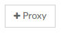
4. Select `"Proxy Bundle"`.
    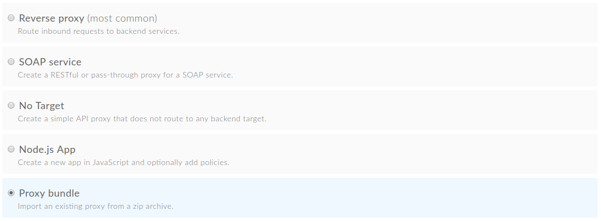
5. Click `Next`.
6. Click `Choose File` and browse to the downloaded zip bundle. Leave the default Proxy name (extract-json-payload) and click `Next`.
7. Click `Build` to build the API Proxy.
    * You should see an acknowledgment that your new API proxy was successfully imported. API Services automatically deploys the imported API proxy to the 'test' environment in your Apigee account. The API exposed by the API proxy is available to be invoked.
8. Click the `"extract-json-payload"` link to display the details page for the API proxy.
Now you'll see the options available to edit your proxy before it's published as an API Endpoint.
9. Click the `Develop` tab in the top right corner of the API Proxies Overview page.
    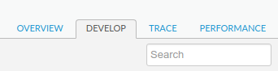
10. In the left Navigator pane, under `Target Endpoints > default`, click `PostFlow`.
    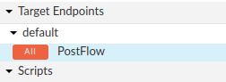
    * A TargetEndpoint is the outbound equivalent of a ProxyEndpoint and functions as the client to a backend service or API -- it sends requests and receives responses.
11. In the Code pane, replace the URL on Line 13 with the following, replacing the `[PROJECT_ID]` with your lab Project ID.
    ```
    https://[PROJECT_ID].appspot.com/webhook
    ```
    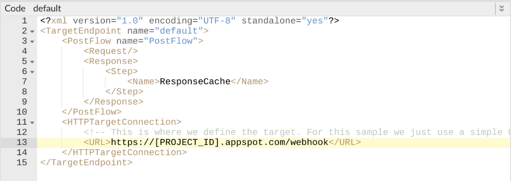
12. Click `Save`.
    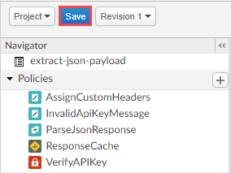

At this point you have configured the basic requirements for your API.

---
## Testing Apigee API

Apigee Edge enables you to control API behavior without writing any code by using *policies*. Policies are designed to let you add common types of management capabilities to an API easily and reliably. You're going to update the **VerifyAPIKey** Policy to require a calling app to have the API Key in order to get a response.

1. In the Development Editor, under Policies, locate the `VerifyAPIKey`.
   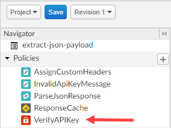
2. Mouse over it, then click the `X` to remove it.
3. Confirm that you want to delete the policy by clicking `Detach and Delet`e.
4. Click `Save`, and confirm with `Save as New Revision`.
5. In the API Proxy Editor, select `Deployment > test` then `Deploy` in the confirmation dialog.
    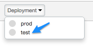
6. Click on the `API Proxie`s left menu, then the `extract-json-payload` name. Copy the deployment URL.
    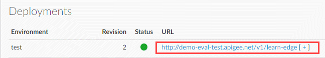
7. Run the following in Cloud Shell, replacing `[YOUR_URL]` with the deployment URL:
    ```bash
    $ curl -H "Content-Type: application/json" -X POST -d '{"phone": "9085055555"}' [YOUR_URL]
    # Example output:
    {
        "source": "qwiklab-module-1-apigee-gcp-taw-appengine",
        "businessPhone": "9085055555",
        "speech": "speech",
        "businessCategory": "Boat Dealers",
        "businessName": "Acme Corp",
        "businessAddress": "55 Some Address Ave.",
        "displayText": "speech",
        "message": "It Works!!!!"
    }
    ```

You have successfully deployed an Apigee API and made a call to retrieve data from Google Cloud Datastore.

---
## Create a developer

Next, you'll simulate the workflow of a developer signing up to use your API. If developer has one or more apps that call your API, each app gets a unique API key. This gives you, the API provider, more granular control over access and more granular reporting on API traffic by app.

### Create a developer

In a production environment, the developer would enter this information through the [Developer Portal](https://apigee.com/api-management/#/product/developer-portal).

1. In Apigee click the back arrow at the top of the left menu next to Develop, then click `Publish`.
2. In the left-hand menu, click `Developers`.
3. Click `+ Developer` in the upper right corner.
4. Enter the following in the New Developer window:
    | First Name | Keyser |
    |---|---|
    | Last Name | Soze |
    | Username | keyser |
    | Email | keyser@example.com |
5. Click `Create`.

### Register a developer app

1. You're still on the `Publish` menu, now select `Apps`.
2. Click `+ App`.
3. Enter the following in the New Developer App window:
    | Name | keyser_app |
    |---|---|
    | Click Developer radio button | Choose Keyser Soze in the Developer dropdown menu |
    | Click Add a credential | Credentials - Expry: Never |
    | Product | Click helloworld then Add(1) |
4. Click `Create`.

---
## Securing the API

Now that the developer is created, you're going back to your API creator role. You'll be getting your proxy app's API key and updating the its security policy.

### Get the API key

1. On the Developer App Details page, click `Show` in the `Key` row. Notice that the key is associated with `"helloworld"`.
    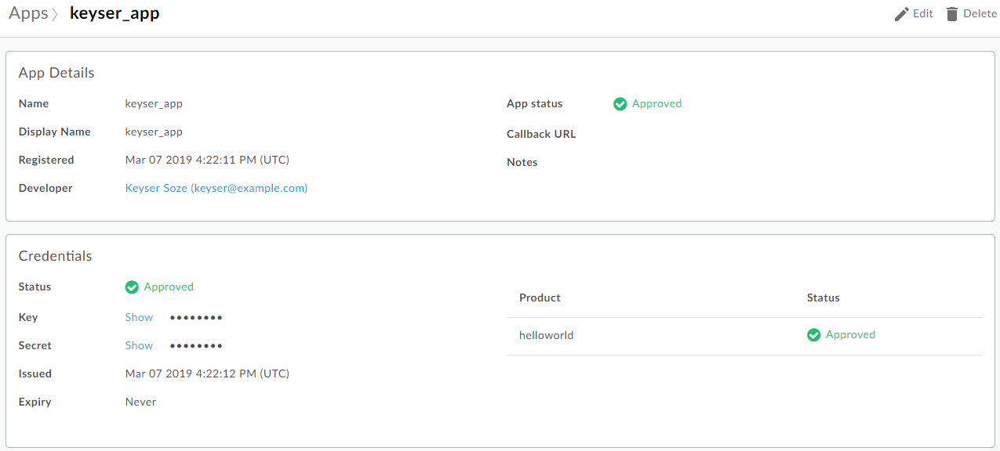
2. Copy the Key and save it - this is your API key. You'll use it in a later step.
3. Click `Hide` to hide the key.
4. Click the back arrow at the top of the left menu and navigate to Develop > API Proxies.
5. Click on the `extract-json-payload` name.
6. In the API proxy editor click the `Develop` tab.
7. Click on `Proxy Endpoints > PreFlow`
8. Now click the PreFlow Endpoint and click `+ Step`
    
9. Look for the `VerifyAPIKey` in the left menu and select it, then click `Add`.
10. The Policy `VerifyAPIKey` tab will be open so you can see its code.
11. Locate `<APIKey ref="request.queryparam.apikey"/>`:
    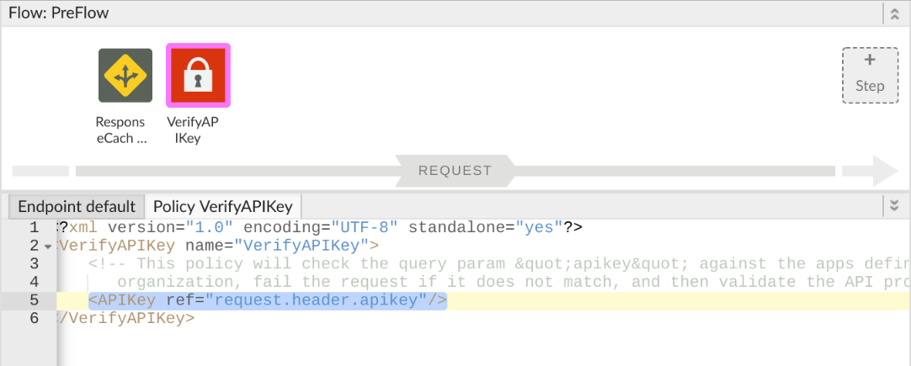
12. And replace it with the following:
    ```
    <APIKey ref="request.header.apikey"/>
    ```
13. Click `Save`.

---
## Use the API key to call the API proxy

The API proxy isolates the app developer from your backend service. This way you're free to change the service implementation as long as the public API remains consistent. By giving the developer the API Key, they can call your API securely and you can track their metrics.

1. Click on the `Overview` tab and copy the URL for the test environment.
    
    * With the next two calls you'll see what happens when a calling API tries to contact your API. Remember to replace `<TEST_URL>` with the test environment URL.
2. Run this command again, but now you won't be successful because you're emulating an un-registered developer calling the API, you don't have the API key:
    ```bash
    $ curl -H "Content-Type: application/json" -X POST -d '{"phone": "9085055555"}' <TEST_URL>
    ```
    * You'll see an error, and that is expected! In order for App Engine to respond, it needs the Consumer Key.
3. Next you'll emulate a registered developer. This time, replace `{api_key}` with the Consumer Key you saved earlier in addition to your `<TEST_URL>`:
    ```bash
    $ curl -X POST <TEST_URL> -d '{"phone": "9085055555"}' -H apikey:{api_key} -H "Content-Type: application/json"
    ```
    * Now you are getting the response you've seen with the App Engine tests.

Apigee protects the APIs, captures identities of the calling apps, and protects App Engine, allowing it to only accept requests from Apigee.

---
## Analyze results

The Apigee [Analytics Services](https://docs.apigee.com/api-platform/analytics/analytics-services-overview) collects and analyzes a wealth of information that flows through APIs. This information is provided to you immediately, in real time. How is your API traffic trending over time? Who are your top developers? When is API response time fastest? Slowest? Are you attracting more developers? Geographically, where do you see the most API traffic?

1. To see your data, click the arrow at the top of the left menu, then navigate to `Analyze > API Proxy Performance`.
2. In the top right corner, change the Environment to `Test`.
3. Since you just deployed the app, change the range to `Hour`.
4. This might take a few minutes to show some results.
    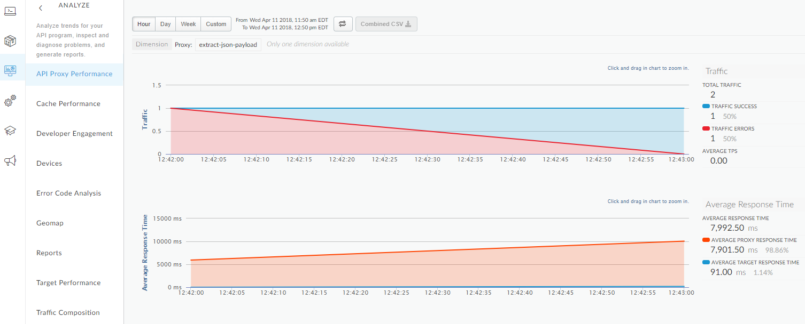

Through a continual process of collecting, analyzing, and visualizing API metrics, analytics will help your API team improve their APIs.

---
## Congratulations!

You have deployed an Apigee API, made a call to retrieve data from Google Cloud Datastore, secured the API and know where to find the reports for the data your API is generating.

### Finish your quest

This self-paced lab is part of the Qwiklabs Quests [Deploying Applications](https://google.qwiklabs.com/quests/26). A Quest is a series of related labs that form a learning path. Completing this Quest earns you the badge above, to recognize your achievement. You can make your badge (or badges) public and link to them in your online resume or social media account. [Enroll in this Quest](https://google.qwiklabs.com/quests/26/enroll) and get immediate completion credit if you've taken this lab. [See other available Qwiklabs Quests](https://google.qwiklabs.com/catalog).

### Take your next lab

Continue with labs from your quest, or check out these suggestions:

* [Deploying a Python Flask Web Application to App Engine Flexible](https://google.qwiklabs.com/catalog_lab/319)
* [Firebase Web](https://google.qwiklabs.com/catalog_lab/363)

### Next steps

* Additional information about Apigee Edge: https://docs.apigee.com/api-platform/get-started/what-apigee-edge
* To learn more about Datastore queries: https://cloud.google.com/datastore/docs/concepts/queries
* To learn more about APIs and API proxies: https://docs.apigee.com/api-platform/fundamentals/understanding-apis-and-api-proxies