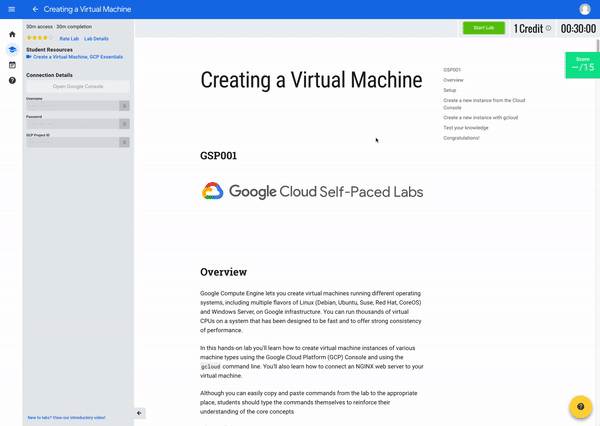
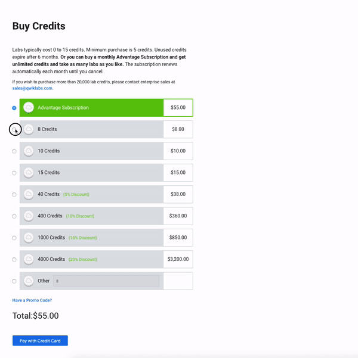
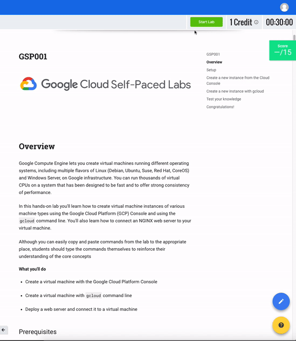
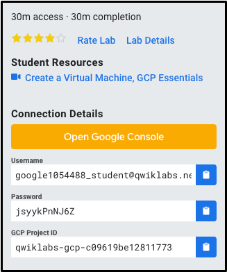
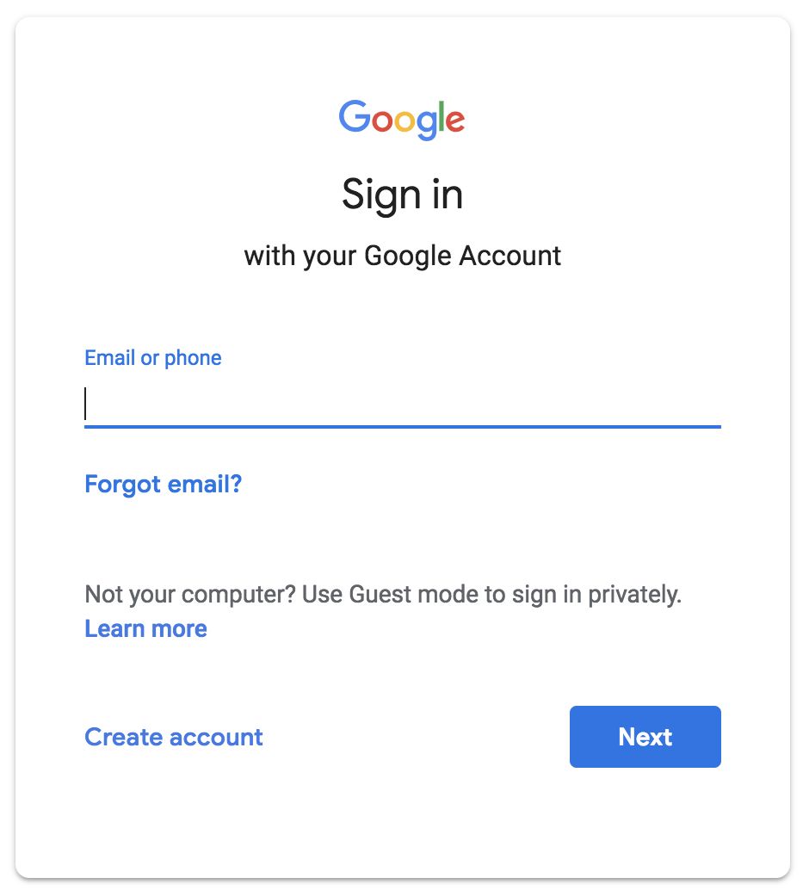
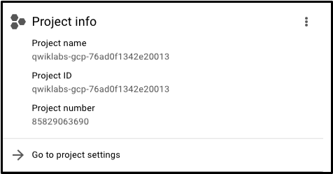
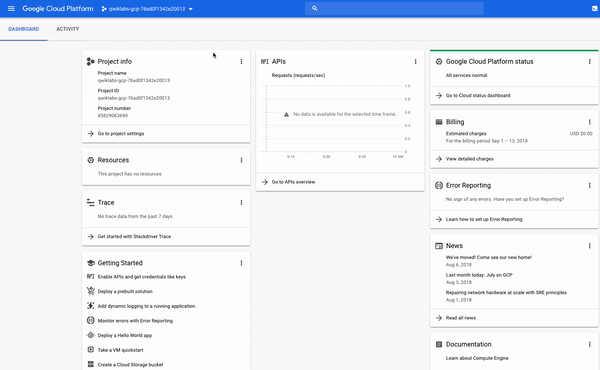
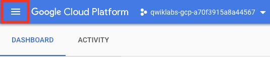
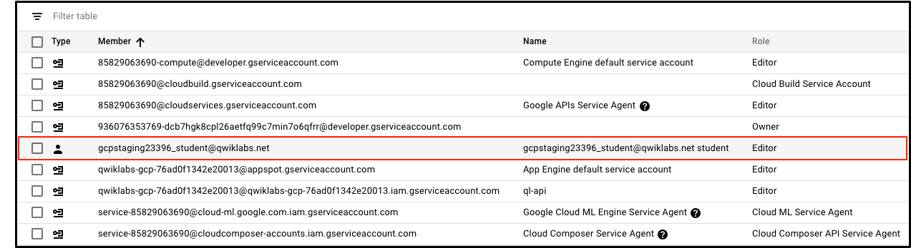
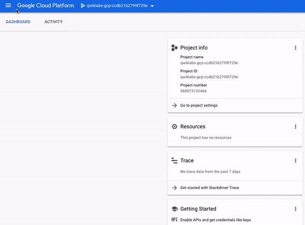

# A Tour of Qwiklabs and the Google Cloud Platform

## GSP282


The [Google Cloud Platform](https://cloud.google.com/) (GCP) is a suite of cloud services hosted on Google's infrastructure. From computing and storage, to data analytics, machine learning, and networking, GCP offers a wide variety of services and APIs that can be integrated with any cloud-computing application or project—be it personal or enterprise-grade.

In this introductory-level lab, you will take your first steps with GCP by getting hands-on practice with the Google [Cloud Platform console](https://cloud.google.com/cloud-console/)—an in-browser UI that lets you access and manage Google Cloud services. You will identify key features of GCP and also learn the ins and outs of the Qwiklabs environment. If you are new to cloud computing or looking for an overview of GCP and Qwiklabs, you are in the right place. Read on to learn about the specifics of this lab and areas that you will get hands-on practice with.

### What you will learn

In this lab, you will do the following:

* Learn about the Qwiklabs platform and identify key features of a lab environment.
* Learn about (and possibly purchase) Qwiklabs credits and launch an instance of a lab.
* Learn how to access the GCP console with specific credentials.
* Learn about GCP projects and identify common misconceptions that surround them.
* Learn how to use the GCP navigation menu to identify types of GCP services.
* Learn about primitive roles and use the Cloud IaM service to inspect actions available to specific users.
* Learn about Cloud Shell and run commands that use the `gcloud` toolkit.
* Learn about the API library and examine its chief features.
* Use tools that are pre-installed in Cloud Shell and run commands like `touch`, `nano`, and `cat` to create, edit, and output the content of files.

### Prerequisites

This is an **introductory level** lab and the first lab you should take if you're unfamiliar with GCP or Qwiklabs. If you are already experienced with Qwiklabs and the Google Cloud Platform Console, check out the following labs (if you decide to take one, make sure you **end your lab now**):

* [Getting Started with Cloud Shell and gcloud](https://google.qwiklabs.com/catalog_lab/320)
* [Creating a Virtual Machine](https://google.qwiklabs.com/catalog_lab/315)

Once you're ready, scroll down to get your lab set up.

---
## Qwiklabs Fundamentals

### Features and components

Regardless of topic or expertise level, all Qwiklabs share a common interface. This lab that you're taking should look quite similar to the following:


> **Note:** You are not taking the "Creating a Virtual Machine" lab show above, it used merely as an example to highlight common features across Qwiklabs.

Read the following lab component definitions and then locate them in the top-right corner of the interface.

#### Start Lab (button)

Clicking this will create a temporary GCP environment with all the necessary services and credentials enabled so you can get dive in and get hands-on practice with the lab's material. Once clicked, you will start a countdown timer that gives you a set amount of time to complete the lab's steps. Once the timer hits `00:00:00`, your lab environment and temporary credentials will be deleted.

#### Credit

The price of a lab. 1 Credit is *usually* equivalent to 1 US dollar (the more credits your purchase, the bigger the discount you receive.) Introductory level labs (like this one) cost 1 credit, fundamental level cost 5, advanced 7, and expert cost 9 credits. The more specialized labs cost more because they involve heavier computing tasks and demand more GCP resources.

#### Time

Specifies the amount of time you have to complete a lab. As mentioned earlier, once you click the `Start Lab` button the timer will count down until it reaches `00:00:00`. When it does, your temporary GCP environment and resources will be deleted. Ample time is given to complete a lab, but make sure you don't work on something else while a lab is running—you risk losing all of your hard work!

#### Score

Most, but not all labs include a score. This feature is called "activity tracking" and ensures you complete specified steps in a lab. To pass a lab with activity tracking, you need to complete all the steps *in order* (only then will you receive completion credit.)

### Purchasing Credits

1. If you haven't already, click on the `Start Lab` button now. If you have an "Access Code" (a coupon that covers the cost of a single lab regardless of expertise level) or have already purchased credits, you can skip down to the next section "Starting a Lab". Otherwise, click `BUY CREDITS`. This will take you to a new page that offers different credit packages:
    
2. Enter in the amount of credits you want to buy and click `Pay with Credit Card`. This will take you to a secure panel, prompting you to enter in your credit card information:
    
3. Enter in your credit card information and click `Pay`. You're all set to take this and any other Qwiklabs! You can always buy more credits by clicking on the profile icon in the top right corner and selecting "Buy Credits". You will also be prompted to purchase more if you run out and try to start a new lab.

### Starting a Lab

1. Now that we understand the key features and components of a lab, click on the `Start Lab` button in the top-right corner. If you have an Access Code, enter it in now and click `Launch with an Access code`. Otherwise, click `Launch with 1 Credit`:
    
2. It may take a moment for the GCP environment and credentials to spin up—please be patient. Once the timer in the top right corner starts ticking and the `Start Lab` button turns into a red `End Lab` button, everything is in place and you're all set to log in to the Google Cloud Platform Console.
3. Make sure that you do not click the `End Lab` button until you have completed all the tasks required of you. Once clicked, your temporary credentials will be invalidated and you will no longer be able to access the work you've done throughout the lab. Only when you reach the end and have made sure that you've completed all the necessary steps will you click the `End Lab` button. You must click this button when you finish—if you do not, you won't be able to take another lab afterwards (Qwiklabs has protections in place that prevent concurrent enrollment.)

### Test your understanding

Answer the following multiple choice questions to reinforce your understanding of the concepts we've covered so far.

* 4: This builds a temporary environment in GCP.
    1. Credit
    2. Score
    3. Time
    4. Start lab (button)
* 2: Once the timer reaches `00:00:00`, you will lose access to your temporary GCP environment.
    1. False
    2. True
* 2: Some labs have tracking, which scores your completion of hands-on lab activities.
    1. False
    2. True
* 1: In order to receive completion credit for a lab that has tracking, you must complete the required hands-on lab activities.
    1. True
    2. False

---
## Accessing the GCP Console

### Key Terms

Now that your lab instance is up and running, take a look at the **Connection Details** panel on the left-hand side. It should be populated with an Open Google Console button and Username, Password, and GCP Project ID fields.



> **Note:** Your credentials will resemble, but not match the above—every lab instance generates new temporary credentials.

Before we go any further, let's examine each of these components.

#### Open Google Console

This is a button that takes you to the [Google Cloud Platform Console](https://cloud.google.com/storage/docs/cloud-console)—the web console and central development hub for GCP. As you start working in GCP, you will be doing the majority of your work from this interface. All of the GCP Qwiklabs use the console in some form or another.

#### GCP Project ID

A [GCP Project](https://cloud.google.com/docs/overview/#projects) is an organizing entity for your Google Cloud resources. It often times contains resources and services—for example, it may hold a pool of virtual machines, a set of databases, and a network that connects them with one another. Projects also contain settings and permissions, which specify security rules and who has access to what resources.

A `GCP Project ID` is a unique identifier that is used to link GCP resources and APIs to your specific project. Project IDs are unique across GCP, meaning that there can only be one `qwiklabs-gcp-xxx....`, which makes it globally identifiable.

#### Username and Password

These are credentials representing an identity in the GCP Identity and Access Management (IAM) service that has access permissions (a role or roles), which allow you to work with GCP resources in the project you've been allocated. These credentials are temporary, and will only work for the access time of the lab. This means that once the timer hits 0, you will no longer be able to access your GCP project with those credentials.

### Signing in to GCP

1. Now that you have a better understanding of the Connection Details panel, let's use the details it contains to sign in to the GCP Console. Click on the `Open Google Console` button. This will open the GCP sign in page in a new browser tab.
   * You should now be on a page that resembles the following:
        
2. If you've ever signed in to a Google application like Gmail, this page should look familiar. To sign in to the console, copy the `Username` from the Connection Details and paste it in to the `Email or phone` field and hit enter.
    * Wait! Make sure that you used the `googlexxxxxx_student@qwiklabs.net` email to sign in, NOT your personal or company email address!
3. Go back and copy the `Password` from the provisioned credentials on the Qwiklabs lab page and paste it in to the GCP sign in `Password` field and hit enter.
    * The username that resembles googlexxxxxx_student@qwiklabs.net is a Google account that has been created for your use as a Qwiklabs student. It has a specific domain name, which is `qwiklabs.net`, and has been assigned IAM roles that allow you to access the GCP Project that you have been provisioned.
    * If you successfully logged in, your page should resemble the following:
        
4. Go ahead and click `Accept` to indicate your acknowledgement of Google's terms of service and privacy policy. You will then be brought to a `Protect your account` page. Since this is a temporary account, don't worry about updating recovery phone numbers or emails. Click `Done`.
5. You will now be brought to the `Updates to Terms of Service` page—for email updates regarding future announcements check the `No` box. Check the `Yes` box to agree to the Google Cloud Platform's terms of service.
6. And just like that, you've successfully accessed the Google Cloud Platform Console with your Qwiklabs credentials! Your page should now resemble the following:
    

### Test your understanding

Answer the following multiple choice questions to reinforce your understanding of the concepts we've covered so far.

* 2: What field is NOT found in the Connection Details panel?
    1. GCP Project ID
    2. System admin
    3. Password
    4. Open Google Console
* 2: The username in the Connection Details panel, which resembles `googlexxxxxx_student@qwiklabs.net` is a GCP IAM identity.
    1. False
    2. True

Now that we're signed in to our GCP Console and understand the basics of our credentials, let's learn a little bit more about GCP projects.

---
## Projects in the GCP Console

We touched on GCP projects earlier when we examined the components of the "Connection Details" panel. Here's the definition once again:

*A [GCP Project](https://cloud.google.com/docs/overview/#projects) is an organizing entity for your Google Cloud resources. It often times contains resources and services—for example, it may hold a pool of virtual machines, a set of databases, and a network that connects them with one another. Projects also contain settings and permissions, which specify security rules and who has access to what resources.*

1. If you look in the top-left side of the console, you will see a panel called `Project info` which should resemble the following:
    
2. As you see, your project has a `name`, `ID`, and `number`. These identifiers are frequently used when interacting with GCP services. You are working out of one project so you can get practice with a specific service or feature of GCP.
3. You probably haven't noticed it, but you actually have access to more than one GCP project. In fact, in some labs you may be provisioned more than one project to accomplish the tasks assigned. If you click on the drop-down menu with your project name and select `ALL`, you will see that there is a "Qwiklabs Resources" project visible as well:
    

> **Note:** **Do not switch over to the Qwiklabs Resources Project at this point!** However, you may use it later in other labs.

It's not uncommon for large enterprises or experienced users of GCP to have dozens to thousands of GCP projects. Organizations use GCP in different ways, so projects are a good way to separate cloud-computing services (by team or product for example.)

`Qwiklabs Resources` is a project that contains files, datasets, and machine images for certain labs and can be accessed from every GCP lab environment. It's important to note that "Qwiklabs Resources" is shared (read only) with all Qwiklabs users, meaning you won't be able to delete or modify it.

The GCP project that you are working out of and whose name resembles `qwiklabs-gcp-xxx...` is temporary, meaning the project and everything it contains will be deleted once the lab ends. Whenever you start a new lab, you will be given access to one or more new GCP project(s), and there (not `Qwiklabs Resources`) is where you will run all of the lab steps.

### Test your understanding

Answer the following multiple choice questions to reinforce your understanding of the concepts we've covered so far.

* 4: An organizing entity for anything you build with the Google Cloud Platform.
    1. Username
    2. Password
    3. Cloud Storage bucket
    4. GCP Project
* 1: Qwiklabs Resources is shared (read only) with all Qwiklabs users, meaning you won't be able to delete or modify it.
    1. True
    2. False
* 2: Qwiklabs Resources is the project where you run all of your lab steps.
    1. True
    2. False

---
## Navigation Menu and Services

1. In the top-left corner, you will notice a three-line icon that resembles the following:
    
2. Clicking on this will reveal (or hide) a **navigation menu** that points to GCP's core services. If the menu isn't exposed, click on the icon now and scroll through to see the types of services offered:
    
3. The navigation menu is an important component of the GCP console—it offers quick access to the platform's services and also outlines its offerings. If you scroll through the menu, you will see that there are seven categories of GCP services:
    * **Compute**: houses a variety of machine types that support any type of workload. The different computing options let you decide how involved you want to be with operational details and infrastructure amongst other things.
    * **Storage**: data storage and database options for structured or unstructured, relational or non relational data.
    * **Networking**: services that balance application traffic and provision security rules amongst other things.
    * Stackdriver: a suite of cross-cloud logging, monitoring, trace, and other service reliability tools.
    * **Tools**: services for developers managing deployments and application build pipelines.
    * **Big Data**: services that allow you to process and analyze large datasets.
    * **Artificial Intelligence**: a suite of APIs that run specific artificial intelligence and machine learning tasks on the Google Cloud platform.

> **Note:** [This link](https://cloud.google.com/docs/overview/cloud-platform-services#top_of_page) will take you to documentation that covers each of these categories in more depth if you are interested.

---
## Roles and Permissions

Earlier we mentioned that besides cloud computing services, GCP also houses a collection of permissions and roles that define who has access to what resources. We can use the [Cloud Identity and Access Management (IAM)](https://cloud.google.com/iam/) service to inspect and modify such roles and permissions.

1. If closed, open up the navigation menu. Then near the top click `IAM & admin`. This will take you to a page that contains a list of users, which specifies permissions and roles granted to certain accounts. Try to sift through these and find the `@qwiklabs` username you signed in with:
    
    * You should find something similar:
        
2. The `Member` field is set to `google23396_student@qwiklabs.net` (which matches the username you logged in with) and the name field is set to `google23396_student@qwiklabs.net student`. You will see that the `Role` field is set to `Editor`, which is one of three primitive roles offered by GCP. Primitive roles set project-level permissions and unless otherwise specified, they control access and management to all GCP services.
    * The following table pulls definitions from the [roles documentation](https://cloud.google.com/iam/docs/understanding-roles#primitive_roles), which gives a brief overview of viewer, editor, and owner role permissions:
        | Role Name | Permissions |
        |---|---|
        | roles/viewer | Permissions for read-only actions that do not affect state, such as viewing (but not modifying) existing resources or data. |
        | roles/editor | All viewer permissions, plus permissions for actions that modify state, such as changing existing resources. |
        | roles/owner | All editor permissions and permissions for the following actions: * Manage roles and permissions for a project and all resources within the project. * Set up billing for a project. |
    * So as an editor you will be able to create, modify, and delete GCP resources. However, you won't be able to add or delete members from GCP projects.

### Test your understanding

Answer the following multiple choice questions to reinforce your understanding of the concepts we've covered so far.

* 4: Offers quick access to the platform's services and also outlines its offerings.
    1. Networking
    2. Compute
    3. Stackdriver
    4. Navigation menu
* 2: Primitive roles set project-level permissions and unless otherwise specified, they control access and management to all GCP services.
    1. False
    2. True
* 2: Provides all viewer permissions, plus permissions for actions that modify state, such as changing existing resources.
    1. GCP project
    2. Editor role
    3. Viewer role
    4. Owner role

---
## APIs and Services

Google Cloud APIs are a key part of the Google Cloud Platform. Like services, the 200+ APIs in areas that range from business administration to machine learning all easily integrate with GCP projects and applications.

APIs are "Application Programming Interfaces" that you can call directly or via our client libraries. Cloud APIs use resource-oriented design principles as described in our [Google API Design Guide](https://cloud.google.com/apis/design/).

When Qwiklabs provisions a new GCP Project for a lab instance, it enables most APIs behind the scenes so you can work on the lab's tasks right away. Be aware that when you create your own GCP projects outside of Qwiklabs, you will have to enable certain APIs yourself.

1. Most Cloud APIs provide you with detailed information on your project’s usage of that API, including traffic levels, error rates, and even latencies, helping you to quickly triage problems with applications that use Google services. You can view this information by opening the navigation menu and clicking on `APIs & Services > Library`:
    
2. If you take a look at the left-hand menu with the header `CATEGORY`, you will see all the different type of categories offered. In the API search bar, type in Dialogflow and select the `Dialogflow API`. You should now be on the following page:
    
    * The `Dialogflow API` allows you to build rich conversational applications (e.g. for Google Assistant) without having to worry about the underlying machine learning and natural language understanding schema.
3. Now click `Enable`. This will take you to a new page, hit the back button in your browser and you will see that the API is now enabled:
    
4. Now click on `Try this API`. This will open a new tab that will reveal the documentation for the Dialogflow API and will specify the methods available to you. Examine some of these and close the tab when you're finished.
    * If you're interested in learning more about APIs, please see new the new hands-on tool in Google Cloud called [APIs Explorer](https://developers.google.com/apis-explorer/#p/). We've also created a lab [APIs Explorer: Qwik Start](https://google.qwiklabs.com/catalog_lab/1241) that will give you hands-on experience with the tool using a simple example.
5. Open the navigation menu and click `Home` to go back to main page of the GCP console.

### Test your understanding

Answer the following multiple choice question to reinforce your understanding of the concepts we've covered so far.

* 1: When you start a lab in Qwiklabs, you need to enable APIs in your GCP project to start working with GCP.
    1. False
    2. True

---
## Cloud Shell

Now that you understand the key features of GCP and the console, you will get hands-on practice with [Cloud Shell](https://cloud.google.com/shell/docs/features). Cloud Shell is an in-browser command prompt execution environment that allows you to enter commands at a terminal prompt to manage resources and services in your GCP project.

Cloud Shell lets you run all of your shell commands without leaving the console and comes with pre-installed command line tools.

1. In the top-right corner of the console, click on the `Activate Cloud Shell` button and then click `Start Cloud Shell` if prompted:
    
   * A new, black window should appear at the bottom of the console with messages and prompts that resemble the following:
        ```bash
        Welcome to Cloud Shell! Type "help" to get started.
        Your Cloud Platform project in this session is set to qwiklabs-gcp-76ad0f1342e20013.
        Use "gcloud config set project [PROJECT_ID]" to change to a different project.
        gcpstaging23396_student@cloudshell:~ (qwiklabs-gcp-76ad0f1342e20013)$
        ```
2. You now have a Cloud Shell session up and running. Copy and paste (or type in) the following into Cloud Shell and hit enter:
    ```bash
    $ gcloud auth list
    ```
    * You should receive see a similar output, where `ACTIVE ACCOUNT` is set to your GCP IAM identity (`gcpstagingxxxxx_student@qwiklabs.net`):
        ```bash
        Credentialed Accounts
        ACTIVE  ACCOUNT
        *       gcpstaging23396_student@qwiklabs.net
        To set the active account, run:
            $ gcloud config set account `ACCOUNT`
        ```
    * As mentioned earlier, Cloud Shell comes preinstalled with specific command line tools. The main GCP toolkit is [gcloud](https://cloud.google.com/sdk/gcloud/), which is used for many tasks on the platform, like resource management and user authentication.
    * You just ran a `gcloud` command—[auth list](https://cloud.google.com/sdk/gcloud/reference/auth/list)—which lists the credentialed account(s) in your GCP project. This account name matches the Qwiklabs username you signed in to the console with earlier.
    * Besides pre-installed toolkits, Cloud Shell also comes with the standard unix command line interface (CLI) tools and text editors like [nano](https://www.nano-editor.org/). We can use these to create and edit files right inside Cloud Shell.
3. Run the following [touch command](http://www.linfo.org/touch.html) to create a file called `test.txt`:
    ```bash
    $ touch test.txt
    ```
4. `touch` won't generate any output. Run the unix command `ls` to list the files in our current directory:
    ```bash
    $ ls
    ```
    * You should receive the following output:
        ```bash
        README-cloudshell.txt  test.txt
        ```
5. We see our new `test.txt` file added to our working directory. Let's make some edits to it using the nano text editor that we referenced earlier. To edit a file, type in nano followed by the filename you want to edit in Cloud Shell:
    ```bash
    $ nano test.txt
    ```
    * This will open the blank file with the Nano text editor:
        
6. Go ahead and type in a message, like the following:
    ```bash
    GCP and Qwiklabs are the best!
    ```
7. Once you have that written in, hold the `CTRL + X` keys. Then type in `Y` followed by the `Enter key` to save the file with the new message.
8. Another helpful command is [`cat`](http://www.linfo.org/cat.html), which will output the contents of a file. Run the following command to make sure that our file was updated correctly:
    ```bash
    $ cat test.txt
    ```
    * You should see the following output in your Cloud Shell session:
        ```bash
        GCP and Qwiklabs are the best!
        ```
    * And just like that, you were able to create, edit, and output the contents of a file all in Cloud Shell (all without having to leave your browser.)

---
## Ending your lab

1. Now that you're finished with the lab, click on the `End Lab` button at the top of this page.
    
   * Please rate each lab you take in Qwiklabs. Rate it five stars if you were satisfied—anything less if you weren't. Leave comments about your experiences in the `Comment` window; Google always appreciates thoughtful feedback.
2. Ending a lab will remove your access to the GCP project as well as the services and work you've done in it. If you go back to the GCP console, you will see that you've been signed out automatically. You can close that tab now.

---
## Congratulations!

In just 30 minutes you developed a solid understanding of the GCP console and the platform's key features. You learned about projects, roles, and the types of services the platform offers. You also practiced with Cloud IAM, the APIs library, and Cloud Shell. You are now ready to take more GCP labs in Qwiklabs.

### Finish Your Quest

Continue your Quest with [GCP Essentials](https://google.qwiklabs.com/quests/23). A Quest is a series of related labs that form a learning path. Completing this Quest earns you the badge above, to recognize your achievement. You can make your badge (or badges) public and link to them in your online resume or social media account. Enroll in this Quest and get immediate completion credit if you've taken this lab. [See other available Qwiklabs Quests](http://google.qwiklabs.com/catalog).

### Next Steps / Learn More

Be sure to check out the following labs for more practice with essential GCP services:
* [Creating a Virtual Machine](https://google.qwiklabs.com/catalog_lab/315)
* [Getting Started with Cloud Shell and gcloud](https://google.qwiklabs.com/catalog_lab/320)