# Introduction to APIs in Google

## GSP294


APIs (Application Programming Interfaces) are software programs that give developers access to computing resources and data. Companies from many different fields offer publicly available APIs so that developers can integrate specialized tools, services, or libraries with their own applications and codebase.

This lab will teach you about the architecture and basic functioning of APIs. This will be supplemented with hands-on practice, where you will configure and run [Cloud Storage API](https://cloud.google.com/storage/docs/json_api/) methods in Google Cloud Shell. After taking this lab you will understand key principles of API communication, architecture, and authentication. You will also gain practical experience with APIs, which you can apply to future labs or projects.

### Objectives

In this lab, you will learn about:

* Google APIs
* API architecture
* HTTP protocol and methods
* Endpoints
* REST (Representational State Transfer) and RESTful APIs
* JSON (JavaScript Object Notation)
* API authentication services

---
## Prerequisites

This is an **introductory level** lab. This assumes little to no prior knowledge of APIs or experience using Google APIs. Familiarity with shell environments and command line interface tools is recommended, but not required. Familiarity with the Google Cloud Console and Cloud Storage is recommended, so please at a minimum take the following labs before attempting this one:

* [A Tour of Qwiklabs and Google Cloud](https://google.qwiklabs.com/catalog_lab/1281)
* [Cloud Storage: Qwik Start - Console](https://google.qwiklabs.com/catalog_lab/1089)

Once you're ready, scroll down and follow the steps below to set up your lab environment.

---
## Setup and Requirements

### Before you click the Start Lab button

Read these instructions. Labs are timed and you cannot pause them. The timer, which starts when you click `Start Lab`, shows how long Google Cloud resources will be made available to you.

This Qwiklabs hands-on lab lets you do the lab activities yourself in a real cloud environment, not in a simulation or demo environment. It does so by giving you new, temporary credentials that you use to sign in and access Google Cloud for the duration of the lab.

### What you need

To complete this lab, you need:

* Access to a standard internet browser (Chrome browser recommended).
* Time to complete the lab.

> **Note:** If you already have your own personal Google Cloud account or project, do not use it for this lab.
> **Note:** If you are using a Pixelbook, open an Incognito window to run this lab.

### How to start your lab and sign in to the Google Cloud Console

1. Click the `Start Lab` button. If you need to pay for the lab, a pop-up opens for you to select your payment method. On the left you will see a panel populated with the temporary credentials that you must use for this lab.
    
2. Copy the username, and then click `Open Google Console`. The lab spins up resources, and then opens another tab that shows the **Choose an account** page.
    * **Tip:** Open the tabs in separate windows, side-by-side.
3. On the **Choose an account** page, click `Use Another Account`.
    
4. The Sign in page opens. Paste the username that you copied from the Connection Details panel. Then copy and paste the password.
    * **Important:** You must use the credentials from the Connection Details panel. Do not use your Qwiklabs credentials. If you have your own GCP account, do not use it for this lab (avoids incurring charges).
5. Click through the subsequent pages:
    * Accept the terms and conditions.
    * Do not add recovery options or two-factor authentication (because this is a temporary account).
    * Do not sign up for free trials.
6. After a few moments, the GCP console opens in this tab.
    * **Note:** You can view the menu with a list of GCP Products and Services by clicking the Navigation menu at the top-left, next to “Google Cloud Platform”.
        

---
## APIs - What and Why

As mentioned earlier, an API (Application Programming Interface) is a software program that gives developers access to computing resources and data. APIs adhere to specific rules and methods to clearly communicate requests and responses.

The ability to access data and computing resources greatly increases a developer's efficiency. It is much easier to use an API than to build every single program, method, or dataset from scratch. APIs are built on the principle of abstraction—you don't need to understand the inner workings or complexities of an API to use it in your own environment.

APIs are built with the developer in mind and often times do not offer a graphical user interface (GUI). However, there are exceptions to this standard. Google has released a new tool called [APIs Explorer](https://developers.google.com/apis-explorer/#p/), which allows you to explore various Google APIs interactively (be sure to check out the [APIs Explorer: Qwik Start](https://google.qwiklabs.com/catalog_lab/1241) lab afterwards if you are interested in learning more.)

---
## Cloud APIs

Google offers APIs that can be applied to many different fields and sectors. APIs are often used in web development, machine learning, data science, and system administration workflows. However, these are only a handful of use cases. If you explore [AnyAPI](https://any-api.com/), for example, you will start to see just how many APIs are available.

When Qwiklabs provisions a new Google Cloud Project for a lab instance, it enables most APIs behind the scenes so you can work on the lab's tasks right away. If you create your own projects outside of Qwiklabs, you will have to enable certain APIs yourself.

As you gain proficiency as a Google Cloud user, you will start to use more APIs in your workflow. Experienced users will integrate and use Cloud APIs in their local environments almost exclusively, rarely using the Cloud Console to run tools and services. Dozens of labs are available that give you practice with various Google APIs in different languages. Here are two for example:

* [Cloud Natural Language API: Qwik Start](https://google.qwiklabs.com/catalog_lab/709)
* [Entity and Sentiment Analysis with the Natural Language API](https://google.qwiklabs.com/catalog_lab/1113)

You will now explore the [API library](https://console.cloud.google.com/apis/library?project=hello-world-sean-200116&folder&organizationId) to see what Google APIs are available.

---
## API Library

1. Open the **Navigation menu** and select `APIs & Services > Library`:
    
    * The API library offers quick access, documentation, and configuration options for 200+ Google APIs. Even though it's housed in the Console, it's important to note that the library offers access to all Google APIs — not only Google Cloud centric ones. This highlights an important theme: APIs are fundamental to all Google services, and Cloud APIs don't all fall under the Google Cloud category.
    * Time for some hands-on practice enabling an API in the API library. Assume that you are a mobile developer for a fitness site and you want to use the [Google Fitness API](https://developers.google.com/fit/) to build your application.
2. In the "Search for APIs and Services" search bar, type in `Fitness API` and press `Enter`. Click on the **Fitness API** from the result list. Then, click `Enable`. If you return to the Fitness API in the API library by clicking on the back button in your browser window **twice**, you will see that the API is now enabled:
    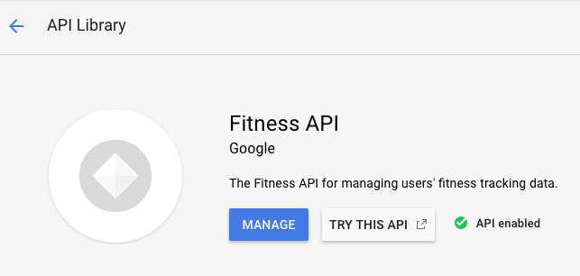
    * The API library provides links to tutorials and documentation, terms of service, and interactive methods offered in the APIs Explorer. To see metric and usage information, you will use the API Dashboard.

---
## API Dashboard

1. Inspect the Fitness API in the Cloud Console's API Dashboard. Open the navigation menu and and select `APIs & Services > Dashboard`:
    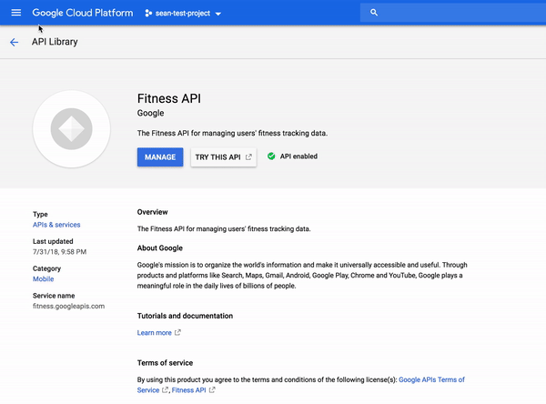
    * The **API Dashboard** details your project's usage of specific APIs, including traffic levels, error rates, and even latencies, which helps you quickly triage problems with applications that use Google services.
2. From the API list, select `Fitness API`:
    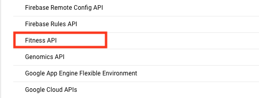
3. From this page you can view and request quotas, control access to resources and data, and view metrics. To see one of these features in action, select `Quotas` from the left-hand menu.
4. This shows you how many queries this API allows per day, per user, and per second:
    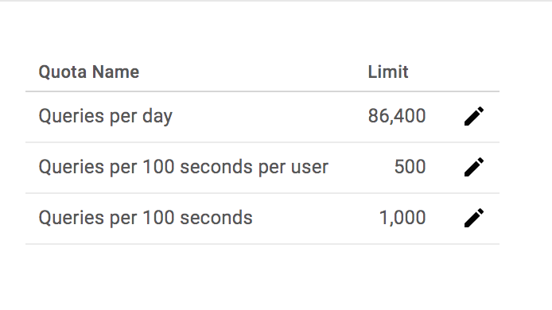
5. Now that you've gotten experience provisioning a non-Cloud API, the rest of the hands-on practice will involve the Google Cloud Storage API. You will now learn about the architecture and basic functioning of APIs.

### Test your understanding

Answer the following multiple choice questions to reinforce your understanding of the concepts covered so far.

* 0: Offers quick access, documentation, and configuration options for 200+ Google APIs.
    1. Google Cloud Project
    2. API Dashboard
    3. API Library
    4. Dialogflow
* 0: Details your project's usage of specific APIs, including traffic levels, error rates, and even latencies.
    1. Google Cloud Project
    2. API Dashboard
    3. API Library
    4. Dialogflow

---
## API Architecture

APIs are a set of methods that allow programs to communicate with one another. To communicate effectively, programs need to adhere to a clear protocol that governs the transfer and interpretation of data.

### Client-server model

The internet is the standard communication channel that APIs use to transmit requests and responses between programs. The [client-server model](https://en.wikipedia.org/wiki/Client%E2%80%93server_model) is the underlying architecture that web-based APIs use for exchanging information.

* The **client** is a computing device (e.g. a smartphone, laptop, etc.) that makes a request for some computing resource or data. The client's request needs to be formatted in the agreed upon protocol.
* The **server** has data and/or computing resources stored on it. Its job is to interpret and fulfill a client's request.

The following is a visual representation of the client-server model:
    ！[](../../../res/img/MachineLearningAPIs/MachineLearningAPIs-1-6.png)

---
## HTTP protocol and request methods

Since APIs use the web as a communication channel, many of them adhere to the [HTTP protocol](https://developer.mozilla.org/en-US/docs/Web/HTTP/Overview), which specifies rules and methods for data exchange between clients and servers over the internet. The HTTP protocol is not only used by APIs — it is the standard for web communication where data is sent and received over the internet.

APIs that utilize the HTTP protocol use *HTTP request methods* (also known as "HTTP verbs") for transmitting client requests to servers. The most commonly used HTTP request methods are *GET*, *POST*, *PUT*, and *DELETE*.

* The **GET** request method is used by a client to fetch data from a server. If the requested resource is found on the server, it will then be sent back to the client.
* The **PUT** method replaces existing data or creates data if it does not exist. If you use PUT many times, it will have no effect — there will only be one copy of the dataset on the server.
* The **POST** method is used primarily to create new resources. Using POST many times will add data in multiple places on the server. It is recommended to use PUT to update resources and POST to create new resources.
* The **DELETE** method will remove data or resources specified by the client on a server.

Although there are hundreds of APIs out there, all with their own unique purposes and specializations, it's important to realize that at the end of the day they all use the same protocol and underlying methods for client-server communication.

### Test your understanding

Answer the following multiple choice questions to reinforce your understanding of the concepts covered so far.

* 0: A computing device (e.g. a smartphone, laptop, etc.) that makes a request for some computing resource or data.
    1. Web-based API
    2. Client-server model
    3. Client
    4. Server
* 0: An HTTP method commonly used for creating new resources.
    1. POST
    2. PUT
    3. DELETE
    4. GET

---
## Endpoints

APIs use HTTP methods to interact with data or computing services hosted on a server. These methods are useless if there isn't a way to access specific resources with consistency. APIs utilize communication channels called endpoints so that clients can access the resources they need without complication or irregularity.

**Endpoints** are access points to data or computing resources hosted on a server and they take the form of an [HTTP URI](https://en.wikipedia.org/wiki/Uniform_Resource_Identifier). Endpoints are added to an API's base URL (e.g. `http://example.com`) to create a path to a specific resource or container of resources. The following are some examples of endpoints:

* `http://example.com/storelocations`
* `http://example.com/accounts`
* `http://example.com/employees`

The following are also valid endpoints:

* `http://example.com/storelocations/sanfrancisco`
* `http://example.com/storelocations/newdelhi`
* `http://example.com/storelocations/london`

You can add query strings to endpoints (e.g. `http://example.com/endpoint/?id=1`) to pass in variables that may be needed to complete an API's request. Endpoints are referred to as the "nouns" that verbs (HTTP methods) act on, and APIs use this framework to fulfill requests.

More specifically, a client sends a request composed of an HTTP method (verb) and an endpoint (noun) to receive specific data or to perform a particular action on the server. It's important to realize that the server is the one that fulfills a client's request by translating and performing a specific operation based on the method and endpoint provided.

Since the backend is where all of the heavy lifting takes place, it could be said that an API that utilizes HTTP methods and endpoints lives on the server, acting as an implementer for client requests. This model loosely defines RESTful APIs, which are examined in more detail in the next section. For hands-on practice building endpoints for an API, please take the lab [Cloud Endpoints: Qwik Start](https://google.qwiklabs.com/catalog_lab/841).

---
## RESTful APIs

APIs that utilize the HTTP protocol, request methods, and endpoints are referred to as **RESTful APIs**. REST (Representational State Transfer) is an architectural style that prescribes standards for web-based communication. The Google [description of a RESTful system](https://developers.google.com/photos/library/guides/about-restful-apis):

> ...resources are stored in a data store; a client sends a request that the server perform a particular action (such as creating, retrieving, updating, or deleting a resource), and the server performs the action and sends a response, often in the form of a representation of the specified resource.

This resource-oriented design is a key principle of REST. [RESTful APIs are modelled](https://cloud.google.com/apis/design/resources#what_is_a_rest_api) as:

> ...collections of individually-addressable resources... The resources and methods are known as nouns and verbs of APIs. With the HTTP protocol, the resource names naturally map to URLs, and methods naturally map to HTTP methods...

These terms should sound familiar since you examined these building blocks in the previous sections. REST is the most widely used framework for APIs. In 2010, about 74% of public network APIs were HTTP REST APIs.

Besides query strings, RESTful APIs can also use the following fields in their requests:

* **Headers**: parameters that detail the HTTP request itself.
* **Body**: data that a client wants to send to a server.

The body is written in the **JSON** or **XML** data formatting language.

---
## API Data Formats (JSON)

RESTful APIs use either XML or JSON (JavaScript Object Notation) as file formats for data held in the body of an HTTP request method.

JSON has surpassed XML in RESTful API use largely because JSON is lightweight, easier to read, and faster to parse. Next, a brief introduction to JSON syntax and structurewill be covered. For a more comprehensive reference, be sure to check out the W3C's [JSON syntax documentation](https://www.w3.org/TR/json-ld/).

JSON supports the following data types:

* **Numbers**: all types — no distinction between integers and floating point values.
* **Strings**: text enclosed in quotes.
* **Booleans**: True or False values.
* **Arrays**: a list of elements grouped by similar type.
* **Null**: an "empty" value.

JSON data is composed of **key-value pairs**. These are linked pieces of data that are composed of a unique identifier (a key) that references piece(s) of data (value). The key must be of type *string* and the value can be any of the data types listed above.

The following is an example of a simple key-value pair in JSON:

```json
"Key1" : "Value 1"
```

Here are some more:

```json
"Key2" : 64
"Key3" : True
"Key4" : ["this", "is", "an", "array"]
```

A JSON **object** uses curly braces `{ }` to group data that's arranged in key-value pairs. The following is an example of an object that contains three key value pairs:

```
{
	"Name": "Julie",
	"Hometown": "Los Angeles, CA",
	"Age": 28
}
```

Commas separate the key-value pairs stored in an object.

### JSON Validator

JSON files can contain any number of key-value pairs and/or objects. In professional development, it's not uncommon for some files to be hundreds, if not thousands, of lines long. As a developer, you know that one small error in formatting or syntax is enough to break your entire codebase.

JSON validators like [jsonlint](https://jsonlint.com/) or, if you use Chrome as your primary browser, the [JSONView extension](https://chrome.google.com/webstore/detail/jsonview/chklaanhfefbnpoihckbnefhakgolnmc?hl=en) quickly identify syntax and formatting issues in your JSON code and pinpoint ways to fix it.

1. Get some practice with JSON validation. Open the [jsonlint](https://jsonlint.com/) validator in a new tab.
2. Paste the following codeblock into the validator:
    ```json
    {
        "Name": "Julie",
        "Hometown": "Los Angeles, CA",
        "Age": 28
    }
    ```
3. Then click `Validate JSON`. You should receive a green message that says `Valid JSON` in the results section.
4. Now paste the following codeblock in the validator:
    ```json
    {
        "Name": "Julie"
        "Hometown": "Los Angeles, CA",
        "Age": 28
    }
    ```
5. Click `Validate JSON`.
6. You will see that it has a missing comma and does not maintain proper indentation. The indentation gets corrected and the validator highlights where things went wrong:
    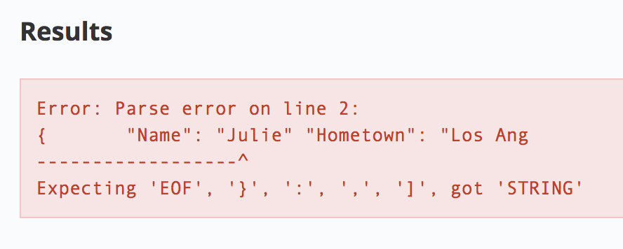
7. The validator identified that there was a missing identifier (a comma) after the second line, which is what was anticipated. If you add a comma after the second line and click `Validate JSON` you should now receive the following output:
    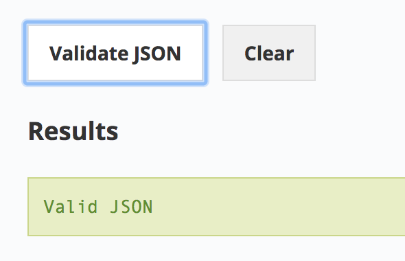
8. As you work through labs using APIs and JSON, using a JSON validator like this can save you lots of headache, time, and effort in debugging syntax errors.

### Test your understanding

Answer the following multiple choice questions to reinforce your understanding of the concepts covered so far.

* 0: Access points to data or computing resources hosted on a server and they take the form of an HTTP URI.
    1. Endpoint
    2. HTTP protocol
    3. Base URL
    4. Query string
* 0: An architectural style that prescribes standards for web-based communication.
    1. RESTful APIs
    2. Body
    3. Headers
    4. REST
* 0: A file format that is lightweight, easy to read, and fast to parse.
    1. Object
    2. Array
    3. Java
    4. JSON

---
## Creating a JSON File in the Cloud Console

You will apply what you've learned by making [Cloud Storage REST/JSON API](https://cloud.google.com/storage/docs/json_api/v1/) calls in Cloud Shell to create buckets and upload content.

1. Open the [following link](https://console.cloud.google.com/apis/library/storage-api.googleapis.com?_ga=2.263178572.-1708473792.1539023585) in a new tab to ensure that the Google Cloud Storage API is enabled. You should see the following:
    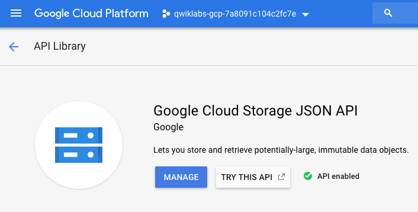
2. Now open up a Cloud Shell session. Run the following command to create and edit a file called `values.json`:
    ```bash
    $ nano values.json
    ```
3. Inside the nano text editor copy and paste the following, replacing `<YOUR_BUCKET_NAME>` with a [unique bucket name](https://cloud.google.com/storage/docs/naming):
    ```json
    {  
        "name": "<YOUR_BUCKET_NAME>",
        "location": "us",
        "storageClass": "multi_regional"
    }
    ```
4. Once you have, exit out of the nano text editor with `CNTRL + X` → `Y` → `ENTER`.

You just created a JSON file that contains an object that has three key-value pairs: `name`, `location`, and `storageClass`. These are the same values that are required when you make a bucket with the gsutil command line tool or in the console.

Before a bucket can be created with the Cloud Storage REST/JSON API, you need to get the proper authentication and authorization policies in place.

---
## Authentication and Authorization

The final piece to cover is the scheme of API authentication and authorization.

* Authentication refers to the process of determining a client's identity.
* Authorization refers to the process of determining what permissions an authenticated client has for a set of resources.

Authentication identifies who you are, and authorization determines what you can do.

There are three types of authentication/authorization services that Google APIs use. These are "API Keys", "Service accounts", and "OAuth". An API will use one of these authentication services depending on the resources it requests and from where the API is called from.

### API Keys

**API keys** are secret tokens that usually come in the form of an encrypted string. API keys are quick to generate and use. APIs that use public data or methods and want to get developers up and running quickly will oftentimes use API keys to authenticate users.

In Google Cloud terms, API keys identify the calling project making the call to an API. By identifying the calling project, API keys enable usage information to be associated with that project, and they can reject calls from projects that haven't been granted access or enabled by the API.

### OAuth

**OAuth** tokens are similar to API keys in their format, but they are more secure and can be linked to user accounts or identities. These tokens are used primarily when APIs give a developer the means to access user data.

While API keys give developers access to all of an API's functionality, OAuth client IDs are all based on scope; different privileges will be granted to different identities.

### Service Accounts

A **service account** is a special type of Google account that belongs to your application or a virtual machine (VM) instead of to an individual end user. Your application assumes the identity of the service account to call Google APIs, so that the users aren't directly involved.

You can use a service account by providing its private key to your application, or by using the built-in service accounts available when running on Google Cloud Functions, Google App Engine, Google Compute Engine, or Google Kubernetes Engine.

For a lab specifically dealing with service accounts and roles, see: [Service Accounts and Roles: Fundamentals](https://google.qwiklabs.com/catalog_lab/956).

---
## Authenticate and authorize the Cloud Storage JSON/REST API

Since Cloud Storage is a platform that hosts and provides access to user data, you need to generate an OAuth token before you use its services.

1. Open the [OAuth 2.0 playground](https://developers.google.com/oauthplayground/) in a new tab. This is a service that allows you to generate OAuth tokens with ease.
2. Scroll down and select `Cloud Storage JSON API V1`. Then select the `https://www.googleapis.com/auth/devstorage.full_control` scope:
    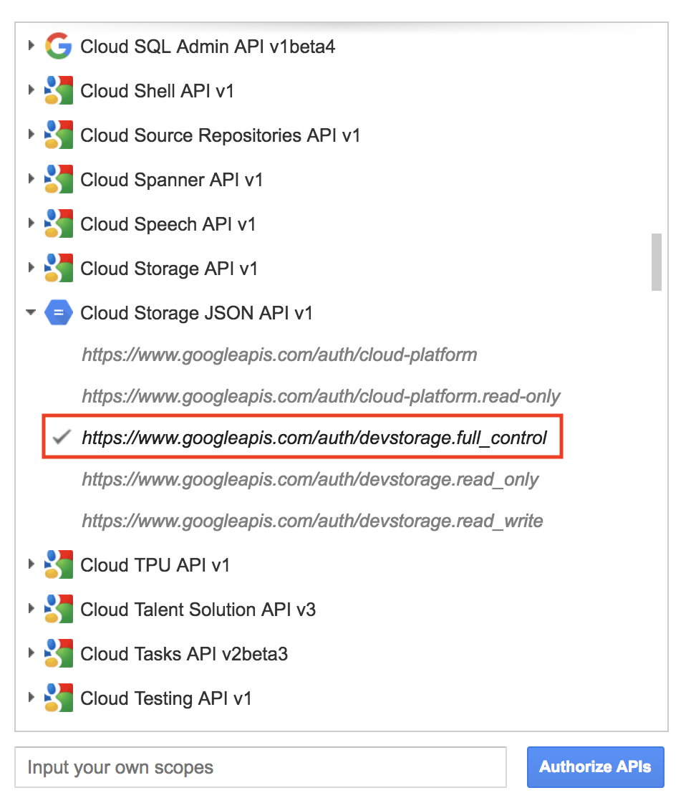
3. Click on the blue box that says **Authorize APIs**. This will open a Google Sign-in page. Select your Qwiklabs username and then click `Allow` when prompted for permissions.
    * Step 2 should now have an authorization code generated. Click on `Exchange authorization code for tokens`. If you get moved to Step 3, click on the Step 2 panel. Your page should resemble the following:
        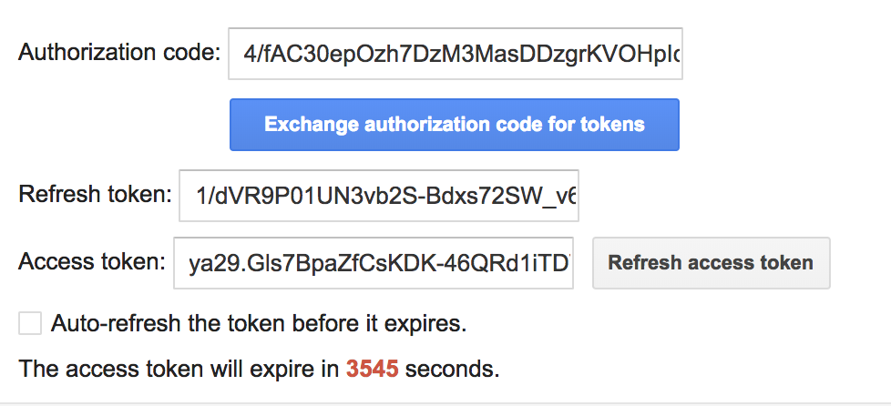
4. **Copy** the access token, it will be used in the following step.

---
## Create a bucket with the Cloud Storage JSON/REST API

1. Return to your **Cloud Shell** session. At the CLI prompt, type in ls and hit enter. You should see the `values.json` file that you created before and a `README-cloudshell.txt` file:
    ```
    README-cloudshell.txt    values.json
    ```
2. Run the following command to set your OAuth2 token as an environment variable, replacing `<YOUR_TOKEN>` with the access token you generated:
    ```bash
    $ export OAUTH2_TOKEN=<YOUR_TOKEN>
    ```
3. Run the following command to set your Project ID as an environment variable, replacing `<YOUR_PROJECT_ID>` with your Qwiklabs project ID:
    ```bash
    $ export PROJECT_ID=<YOUR_PROJECT_ID>
    ```
4. Now run the following command to create a Cloud Storage bucket:
    ```bash
    $ curl -X POST --data-binary @values.json \
        -H "Authorization: Bearer $OAUTH2_TOKEN" \
        -H "Content-Type: application/json" \
        "https://www.googleapis.com/storage/v1/b?project=$PROJECT_ID"
    ```
    * You should receive a similar output:
        ```json
        {
            "kind": "storage#bucket",
            "id": "qwiklabs-test-bucket",
            "selfLink": "https://www.googleapis.com/storage/v1/b/sean123456789",
            "projectNumber": "218136653205",
            "name": "sean123456789",
            "timeCreated": "2018-10-19T21:04:03.604Z",
            "updated": "2018-10-19T21:04:03.604Z",
            "metageneration": "1",
            "location": "US",
            "storageClass": "MULTI_REGIONAL",
            "etag": "CAE="
        }
        ```

> **Note:** If you received an error message like "Use of this bucket name is restricted" or "Sorry, that name is not available", it means that there is a conflict with the [universal bucket naming convention](https://cloud.google.com/storage/docs/naming). Edit the `values.json` file and replace the bucket name.

This request is the culmination of everything you've learned about so far. You used the curl CLI tool to make an HTTP POST method request. You passed in the `values.json` file into the request body. You passed the OAuth token and a JSON specification as request headers. This request was routed to the Cloud Storage endpoint, which contains a query string parameter set to your Google Cloud Project ID.

### View your newly created Cloud Storage Bucket

To see your newly created bucket, from the **Navigation menu** select `Storage > Browser`:
    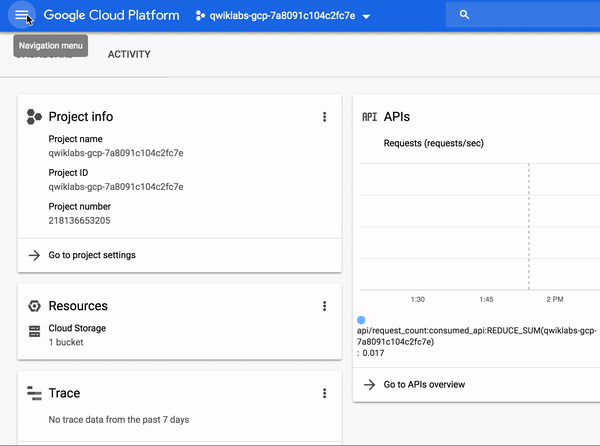

---
## Upload a file using the Cloud Storage JSON/REST API

You can use the Cloud Storage JSON/REST API to upload files to buckets.

1. Save the following image to your computer and name it `demo-image.png`:
    
2. In your **Cloud Shell** session, click on the three-dotted menu icon in the top-right corner and click `Upload file`. Select `demo-image.png`. This will add the image to your directory.
3. Run the following command to get the path to the image file:
    ```bash
    $ realpath demo-image.png
    ```
    * You should receive a similar output:
        ```bash
        /home/gcpstaging25084_student/demo-image.png
        ```
4. Set the file path as an environment variable by running the following command, replacing `<DEMO_IMAGE_PATH>` with your output from the previous command:
    ```bash
    $ export OBJECT=<DEMO_IMAGE_PATH>
    ```
5. Set your bucket name as an environment variable by running the following command, replacing `<YOUR_BUCKET>` with the name of your bucket:
    ```bash
    $ export BUCKET_NAME=<YOUR_BUCKET>
    ```
6. Now run the following command to upload the demo image to your Cloud Storage bucket:
    ```bash
    $ curl -X POST --data-binary @$OBJECT \
        -H "Authorization: Bearer $OAUTH2_TOKEN" \
        -H "Content-Type: image/png" \
        "https://www.googleapis.com/upload/storage/v1/b/$BUCKET_NAME/o?uploadType=media&name=demo-image"
    ```
    * You should receive a similar output:
        ```json
        {
            "kind": "storage#object",
            "id": "qwiklabs-test-bucket/demo-image/1539990580500843",
            "selfLink": "https://www.googleapis.com/storage/v1/b/qwiklabs-test-bucket/o/demo-image",
            "name": "demo-image",
            "bucket": "qwiklabs-test-bucket",
            "generation": "1539990580500843",
            "metageneration": "1",
            "contentType": "image/png",
            "timeCreated": "2018-10-19T23:09:40.500Z",
            "updated": "2018-10-19T23:09:40.500Z",
            "storageClass": "MULTI_REGIONAL",
            "timeStorageClassUpdated": "2018-10-19T23:09:40.500Z",
            "size": "77430",
            "md5Hash": "sJd98pyssh0tmYr4FPgXpg==",
            "mediaLink": "https://www.googleapis.com/download/storage/v1/b/qwiklabs-test-bucket/o/demo-image?generation=1539990580500843&alt=media",
            "crc32c": "e1XZrA==",
            "etag": "COuyiPzPk94CEAE="
        }
        ```
7. To see the image that was added to your bucket, open the navigation menu and select `Storage > Browser`. Then click on the name of your bucket. You should see that demo-image has been added:
    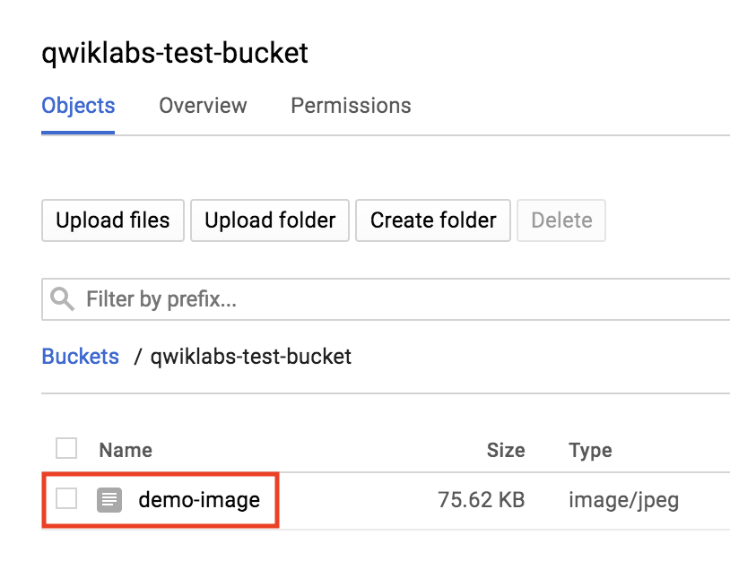

---
## Congratulations!

In this lab you developed a solid understanding of APIs and received hands-on practice with the Cloud Storage JSON/REST API. You learned about Cloud APIs, API architecture, the HTTP protocol and methods, endpoints, RESTful APIs, JSON, and API authentication practices. You are now ready to take more API labs in Qwiklabs.

### Ending your lab

This concludes the end of your hands-on lab. Click on the `End Lab` button at the top of this page:
    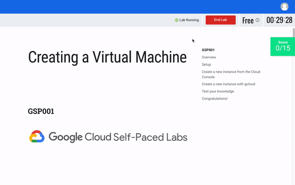

### Finish Your Quest

This self-paced lab is part of the following Qwiklabs Quests: 

* [OK Google: Build Interactive Apps with Google Assistant](https://google.qwiklabs.com/quests/61)
* [Machine Learning APIs](https://google.qwiklabs.com/quests/32)
* [G Suite: Integrations](https://google.qwiklabs.com/quests/51)
* [Developing Data and Machine Learning Apps with C#](https://google.qwiklabs.com/quests/48)
* [Exploring APIs](https://google.qwiklabs.com/quests/54/)

A Quest is a series of related labs that form a learning path. Completing this Quest earns you the badge above, to recognize your achievement. You can make your badge (or badges) public and link to them in your online resume or social media account. Enroll in a Quest and get immediate completion credit if you've taken this lab. [See other available Qwiklabs Quests](http://google.qwiklabs.com/catalog).

### Next Steps / Learn More

Be sure to check out the following labs for more practice with APIs:

* [APIs Explorer: Qwik Start](https://google.qwiklabs.com/catalog_lab/1241)
* [Cloud Natural Language API: Qwik Start](https://google.qwiklabs.com/catalog_lab/709)
