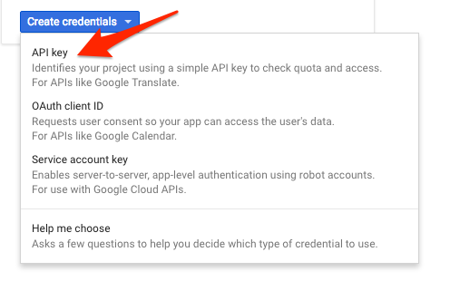
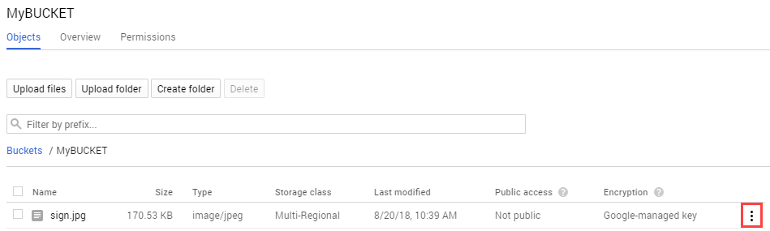
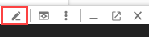

# Extract, Analyze, and Translate Text from Images with the Cloud ML APIs

## GSP075


In this lab, we'll explore the power of machine learning by using multiple machine learning APIs together. We'll start with the Cloud Vision API's text detection method to make use of Optical Character Recognition (OCR) to extract text from images. Then we'll learn how to translate that text with the Translation API and analyze it with the Natural Language API.

### What you'll learn

* Creating a Vision API request and calling the API with curl
* Using the text detection (OCR) method of the Vision API
* Using the Translation API to translate text from your image
* Using the Natural Language API to analyze the text

### What you'll need

* A Google Cloud Project
* A Browser, such [Chrome](https://www.google.com/chrome/browser/desktop/) or [Firefox](https://www.mozilla.org/firefox/)

---
## Setup

### Before you click the Start Lab button

Read these instructions. Labs are timed and you cannot pause them. The timer, which starts when you click Start Lab, shows how long Cloud resources will be made available to you.

This Qwiklabs hands-on lab lets you do the lab activities yourself in a real cloud environment, not in a simulation or demo environment. It does so by giving you new, temporary credentials that you use to sign in and access the Google Cloud Platform for the duration of the lab.

### What you need

To complete this lab, you need:

* Access to a standard internet browser (Chrome browser recommended).
* Time to complete the lab.

> **Note:** If you already have your own personal GCP account or project, do not use it for this lab.

### How to start your lab and sign in to the Console

1. Click the `Start Lab` button. If you need to pay for the lab, a pop-up opens for you to select your payment method. On the left you will see a panel populated with the temporary credentials that you must use for this lab.
    
2. Copy the username, and then click `Open Google Console`. The lab spins up resources, and then opens another tab that shows the **Choose an account** page.
    * **Tip:** Open the tabs in separate windows, side-by-side.
3. On the **Choose an account** page, click `Use Another Account`.
    
4. The Sign in page opens. Paste the username that you copied from the Connection Details panel. Then copy and paste the password.
    * **Important:** You must use the credentials from the Connection Details panel. Do not use your Qwiklabs credentials. If you have your own GCP account, do not use it for this lab (avoids incurring charges).
5. Click through the subsequent pages:
    * Accept the terms and conditions.
    * Do not add recovery options or two-factor authentication (because this is a temporary account).
    * Do not sign up for free trials.
6. After a few moments, the GCP console opens in this tab.
    * **Note:** You can view the menu with a list of GCP Products and Services by clicking the Navigation menu at the top-left, next to “Google Cloud Platform”.
        

### Activate Google Cloud Shell

Google Cloud Shell is a virtual machine that is loaded with development tools. It offers a persistent 5GB home directory and runs on the Google Cloud. Google Cloud Shell provides command-line access to your GCP resources.

1. In GCP console, on the top right toolbar, click the `Open Cloud Shell` button.
    
2. In the dialog box that opens, click `START CLOUD SHELL`:
    
    * You can click `START CLOUD SHELL` immediately when the dialog box opens.
3. It takes a few moments to provision and connect to the environment. When you are connected, you are already authenticated, and the project is set to your `PROJECT_ID`. For example:
    
4. `gcloud` is the command-line tool for Google Cloud Platform. It comes pre-installed on Cloud Shell and supports tab-completion.
    * You can list the active account name with this command:
        ```bash
        $ gcloud auth list
        # Output
        Credentialed accounts:
        - <myaccount>@<mydomain>.com (active)
        # Example output
        Credentialed accounts:
        - google1623327_student@qwiklabs.net
        ```
    * You can list the project ID with this command:
        ```bash
        $ gcloud config list project
        # Output
        [core]
        project = <project_ID>
        # Example output
        [core]
        project = qwiklabs-gcp-44776a13dea667a6
        ```
    * Full documentation of `gcloud` is available on [Google Cloud gcloud Overview](https://cloud.google.com/sdk/gcloud).

---
## Create an API Key

Since you'll be using curl to send a request to the Vision API, you'll need to generate an API key to pass in your request URL. 

1. To create an API key, navigate to: `APIs & services > Credentials`.
    
2. Click `Create credentials`:
    
3. In the drop down menu, select `API key`:
    
4. Next, copy the key you just generated. Click `Close`.
5. Now save the API key to an environment variable to avoid having to insert the value of your API key in each request.
6. Run the following in Cloud Shell, replacing `<your_api_key>` with the key you just copied.
    ```bash
    $ export API_KEY=<YOUR_API_KEY>
    ```

---
## Upload an image to a cloud storage bucket

### Creating a Cloud Storage bucket

There are two ways to send an image to the Vision API for image detection: by sending the API a base64 encoded image string, or passing it the URL of a file stored in Cloud Storage. For this lab you'll create a Cloud Storage bucket to store your images.

1. Navigate to the `Navigation menu > Storage browser` in the Console:
    
2. Then click `Create bucket`.
3. Give your bucket a globally unique name and click `Create`.
    

### Upload an image to your bucket

1. Right click on the following image of a French sign, then click `Save image as` and save it to your computer as `sign.jpg`.
    
2. Navigate to the bucket you just created in the storage browser and click `Upload files`. Then select `sign.jpg`.
    
3. Next you'll allow the file to be viewed publicly while keeping the access to the bucket private.
4. Click on the 3 dots for the image file:
    
5. Select `Edit Permissions`.
6. Click `Add Item` and set the following:
    * Select "Public" for the Entity.
    * Ensure "allUsers" is the value for the Name.
    * Select "Reader" for the Access.
    
7. Click `Save`.
    * You'll now see that the file has public access.

Now that you have the file in your bucket, you're ready to create a Vision API request, passing it the URL of this picture.

---
## Create your Vision API request

1. In your `Cloud Shell` environment, create an `ocr-request.json` files, then add the code below to the file, replacing `my-bucket-name` with the name of the bucket you created. You can create the file using one of your preferred command line editors (`nano`, `vim`, `emacs`) or click the pencil icon to open the code editor in `Cloud Shell`:
    
2. Add the following to your `ocr-request.json` file:
    ```json
    {
        "requests": [
            {
                "image": {
                "source": {
                    "gcsImageUri": "gs://my-bucket-name/sign.jpg"
                }
                },
                "features": [
                {
                    "type": "TEXT_DETECTION",
                    "maxResults": 10
                }
                ]
            }
        ]
    }
    ```
3. You're going to use the [`TEXT_DETECTION`](https://cloud.google.com/vision/docs/ocr) feature of the Vision API. This will run optical character recognition (OCR) on the image to extract text.

---
## Call the Vision API's text detection method

1. In Cloud Shell, call the Vision API with `curl`:
    ```bash
    $ curl -s -X POST -H "Content-Type: application/json" --data-binary @ocr-request.json  https://vision.googleapis.com/v1/images:annotate?key=${API_KEY}
    ```
    * The first part of your response should look like the following:
        ```json
        {
            "responses": [
                {
                    "textAnnotations": [
                        {
                            "locale": "fr",
                            "description": "LE BIEN PUBLIC\nles dépêches\nPour Obama,\nla moutarde\nest\nde Dijon\n",
                            "boundingPoly": {
                                "vertices": [
                                {
                                    "x": 138,
                                    "y": 40
                                },
                                {
                                    "x": 622,
                                    "y": 40
                                },
                                {
                                    "x": 622,
                                    "y": 795
                                },
                                {
                                    "x": 138,
                                    "y": 795
                                }
                                ]
                            }
                        },
                        {
                            "description": "LE",
                            "boundingPoly": {
                                "vertices": [
                                {
                                    "x": 138,
                                    "y": 99
                                },
                                {
                                    "x": 274,
                                    "y": 82
                                },
                                {
                                    "x": 283,
                                    "y": 157
                                },
                                {
                                    "x": 147,
                                    "y": 173
                                }
                                ]
                            }
                        },
                        {
                            "description": "BIEN",
                            "boundingPoly": {
                                "vertices": [
                                    {
                                        "x": 291,
                                        "y": 79
                                    },
                                    {
                                        "x": 413,
                                        "y": 64
                                    },
                                    {
                                        "x": 422,
                                        "y": 139
                                    },
                                    {
                                        "x": 300,
                                        "y": 154
                                    }
                                ]
                            }
                            ...
                        }
                    ]
                }
            ]
        }
        ```
    * The OCR method is able to extract lots of text from our image, cool! Let's break down the response. The first piece of data you get back from `textAnnotations` is the entire block of text the API found in the image. This includes the language code (in this case fr for French), a string of the text, and a bounding box indicating where the text was found in our image. Then you get an object for each word found in the text with a bounding box for that specific word.
        > **Note:** The Vision API also has a [`DOCUMENT_TEXT_DETECTION`](https://cloud.google.com/vision/docs/reference/rest/v1/images/annotate#TextAnnotation) feature optimized for images with more text. This response includes additional information and breaks text down into page, blocks, paragraphs, and words.
    * Unless you speak French you probably don't know what this says. The next step is translation.
2. Run the following `curl` command to save the response to an `ocr-response.json` file so it can be referenced later:
    ```bash
    $ curl -s -X POST -H "Content-Type: application/json" --data-binary @ocr-request.json  https://vision.googleapis.com/v1/images:annotate?key=${API_KEY} -o ocr-response.json
    ```

---
## Sending text from the image to the Translation API

The [Translation API](https://cloud.google.com/translate/docs/reference/translate) can translate text into 100+ languages. It can also detect the language of the input text. To translate the French text into English, all you need to do is pass the text and the language code for the target language (en-US) to the Translation API.

1. First, create a `translation-request.json` file and add the following to it:
    ```json
    {
        "q": "your_text_here",
        "target": "en"
    }
    ```
    * `q` is where you'll pass the string to translate.
2. **Save** the file.
3. Run this Bash command in **Cloud Shell** to extract the image text from the previous step and copy it into a new `translation-request.json` (all in one command):
    ```bash
    $ STR=$(jq .responses[0].textAnnotations[0].description ocr-response.json) && STR="${STR//\"}" && sed -i "s|your_text_here|$STR|g" translation-request.json
    ```
4. Now you're ready to call the Translation API. This command will also copy the response into a `translation-response.json` file:
    ```bash
    $ curl -s -X POST -H "Content-Type: application/json" --data-binary @translation-request.json https://translation.googleapis.com/language/translate/v2?key=${API_KEY} -o translation-response.json
    ```
5. Run this command to inspect the file with the Translation API response:
    ```bash
    $ cat translation-response.json
    ```
    * Awesome, you can understand more of what the sign said!
        ```json
        {
            "data": {
                "translations": [
                {
                    "translatedText": "PUBLIC PROPERTY dispatches For Obama, mustard is from Dijon",
                    "detectedSourceLanguage": "fr"
                }
                ]
            }
        }
        ```
    * In the response, `translatedText` contains the resulting translation, and `detectedSourceLanguage` is `fr`, the ISO language code for French. The Translation API supports 100+ languages, all of which are listed [here](https://cloud.google.com/translate/docs/languages).

In addition to translating the text from our image, you might want to do more analysis on it. That's where the Natural Language API comes in handy. Onward to the next step!

---
## Analyzing the image's text with the Natural Language API

The Natural Language API helps us understand text by extracting entities, analyzing sentiment and syntax, and classifying text into categories. Use the `analyzeEntities` method to see what entities the Natural Language API can find in the text from your image.

1. To set up the API request, create a `nl-request.json` file with the following:
    ```json
    {
        "document":{
            "type":"PLAIN_TEXT",
            "content":"your_text_here"
        },
        "encodingType":"UTF8"
    }
    ```
2. In the request, you're telling the Natural Language API about the text you're sending:
    * **type**: Supported type values are `PLAIN_TEXT` or `HTML`.
    * **content**: pass the text to send to the Natural Language API for analysis. The Natural Language API also supports sending files stored in Cloud Storage for text processing. To send a file from Cloud Storage, you would replace content with `gcsContentUri` and use the value of the text file's uri in Cloud Storage.
    * **encodingType**: tells the API which type of text encoding to use when processing the text. The API will use this to calculate where specific entities appear in the text.
3. Run this Bash command in Cloud Shell to copy the translated text into the content block of the Natural Language API request:
    ```bash
    $ STR=$(jq .data.translations[0].translatedText  translation-response.json) && STR="${STR//\"}" && sed -i "s|your_text_here|$STR|g" nl-request.json
    ```

The `nl-request.json` file now contains the translated English text from the original image. Time to analyze it!

1. Call the `analyzeEntities` endpoint of the Natural Language API with this curl request:
    ```bash
    $ curl "https://language.googleapis.com/v1/documents:analyzeEntities?key=${API_KEY}" \
    -s -X POST -H "Content-Type: application/json" --data-binary @nl-request.json
    ```
    * If you scroll through the response you can see the entities the Natural Language API found:
        ```json
        {
            "entities": [
                {
                "name": "PUBLIC PROPERTY",
                "type": "OTHER",
                "metadata": {},
                "salience": 0.4682728,
                "mentions": [
                    {
                    "text": {
                        "content": "PUBLIC PROPERTY",
                        "beginOffset": 0
                    },
                    "type": "PROPER"
                    }
                ]
                },
                {
                "name": "mustard",
                "type": "OTHER",
                "metadata": {},
                "salience": 0.2878307,
                "mentions": [
                    {
                    "text": {
                        "content": "mustard",
                        "beginOffset": 38
                    },
                    "type": "COMMON"
                    }
                ]
                },
                {
                "name": "Obama",
                "type": "PERSON",
                "metadata": {
                    "mid": "/m/02mjmr",
                    "wikipedia_url": "https://en.wikipedia.org/wiki/Barack_Obama"
                },
                "salience": 0.16260329,
                "mentions": [
                    {
                    "text": {
                        "content": "Obama",
                        "beginOffset": 31
                    },
                    "type": "PROPER"
                    }
                ]
                },
                {
                "name": "Dijon",
                "type": "LOCATION",
                "metadata": {
                    "mid": "/m/0pbhz",
                    "wikipedia_url": "https://en.wikipedia.org/wiki/Dijon"
                },
                "salience": 0.08129317,
                "mentions": [
                    {
                    "text": {
                        "content": "Dijon",
                        "beginOffset": 54
                    },
                    "type": "PROPER"
                    }
                ]
                }
            ],
            "language": "en"
        }
        ```
2. For entities that have a wikipedia page, the API provides metadata including the URL of that page along with the entity's `mid`. The `mid` is an ID that maps to this entity in Google's Knowledge Graph. To get more information on it, you could call the [Knowledge Graph API](https://developers.google.com/knowledge-graph/), passing it this ID. For all entities, the Natural Language API tells us the places it appeared in the text (`mentions`), the `type` of entity, and `salience` (a [0, 1] range indicating how important the entity is to the text as a whole). In addition to English, the Natural Language API also supports the languages listed [here](https://cloud.google.com/natural-language/docs/languages).

Looking at this image it's relatively easy for us to pick out the important entities, but if we had a library of thousands of images this would be much more difficult. OCR, translation, and natural language processing can help to extract meaning from large datasets of images.

---
## Congratulations!

You've learned how to combine 3 different machine learning APIs: the Vision API's OCR method extracted text from an image, then the Translation API translated that text to English and the Natural Language API to found entities in that text.

### What was covered

* Use cases for combining multiple machine learning APIs
* Creating a Vision API OCR request and calling the API with curl
* Translating text with the Translation API
* Extract entities from text with the Natural Language API

### Finish your quest

This self-paced lab is part of the Qwiklabs [Machine Learning APIs](https://google.qwiklabs.com/quests/32) and [Intro to ML: Image Processing](https://google.qwiklabs.com/quests/85) Quests. A Quest is a series of related labs that form a learning path. Completing a Quest earns you a badge to recognize your achievement. You can make your badge (or badges) public and link to them in your online resume or social media account. Enroll in these Quests and get immediate completion credit if you've taken this lab. [See other available Qwiklabs Quests](http://google.qwiklabs.com/catalog).

### Take your next lab

Try out another lab on Machine Learning APIs, like:

* [Classify Text into Categories using the Natural Language API](https://google.qwiklabs.com/catalog_lab/1086)
* [Awwvision: Cloud Vision API from a Kubernetes Cluster](https://google.qwiklabs.com/catalog_lab/1041)

### Next steps

* Sign up for the full [Coursera Course on Machine Learning](https://www.coursera.org/learn/serverless-machine-learning-gcp/)
* Check out the tutorials and docs for [Vision](https://cloud.google.com/vision/docs/detecting-text), [Translation](https://cloud.google.com/translate/docs/samples), and [Natural Language](https://cloud.google.com/natural-language/docs/samples).
