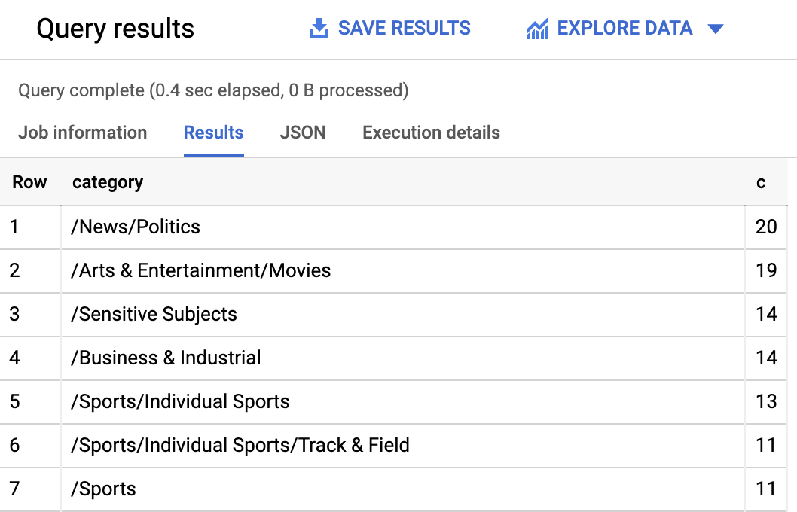

# Classify Text into Categories with the Natural Language API

## GSP063


The Cloud Natural Language API lets you extract entities from text, perform sentiment and syntactic analysis, and classify text into categories. In this lab, we'll focus on text classification. Using a database of 700+ categories, this API feature makes it easy to classify a large dataset of text.

### What you'll learn

* Creating a Natural Language API request and calling the API with curl
* Using the NL API's text classification feature
* Using text classification to understand a dataset of news articles

### What you'll need

* A Google Cloud Project
* A Browser, such [Chrome](https://www.google.com/chrome/browser/desktop/) or [Firefox](https://www.mozilla.org/firefox/)

---
## Setup

### Before you click the Start Lab button

Read these instructions. Labs are timed and you cannot pause them. The timer, which starts when you click Start Lab, shows how long Cloud resources will be made available to you.

This Qwiklabs hands-on lab lets you do the lab activities yourself in a real cloud environment, not in a simulation or demo environment. It does so by giving you new, temporary credentials that you use to sign in and access the Google Cloud Platform for the duration of the lab.

### What you need

To complete this lab, you need:

* Access to a standard internet browser (Chrome browser recommended).
* Time to complete the lab.

> **Note:** If you already have your own personal GCP account or project, do not use it for this lab.

### How to start your lab and sign in to the Console

1. Click the `Start Lab` button. If you need to pay for the lab, a pop-up opens for you to select your payment method. On the left you will see a panel populated with the temporary credentials that you must use for this lab.
    
2. Copy the username, and then click `Open Google Console`. The lab spins up resources, and then opens another tab that shows the **Choose an account** page.
    * **Tip:** Open the tabs in separate windows, side-by-side.
3. On the **Choose an account** page, click `Use Another Account`.
    
4. The Sign in page opens. Paste the username that you copied from the Connection Details panel. Then copy and paste the password.
    * **Important:** You must use the credentials from the Connection Details panel. Do not use your Qwiklabs credentials. If you have your own GCP account, do not use it for this lab (avoids incurring charges).
5. Click through the subsequent pages:
    * Accept the terms and conditions.
    * Do not add recovery options or two-factor authentication (because this is a temporary account).
    * Do not sign up for free trials.
6. After a few moments, the GCP console opens in this tab.
    * **Note:** You can view the menu with a list of GCP Products and Services by clicking the Navigation menu at the top-left, next to “Google Cloud Platform”.
        

### Activate Google Cloud Shell

Google Cloud Shell is a virtual machine that is loaded with development tools. It offers a persistent 5GB home directory and runs on the Google Cloud. Google Cloud Shell provides command-line access to your GCP resources.

1. In GCP console, on the top right toolbar, click the `Open Cloud Shell` button.
    
2. In the dialog box that opens, click `START CLOUD SHELL`:
    
    * You can click `START CLOUD SHELL` immediately when the dialog box opens.
3. It takes a few moments to provision and connect to the environment. When you are connected, you are already authenticated, and the project is set to your `PROJECT_ID`. For example:
    
4. `gcloud` is the command-line tool for Google Cloud Platform. It comes pre-installed on Cloud Shell and supports tab-completion.
    * You can list the active account name with this command:
        ```bash
        $ gcloud auth list
        # Output
        Credentialed accounts:
        - <myaccount>@<mydomain>.com (active)
        # Example output
        Credentialed accounts:
        - google1623327_student@qwiklabs.net
        ```
    * You can list the project ID with this command:
        ```bash
        $ gcloud config list project
        # Output
        [core]
        project = <project_ID>
        # Example output
        [core]
        project = qwiklabs-gcp-44776a13dea667a6
        ```
    * Full documentation of `gcloud` is available on [Google Cloud gcloud Overview](https://cloud.google.com/sdk/gcloud).

---
## Confirm that the Cloud Natural Language API is enabled

1. Click the menu icon in the top left of the screen.
    
2. Select `APIs & services > Dashboard`.
    
3. Click `Enable APIs and services`.
    
4. Then, search for `"language"` in the search box. Click `Cloud Natural Language API`:
    
5. If the API is not enabled, you'll see the `Enable` button. Click `Enable` to enable the Cloud Natural Language API:
    
6. When the API is enabled, Google Cloud displays API information as follows:
    

---
## Create an API Key

Since you're using `curl` to send a request to the Natural Language API, you need to generate an API key to pass in the request URL.

1. To create an API key, in your Console, click `Navigation menu > APIs & services > Credentials`:
    
2. Then click `Create credentials`:
    
3. In the drop down menu, select `API key`:
    
4. Next, copy the key you just generated. Then click `Close`.

Now that you have an API key, you will save it as an environment variable to avoid having to insert the value of your API key in each request.

1. In order to perform next steps please connect to the instance provisioned for you via ssh. Open the navigation menu and select `Compute Engine > VM Instances`. You should see the following provisioned linux instance:
    
2. Click on the SSH button. You will be brought to an interactive shell. In the command line, enter in the following, replacing `<YOUR_API_KEY>` with the key you just copied:
    ```bash
    $ export API_KEY=<YOUR_API_KEY>
    ```

---
## Classify a news article

Using the Natural Language API's classifyText method, you can sort text data into categories with a single API call. This method returns a list of content categories that apply to a text document. These categories range in specificity, from broad categories like `/Computers & Electronics` to highly specific categories such as `/Computers & Electronics/Programming/Java (Programming Language)`. A full list of 700+ possible categories can be found [here](https://cloud.google.com/natural-language/docs/categories).

We'll start by classifying a single article, and then we'll see how we can use this method to make sense of a large news corpus. To start, let's take this headline and description from a New York Times article in the food section:

> A Smoky Lobster Salad With a Tapa Twist. This spin on the Spanish pulpo a la gallega skips the octopus, but keeps the sea salt, olive oil, pimentón and boiled potatoes.

1. Create a `request.json` file with the code below. You can either create the file using one of your preferred command line editors (`nano`, `vim`, `emacs`).
2. Create a new file named `request.json` and add the following:
    ```json
    {
        "document":{
            "type":"PLAIN_TEXT",
            "content":"A Smoky Lobster Salad With a Tapa Twist. This spin on the Spanish pulpo a la gallega skips the octopus, but keeps the sea salt, olive oil, pimentón and boiled potatoes."
        }
    }
    ```
3. Now you can send this text to the Natural Language API's `classifyText` method with the following `curl` command:
    ```bash
    $ curl "https://language.googleapis.com/v1/documents:classifyText?key=${API_KEY}" \
    -s -X POST -H "Content-Type: application/json" --data-binary @request.json
    ```
    * Look at the response:
        ```bash
        {
            categories: [
                {
                    name: '/Food & Drink/Cooking & Recipes',
                    confidence: 0.85
                },
                {
                    name: '/Food & Drink/Food/Meat & Seafood',
                    confidence: 0.63
                }
            ]
        }
        ```
4. You created an Speech API request then called the Speech API. Run the following command to save the response in a `result.json` file:
    ```bash
    $ curl "https://language.googleapis.com/v1/documents:classifyText?key=${API_KEY}" \
    -s -X POST -H "Content-Type: application/json" --data-binary @request.json > result.json
    ```
5. The API returned 2 categories for this text:
    * `/Food & Drink/Cooking & Recipes`
    * `/Food & Drink/Food/Meat & Seafood`

The text doesn't explicitly mention that this is a recipe or even that it includes seafood, but the API is able to categorize it. Classifying a single article is cool, but to really see the power of this feature, let's classify lots of text data.

---
## Classifying a large text dataset

To see how the `classifyText` method can help us understand a dataset with lots of text, you'll use this [public dataset](http://mlg.ucd.ie/datasets/bbc.html) of BBC news articles. The dataset consists of 2,225 articles in five topic areas (business, entertainment, politics, sports, tech) from 2004 - 2005. A subset of these articles are in a public Cloud Storage bucket. Each of the articles is in a .txt file.

To examine the data and send it to the Natural Language API, you'll write a Python script to read each text file from Cloud Storage, send it to the `classifyText` endpoint, and store the results in a **BigQuery** table. **BigQuery** is Google Cloud's big data warehouse tool - it lets you easily store and analyze large data sets.

1. To see the type of text you'll be working with, run the following command to view one article (`gsutil` provides a command line interface for Cloud Storage):
    ```bash
    $ gsutil cat gs://spls/gsp063/bbc_dataset/entertainment/001.txt
    ```
2. Next you'll create a BigQuery table for your data.

---
## Creating a BigQuery table for our categorized text data

Before sending the text to the Natural Language API, you need a place to store the text and category for each article.

1. Navigate to BigQuery in the Console.
    
2. Then click on the name of your project, then `Create dataset`:
    
3. Name the dataset `news_classification_dataset`. Then click `Create dataset`.
4. Click on the name of the dataset, then select `Create Table`. Use the following settings for the new table:
    * Create From: **empty table**
    * Name your table `article_data`
    * Click `Add` Field and add the following 3 fields: `article_text`, `category`, and `confidence`.
    
5. Click `Create Table`.

The table is empty right now. In the next step you'll read the articles from Cloud Storage, send them to the Natural Language API for classification, and store the result in BigQuery.

---
## Classifying news data and storing the result in BigQuery

1. In order to perform next steps please connect to the the Cloud Shell.
2. Before writing a script to send the news data to the Natural Language API, you need to create a service account. This will be used to authenticate to the Natural Language API and BigQuery from a Python script.
3. Export the name of your Cloud project as an environment variable. Replace `<your_project_name>` with the **Project ID** found in the `CONNECTION DETAILS` section of the lab:
    ```bash
    $ export PROJECT=<your_project_name>
    ```
4. Then run the following commands to create a service account:
    ```bash
    $ gcloud iam service-accounts create my-account --display-name my-account
    $ gcloud projects add-iam-policy-binding $PROJECT --member=serviceAccount:my-account@$PROJECT.iam.gserviceaccount.com --role=roles/bigquery.admin
    $ gcloud iam service-accounts keys create key.json --iam-account=my-account@$PROJECT.iam.gserviceaccount.com
    $ export GOOGLE_APPLICATION_CREDENTIALS=key.json
    ```

Now you're ready to send the text data to the Natural Language API!

To do that, write a Python script using the Python module for Google Cloud. You can accomplish the same thing from any language, there are many different cloud client libraries.

1. Create a file called `classify-text.py` and copy the following into it. You can either create the file using one of your preferred command line editors (`nano`, `vim`, `emacs`). Replace `YOUR_PROJECT` with your **Project ID**.
    ```python
    from google.cloud import storage, language, bigquery

    # Set up our GCS, NL, and BigQuery clients
    storage_client = storage.Client()
    nl_client = language.LanguageServiceClient()
    # TODO: replace YOUR_PROJECT with your project name below
    bq_client = bigquery.Client(project='YOUR_PROJECT')

    dataset_ref = bq_client.dataset('news_classification_dataset')
    dataset = bigquery.Dataset(dataset_ref)
    table_ref = dataset.table('article_data')
    table = bq_client.get_table(table_ref)

    # Send article text to the NL API's classifyText method
    def classify_text(article):
            response = nl_client.classify_text(
                    document=language.types.Document(
                            content=article,
                            type=language.enums.Document.Type.PLAIN_TEXT
                    )
            )
            return response


    rows_for_bq = []
    files = storage_client.bucket('qwiklabs-test-bucket-gsp063').list_blobs()
    print("Got article files from GCS, sending them to the NL API (this will take ~2 minutes)...")

    # Send files to the NL API and save the result to send to BigQuery
    for file in files:
            if file.name.endswith('txt'):
                    article_text = file.download_as_string()
                    nl_response = classify_text(article_text)
                    if len(nl_response.categories) > 0:
                            rows_for_bq.append((str(article_text), nl_response.categories[0].name, nl_response.categories[0].confidence))

    print("Writing NL API article data to BigQuery...")
    # Write article text + category data to BQ
    errors = bq_client.insert_rows(table, rows_for_bq)
    assert errors == []
    ```
2. Now you're ready to start classifying articles and importing them to BigQuery. Run the following script:
    ```bash
    $ python3 classify-text.py
    ```
    * The script takes about two minutes to complete, so while it's running let's discuss what's happening.
    * We're using the google-cloud [Python client library](https://googlecloudplatform.github.io/google-cloud-python/) to access Cloud Storage, the Natural Language API, and BigQuery. First, a client is created for each service; then references are created to the BigQuery table. `files` is a reference to each of the BBC dataset files in the public bucket. We iterate through these files, download the articles as strings, and send each one to the Natural Language API in our `classify_text` function. For all articles where the Natural Language API returns a category, the article and its category data are saved to a rows_for_bq list. When classifying each article is done, the data is inserted into BigQuery using `insert_rows()`.
    > **Note:** The Natural Language API can return more than one category for a document, but for this lab you're only storing the first category returned to keep things simple.

When the script has finished running, it's time to verify that the article data was saved to BigQuery.

1. In BigQuery, navigate to the article_data table in the BigQuery tab and click `Query Table`:
    
2. Edit the results in the **Unsaved query** box, adding an asterisk between `SELECT` and `FROM`:
    ```sql
    SELECT * FROM `YOUR_PROJECT.news_classification_dataset.article_data`
    ```
3. Now click `Run`.
4. You will see your data when the query completes. Scroll to the right to see the category column.

The category column has the name of the first category the Natural Language API returned for the article, and confidence is a value between 0 and 1 indicating how confident the API is that it categorized the article correctly. You'll learn how to perform more complex queries on the data in the next step.

---
## Analyzing categorized news data in BigQuery

First, see which categories were most common in the dataset.

1. In the BigQuery console, click `Compose New Query`.
2. Enter the following query, replacing YOUR_PROJECT with your project name:
    ```sql
    SELECT
        category,
        COUNT(*) c
    FROM
        `YOUR_PROJECT.news_classification_dataset.article_data`
    GROUP BY
        category
    ORDER BY
        c DESC
    ```
3. Now click `Run`.
    * You should see something like this in the query results:
        
4. If you wanted to find the article returned for a more obscure category like `/Arts & Entertainment/Music & Audio/Classical Music`, you could write the following query:
    ```sql
    SELECT * FROM `YOUR_PROJECT.news_classification_dataset.article_data`
    WHERE category = "/Arts & Entertainment/Music & Audio/Classical Music"
    ```
5. Or, you could get only the articles where the Natural language API returned a confidence score greater than 90%:
    ```sql
    SELECT
        article_text,
        category
    FROM `YOUR_PROJECT.news_classification_dataset.article_data`
    WHERE cast(confidence as float64) > 0.9
    ```

To perform more queries on your data, explore the [BigQuery documentation](https://cloud.google.com/bigquery/docs/reference/standard-sql/functions-and-operators). BigQuery also integrates with a number of visualization tools. To create visualizations of your categorized news data, check out the [Data Studio quickstart](https://cloud.google.com/bigquery/docs/visualize-data-studio) for BigQuery.

---
## Congratulations!

You've learned how to use the Natural Language API text classification method to classify news articles. You started by classifying one article, and then learned how to classify and analyze a large news dataset using the NL API with BigQuery.

### What we've covered

* Creating a Natural Language API `classifyText` request and calling the API with curl
* Using the Google Cloud Python module to analyze a large news dataset
* Importing and analyzing data in BigQuery

### Finish your quest

This self-paced lab is part of the Qwiklabs [Machine Learning APIs](https://google.qwiklabs.com/quests/32) and [Data Engineering](https://google.qwiklabs.com/quests/25) Quests. A Quest is a series of related labs that form a learning path. Completing this Quest earns you the badge above, to recognize your achievement. You can make your badge (or badges) public and link to them in your online resume or social media account. [Enroll in this Quest](http://google.qwiklabs.com/learning_paths/24/enroll) and get immediate completion credit if you've taken this lab. [See other available Qwiklabs Quests](http://google.qwiklabs.com/catalog).

### Take your next lab

Continue your Quest with [Predict Visitor Purchases with a Classifiction Model in BQML](https://google.qwiklabs.com/catalog_lab/1101) or try one of these:

* [Building an IoT Analytics Pipeline on Google Cloud](https://google.qwiklabs.com/catalog_lab/480)
* [Predicting Baby Weight with TensorFlow on Cloud ML Engine](https://google.qwiklabs.com/catalog_lab/480)

### Next Steps / Learn More

* Sign up for the full [Coursera Course on Machine Learning](https://www.coursera.org/learn/serverless-machine-learning-gcp/).
* Check out the [docs for classifying content](https://cloud.google.com/natural-language/docs/classifying-text) with the Natural Language API.
* Learn more about BigQuery in the [documentation](https://cloud.google.com/bigquery/quickstart-web-ui).
